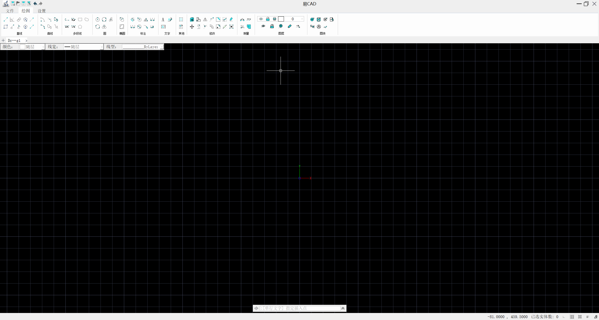
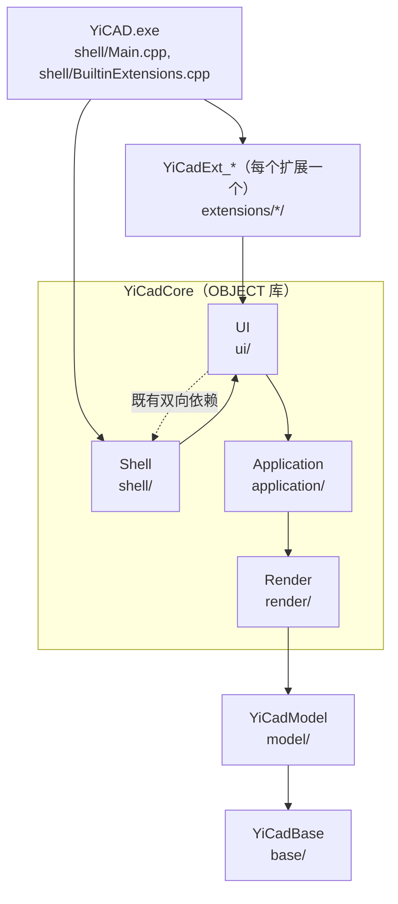

[English](README.md) | 中文

# YiCAD

YiCAD 是一个开源的 2D CAD 应用程序，提供主流 CAD 软件的核心功能，使用 **C++23** 和 **Qt 6.8** 开发，基于 **OpenGL** 进行高性能图形渲染。



当前版本：**v0.20.0**

## 功能特性

- **2D 绘图实体**：直线、圆弧、圆、椭圆、多段线、样条曲线、填充(Hatch)、实体(Solid)
- **块(Block)系统**：块定义、块引用、块属性，支持嵌套块
- **标注系统**：线性标注、对齐标注、角度标注、半径/直径标注
- **文字系统**：单行文字、多行文字(MTEXT)
- **图层管理**：支持图层的创建、锁定、冻结、可见性控制
- **线型/颜色/线宽**：丰富的实体属性设置
- **图像支持**：插入和管理光栅图像
- **捕捉系统**：端点、中点、圆心、交点、垂足等多种捕捉模式
- **修剪/延伸**：支持 Trim 和 Extend 操作
- **Undo/Redo**：完整的撤销/重做框架，基于命令栈实现
- **Office Ribbon 风格 UI**：基于 SARibbonBar 的现代化功能区界面
- **命令行输入**：支持命令行快捷操作
- **插件系统**：提供 ABI v3 SDK，可注册命令、Ribbon 操作和文件导入/导出过滤器
- **DXF 导入/导出**：通过内置 libdxfrw 2.2.0 源码构建的运行时插件提供

## 构建

### 构建流程总览

以下是完整的构建步骤，**必须按顺序执行**：

```
① 安装 Qt 6.8          ← 手动安装，设置 Qt6_DIR 环境变量
② 克隆 external 依赖    ← git clone SARibbonBar 和 CDT 源码
③ 编译安装 SARibbonBar  ← cmake 编译，install 到 external/SARibbonBar/install-*/
④ 编译安装 CDT          ← cmake 编译，install 到 external/CDT/install-*/
⑤ 安装 Conan 依赖       ← conan install（自动下载 Boost、Eigen、GLEW 等）
⑥ CMake 配置 & 编译     ← cmake --preset + cmake --build
⑦ 安装                  ← cmake --install（自动收集所有 DLL）
```

> **依赖关系说明：**
> - 步骤 ②③④ 都依赖 ①（SARibbonBar 编译时需要 Qt 头文件）
> - 步骤 ⑤ 与 ②③④ 互不依赖，可并行执行
> - 步骤 ⑥ 依赖 ①③④⑤ 全部就绪（CMake 配置时需要查找 Qt、SARibbonBar、CDT 和 Conan 的工具链）

### 依赖

- **CMake** 3.21+
- **Visual Studio 2022** (Windows)
- **Conan 2** — C/C++ 包管理器，用于安装大部分第三方依赖
- **Qt 6.8** — 需要开发者自行安装，见下方说明
- **SARibbonBar** — 需要单独编译安装，见下方说明
- **CDT** — 需要单独编译安装，见下方说明

### ① 安装 Qt 6.8

Qt 6.8 需要开发者自行安装：

1. 从 [Qt 官方](https://www.qt.io/download-qt-installer-oss) 或开源镜像安装 Qt 6.8.x，勾选 **MSVC 2022 64-bit** 组件。
2. 设置系统环境变量 `Qt6_DIR` 指向 Qt 安装路径：

```powershell
# 永久设置（需要重启终端/IDE）
[System.Environment]::SetEnvironmentVariable("Qt6_DIR", "C:\Qt\6.8.0\msvc2022_64", "User")
```

**Qt6 查找顺序：**
1. CMake 默认路径（`CMAKE_PREFIX_PATH`、系统 PATH 等）
2. 系统环境变量 `Qt6_DIR`

如果 Qt 安装在标准位置（如 `C:\Qt\6.8.0\msvc2022_64`），设置环境变量后即可自动找到。

### ② 克隆 external 依赖

项目使用 `external/` 目录存放第三方库源码。该目录默认为空（仅含 `.gitkeep`），用户需要手动克隆依赖：

```powershell
# 克隆 SARibbonBar
git clone https://github.com/czyt1988/SARibbon.git external/SARibbonBar
git -C external/SARibbonBar checkout b5d3818

# 克隆 CDT
git clone --branch 1.4.4 --depth 1 https://github.com/artem-ogre/CDT.git external/CDT
```

### ③ 编译安装 SARibbonBar

YiCAD 使用 [SARibbonBar b5d3818](https://github.com/czyt1988/SARibbon)（MIT License）实现 Office 风格 Ribbon 界面。
SARibbonBar 不随 YiCAD 源码分发，也不要求修改 SARibbonBar 源码。请使用已经由用户自行编译、安装或导入的 SARibbonBar，并在 YiCAD 的 CMake 配置中通过 `SARIBBON_DIR` 指定其安装前缀。

SARibbonBar 需要单独编译安装：

```powershell
# 1. 克隆上游仓库（如果尚未克隆）
git clone https://github.com/czyt1988/SARibbon.git external/SARibbonBar
git -C external/SARibbonBar checkout b5d3818

# 2. 编译并安装（Release + Debug）
cmake -G "Visual Studio 17 2022" -A x64 -S external/SARibbonBar -B external/SARibbonBar/build `
  -DCMAKE_PREFIX_PATH="$env:Qt6_DIR" `
  -DSARIBBON_INSTALL_IN_CURRENT_DIR=OFF
cmake --build external/SARibbonBar/build --config Release
cmake --build external/SARibbonBar/build --config Debug
cmake --install external/SARibbonBar/build --config Release --prefix external/SARibbonBar/install-qt6-release
cmake --install external/SARibbonBar/build --config Debug --prefix external/SARibbonBar/install-qt6-debug
```

编译完成后，在 YiCAD 的 CMake 配置中通过 `SARIBBON_DIR` 指定安装路径：

```powershell
# Release 构建
"-DSARIBBON_DIR=external/SARibbonBar/install-qt6-release"

# Debug 构建
"-DSARIBBON_DIR=external/SARibbonBar/install-qt6-debug"
```

`SARIBBON_DIR` 应指向包含 `include`、`lib`、`bin` 等子目录的安装前缀。YiCAD 的查找逻辑支持常见头文件布局，例如 `include/SARibbon/SARibbonBar.h`、`include/SARibbonBar/SARibbonBar.h` 或 `include/SARibbonBar.h`。

> YiCAD 与 czyt1988/SARibbon 不存在官方隶属或认可关系。

### ④ 编译安装 CDT

YiCAD 使用 [CDT](https://github.com/artem-ogre/CDT)（v1.4.4，MPL-2.0 License）进行约束 Delaunay 三角剖分。
CDT 不随 YiCAD 源码分发，需要单独获取、编译和安装：

```powershell
# 1. 克隆上游仓库（如果尚未克隆）
git clone --branch 1.4.4 --depth 1 https://github.com/artem-ogre/CDT.git external/CDT

# 2. 编译并安装（Release + Debug）
cmake -G "Visual Studio 17 2022" -A x64 -S external/CDT/CDT -B external/CDT/build `
  "-DCDT_USE_AS_COMPILED_LIBRARY=ON"
cmake --build external/CDT/build --config Release
cmake --build external/CDT/build --config Debug
cmake --install external/CDT/build --config Release --prefix external/CDT/install-release
cmake --install external/CDT/build --config Debug --prefix external/CDT/install-debug
```

编译完成后，在 YiCAD 的 CMake 配置中通过 `CDT_DIR` 指定安装路径：

```powershell
# Release 构建
"-DCDT_DIR=external/CDT/install-release/cmake"

# Debug 构建
"-DCDT_DIR=external/CDT/install-debug/cmake"
```

> CDT 安装的库文件名固定为 `lib/CDT.lib`。Release 和 Debug 请安装到不同前缀，避免 Debug 库覆盖 Release 库后产生 MSVC 运行库不匹配的链接错误。

### ⑤ 通过 Conan 安装第三方依赖

大部分第三方依赖通过 [Conan 2](https://conan.io/) 安装。首先安装 Conan 2，然后执行：

```powershell
# 安装 Conan 2（如果尚未安装）
pip install conan

# 安装 Release 依赖
conan install . --output-folder=build/conan-release --profile=profiles/windows-msvc-release --build=never --lockfile=conan.lock

# 安装 Debug 依赖
conan install . --output-folder=build/conan-debug --profile=profiles/windows-msvc-debug --build=never --lockfile=conan.lock
```

Conan 2 使用 `cmake_layout()` 时，CMake toolchain 会生成在 `build/conan-<config>/build/generators/conan_toolchain.cmake`。

### 其他第三方库

| 库 | 用途 | 来源 |
|----|------|------|
| [SARibbonBar b5d3818](https://github.com/czyt1988/SARibbon) | Office Ribbon 界面 | 单独编译 |
| [Boost 1.90](https://www.boost.org/) | 一元四次方程求解等 | Conan |
| [Eigen 3.4](https://eigen.tuxfamily.org/) | 线性代数 | Conan |
| [GLM 1.0](https://github.com/g-truc/glm) | 图形数学 | Conan |
| [GLEW 2.2](https://glew.sourceforge.net/) | OpenGL 扩展加载 | Conan |
| [FreeType 2.13](https://www.freetype.org/) | 字体渲染 | Conan |
| [zlib 1.3](https://www.zlib.net/) | 压缩 | Conan |
| [minizip-ng 4.0](https://github.com/nmoinvaz/minizip) | ZIP 归档 | Conan |
| [muparser 2.3](https://beltoforion.de/en/muparser/) | 数学表达式解析 | Conan |
| [libdxfrw 2.2](https://github.com/LibreCAD/libdxfrw) | 供 DXF 插件解析 DXF | 内置源码 |
| [nlohmann/json 3.11](https://github.com/nlohmann/json) | JSON 序列化 | Conan |
| [pugixml 1.14](https://pugixml.org/) | XML 解析 | Conan |

### ⑥ CMake 配置、编译与安装

构建前请确保以下依赖已就绪：

1. **Qt 6.8** — 已安装，`Qt6_DIR` 环境变量已设置（见上方说明）
2. **SARibbonBar** — 已克隆、编译并安装到 `external/SARibbonBar/install-qt6-release/` 和 `external/SARibbonBar/install-qt6-debug/`（见上方说明）
3. **CDT** — 已克隆、编译并安装到 `external/CDT/install-release/` 和 `external/CDT/install-debug/`（见上方说明）
4. **Conan 依赖** — 已通过 `conan install` 下载（见下方步骤）

项目提供了 CMake 预设（`CMakePresets.json`），可简化配置流程：

```powershell
# 0. 设置 Qt6_DIR 环境变量（如果尚未设置）
$env:Qt6_DIR = "C:/Qt/6.8.0/msvc2022_64"

# 1. 安装 Conan 依赖（以 Release 为例）
conan install . --output-folder=build/conan-release --profile=profiles/windows-msvc-release --build=never --lockfile=conan.lock

# 2. 使用 CMake 预设配置（输出到 build/Release，toolchain/SARibbon/CDT 路径已内置于预设）
cmake --preset Release "-DCMAKE_PREFIX_PATH=$env:Qt6_DIR"

# 3. 编译并安装 Release 运行时（不安装插件开发文件）
cmake --build --preset Release-Runtime

# 可选：安装第三方插件开发 SDK
cmake --build --preset Release-PluginSDK

# 构建输出: build/Release/bin/YiCAD.exe
# 安装输出: build/Release/bin/YiCAD.exe + 所有第三方 DLL
```

上述 Release 流程已在 Windows 11、Visual Studio 2022/v143、Qt 6.8.0、
CMake 3.26.3 和 Conan 2.29.1 环境中验证，依赖解析、CMake 配置、编译、
Runtime 安装及程序启动冒烟测试均成功。

项目预设有意不固定 CMake 生成器。CMake 会复用构建目录中记录的生成器、
平台和工具集。如果 `build/Release` 曾由其他 IDE 或不同生成器参数配置，
请在重新配置前仅刷新 CMake 生成状态：

```powershell
cmake --fresh --preset Release "-DCMAKE_PREFIX_PATH=$env:Qt6_DIR"
```

仅在切换生成器或处理生成器、平台、工具集缓存冲突时使用 `--fresh`；
普通增量构建不需要使用。

**安装说明：**

安装组件说明：

- `Runtime`：YiCAD 可执行程序、运行库、资源、翻译和运行许可证。
- `PluginSDK`：公开头文件、CMake package、SDK 文档、许可证和独立 Demo 源码。
- `Debug-Runtime`、`Debug-PluginSDK`、`Release-Runtime` 和 `Release-PluginSDK` 构建预设会自动安装对应组件。
- 不指定 `--component` 时会安装两个组件。

安装 `Runtime` 时，会自动复制以下依赖到 `build/<config>/bin/` 目录：
- SARibbonBar.dll
- CDT.dll（如果存在）
- Conan 管理的第三方库 DLL（GLEW、FreeType、zlib 等）
- DXF 插件清单、`YiCadDxfPlugin.dll` 及其私有依赖 `YiCadLibdxfrw220.dll`

这使得应用运行目录可以独立运行。要启用插件，仍需按下文说明将插件清单和 DLL 目录
部署到插件发现路径。

DXF 运行时文件作为一个完整部署单元生成：

```text
build/<config>/bin/plugins/
  dxf.xml
  dxf/YiCadDxfPlugin.dll
  dxf/YiCadLibdxfrw220.dll
```

两个 DLL 必须放在一起。安装输出中的 `bin/plugins` 是部署来源；生产环境下 YiCAD
只从以下目录加载插件：

```text
C:\ProgramData\YiCAD\plugins
```

将 `dxf.xml` 复制到该目录第一层，并将 `dxf` 目录复制到它旁边。YiCAD 只扫描第一层
的 `*.xml` 文件，不会递归扫描子目录。使用随附的相对路径清单时，最终布局为：

```text
C:\ProgramData\YiCAD\plugins\
  dxf.xml
  dxf\YiCadDxfPlugin.dll
  dxf\YiCadLibdxfrw220.dll
```

每个清单都是 UTF-8 XML，只能包含一个空的 `plugin` 根元素和一个不带命名空间的
`dll` 属性：

```xml
<?xml version="1.0" encoding="UTF-8"?>
<plugin dll="dxf/YiCadDxfPlugin.dll"/>
```

清单不允许包含其他属性、命名空间、子元素、文本或 DTD。`dll` 的值必须指向实际存在
的 `.dll` 文件；它可以是绝对路径，也可以是相对于清单所在目录解析的相对路径。
内置 libdxfrw 是 DXF 插件的私有依赖，不属于公开的 Plugin SDK。详见
[插件 SDK 指南](doc/PLUGIN_SDK.md)、[Demo 插件部署说明](plugins/demo_plugin/README.md)
和 [DXF 插件说明](plugins/dxf_plugin/README.md)。

**使用 CLion 开发：**

1. 打开项目后，CLion 会自动检测 `CMakePresets.json`
2. 在 CMake 工具窗口中选择预设（Debug/Release/RelWithDebInfo）
3. 构建目录自动设置为 `build/<presetName>`（如 `build/Release`）
4. 构建和安装输出统一到 `build/<presetName>/bin/` 文件夹

预设已包含 `CMAKE_TOOLCHAIN_FILE`（Conan 工具链）、`SARIBBON_DIR` 和 `CDT_DIR`，无需手动指定额外参数。

**重要：** 在使用 CLion 前，请确保已设置 `Qt6_DIR` 环境变量：
- 打开 Windows 系统设置 → 搜索"环境变量"
- 添加用户环境变量：`Qt6_DIR` = `C:\Qt\6.8.0\msvc2022_64`
- 重启 CLion 使环境变量生效

PowerShell 下请保留上面 `"-D...=..."` 参数的引号，尤其是 `conan_toolchain.cmake` 这类以 `.cmake` 结尾的路径。测试程序会构建在 build 目录中用于验证，但 `cmake --install` 不会把 `test_*` 程序安装到 `bin/`。

如果 MSBuild 报告 `MSB6001`，并提示存在重复的 `PATH`/`Path` 键，请重新打开
Visual Studio 2022 Developer PowerShell。可用以下命令诊断当前进程：

```powershell
[System.Environment]::GetEnvironmentVariables().Keys |
  Where-Object { $_ -ieq "path" }
```

如果同时列出两种拼写，请先规范化环境变量再重新运行 CMake；不要创建仅大小写
不同的第二个 PATH 变量。

> **注意：** Linux 后续支持。

## 架构概览

项目采用 **MVC + 命令** 架构：业务命令是由每个视图的命令总线运行的 `XxxCommand` 对象，事件由 `XxxTool` 视图工具处理，所有命令都放在进程内扩展里。

| 层次 | 路径 | 说明 |
|------|------|------|
| **基础** | `YiCAD/src/base/` | 类型系统与序列化机制（`core/`）、日志与计时（`debug/`）、向量与计算几何、KD 树、R 树（`geometry/`） |
| **数据模型** | `YiCAD/src/model/` | 文档、Dm* 实体（`entity/`）与实体数据（`entity_data/`）、符号表与空间索引（`table/`）、Undo/Redo（`history/`）、求交与 Delaunay 三角剖分（`algorithm/`）、原生格式读写（`io/`） |
| **渲染** | `YiCAD/src/render/` | 绘制抽象（`painter/`）、OpenGL 实现（`opengl/`）、画布 `GuiDocumentView`（`view/`，QOpenGLWidget 子类，4 层渲染） |
| **应用** | `YiCAD/src/application/` | 命令与视图工具机制（命令总线、注册表、选择、捕捉、命令行别名 `keyconfig.xml`）、扩展框架（`framework/`）、交互视图 `UIView`（`view/`） |
| **界面** | `YiCAD/src/ui/` | Qt 控件、对话框与 Ribbon 注册表 |
| **扩展** | `YiCAD/src/extensions/` | 业务命令（绘图、修改、测量、编辑、视图、标注、块、文字、填充……） |
| **壳层** | `YiCAD/src/shell/` | 主窗口、程序入口、C ABI 插件运行时（`plugin_runtime/`） |

### 模块依赖

箭头从使用方指向被依赖方。各分区即 `YiCAD/CMakeLists.txt` 中的 `yicad_collect_sources` 调用。


```mermaid
flowchart TB
    Exe["YiCAD.exe<br/>shell/Main.cpp, shell/BuiltinExtensions.cpp"]
    Ext["YiCadExt_*（每个扩展一个）<br/>extensions/*/"]
    subgraph Core["YiCadCore（OBJECT 库）"]
        Shell["Shell<br/>shell/"]
        Ui["UI<br/>ui/"]
        Appl["Application<br/>application/"]
        Render["Render<br/>render/"]
    end
    Model["YiCadModel<br/>model/"]
    Base["YiCadBase<br/>base/"]

    Exe --> Ext
    Exe --> Shell
    Ext --> Ui
    Shell --> Ui
    Ui -. 既有双向依赖 .-> Shell
    Ui --> Appl
    Appl --> Render
    Render --> Model
    Model --> Base
```

- 依赖可以传递：模块也可以使用它沿箭头能到达的模块，例如 Application 使用 Render、Model 与 Base。除虚线外没有向上的箭头。
- `YiCadBase`、`YiCadModel` 是独立的静态库，依赖方向由 CMake 的 include 路径物理保证：Base 看不到 Model，Model 看不到渲染、命令机制与界面。
- Render、Application、UI、Shell 合编进 `YiCadCore`，由 CI 中的 `tools/check_layering.py` 按目录检查：下层不得包含上层的头文件；`application/view/` 以外不得包含交互视图 `UIView`，命令与工具只经 `IDocumentView`/`GuiDocumentView` 认识视图。
- 每个扩展是链接 `YiCadCore` 的独立 OBJECT 库，只看得到自己的头文件，因此不能包含别的扩展，也不得包含 `shell/`。`YiCadCore` 不引用任何扩展，只有编进可执行文件的 `shell/BuiltinExtensions.cpp` 引用它们。
- UI 与 Shell 互相依赖（虚线）：`UIActionHandler`、`UIBottomWidget` 等部件直接调用 `ApplicationWindow`/`MDIWindow` 取当前文档等全局状态，这些 include 登记在 `check_layering.py` 的白名单里。
- 原生格式的读写代码与格式注册表 `FilterRegistry` 在 `model/io/`，插件格式也登记进这个注册表。文档自己读写文件（`DmDocument::readFile`/`writeFile`），不经宿主；存盘策略（自动保存、`.bak` 备份、打开失败时的提示）归 Application 的 `DocumentFileService`。Model 已不认识视图（文档经 `DmDocumentListener` 通知它），对宿主的遗留依赖集中在过渡目录 `model/host/`；`doc/LAYER_RESTRUCTURE_PLAN.md` 记录了解开它们、把 `YiCadCore` 拆成四个库的步骤。

## 开发

- **代码规范**: UTF-8 with BOM 编码
- **命名约定**: `Dm*` (数据模型), `XxxCommand`/`XxxTool` (交互命令与视图工具), `UI*` (界面组件), `GL*` (OpenGL), `Meta*` (序列化), `Filter*` (文件格式)

## 许可证

YiCAD 包含源自 QCAD Community Edition 的派生代码、翻译和资源。
相关部分保留其原始版权声明，并依据 GNU General Public License version 3 (GPLv3) 发布。
YiCAD 的修改和新增代码同样按 GPLv3 发布。

完整 GPLv3 许可证文本位于 [`licenses/gpl-3.0.txt`](licenses/gpl-3.0.txt)。
项目许可证说明详见 [`LICENSE`](LICENSE) 文件。

### 来源说明

YiCAD 基于以下上游项目的派生代码：

| 项目 | 主页 | 许可证 |
|------|------|--------|
| QCAD Community Edition 2.0.5.0 | <https://github.com/qcad/qcad> | GPLv3 |

YiCAD 的主要修改范围包括：
- 重构项目结构和命名空间（`RS_` → `Dm` 等前缀变更）；
- 迁移至 Qt 6.8 + C++23 + OpenGL 渲染架构；
- 新增 Office Ribbon 风格 UI（基于 SARibbonBar）；
- 扩展和修改数据模型、命令系统和持久化层。

### 第三方组件

第三方组件分别适用其自身许可证，详见 [`LICENSE`](LICENSE) 文件和 [`licenses/`](licenses/) 目录。
DXF 插件在 `plugins/dxf_plugin/third_party/libdxfrw` 中内置了修改后的 libdxfrw 2.2.0
源码，适用 `GPL-2.0-or-later`。仓库保留了上游 `COPYING` 文件；GPLv2 全文也位于
[`licenses/gpl-2.0.txt`](licenses/gpl-2.0.txt)，并随 Runtime 一起安装。

### 声明

YiCAD 与 QCAD 项目不存在官方隶属、授权或认可关系。
