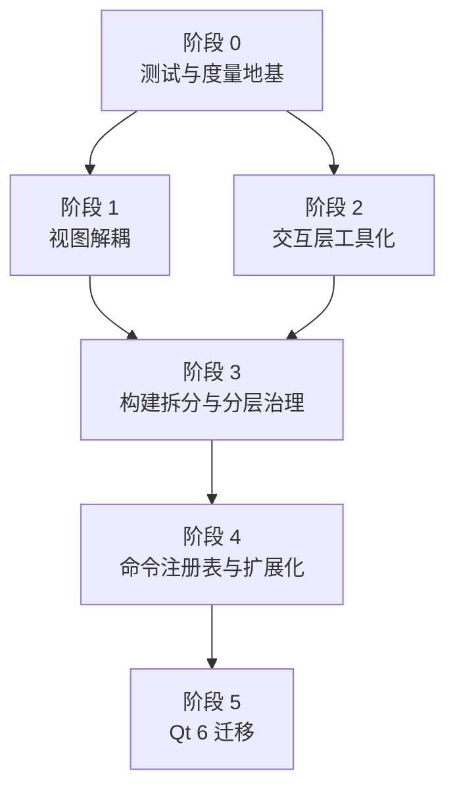
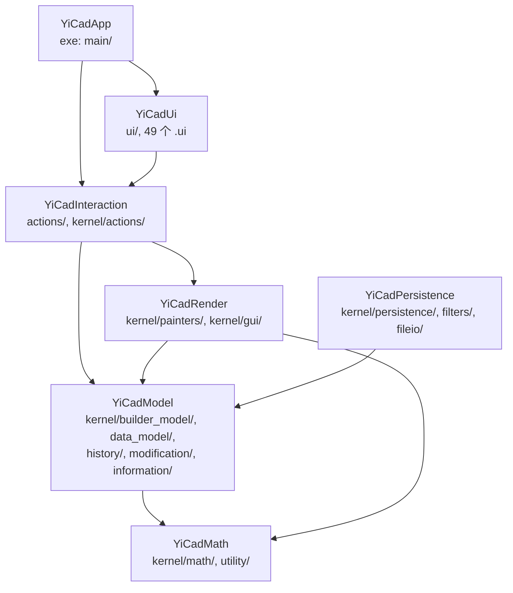

# YiCAD 架构演进分阶段执行方案

本文档给出 YiCAD 从当前形态演进到「可扩展、层次清晰、可测试」目标架构的
分阶段执行方案。每个阶段独立可交付、独立可回退，阶段之间只有明确的前置依赖。

> 本方案基于 `d8e0be5` 的代码基线。文中引用的行号、调用点数量、代码量均为该基线
> 的实测值，见「附录 A 现状度量」。
>
> **范围说明**：渲染子系统（缓存增量化、后端接口化、Vulkan / RHI 评估）不在本方案
> 排期内，另行统一规划。

---

## 1. 现状基线

### 1.1 规模

| 模块 | 文件数 | 代码行 |
|------|-------:|-------:|
| `src/kernel/` | 424 | 104,020 |
| `src/actions/` | 212 | 36,122 |
| `src/ui/` | 160 | 26,385 |
| `src/plugin_runtime/` | 18 | 14,363 |
| `src/ai/` | 29 | 7,063 |
| `src/main/` | 9 | 3,481 |
| `src/cmd/` | 2 | 914 |
| **合计** | **853** | **192,306** |

其中 `kernel/builder_model/` 单目录 51,368 行，`kernel/persistence/` 12,256 行，
`kernel/math/` 8,848 行，`kernel/history/` 8,571 行。

### 1.2 本方案处理的问题清单

按照严重度与修复收益排序。编号保持稳定，不因增删而重排。

| 编号 | 问题 | 证据 | 影响 |
|------|------|------|------|
| P2 | 无任何自动化测试 | 仓库内无 CTest 树 | 后续所有重构无回归保护 |
| P4 | 交互语义混杂、pan 绕过事件栈 | `ActionDefault` 单状态机含 6 态；`GuiDocumentView.cpp:1370` 中键直接 `new ActionZoomPan` | 交互难扩展、光标抢占 |
| P5 | 单一可执行目标 + `file(GLOB)` | `YiCAD/CMakeLists.txt` 仅一个 `add_executable`，19 万行同一 target，GLOB 无 `CONFIGURE_DEPENDS` | 构建慢、层次无强制 |
| P6 | 命令中心化 | `Datamodel.h:127` 的 `ActionType` 含 162 项；`UIActionHandler.cpp` 153 个 `case` | 加命令必改内核 |
| P7 | 分层违规：kernel 反向依赖 ui | `DmDocument.cpp:47` 引入 `UITabDrawWidget.h`；`DmEntityContainer.cpp`、`DmHatch.cpp` 引入 `UIDialogFactory.h` | 阻塞库拆分 |
| P8 | 重头文件扩散 | `GuiDocumentView.h` 被 121 个文件包含，却拖入 `GL/glew.h`、`GL/gl.h`、`GL/glu.h`、`QOpenGLWidget`、`QPushButton`、`QToolButton` | 编译慢、Action 耦合具体后端 |
| P9 | Snap 以继承方式植入所有 Action | `ActionInterface.h:37`：`class ActionInterface : public QObject, public Snapper` | 捕捉策略不可替换、不可单测 |
| P10 | 残余 O(N) 全量扫描 | `Selection::selectWindow` 遍历全表（仅 AABB 粗筛）；`EntityTable::getNearestVirtualIntersection` 对全容器求最近实体 | 大图纸框选、虚拟交点捕捉变慢 |
| P11 | 每帧调试输出 | `GuiDocumentView.cpp:1354` 每帧 `std::cout`，且用 `system_clock` 测时长 | 帧耗时污染、无统一日志 |
| P12 | 无效 GL 调用 | `GuiDocumentView.cpp:124` 在构造函数中调 `glEnable(GL_MULTISAMPLE)`，此时无 current context | 该行不生效 |

### 1.3 需要澄清的既有正确实现

**拾取与捕捉已走 R 树**，不是 O(N) 全量求距。`Snapper::catchEntity`
（`Snapper.cpp:642`、`:689`）先调 `pDocument->searchEntities(min, max, ents, ...)`
由 `EntityTable::m_searchTree` 粗筛，再对候选集精确求距。

这一点容易误判——`Snapper.cpp:736` 确实调用了
`DmEntityContainer::getNearestEntity`，但作用对象是由 R 树候选集临时构造的容器
`ec`，而非全文档容器。P10 列出的两处才是真正的全量扫描。

---

## 2. 阶段总览



| 阶段 | 目标 | 前置 | 可与谁并行 | 相对工作量 |
|------|------|------|-----------|-----------|
| 0 | 测试与度量地基 | 无 | — | M |
| 1 | 视图解耦 | 0 | 2 | M |
| 2 | 交互层工具化 | 0 | 1 | L |
| 3 | 构建拆分与分层治理 | 1、2 | — | L |
| 4 | 命令注册表与扩展化 | 3 | — | XL |
| 5 | Qt 6 迁移 | 4 | — | L |

工作量为相对量级：S 约数日，M 约 1–2 周，L 约 3–6 周，XL 约 2 个月以上，
按单人投入估算。

**关键排序理由**：阶段 1、2 互不冲突且都只在现有单 target 内动，可并行推进；
阶段 3 的库拆分必须等它们落地，否则刚拆完的边界会被后续改动反复打穿；
阶段 4 的扩展化依赖阶段 3 建立的物理边界，否则「扩展」只是目录搬迁。

第 9 节的独立小项不依赖任何阶段，可随时穿插执行。

---

## 3. 阶段 0：测试与度量地基

### 3.1 目标

在动任何架构之前，建立回归保护和性能基线。此阶段基本不改变产品行为，
仅顺带修复 P11、P12 两处无副作用的缺陷。

### 3.2 任务

1. **引入 CTest 骨架**
   - 新建 `tests/` 树，按子系统分目录：`tests/math/`、`tests/persistence/`、
     `tests/geometry/`。
   - 选型：Catch2 或 GoogleTest（经 Conan 引入），二选一后写入 `conanfile.py`
     与 `conan.lock`。
   - 在根 `CMakeLists.txt` 加 `enable_testing()` 与 `option(YICAD_BUILD_TESTS)`。
2. **优先覆盖纯函数子系统**（无 Qt、无 GL 依赖，测试成本最低）
   - `kernel/math/`（8,848 行）：`Math2d`、`RTree`、`KDTree`、`SpacialSearchTree`、
     `FindClosedRegion`。
   - `kernel/information/`：实体求交（`Information::getIntersection`）。
   - `kernel/persistence/`（12,256 行）：**往返测试** —— 构造文档、写盘、读回、
     结构比对。这是投入产出比最高的一类测试，能一次性锁住整个数据模型的语义，
     也是阶段 5（Qt 6 迁移）字符编码验证的唯一依靠。
   - `kernel/builder_model/` 中的几何实体：`DmArc`、`DmCircle`、`DmEllipse`、
     `DmSpline` 的求交、偏移、包围盒。
3. **度量设施**
   - 移除 `GuiDocumentView.cpp:1354` 的每帧 `std::cout`，替换为可开关的计时埋点，
     并把 `system_clock` 改为 `steady_clock`（P11）。
   - 删除 `GuiDocumentView.cpp:124` 构造函数中无 current context 的
     `glEnable(GL_MULTISAMPLE)`（P12）。
   - 引入轻量日志门面（当前 `Debug.h` 被 143 处包含但无分级、分类能力）。
   - 埋点位置：`paintGL` 帧耗时、`Snapper::catchEntity` 耗时、
     `Selection::selectWindow` 耗时。
4. **建立基准图纸**
   - 准备 3 份可复现样本：小（约 1k 实体）、中（约 50k）、大（约 500k），
     含样条、填充、块引用、文字，提交到仓库或以脚本生成。
   - 这三份样本在阶段 2 的交互回归、第 9 节的 P10 验证、以及未来的渲染专项中
     都会复用。
   - 记录基线数据表，模板见「附录 B」。
5. **CI 接入**
   - `.github/workflows/build.yml` 增加 `ctest` 步骤。

### 3.3 验收标准

- `ctest` 在 CI 中绿灯，且至少覆盖 `kernel/math`、`kernel/persistence` 两个子系统。
- 三份基准图纸的帧耗时、拾取耗时、框选耗时有书面基线数据。
- 主干上不再有每帧 `std::cout`。

### 3.4 风险

- 低。此阶段几乎不修改产品代码路径，唯一的产品侧改动是删除调试输出和无效 GL 调用。

### 3.5 执行结果

已完成。落地内容与方案的差异，以及执行中发现的缺陷，记在这里。

**与方案的偏差**

| 项 | 方案 | 实际 | 理由 |
|----|------|------|------|
| 测试框架 | Catch2 或 GoogleTest | GoogleTest 1.15.0 | 阶段 2、4 引入 `ISnapService`、`IDocumentView`、`IExtension` 后要写替身，gmock 更顺手 |
| 测试如何链接内核 | 未定 | 新建 `YiCadCore` OBJECT 库（除 `Main.cpp`），可执行目标与测试共享目标文件 | 单一 `add_executable` 下测试无法复用编译产物；OBJECT 而非 STATIC，避免静态库符号剥离丢掉 Qt 的自动注册符号 |
| 源文件收集 | 阶段 3 才处理 | 阶段 0 就按阶段 3 的七个目标库分区收集，`file(GLOB ... CONFIGURE_DEPENDS)` | 建 OBJECT 库本来就要重排源文件组织，顺带补上 `CONFIGURE_DEPENDS`（P5 的一半）；阶段 3 拆库退化为把七个分区变量各自喂给一次 `add_library`。曾一度改成显式清单，但那要配生成脚本加 CI 校验，维护成本超过收益，已退回 GLOB |
| 分层护栏 | 未列 | 新增 `tools/check_layering.py` 进 CI，P7 的三处进白名单 | 方向先锁住，库后建；白名单失效时脚本报错，防止腐化 |
| 往返测试的接口 | `Persistence` 的流接口 | `OutputStream`/`InputStream` | `dumpToStream`/`restoreFromStream` 是死代码且有缺陷，见下 |

**新增设施**

- `YiCAD/src/kernel/debug/YiCadLog.{h,cpp}` —— 分类加分级的日志门面，
  默认 Warning，过滤不通过时右侧不求值；`YICAD_LOG=*:warning,render:debug` 配置。
- `YiCAD/src/kernel/debug/ScopedTimer.{h,cpp}` —— 可开关的耗时埋点，
  `steady_clock`，按计数器累计而非逐次打印；`YICAD_PROFILE=1` 开启。
- `tools/gen_benchmark_drawings.py` —— 生成 1k / 50k / 500k 三份基准图纸
  （DXF R2000，含样条、填充、块引用、文字），确定性，零第三方依赖。
- `YiCAD/CMakeLists.txt` 的 `yicad_collect_sources()` —— 按分区收集源文件，
  对不存在的目录直接报错。启用后立刻发现原 GLOB 里挂着四个早已不存在的目录
  （`builder_model/array`、`temp/entity_builders`、`temp/entity_data`、
  `temp/geometry`），以及 include 路径里的 `kernel/engine`、`kernel/scripting`，
  一并清理。
- `tests/CMakeLists.txt` 里给测试进程加 PATH —— SARibbonBar 的 DLL 只在
  `cmake --install` 时才就位，构建树里没有，测试二进制会以 0xc0000135
  起不来。只改测试进程的环境变量，不往构建产物里复制任何文件。
- `tools/measure_build.ps1` —— 采集附录 B 的构建指标。
- `doc/BASELINE.md` —— 基线采集步骤与数据表。

**执行中发现的缺陷**

均为测试暴露、且**未在本阶段修复**（阶段 0 不改产品语义）。每一条都留了
`DISABLED_` 测试，修复后去掉前缀即可作为验收。

| # | 位置 | 问题 | 可达性 |
|---|------|------|--------|
| B1 | `Math2d.cpp:400` `cubicSolver` | 单实根分支在 `q > 0` 时取错辅助二次方程的根，对负数取立方根得到 NaN/inf。应取 `r[0]` 而非 `r[1]` | 经 `quarticSolver` → `simultaneousQuadraticSolver*` 被 `Information.cpp:621`（椭圆求交）与 `ActionDrawLineTangent2.cpp:392`（切线）使用 |
| B2 | `Math2d.cpp:396` 同一段 | `r.size() == 0` 时只往 cerr 打一行，随后仍索引 `r[0]`/`r[1]`，越界读 | 同上 |
| B3 | `Information.cpp:398` `getIntersectionLineArc` | 死代码：有完整的相切处理，但全仓无调用点。线与圆实际走通用二次曲线路径，**精确相切求不出切点** | 对切点做修剪、延伸、交点捕捉时失败 |
| B4 | `Persistence.cpp` `restoreFromStream` | 违反 `Archive.h` 为 `ArchiveReader` 写明的契约——未调用 `nextEntry()` 就取 `stream()`，读到空流并抛异常 | 死代码，全仓无调用点。产品文档读写走 `FilterOcdIO`，不受影响 |

另有两处注释与实现不符，已在测试里按实现的真实契约断言并注明：

- `Math2d::correctAngle2` 注释写 `[-PI, +PI)`，实现是 `remainder`，区间是闭的。
- `DmVector::flipXY` 注释未提及它会丢弃 z 分量。

**验收对照**

| 3.3 节的验收标准 | 状态 |
|------------------|------|
| `ctest` 绿灯，覆盖 `kernel/math`、`kernel/persistence` | 达成，另含 `geometry`，共 133 个用例 |
| 三份基准图纸有书面基线数据 | 图纸与采集流程就绪；运行期数据需在有 GPU 的开发机上按 `doc/BASELINE.md` 手工采集 |
| 主干上不再有每帧 `std::cout` | 达成 |

---

## 4. 阶段 1：视图解耦

### 4.1 目标

让 106 个 Action 不再依赖具体的 OpenGL widget，为阶段 3 的库拆分建立前置条件。
这是 P8 的解法。

> **范围边界**：本阶段**不涉及** `Painter` 的接口化、`GL_PAINTER_COMMON()` 宏的
> 消除、或任何渲染后端相关改动——那些属于渲染专项，另行规划。
> 本阶段做的是头文件卫生与视图抽象，本质是解耦而非渲染。

### 4.2 现状证据

- `GuiDocumentView.h` 被 **121 个文件**包含，头部包含 `GL/glew.h`、`GL/gl.h`、
  `GL/glu.h`、`QOpenGLWidget`、`QPushButton`、`QToolButton`、
  `CustomComboboxItem.h`、`PainterCreator.h`。
- `PainterCreator.h:27` 写有 `using namespace opengl;`，污染全部间接包含者。
- 106 个 Action 类直接依赖具体的 `GuiDocumentView`，因而全部间接依赖 OpenGL 头。

### 4.3 任务

1. **`GuiDocumentView.h` 瘦身**
   - 成员 `opengl::GLPainter*` 与 `DmCachePainter*` 改用前置声明，
     `PainterCreator.h` 与全部 `GL/*` 头下沉到 `.cpp`。
   - 移除 `QPushButton`、`QToolButton`、`CustomComboboxItem.h`——这些是 UI 细节，
     不应出现在被 121 个文件包含的头里。
   - 注意：此处只改包含关系，**不改成员类型**，不需要 `Painter` 变虚函数。
2. **清除 `PainterCreator.h` 的 `using namespace opengl;`**
   - 修正因该命名空间泄漏而省略限定符的调用点。
3. **抽出抽象视图接口 `IDocumentView`**
   - 抽出 Action 实际需要的能力：坐标变换（`toGraphX/Y`、`toGuiX/Y`）、
     重绘请求、光标设置、预览容器访问、相对零点、视口矩形。
   - `actions/` 与 `kernel/actions/` 改为依赖 `IDocumentView`。
   - `GuiDocumentView` 实现该接口。

### 4.4 验收标准

- `src/actions/` 与 `src/kernel/actions/` 下不再出现任何 `GL/*` 头。
- `GuiDocumentView.h` 不再包含任何 `GL/*` 头。
- 全量编译时间相对阶段 0 基线有可测量的下降（记录数据）。
- 行为零变化：阶段 0 测试加三份基准图纸目视回归。

### 4.5 风险

- **中**。改动面广（涉及 106 个 Action 的包含关系），但每一步都是机械变换，
  编译器会抓住绝大部分错误。
- 缓解：分两个 PR，先做头文件瘦身（纯包含关系），再做 `IDocumentView` 抽取。

### 4.6 执行结果

已完成，分两个提交，与 4.5 节的缓解措施一致。

**与方案的偏差**

| 项 | 方案 | 实际 | 理由 |
|----|------|------|------|
| `GuiDocumentView.h` 是否彻底摆脱 GL 头 | 不再包含任何 `GL/*` 头 | 仍保留 `#define GL_GLEXT_PROTOTYPES` + `#include <GL/glew.h>`；`GL/gl.h`、`GL/glu.h`、`PainterCreator.h` 按计划下沉到 `.cpp` | `QOpenGLWidget` 经 Qt 的 `qopengl.h` 会在桌面 GL 下间接 `#include <GL/gl.h>`。`GL/glew.h` 的 `#error` 保护是翻译单元级别的约束——只要本文件的某个包含者后续还引入了需要 `glew.h` 的画笔代码（`GLShader.h` 等），gl.h 抢先被 Qt 拉入就会报错。这是被 100+ 文件包含的头无法完全摆脱的不变量，已把代价压到最小（详见文件内注释），构建数据仍达到预期收益（见下） |
| `IDocumentView` 覆盖范围 | `actions/` 与 `kernel/actions/` | 额外覆盖 `kernel/modification/`（`Selection`、`Modification`）与 `kernel/history/BlockEditCmd` | 这三个类直接持有 Action 传入的 `docView` 指针：`Selection`/`Modification` 调用的 `redraw()`/`specifyDocumentModified()`/`getDocument()` 均已在接口内，机械替换即可；`BlockEditCmd` 的 `m_pDocView` 只存储从不解引用，改类型不需要新增任何接口方法。不跟着切换就无法编译（`docView` 现在是 `IDocumentView*`，反向转型不是隐式的） |
| `IDocumentView` 的能力清单 | 坐标变换、重绘请求、光标设置、预览容器访问、相对零点、视口矩形 | 额外加了 `setCursor(const QCursor&)` 与 `asQObject()` | 两处遗留用法绕不开：`ActionDrawMText` 退出文字编辑态要恢复系统默认箭头光标，语义不同于 `setMouseCursor()` 的自绘光标（后者对 `ArrowCursor` 是画 `Qt::BlankCursor` 再自绘十字线）；`ActionDrawHatch`/`ActionModifyExtend` 用旧式 `connect(docView, SIGNAL(viewChanged())...)`，需要一个 `QObject*` |
| 保留具体类型的例外 | 未列 | `ActionOptionsGeneral.cpp`、`kernel/actions/Preview.cpp` 仍 `#include GuiDocumentView.h`；`ActionDrawMText.cpp` 两处 `static_cast<GuiDocumentView*>(docView)` | 前两者拿到的指针分别来自 `MDIWindow::getDocumentView()`、`DmDocument::getDocumentView()`——这两个访问器的返回类型本就是具体的 `GuiDocumentView*`（UI/Model 层既有设计，不在本阶段范围），隐式上转型需要完整类型。后者是因为 `MTextEditWidget`（`ui/`，未迁移）的构造函数要求它同时是 Qt 父窗口和信号源，两者都要求具体类型 |

**新增设施**

- `YiCAD/src/kernel/actions/IDocumentView.h` —— Action/Snapper 视角下的文档视图
  接口，纯虚，无成员，放在 `kernel/actions/` 而非 `kernel/gui/`：接口属于消费方
  （依赖倒置），`GuiDocumentView`（`kernel/gui/`）反过来实现它，物理依赖方向与
  6.3 节的目标库图（`Interaction --> Render`）保持一致。

**执行中发现的缺陷（均属既有代码，本阶段顺手修复）**

| 位置 | 问题 |
|------|------|
| `DmEllipse.cpp` | 用了 `glm::vec2`/`glm::distance`，但从未直接 `#include <glm/glm.hpp>`，全靠 `GuiDocumentView.h → PainterCreator.h → GLPainter.h` 这条链路间接带进来 |
| `ActionLayersActivate/Color/Delete/Freeze/Lock/Print.cpp`（6 个文件） | 通过 `ComboBoxData::btnColor` 等字段与 `sender()` 做 `QObject* == QToolButton*`/`QPushButton*` 比较，但从未直接包含 `<QToolButton>`/`<QPushButton>`，同样靠 `GuiDocumentView.h` 间接带入 |
| `UIBottomWidget.cpp` | 用 `QToolButton` 却未直接包含，同上 |

三处都是 P8（重头文件扩散）描述的典型后果：头文件瘦身之前，这些缺失的直接依赖
被 `GuiDocumentView.h` 的宽泛包含悄悄掩盖了。

**验收对照**

| 4.4 节的验收标准 | 状态 |
|------------------|------|
| `src/actions/` 与 `src/kernel/actions/` 下不再出现任何 `GL/*` 头 | 达成 |
| `GuiDocumentView.h` 不再包含任何 `GL/*` 头 | 部分达成，仅保留 `GL/glew.h`，原因见上表 |
| 全量编译时间相对阶段 0 基线有可测量的下降 | 达成。Release 全量构建 144.3s → 129.5s（-10%）；改 `GuiDocumentView.h` 后的增量构建 65.3s → 25.4s（**-61%**，本阶段的核心指标）；数据见 `doc/BASELINE.md` §5 |
| 行为零变化：阶段 0 测试加三份基准图纸目视回归 | `ctest` 全绿（133 个用例不变）；三份基准图纸的目视回归需要 GPU 开发机人工完成，与阶段 0 的既有限制一致，未变化 |

---

## 5. 阶段 2：交互层工具化

### 5.1 目标

把「选择」「平移」「捕捉」从 Action 体系中剥离为独立的、可叠加的工具层，
并建立明确的事件分发与光标仲裁规则。这是 P4、P9 的解法。
参考 `E:\dev\DS` 的 `ViewToolControl` 设计。

### 5.2 现状证据

- `ActionDefault` 单个状态机承载 6 种语义：`Neutral`、`Dragging`、`SetCorner2`、
  `Moving`、`MovingRef`、`Panning`。
- `GuiDocumentView.cpp:1370`：中键按下直接
  `setCurrentAction(new ActionZoomPan(...))`，绕过 `GuiEventHandler` 的分发逻辑。
- `GuiEventHandler` 持有 `QList<ActionInterface*>`，但没有「未处理则下传」语义，
  依赖 `isExclusive()`、`isSubAction()`、`canBeInterrupt()`、`isViewAction()`
  四个布尔标志互相仲裁优先级。
- 光标无仲裁机制：各 Action 在 `updateMouseCursor()` 中各自抢占。
- `ActionInterface.h:37`：`class ActionInterface : public QObject, public Snapper`，
  捕捉能力以**继承**方式植入全部 106 个 Action。

### 5.3 参考设计（DS/DimX）

- `Application/IViewTool.h`：统一事件集，每个回调返回 `HOP_OK`（已处理，停止分发）、
  `HOP_NOT_HANDLED`（继续下传）或 `HOP_CANCEL`。
- `Application/ViewToolControl.h`：唯一注册到视图的事件接收者，内部维护三层栈 ——
  导航工具（栈底）、选择工具、业务工具栈（后进先出优先）。
- `IViewTool::GetCursor()` 返回 `std::optional<QCursor>`，按与事件分发相同的栈序
  取首个非 `nullopt` 者，并做去重避免每次鼠标移动都 set/unset。
- `Application/Snap2D/`：捕捉作为**独立模块**，不是基类。

### 5.4 任务

1. **定义 `IViewTool` 与 `ViewToolControl`**
   - 事件集对齐 Qt：`mousePress/Release/Move/DoubleClick`、`keyPress/Release`、
     `wheel`、`enter/leave`。
   - 返回值语义：`Handled`、`NotHandled`、`Cancel`。
   - 三层栈：`NavigationTool`、`SelectionTool`、业务工具栈。
2. **抽出 `PanZoomTool` 作为导航工具**
   - 吸收 `ActionZoomPan` 与 `ActionDefault::Panning` 状态。
   - 删除 `GuiDocumentView.cpp:1370` 的硬编码分支，中键平移由导航工具处理。
3. **抽出 `SelectTool` 作为选择工具**
   - 吸收 `ActionDefault` 的 `Neutral`、`Dragging`、`SetCorner2` 状态
     （点选、框选、交叉选）。
   - `Moving` 与 `MovingRef`（拖拽实体与夹点）评估后决定：留在 `SelectTool` 内
     还是拆为 `GripEditTool`。倾向后者，与 DS 的 `Edit/EditTool` 对应。
4. **光标仲裁**
   - `IViewTool::GetCursor()` 返回 `std::optional<QCursor>`，由 `ViewToolControl`
     按栈序仲裁并去重。
   - 移除各 Action 的 `updateMouseCursor()` 直接抢占。
5. **Snap 从继承改为组合**
   - 定义 `ISnapService`，把 `Snapper`（`kernel/actions/Snapper.*`）的能力迁入。
   - `ActionInterface` 去掉 `public Snapper`，改为持有 `ISnapService*`。
   - 这是本阶段改动面最大的一项（影响 106 个 Action），但机械性强。
6. **`ActionInterface` 适配为一类 `IViewTool`**
   - 保留现有 Action 体系不动，用适配器把 `GuiEventHandler` 的 Action 栈包成
     业务工具栈的一项，实现渐进迁移。
   - `isExclusive()`、`isSubAction()`、`canBeInterrupt()`、`isViewAction()`
     四个标志的语义由栈层次替代，逐步废弃。

### 5.5 验收标准

- `ActionDefault` 的 `Panning` 状态被删除，`GuiDocumentView` 内无 `new ActionZoomPan`。
- 中键平移、框选、点选在任意 Action 激活期间行为一致且可预测。
- 光标在「绘制中 + 悬停实体 + 按住 Ctrl」等叠加场景下有确定性结果。
- `ActionInterface` 不再继承 `Snapper`。
- 捕捉逻辑可脱离 Action 单独测试（补充单测）。

### 5.6 风险

- **中高**。交互是用户最敏感的部分，行为回归难以自动化验证。
- 缓解：
  - 第 6 项的适配器策略保证旧 Action 无需改写即可运行，迁移可按 Action 分批；
  - 准备一份交互回归检查清单（手工），覆盖各 Action 与选择、平移的组合；
  - 第 5 项（Snap 解耦）可作为独立 PR 先行，它与工具栈无强耦合。

### 5.7 执行结果

分三轮落地。第一轮完成第 1（`IViewTool`/`ViewToolControl`）、2
（`PanZoomTool`）、4（光标仲裁，范围收窄）、5（Snap 组合化）项；第二轮
补上第 3 项（`SelectTool`，`GripEditTool` 未单独拆分，理由见下）；第三轮
完成第 6 项（业务工具适配器，`LegacyActionTool`）。六项任务全部落地，
剩下的只是第 6 项完成后才有意义的两处收尾（`SelectTool` 正式注册为
选择层、删除 `ActionDefault` 里那次直接置光标的调用），见"后续"。

**与方案的偏差**

| 项 | 方案 | 实际 | 理由 |
|----|------|------|------|
| 落地范围（第一轮） | 六项任务一次性完成 | 先完成第 1、2、4、5 项 | `ActionDefault` 与 `ActionInterface::finish()`（"拒绝退出默认 Action"的特判）、`GuiEventHandler::inSelectionMode()`、`GuiDocumentView::tabletEvent` 的橡皮擦手势深度耦合，拆解它是独立体量的工作，与第 5 项（改动面覆盖 106 个 Action）叠加会突破 10 节"禁止跨阶段大爆炸式 PR"的约束，故拆成两轮 |
| `GripEditTool` 未单独拆分 | `Moving`/`MovingRef` "倾向拆为 GripEditTool" | 与 `Neutral`/`Dragging`/`SetCorner2` 一起留在同一个 `SelectTool` 里 | 这五个状态共享同一次拖拽手势：鼠标刚按下时（`Dragging` 状态）还不知道最终是框选还是拖动实体/夹点，要等移动超过阈值后才能判定，判定逻辑本身就要同时读取"有没有选中的参考点"和"有没有选中的实体"。拆成两个类需要在它们之间转移这次"未决"的拖拽状态，边界不清晰而收益有限；方案本身也把这个拆分标注为"评估后决定"，判断后选择保留在一起 |
| `SelectTool` 未注册进 `ViewToolControl` 的选择层 | 三层栈里选择层由 `SelectTool` 担任 | `SelectTool` 已实现为独立的 `IViewTool`，业务工具适配器（`LegacyActionTool`）也已经落地，但 `SelectTool` 仍只由 `ActionDefault`（薄适配器）在内部持有和调用，未 `setSelectionTool()` 注册进 `ViewToolControl` | `LegacyActionTool` 转发规则是"没有业务 Action 活动、且不是中键/空闲态 Ctrl+左键时，一律转发给 `GuiEventHandler`"——这条规则本身涵盖了"转发给默认 Action（内部即 `SelectTool`）"的全部场景。若现在再把 `SelectTool` 注册成选择层，业务层会先于选择层拿到事件、并且总是转发成功，选择层将永远收不到事件，成为死代码。要让选择层真正生效，需要反过来让 `LegacyActionTool` 在"没有业务 Action 活动"时也主动让路（不转发给默认 Action），把这部分职责正式移交给注册进选择层的 `SelectTool`——这是比"包一层适配器"更深一层的收尾，留在下一步，见"后续" |
| `LegacyActionTool` 对中键/空闲 Ctrl+左键的让路判断 | 未细化——方案只说"给它一个 NotHandled 语义" | 只在两种情况下声明 `NotHandled`：中键（任何时候）；Ctrl/Meta+左键且 `!eventHandler->hasAction()`。平移进行中（`PanZoomTool::isPanning()`）时对移动/释放也让路，避免业务层抢在导航层结束平移之前把事件转发给默认/业务 Action | `GuiEventHandler` 本身没有"这次事件我不关心"的概念——它的分发语义是"只要活着就总是处理"。这条规则原样承袭自第一轮的 `wantsPan`/`isPanning()` 判断（当时是 `GuiDocumentView` 里的外部判断），现在收进 `LegacyActionTool` 内部，让 `GuiDocumentView` 的三个鼠标事件处理函数能统一交给 `ViewToolControl` 分发，不用再各自判断"这次要不要问 ViewToolControl" |
| `GuiDocumentView` 对 RightButton / XButton1 释放的特判保留在工具栈之外 | 未细化 | `mouseReleaseEvent` 的 `switch (e->button())` 结构原样保留：`RightButton`（`back()` 的合成事件回退）与 `XButton1`（`enter()` + `emit xbutton1_released()`）两个分支不经过 `ViewToolControl`；只有 `default` 分支（其余按钮，含中键/左键释放）改为统一调用 `m_pViewToolControl->mouseReleaseEvent(e)` | 这两个分支依赖的是 `GuiDocumentView` 自己的方法（`back()`、`enter()`）和信号（`xbutton1_released()`），不是"哪个 Action 处理这次事件"的问题，本质上是画布级的全局快捷手势，与 `zoomAuto()`（中键双击）、滚轮缩放等其它没有并入工具栈的全局手势同类。如果把它们也塞进 `LegacyActionTool`，要么反过来给 `IViewTool`/`IDocumentView` 增加这两个方法，要么让适配器直接依赖具体的 `GuiDocumentView`——两者都超出"包一层 GuiEventHandler"本身的范围，收益也不明显（没有其它工具需要与它们竞争优先级） |
| 光标仲裁范围 | 移除各 Action 的 `updateMouseCursor()` 直接抢占，统一走 `IViewTool::GetCursor()` | 106 个 Action（含 `ActionDefault`）的 `updateMouseCursor()` 直接调用保持不变；`ViewToolControl` 仅在**全体工具都无偏好**时不触碰当前光标，只有 `PanZoomTool` 主动断言（平移进行中）时才覆盖 | `LegacyActionTool` 未覆盖 `getCursor()`（保持接口默认的 `nullopt`）——它包装的是 100 余个各自直接调用 `setMouseCursor()` 的 Action，没有单一、可查询的"当前光标偏好"可以汇报给仲裁链路。改光标的职责仍在 `ActionDefault::updateMouseCursor()`（读取 `SelectTool::getCursor()` 后直接调用 `docView->setMouseCursor()`）。等 `SelectTool` 也注册为选择层之后，`ActionDefault` 这个直接调用点才能安全删除 |
| Ctrl+左键平移的适用范围 | 未细化 | 仅在 `!eventHandler->hasAction()`（无业务 Action 活动）时生效，与原 `ActionDefault::Panning` 完全一致 | 保持行为零回归：原实现里 Ctrl+拖拽只在 `ActionDefault::Neutral` 状态下响应；业务 Action 运行时左键另有含义（放置绘制点等），不应被导航层截获 |
| 中键平移与活动 Action 的关系 | "在任意 Action 激活期间行为一致" | 中键平移不再通过 `setCurrentAction` 挂起当前 Action，而是在 `GuiDocumentView` 层直接分流给 `PanZoomTool`；平移过程中当前 Action（及其预览）保持活跃、不被挂起 | 与原实现（中键按下会 `setCurrentAction(new ActionZoomPan(...))`，通过挂起/恢复机制暂停前一个 Action）相比是行为上的小幅改善而非逐位复刻，判断为更贴合验收标准"一致且可预测"的本意，已在 `PanZoomTool.h` 顶部注明 |

**执行中发现的缺陷（既有代码，本阶段未修复）**

| 位置 | 问题 | 可达性 |
|------|------|--------|
| `Snapper::setSnapRestriction`（`Snapper.cpp`） | 空实现，从未给 `snapMode.restriction` 赋值——`restriction` 字段只有 `SnapMode::fromInt`/`clear()` 会写。`ActionDefault`（现为 `SelectTool::keyPressEvent`）按 Shift 键临时切到正交捕捉的调用因此从未真正生效 | 原样从 `ActionDefault` 搬到 `SelectTool`，为 `tests/interaction/test_select_tool.cpp` 的单测暴露；不在阶段2范围内修复，测试里已注明不对 `restriction` 取值断言 |

**新增设施**

- `kernel/actions/ISnapService.h` —— 捕捉能力的纯虚接口；`SnapMode` /
  `SnapResultType` / `EntityTypeList` / 吸附常量随之从 `Snapper.h` 迁出。
- `kernel/actions/Snapper.{h,cpp}` —— 改为 `ISnapService` 的具体实现，公开
  API（含签名、默认参数）不变。
- `kernel/actions/ActionInterface.{h,cpp}` —— 不再 `public Snapper` 继承，
  改为持有 `std::unique_ptr<ISnapService>`；保留与 Snapper 完全同名同签名
  的一组转发方法（`catchEntity`/`snapPoint`/`getSnapMode` 等），使既有
  106 个 Action 子类的调用点不必改动一行。另加 `pDocument`/`docView` 两个
  直接成员（构造参数的留存，替代原来经 `Snapper` 继承获得的同名成员）与
  `snapService()` 访问器，供极少数需要绕过 `ActionInterface` 自身
  `finish()`/`suspend()` 语义、直调捕捉器原始实现的子类使用。
- `kernel/actions/IViewTool.h` —— 视图工具接口，事件集对齐 Qt
  （mousePress/Release/Move/DoubleClick、keyPress/Release、wheel、
  enter/leave），参考 `E:\dev\DS` 的 `Application/IViewTool.h`，把
  HOOPS 事件/`QCursor` 换成 Qt 原生事件/`DM::CursorType`。
- `kernel/actions/ViewToolControl.{h,cpp}` —— 三层工具栈分发器（业务栈
  后进先出 > 选择工具 > 导航工具）与光标仲裁，参考 `E:\dev\DS` 的
  `Application/ViewToolControl.{h,cpp}`。
- `kernel/actions/PanZoomTool.{h,cpp}` —— 导航层：中键拖拽（始终生效）与
  Ctrl+左键拖拽（仅无业务 Action 活动时生效）平移，吸收原
  `GuiDocumentView.cpp:1382` 的硬编码 `new ActionZoomPan` 与
  `ActionDefault::Panning` 状态。显式的 Ribbon "Pan" 命令（`ActionZoomPan`
  类本身）不在改动范围内——那是用户主动进入的模态命令，与这里"随时中键一按
  就能平移"的导航手势语义不同，予以保留。
- `kernel/actions/LegacyActionTool.{h,cpp}` —— 阶段2第6项的业务工具
  适配器，把 `GuiEventHandler`（业务 Action 栈 + 默认 Action 的既有分发
  逻辑，一行未改）包成一个 `IViewTool`，注册进 `ViewToolControl` 的
  业务工具栈。只在两类场景声明 `NotHandled`：中键；以及没有业务 Action
  活动时的 Ctrl/Meta+左键——把这两类事件让给导航层 `PanZoomTool`；平移
  进行中时对移动/释放也主动让路，避免业务层抢在导航层结束平移之前
  把事件转发出去。
- `kernel/gui/GuiDocumentView.{h,cpp}` —— 持有 `ViewToolControl`/
  `PanZoomTool`/`LegacyActionTool`（第三轮新增）。`mousePressEvent`/
  `mouseMoveEvent` 统一交给 `ViewToolControl` 分发，不再有 `GuiDocumentView`
  自己判断"这次要不要问 ViewToolControl"的外部 `wantsPan` 逻辑——那部分
  判断已经收进 `LegacyActionTool`。`mouseReleaseEvent` 保留 RightButton/
  XButton1 两个全局手势分支在工具栈之外（原因见"与方案的偏差"表），其余
  按钮的 `default` 分支统一交给 `ViewToolControl`。
- `tests/support/FakeDocumentView.h` —— `IDocumentView` 的最小测试替身，
  交互层工具的单测因此不必依赖 `GuiDocumentView` 或任何 Qt 界面组件。
  `getGrid()`/`getOverlayContainer()`/`getPreviewContainer()` 用真实的
  `GuiGrid`/`DmEntityContainer` 成员兜底（而非 `nullptr`）——`Snapper` 的
  `init()`/`deleteSnapper()` 等方法会无条件解引用它们的返回值。
- `kernel/actions/SelectTool.{h,cpp}` —— 从 `ActionDefault` 抽出的选择/
  拖拽状态机，吸收原来的 `Neutral`/`Dragging`/`SetCorner2`/`Moving`/
  `MovingRef` 五个状态；不继承 `QObject`/`ActionInterface`，构造时接收
  非持有的 `ISnapService*`/`Preview*`（与拥有者共享同一个捕捉器与预览
  容器实例，保证捕捉模式、预览内容一致）。
- `actions/ActionDefault.{h,cpp}` —— 由完整的状态机改为薄适配器：
  持有 `std::unique_ptr<Preview>` 与 `std::unique_ptr<SelectTool>`，把
  `ActionInterface` 的全部虚方法转发给 `SelectTool`。保留下来是因为
  `GuiEventHandler::m_pDefaultAction`/`DM::ActionDefault` 类型身份、以及
  `ActionBlocksEdit`/`ActionModifyMText` 对
  `handler->getDefaultAction()->mouseXEvent(e)` 的直接复用都依赖一个
  仍然存活、行为不变的 `ActionDefault` 实例。
- `tests/interaction/` —— `test_select_tool.cpp`（`SelectTool` 的状态
  转换、按钮语义、`Escape`/`Shift` 处理，9 个用例，用真实的空
  `DmDocument` + `Snapper` + `FakeDocumentView` 构造，不需要
  `GuiDocumentView`）；`test_legacy_action_tool.cpp`（`LegacyActionTool`
  的转发/让路判断，7 个用例，用一个没有挂任何 Action 的空
  `GuiEventHandler` 构造）。连同已有的 `ViewToolControl`/`PanZoomTool`
  用例，本目录共 32 个用例。

**影响面**

- `actions/ActionDefault.{h,cpp}` —— 第一轮删除 `Panning` 状态；第二轮
  整体重写为薄适配器（见上）。
- `actions/ActionDimAngular.cpp`、`ActionDimDiametric.cpp`、
  `ActionDimRadial.cpp`、`ActionDrawEllipseInscribe.cpp`、
  `ActionDrawLineBisector.cpp` —— 原先绕开虚函数分派、显式调用
  `Snapper::finish()`/`Snapper::suspend()` 的 5 处基类调用，改为
  `snapService()->finish()`/`suspend()`。
- `actions/ActionModifyBevel.cpp`、`ActionModifyRound.cpp`、
  `ActionModifyTrim.cpp`、`ActionZoomPan.cpp` —— 4 处直接读写 `snapMode`
  字段（原继承自 `Snapper` 的 protected 成员）的代码，改为
  `getSnapMode()->...`。
- 其余全部 100 余个 Action 子类文件未改动一行——`catchEntity`/
  `snapPoint`/`snapMode` 等调用点是到 `m_snapService` 的透明转发，
  机械性由编译期验证（全量构建 + 133+32 个既有/新增用例全绿，Debug 与
  Release 均已构建，分层检查脚本无新增违规）。

**验收对照**

| 5.5 节的验收标准 | 状态 |
|------------------|------|
| `ActionDefault` 的 `Panning` 状态被删除，`GuiDocumentView` 内无 `new ActionZoomPan` | 达成 |
| 中键平移、框选、点选在任意 Action 激活期间行为一致且可预测 | 中键平移达成，且现在经由统一的 `ViewToolControl` 分发（`LegacyActionTool` 主动让路），不再依赖 `GuiDocumentView` 里的外部判断；框选/点选的状态机已抽到 `SelectTool` 并独立单测，但仍只经 `ActionDefault` 触达，未注册为选择层参与统一优先级排序（见上表），运行时行为与前两轮等价，未回归也未扩大适用范围 |
| 光标在叠加场景下有确定性结果 | 部分达成：平移进行中/结束后的光标切换已可预测；`SelectTool`/`ActionDefault` 与其余 105 个旧 Action 的光标仲裁化未做，等 `SelectTool` 正式注册为选择层后收尾 |
| `ActionInterface` 不再继承 `Snapper` | 达成 |
| 捕捉逻辑可脱离 Action 单独测试（补充单测） | 达成，并扩展到选择逻辑与业务工具适配器：`SelectTool` 已完全脱离 `ActionInterface`/`QObject`，用一个空 `DmDocument` + 真实 `Snapper` + `FakeDocumentView` 即可单测；`LegacyActionTool` 用一个没有挂任何 Action 的空 `GuiEventHandler` 即可单测其转发/让路判断，都不需要 `GuiDocumentView` |

**后续**

- 把 `SelectTool` 正式注册为 `ViewToolControl` 的选择层。需要先让
  `LegacyActionTool` 在"没有业务 Action 活动"时也主动让路（当前它只对
  中键和空闲态 Ctrl+左键让路，其余情况——包括转发给默认 Action 的场景——
  都会转发成功），把"转发给默认 Action"这部分职责正式移交给选择层的
  `SelectTool`；之后即可删除 `ActionDefault::updateMouseCursor()` 里那次
  直接 `setMouseCursor` 调用，光标仲裁改由 `ViewToolControl::
  refreshCursor()` 统一处理。
- `GripEditTool` 的拆分已评估并搁置（见上表"与方案的偏差"），除非后续
  出现新的、独立于点选/框选状态机的夹点交互需求，否则不再重新考虑。

---

## 6. 阶段 3：构建拆分与分层治理

### 6.1 目标

把 19 万行的单一可执行目标拆为按层划分的静态库，让依赖方向由 CMake 强制执行。
这是 P5、P7 的解法，也是阶段 4 扩展化的物理前提。

### 6.2 现状证据

- `YiCAD/CMakeLists.txt:196` 只有一个 `add_executable`（另有 `YiCadPluginSdk`
  INTERFACE 库和两个插件 DLL 目标）。
- 源文件全部通过 `file(GLOB ...)` 收集，**未加 `CONFIGURE_DEPENDS`**，新增文件
  不重新配置 CMake 就不会进入构建。
- 已有 PCH（`src/main/YiCadPch.h`），未启用 unity build。
- 分层违规三处：`DmDocument.cpp:47` 引入 `UITabDrawWidget.h`，
  `DmEntityContainer.cpp:31` 与 `DmHatch.cpp:50` 引入 `UIDialogFactory.h`
  —— 数据模型层在弹对话框。

### 6.3 目标库结构



依赖方向严格单向，**`YiCadModel` 不得依赖 `YiCadUi` 或 `YiCadRender`**。

`YiCadRender` 在此仅作为一个层次边界存在，本方案**不改动其内部实现**。
未来的渲染专项将在这个边界内进行，届时不会波及其它库。

### 6.4 任务

1. **先修分层违规（P7）**
   - `DmEntityContainer` 与 `DmHatch` 对 `UIDialogFactory` 的调用：改为由模型层
     返回状态或错误码，由调用方（Action 或 UI 层）决定是否提示；或注入
     `IUserPrompt` 接口，默认实现为静默。
   - `DmDocument` 对 `UITabDrawWidget` 的依赖：走已有的
     `GuiDialogFactoryInterface` 式的接口注入，或用信号解耦。
2. **源文件清单显式化**
   - 把 `file(GLOB)` 改为显式源文件列表（推荐），或至少加 `CONFIGURE_DEPENDS`。
   - 显式列表的额外收益：拆库时每个库的边界一目了然，误放文件会立刻暴露。
3. **逐库拆分**
   - 顺序：`YiCadMath`、`YiCadModel`、`YiCadPersistence`、`YiCadRender`、
     `YiCadInteraction`、`YiCadUi`、`YiCadApp`。
   - 从最底层开始，每拆一个库，编译器会把所有反向依赖暴露出来。
   - 每个库独立 `target_include_directories(... PUBLIC/PRIVATE)`，禁止全局
     include 路径。
4. **构建优化**
   - 每个库单独配置 PCH（当前全局一份 `YiCadPch.h`，拆库后各层需要的头不同）。
   - 对 `YiCadModel`、`YiCadPersistence` 等大库启用 `UNITY_BUILD`。
   - 测量并记录：全量构建时间、单文件改动的增量构建时间。
5. **CI 适配**
   - `.github/workflows/build.yml` 与 `cmake/` 下的安装脚本适配多目标。

### 6.5 验收标准

- `YiCadModel` 的编译不需要 Qt Widgets 与 OpenGL。
- `src/kernel/` 下不再出现对 `UI*` 头文件的包含。
- 全量构建时间与「只改 `DmArc.cpp` 的增量构建时间」相对阶段 0 基线有明确改善数据。
- 新增源文件无需手工重配 CMake，或有明确的显式清单维护流程。

### 6.6 风险

- **中**。主要是循环依赖的发现与拆解，可能暴露出比已知三处更多的反向依赖。
- 缓解：先做一次静态依赖分析（按 `#include` 构图），在动手前把循环依赖清单列全，
  评估后再决定是否调整库边界。

---

## 7. 阶段 4：命令注册表与扩展化

### 7.1 目标

消除命令的中心化注册，使「新增一个功能」不再需要修改内核文件；
在此基础上把功能按领域拆为进程内扩展。这是 P6 的解法。

### 7.2 现状证据

- `Datamodel.h:127` 的 `DM::ActionType` 枚举含 **162** 项，位于内核最底层，
  被 27 个文件直接包含。
- `UIActionHandler.cpp`（1,735 行）用 **153 个 `case`** 把枚举映射到 Action 构造。
- `cmd/Commands.cpp`（727 行）是命令行输入的第二套映射。
- 插件 DLL 走第三套路径：`plugin_runtime/`（14,363 行），其中
  `HostApi.cpp` 5,661 行、`YiCadPluginAbi.h` 2,036 行、`YiCadPluginSdk.h` 3,806 行，
  合计约 11.5k 行手写 C ABI。

### 7.3 关键决策：内部扩展不走 C ABI

现有的 ABI v3 是为**第三方 DLL** 设计的稳定二进制边界。内部功能拆扩展**不应**复用
它，否则等于为自己的代码支付 ABI 稳定性成本（版本协商、布局静态断言、字符串
借用语义、句柄不可解引用等约束）。

内部扩展应使用进程内 C++ 接口，参考 DS 的 `Application/Framework/`：

- `IExtension`：`OnRegister(IExtensionContext&)`、`OnShutdown()`、`Id()`；
- `IExtensionContext`：启动期资源门面（Ribbon 注册入口等），刻意不暴露全局单例；
- `ExtensionManager`：持有 `unique_ptr<IExtension>`，`OnShutdown` 按注册反序触发。

两套机制并存，边界清晰：**C ABI 对外，`IExtension` 对内**。

### 7.4 任务

1. **命令注册表（本阶段的核心，先于扩展化）**
   - 定义 `CommandRegistry`：以稳定字符串 ID（如 `draw.line`、`modify.trim`）
     为键，注册命令元数据（显示名、图标、可用性谓词、工厂函数）。
   - 自注册机制：每个 Action 在自己的 `.cpp` 中静态注册，加命令等于加一个文件。
   - 三条入口收敛到同一注册表：Ribbon（`UIActionHandler`）、命令行
     （`cmd/Commands.cpp`）、插件（`PluginRegistry`）。
   - `DM::ActionType` 降级：保留为实体类型标识等仍需枚举的场景，
     移除其作为命令 ID 的职责。
2. **删除 153 个 `case`**
   - `UIActionHandler` 退化为「查表加激活」，从 1,735 行降到数百行。
3. **扩展框架**
   - `IExtension`、`IExtensionContext`、`ExtensionManager`。
   - Ribbon 注册改为由扩展在 `OnRegister` 期间声明，而非集中在
     `ApplicationWindow`（2,293 行）中硬编码。
   - 加入命名空间校验：扩展注册的命令 ID 必须以其扩展 ID 为前缀。
4. **试点扩展：`ai/`**
   - 选择理由：7,063 行，自包含度最高，抽掉不影响核心绘图能力，失败成本最低。
   - 验证扩展框架的生命周期、Ribbon 注册、设置页注册三条路径。
5. **按领域推进后续扩展**
   - 建议顺序：`ai/`、标注（Dim 系列）、文字（Text/MText）、块（Block）、
     填充（Hatch）、打印。
   - 每个扩展独立成库（依托阶段 3 的库拆分能力）。

### 7.5 验收标准

- 新增一条绘图命令不需要修改 `src/kernel/` 下的任何文件。
- `UIActionHandler.cpp` 无 `switch (actionType)` 巨型分支。
- `ai/` 作为独立扩展加载，关闭该扩展后应用正常启动与绘图。
- 扩展的注册与卸载顺序可预测，`OnShutdown` 反序执行。

### 7.6 风险

- **高**。改动面覆盖全部 106 个 Action 与全部 Ribbon 装配代码。
- 缓解：
  - 注册表与枚举**并行共存**一段时间：新命令走注册表，旧命令保留 `case` 分支，
    逐批迁移，任何时刻都可构建可运行；
  - 每批迁移后跑阶段 0 的测试加交互回归清单；
  - 先只做第 1、2 项（注册表），确认稳定后再做第 3 至 5 项（扩展框架）。

---

## 8. 阶段 5：Qt 5.15 到 Qt 6 迁移

### 8.1 目标

脱离已停止公开维护的 Qt 5.15 开源版本。

### 8.2 理由

- Qt 5.15 开源版本早已停止公开补丁发布，长期停留有安全与兼容风险。
- `E:\dev\DS` 已在 Qt 6.8，两个项目对齐后可共享 UI 组件经验
  （SARibbonBar、QtADS、ElaWidgetTools）。
- 附带收益：Qt 6 提供 RHI（Rendering Hardware Interface），一份渲染代码可跑
  OpenGL、Vulkan、D3D12、Metal。未来的渲染专项若要评估后端替换，
  Qt 6 是前置条件——但这不是本阶段的排期理由。

### 8.3 任务

1. 依赖侧：SARibbonBar、CDT 及 Conan 依赖的 Qt 6 版本确认与重新构建；
   更新 `conanfile.py`、`conan.lock`、`CMakePresets.json`、CI。
2. 代码侧：`QRegExp` 改 `QRegularExpression`、容器 API 变更、
   `QMouseEvent::x()/y()` 改 `position()`（`Snapper.cpp:750` 等处仍在用旧 API）、
   `qAsConst`、`QTextCodec` 迁移、`QStringRef` 移除等。
3. 字符编码：`DocumentSettings::sourceCodePage` 相关的 DXF 编码处理需重点验证
   （Qt 6 移除了 `QTextCodec`，需改用 `QStringConverter` 或 ICU）。
4. 翻译：`ts/` 下的翻译文件用 Qt 6 的 `lupdate` 重新生成。

### 8.4 验收标准

- Qt 6 下全部测试绿灯，三份基准图纸行为一致。
- DXF 导入导出的中文编码往返测试通过。
- CI 同时或切换到 Qt 6 构建。

### 8.5 风险

- **中**。Qt 6 迁移路径成熟，但 `ui/` 26,385 行加 49 个 `.ui` 文件的改动量不小，
  且字符编码部分（DXF 代码页）有真实的行为回归风险。
- 缓解：阶段 0 建立的 persistence 往返测试在此阶段发挥核心作用。

---

## 9. 独立小项

不依赖任何阶段，可随时穿插执行。

### 9.1 清理残余 O(N) 全量扫描（P10）

| 位置 | 现状 | 改法 |
|------|------|------|
| `Selection::selectWindow`（`Selection.cpp:80`） | 遍历全表，仅有 AABB 粗筛 | 先 `searchEntities(min, max, ...)` 取候选 |
| `EntityTable::getNearestVirtualIntersection`（`EntityTable.cpp:338`） | 对全容器调 `getNearestEntity` | 改用 R 树候选集 |

`EntityTable::searchEntities`（`EntityTable.h:81`）已存在且由 R 树驱动，
两处改造都只是换调用方式，无需新建设施。

**注意**：`Snapper::catchEntity` 已经正确使用 R 树（见第 1.3 节），不在此列，
不要误改。

**验收**：大图纸上框选与虚拟交点捕捉的耗时相对基线明显下降。

**风险**：低。**工作量**：S。

---

## 10. 回退策略

每个阶段都应满足以下约束，确保任何时刻主干可构建、可运行：

| 阶段 | 回退粒度 | 保障机制 |
|------|---------|---------|
| 0 | 单个 PR | 基本不改产品代码路径 |
| 1 | 两个 PR | 纯机械变换，编译期即可发现问题 |
| 2 | 按 Action 分批 | 适配器让新旧事件体系共存，可逐 Action 回退 |
| 3 | 按库分批 | 自底向上拆，每拆一层单独 PR |
| 4 | 按命令分批 | 注册表与枚举并行共存，未迁移的命令走旧路径 |
| 5 | 分支隔离 | Qt 5 与 Qt 6 双 CI 并行一段时间 |

**通用约束**：禁止出现跨阶段的「大爆炸式」PR。任何超过三个核心文件的改动，
按 `AGENTS.md` 的约定先说明影响范围再执行。

---

## 附录 A 现状度量（基线 `d8e0be5`）

### A.1 代码量

```
src/kernel/            424 文件  104,020 行
  builder_model/       141 文件   51,368 行
  persistence/          89 文件   12,256 行
  math/                 20 文件    8,848 行
  history/              39 文件    8,571 行
  data_model/           59 文件    5,700 行
  painters/             27 文件    3,998 行
  gui/                  14 文件    3,856 行
  filters/               5 文件    3,222 行
  modification/          4 文件    2,023 行
  actions/               8 文件    1,985 行
  information/           4 文件    1,223 行
  其余 (fileio/generators/debug/printing/solver/utility)  约 928 行
src/actions/           212 文件   36,122 行   (106 个 Action 类)
src/ui/                160 文件   26,385 行   (49 个 .ui)
src/plugin_runtime/     18 文件   14,363 行
src/ai/                 29 文件    7,063 行
src/main/                9 文件    3,481 行
src/cmd/                 2 文件      914 行
--------------------------------------------
合计                   853 文件  192,306 行
```

### A.2 关键耦合指标

| 指标 | 数值 |
|------|-----:|
| `GuiDocumentView.h` 被包含次数 | 121 |
| `DmDocument.h` 被包含次数 | 146 |
| `Debug.h` 被包含次数 | 143 |
| `GuiDialogFactory.h` 被包含次数 | 105 |
| `DM::ActionType` 枚举项数 | 162 |
| `UIActionHandler.cpp` 的 `case` 数 | 153 |
| `.cpp` 中 `new` 出现次数 | 1,414 |
| `.cpp` 中 `delete` 出现次数 | 227 |
| kernel 反向依赖 ui 的文件数 | 3 |
| 可执行与库目标数（不含插件） | 1 |
| 自动化测试数 | 0 |

### A.3 待修的具体位置索引

| 问题 | 位置 |
|------|------|
| 重头文件 | `kernel/gui/GuiDocumentView.h:26-42` |
| `using namespace` 污染 | `kernel/painters/PainterCreator.h:27` |
| 硬编码 pan | `kernel/gui/GuiDocumentView.cpp:1370` |
| 每帧 `std::cout` | `kernel/gui/GuiDocumentView.cpp:1354` |
| 无效 `glEnable` | `kernel/gui/GuiDocumentView.cpp:124` |
| Snap 继承 | `kernel/actions/ActionInterface.h:37` |
| 中心枚举 | `kernel/builder_model/Datamodel.h:127` |
| 巨型 switch | `ui/UIActionHandler.cpp` |
| 分层违规 | `kernel/builder_model/DmDocument.cpp:47`、`DmEntityContainer.cpp:31`、`DmHatch.cpp:50` |
| 全量框选 | `kernel/modification/Selection.cpp:80` |
| 全容器求最近 | `kernel/history/EntityTable.cpp:343` |

---

## 附录 B 基线数据表模板

阶段 0 产出，后续每个阶段结束时复测并追加一列。

| 指标 | 小图纸(约 1k) | 中图纸(约 50k) | 大图纸(约 500k) |
|------|-------------:|---------------:|----------------:|
| 打开文档耗时 (ms) | | | |
| 稳态帧耗时 (ms) | | | |
| 点选（`catchEntity`）耗时 (ms) | | | |
| 全选框选（`selectWindow`）耗时 (ms) | | | |
| 虚拟交点捕捉耗时 (ms) | | | |

构建指标：

| 指标 | 数值 |
|------|-----:|
| 全量构建耗时 (Release) | |
| 改 `DmArc.cpp` 后增量构建耗时 | |
| 改 `GuiDocumentView.h` 后增量构建耗时 | |
| 改 `Datamodel.h` 后增量构建耗时 | |
