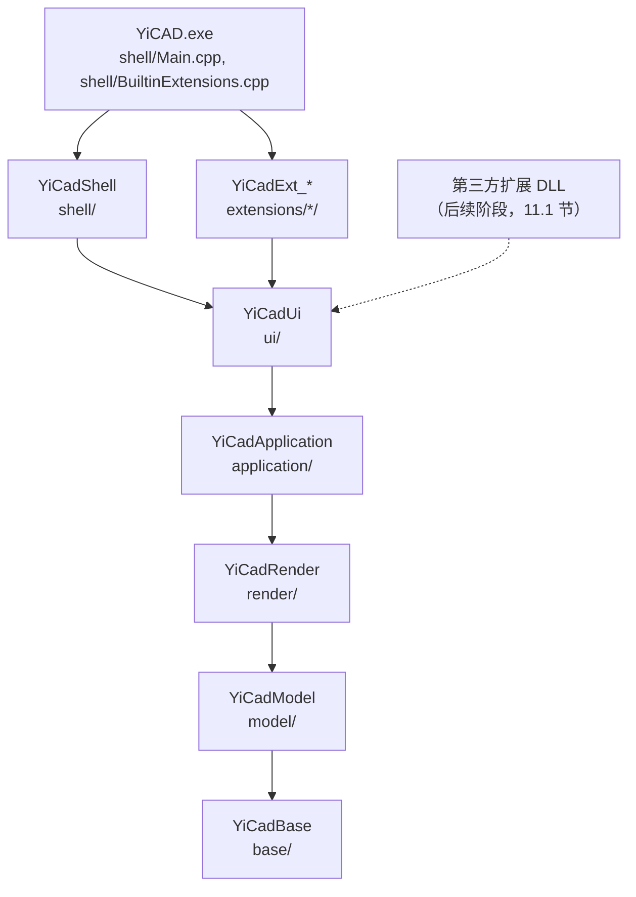

# YiCAD 分层重组分步执行方案

本文档给出把 YiCAD 的源码分层从当前的八个分区收敛为六个库的分步执行方案。
每一步独立可交付、独立可回退：一步做完，构建、测试、安装运行都保持绿色，再开始下一步。

> 本方案基于 `17aaeb5` 的代码基线，文中的行号、文件数、行数均为该基线的实测值。
>
> 本方案接续 `ARCHITECTURE_EVOLUTION_PLAN.md` 阶段 3 留下的事项（6.7 节：RENDER 以上的
> 分区合编进 `YiCadCore`，UI 与 SHELL 互相依赖），完成后第 2 节的目标结构取代该文档
> 6.3 节的目标库结构。
>
> **不做的事**：不改类名与类型前缀（`Dm*`、`Gui*`、`UI*` 保持）；不改渲染子系统内部实现；
> 不改块编辑模式（它在 `ExclusiveCommandBus` 里的设计另行重做，本方案只做最小适配）；
> 不改插件 C ABI。第三方自定义实体已定走 C++ SDK 路线（D7），但动态库化、实体类型开放与
> SDK 本身不在本方案排期内，列为后续阶段（第 11 节）；本方案只保证不给它设障。
>
> **停止确认**：S1 至 S6 每一步都会改动三个以上的核心文件，按 `AGENTS.md` 的停止确认规则，
> 每一步开工前先列出影响面、等确认后再执行。第 12 节的待确认决策在对应步骤开工前定下。

---

## 1. 现状

### 1.1 分区与规模

分区即 `YiCAD/CMakeLists.txt` 里的 `yicad_collect_sources` 调用。

| 分区 | 目录 | 目标库 | 文件 | 行数 |
|------|------|--------|-----:|-----:|
| MATH | `kernel/math`、`kernel/utility`、`kernel/debug` | `YiCadMath`（STATIC） | 53 | 14,261 |
| MODEL | `kernel/builder_model`（含 `dimension`、`text`）、`kernel/data_model`（同）、`kernel/history`、`kernel/modification`、`kernel/information`、`kernel/solver`、`kernel/generators` | `YiCadModel`（STATIC） | 258 | 68,944 |
| PERSISTENCE | `kernel/persistence`、`kernel/persistence/Meta`、`kernel/filters` | `YiCadPersistence`（STATIC） | 65 | 9,275 |
| RENDER | `kernel/painters`、`kernel/painters/opengl`、`kernel/view` | `YiCadCore`（OBJECT，合编） | 39 | 7,040 |
| APPLICATION | `application`、`application/framework`、`cmd` | 同上 | 38 | 6,728 |
| INTERACTION | `kernel/interaction` | 同上 | 2 | 768 |
| UI | `ui`、`ui/forms`、`ui/ribbon` | 同上 | 66 | 10,626 |
| SHELL | `main`、`plugin_runtime`、`kernel/fileio` | 同上 | 32 | 17,801 |
| 扩展 | `extensions/<扩展>`（13 个） | `YiCadExt_<扩展>`（OBJECT） | 266 | 51,920 |

库的依赖链：`YiCadMath ← YiCadModel ← YiCadPersistence ← YiCadCore ← 扩展与可执行文件`。

### 1.2 问题清单

编号保持稳定，不因增删而重排。L1–L8 由本方案处理，L9 由后续阶段处理。

| 编号 | 问题 | 证据 | 影响 |
|------|------|------|------|
| L1 | 持久化单独成层，文档保存自己的原生格式要绕经宿主 | `DmDocument::save` 调 `GUIDIALOGFACTORY->requestFileExport`（`DmDocument.cpp:266`），由 UI 层的 `UIDialogFactory.cpp:103` 转给 SHELL 的 `FileIO`，再到 PERSISTENCE 的 `FilterOcdIO`（`Fileio.cpp:136` 唯一注册的格式）、`Meta*Container`，最后回到 Model 的 `DmEntity::saveStream`；打开同理（`DmDocument.cpp:544`） | 没有界面就存不了盘；Model 与 Persistence 的依赖方向与常规 CAD 相反 |
| L2 | Model 认识视图 | `DmDocument::m_documentView`（`DmDocument.h:277`）；`Selection`、`Modification` 构造时持有 `IDocumentView*`，只用来调 `specifyDocumentModified()` 与 `redraw()`；`BlockEditEnterCmd`/`BlockEditExitCmd` 保存了 `IDocumentView*` 但从未使用（`BlockEditCmd.h:56`、`:85`） | 文档与视图 1:1，无法支持多视口 |
| L3 | Model 认识宿主 | `GuiDialogFactoryInterface`（命令选项栏、坐标控件、`setCommandWidget(UICommandWidget*)` 等宿主服务）放在 `kernel/builder_model/`；Model 内 24 处调用：`DmDocument.cpp` 15 处，标注实体 9 处 `requestActiveDocument()` | 标注实体在多文档下可能取错标注样式表（`ARCHITECTURE_EVOLUTION_PLAN.md` 6.7 节已记录） |
| L4 | UI 与 SHELL 互相依赖 | `ui/` 下 9 个文件包含 `ApplicationWindow.h`/`MDIWindow.h`（`UIActionHandler`、`UIBottomWidget`、`UICommandWidget`、`UICurrentActivePen`、`UIDialogFactory`、`UILineTypeBox`、`UITabDrawWidget`），`UIFileDialog.cpp:98` 调 SHELL 的 `FileIO`；扩展 `file`、`options` 包含 `UITabDrawWidget.h`，`IExtensionContext::tabDrawWidget()` 暴露具体类型 | UI 无法单独成库；扩展与主窗口实现耦合 |
| L5 | 目录名与内容不符 | `kernel/math/` 一半是序列化与编码基础设施；`builder_model/` 放实体与文档，`data_model/` 放 `*Data` 结构体；`kernel/history/` 放着符号表与空间索引；`kernel/` 下同时有 MODEL、RENDER、INTERACTION、SHELL 四个分区的目录 | "目录即边界"名不副实，新人找不到代码 |
| L6 | 过薄的分区与死代码 | INTERACTION 只有 `UIView` 一个类；`cmd/` 2 个文件；`kernel/solver/`（61 行）、`kernel/generators/`（168 行）全仓无包含方；`FilterJsonIO`（2,016 行）未注册、无调用方 | 分层多而不实 |
| L7 | 上层合编，边界只靠脚本 | RENDER、APPLICATION、INTERACTION、UI、SHELL 合编进 `YiCadCore`；`check_layering.py` 不检查 `ui/` 对 `main/` 的包含 | 边界可以被悄悄打穿 |
| L8 | 文件名含空格 | `kernel/builder_model/DmObject .cpp` | 工具链与脚本容易出错 |
| L9 | 实体类型封闭 | `DM::EntityType` 是枚举（`Datamodel.h:83`）；OCD 文件按类型分组、按固定顺序存取（`FilterOcdIO.cpp:386`、`:583`）；实体编辑器与属性编辑器按枚举登记（`CommandRegistry.h:221`、`:223`）；第三方插件只有 C ABI，不能派生实体与交互命令 | 内置扩展与第三方都不能新增实体类型。后续阶段处理，见 11.1 节 |

---

## 2. 目标结构

### 2.1 库与依赖



从八个分区收敛为六个库：PERSISTENCE 拆散（机制进 Base，原生格式进 Model），
INTERACTION 与 `cmd/` 并入 Application，MATH 更名 Base。每一层存在的理由是有使用方只需要它
与它以下的层：几何单测只要 Base，无界面转换与批处理只要 Model，离屏绘制只要 Render，
扩展不需要主窗口。

| 库 | 可以包含 | 本方案的库类型 | S6 之后由谁保证 |
|----|----------|---------------|----------------|
| `YiCadBase` | 第三方库 | STATIC | CMake include 路径 |
| `YiCadModel` | Base | STATIC | CMake |
| `YiCadRender` | Model 及以下 | STATIC（S6） | CMake |
| `YiCadApplication` | Render 及以下；`application/view/` 以外的文件不得包含 `application/view/` | STATIC（S6） | CMake + `check_layering.py` |
| `YiCadUi` | Application 及以下 | OBJECT（S6） | CMake |
| `YiCadShell` | 全部核心库 | OBJECT（S6） | — |
| `YiCadExt_<扩展>` | Ui 及以下，且只含本扩展的头文件 | OBJECT | CMake |

库类型是本方案的过渡选择（D3）。后续阶段做 C++ SDK 时，除 Shell 外的五个库改为 SHARED（11.1 节）。

### 2.2 目录

```
YiCAD/src/
├─ base/                YiCadBase
│  ├─ core/             类型系统、序列化机制、压缩、编码、Uuid、Datamodel
│  ├─ debug/            日志与计时
│  └─ geometry/         向量、矩形、Math2d、方程求解、凸包、KD 树、R 树
├─ model/               YiCadModel
│  ├─ document/         文档与全局对象
│  ├─ property/         颜色、画笔、图层、线型、填充图案
│  ├─ entity/           实体（dimension/、text/）
│  ├─ entity_data/      实体数据结构（dimension/、text/）
│  ├─ table/            符号表、实体表、空间索引
│  ├─ history/          撤销重做
│  ├─ edit/             Modification、Selection
│  ├─ algorithm/        求交、面积、闭合区域、三角剖分
│  └─ io/               原生格式与格式注册表（meta/）
├─ render/              YiCadRender
│  ├─ painter/          绘制抽象
│  ├─ opengl/           OpenGL 实现
│  └─ view/             画布 GuiDocumentView、IDocumentView、ISnapService、网格、预览窗
├─ application/         YiCadApplication（沿用 DS 的 Application 命名）
│  ├─ （根）            命令、命令总线与注册表、视图工具、捕捉、预览、命令别名、宿主服务接口、文档文件服务
│  ├─ framework/        进程内扩展框架、IDocumentManager
│  └─ view/             交互视图 UIView
├─ ui/                  YiCadUi：可复用控件、对话框运行器、文件对话框、Ribbon 注册表（forms/、ribbon/）
├─ shell/               YiCadShell：主窗口、图纸标签页、每图纸窗口、状态栏、命令行、宿主服务实现、
│  │                    Ribbon 装配器与只有壳层使用的表单
│  └─ plugin_runtime/   C ABI 插件运行时
└─ extensions/          不变
```

`shell/` 下不建 `forms/`、`ribbon/` 子目录：壳层只有 `UIExitDialog`、`UISnapMiddleOptions`、
`UIRibbonManager` 三个这类文件，与 `ui/forms/`、`ui/ribbon/` 同名会让人误以为重复。
`ui/` 与 `shell/` 的分界是"谁用它、它依赖谁"：扩展要用的、不依赖主窗口的留在 `ui/`，
只有壳层用的、依赖主窗口的进 `shell/`。

### 2.3 文件去向

`#include` 全部是扁平文件名，搬家只改 CMake 的 include 目录，不改源码。归属存疑的文件按
"谁包含它"决定，执行结果里列出。

| 现在 | 目标 | 步骤 |
|------|------|------|
| `kernel/math/` 的 `Archive`、`Base64`、`FileInfo`、`MD5`、`MetaType`、`MinizipNgArchive`、`Persistence`、`Reader`、`Stream`、`Swap`、`TimeInfo`、`Tools`、`Type`、`Uuid`、`Writer`、`gzstream`、`Datamodel.h` | `base/core/` | S2 |
| `kernel/builder_model/Datamodel.cpp`、`kernel/utility/TSingleton.hpp` | `base/core/` | S2 |
| `kernel/debug/` | `base/debug/` | S2 |
| `kernel/math/` 的 `ConvexHull`、`DmRect`、`DmVector`、`GeometryMethods`、`KDTree`、`Math2d`、`QuarticEquation`、`RTree` | `base/geometry/` | S2 |
| `builder_model/` 的 `DmDocument`、`DmSystem`、`DmSettings`、`DmClipboard`、`DmObject`、`DmFlags`、`DmObserver`、`DmId`、`DmIdManager`、`DmVariable`、`DmVariableDict`、`DmUnits` | `model/document/` | S2 |
| `builder_model/` 的 `DmColor`、`DmPen`、`DmPenList`、`DmLayer`、`DmLineType`、`DmPattern`、`DmPatternList` | `model/property/` | S2 |
| `builder_model/` 其余 25 个实体与实体工具类（`DmEntity`、`DmArc`……`DmEntityHelper`、`DmUtility`） | `model/entity/` | S2 |
| `builder_model/dimension/`、`builder_model/text/` | `model/entity/dimension/`、`model/entity/text/` | S2 |
| `data_model/`（含 `dimension/`、`text/`） | `model/entity_data/`（同） | S2 |
| `builder_model/` 的 `DmBlockTable`、`DmBlockTableListener`；`history/` 的 `DmDimensionStyleTable`、`DmLayerTable`、`DmLineTypeTable`、`DmTextStyleTable`、`EntityTable`、`TableBase`、`SpacialSearchTree` | `model/table/` | S2 |
| `history/` 其余（`Cmd`、`CmdManager`、`MacroCmd`、`Transaction` 与各 `*Cmd`） | `model/history/` | S2 |
| `modification/` | `model/edit/` | S2 |
| `information/` | `model/algorithm/` | S2 |
| `persistence/backuppolicy`、`persistence/Meta/MigratorBase`、`filters/FilterInterface`、`filters/FilterOcdIO` | `model/io/` | S2 |
| `persistence/Meta/` 的各 `Meta*` 容器 | `model/io/meta/` | S2 |
| `builder_model/` 的 `IDocumentView`、`ISnapService` | `model/host/`（过渡）→ `render/view/` | S2 → S3 |
| `builder_model/` 的 `GuiDialogFactory`、`GuiDialogFactoryAdapter`、`GuiDialogFactoryInterface` | `model/host/`（过渡）→ `application/` | S2 → S4 |
| `filters/FilterJsonIO`、`solver/`、`generators/` | 删除 | S1（D1） |
| `painters/`、`painters/opengl/`、`view/` | `render/painter/`、`render/opengl/`、`render/view/` | S2 |
| `cmd/` | `application/` | S2 |
| `kernel/interaction/` | `application/view/` | S2 |
| `main/` | `shell/` | S2 |
| `plugin_runtime/` | `shell/plugin_runtime/` | S2 |
| `kernel/fileio/` | `shell/fileio/`（过渡）→ 消解进 `model/io/` 的格式注册表 | S2 → S4 |
| `ui/` 的 `UITabDrawWidget`、`UIActionHandler`、`UIBottomWidget`、`UICommandWidget`、`UISnapWidget`、`UIDialogFactory` | `shell/` | S5 |
| `ui/forms/` 的 `UIExitDialog`、`UISnapMiddleOptions`；`ui/ribbon/UIRibbonManager` | `shell/` | S5 |

`model/host/` 与 `shell/fileio/` 是过渡目录：S2 先把文件放进去，让遗留依赖显而易见；
S3、S4 解开依赖后清空并删除。

---

## 3. 步骤总览


| 步骤 | 目标 | 解决 | 改变行为 | 工作量 |
|------|------|------|----------|--------|
| S0 | 补齐整文档读写的回归测试，记录构建基线 | 为 S4 兜底 | 否 | S |
| S1 | 删除死代码与未使用的形参，修正文件名 | L6、L8，L2 的一部分 | 否 | S |
| S2 | 按第 2 节搬目录，合并 `YiCadPersistence` 进 `YiCadModel`，`YiCadMath` 更名 `YiCadBase` | L5，L6 的一部分，L1 的物理前提 | 否 | M |
| S3 | 文档通过监听接口通知视图，Model 去掉 `IDocumentView` | L2 | 否（语义一一对应） | M |
| S4 | 原生格式与格式注册表进 Model，存盘策略移出 Model，宿主服务接口移到 Application | L1、L3 | 有风险：文件读写 | L |
| S5 | 新增 `IDocumentManager`，壳层部件搬进 `shell/` | L4 | 否 | M |
| S6 | `YiCadCore` 拆成 Render、Application、Ui、Shell 四个库 | L7 | 否 | M |

工作量：S 约数日，M 约 1–2 周，L 约 3–4 周，按单人投入估算。

**排序理由**：S2 是纯搬家，放在所有代码改动之前做，之后每一步的改动都落在最终路径上，
只有 `model/host/`、`shell/fileio/` 里的少数文件要再搬一次。S3 与 S4 都改 `DmDocument.cpp`，
必须串行。S5 依赖 S4：`UIFileDialog` 要先改查 Model 里的格式注册表，才能和 `FileIO` 脱钩。
S6 要等 S5 解开 UI 与 Shell 的循环依赖。

**每一步的通用验收**：Debug 与 Release 都能构建；`ctest --test-dir build/<config> -C <config> --output-on-failure`
全部通过，用例数不少于上一步；`python tools/check_layering.py` 通过；`cmake --install` 后运行
`build/<config>/bin/YiCAD.exe`，按 `INTERACTION_CHECKLIST.md` 的相关条目冒烟。

---

## 4. S0：回归保护

### 4.1 目标

S4 会改动文档读写路径，这是数据丢失风险最高的地方，而现有测试不覆盖它：
`tests/persistence` 只测单个实体的流往返与编码工具，`test_persistence_roundtrip.cpp:283`
的注释写明产品的文档读写走 `FilterOcdIO`，与已有用例无关。本步先把这条路径锁住。

### 4.2 任务

1. **整文档 OCD 往返测试**（`tests/persistence/`）
   - 构造一份文档：直线、圆、圆弧、椭圆、多段线、样条、单行与多行文字、五种标注与引线、
     填充、块定义与块引用（含属性）、多个图层、线型、文字样式、标注样式。
   - 经 `FilterOcdIO` 写临时文件，再读回新文档。
   - 比对：各类实体数量与类型、关键几何（端点、圆心、半径）、图层与样式表内容、
     块引用指向的块名。
2. **异常路径**：读损坏文件返回失败而不崩溃；如有旧版本样本，覆盖 `MigratorBase` 的迁移。
3. **交互清单**：`INTERACTION_CHECKLIST.md` 新增"文件读写"一节——保存、另存为、自动保存、
   `.bak` 备份、外部修改检测提示、打开损坏文件时询问是否打开备份、未命名图纸首次保存、
   DXF 插件的导入导出。
4. **构建基线**：用 `tools/measure_build.ps1` 记录全量构建与单文件增量构建时间，写入 `BASELINE.md`，
   供 S2、S6 对比。

### 4.3 验收

- 新用例在当前代码上全部通过。如果发现读写缺陷，按 `AGENTS.md` 的约定以 `DISABLED_` 保留并注明原因，
  不在本步修复。
- `BASELINE.md` 有本方案的起点数据。

### 4.4 风险

低。只加测试与文档。

### 4.5 执行结果

2026-09-26 完成，基线 `17aaeb5`。

**新增用例**：`tests/persistence/test_persistence_document.cpp`，31 个，分四组。样本文档含 4.2 节列的全部内容，
另加点、射线、构造线、二维实体（Solid）：

| 组 | 个数 | 内容 |
|----|-----:|------|
| `OcdDocumentWrite` | 4（启用） | 样本构造；压缩包的条目顺序与各条目是否有数据；用 `QXmlStreamReader` 独立解析 `Document.xml`，核对各表与各类实体的 `Count`、当前图层与样式、图层名（base64）；覆盖已有文件时 `FilterOcdIO` 自带的编号备份（`<文件名>1`） |
| `OcdDocumentRoundTrip` | 16（全部 `DISABLED_`） | 各类实体的数量与关键几何、图层与画笔、文字、五种标注与引线、填充、块定义与块引用（含属性）、图层表、线型、文字样式与标注样式、中文路径、再存再读的稳定性 |
| `OcdDocumentErrorPath` | 4（启用） | 空文件、非压缩包、截断、不存在：过滤器一律抛异常（断言现状，S4c 改为结果码后随之改写） |
| `DocumentSavePolicy` | 7（4 启用、3 `DISABLED_`） | 另存为经 `.tmp` 写出、再次保存生成 `.bak`、后缀与格式不符拒绝保存、外部修改检测；打开刚保存的文件、打开损坏文件时询问备份、没有备份时警告 |

宿主服务用测试里的 `OcdHost` 代替（`GuiDialogFactoryAdapter` 派生，按后缀与格式名分派到 `FilterOcdIO`，与 `FileIO`
对 `.ycd` 的分派相同）。用例总数 425 → 456（启用 422 → 434，`DISABLED_` 3 → 22）；Debug、Release 的 ctest 全部通过。

**偏差：读回路径整体不可用。** 按 4.3 节，缺陷以 `DISABLED_` 保留、本步不修。4.1 节设想 S0 为 S4 兜底，但 YiCAD
目前读不回自己写出的任何 `.ycd`，往返用例一个也启用不了。共查出 9 处，机理、位置与可达性写在测试文件头部：

| 编号 | 位置 | 现象 |
|------|------|------|
| R1 | `FilterOcdIO.cpp:154` | 打开压缩包后没有先 `nextEntry()` 就把流交给 `XMLReader`，解析到空流，抛异常。与 `test_persistence_roundtrip.cpp` 里 `Persistence::restoreFromStream` 的缺陷同一机理 |
| R2 | `Reader.cpp:152`–`:280` | `XMLReader` 在 pugixml 的 DOM 上模拟 SAX 读取器，`readEndElement` 实际向后找下一个同名"开始"标签，`readElement` 会重复读当前节点；`restoreXML` 读到线型数据后走到文档末尾，抛异常 |
| R3 | `DmPoint.cpp:233`、`DmRay.cpp:344`、`DmXline.cpp:242` | 先调的 `DmAtomicEntity::restoreStream(reader, revs)` 在当前格式分支什么也不读，实体头（id、图层、画笔）没读出，余下字节被当成更多实体：1 个点读回 6 个，射线、构造线各 4 个，每存开一次还会增多 |
| R4 | `MetaLayers.cpp:114` 等四处 | 新文档自带的 "0" 图层、"Standard" 文字样式、"ISO-25" 标注样式与 19 个箭头块，读入时又各加一份；按名字查找取到默认那份，文件里的同名条目被忽略；箭头块每存开一次多 19 个 |
| R5 | `MetaLineTypes.cpp:86` | 当前线型按"有没有 active 属性"判断，而每个线型都写了该属性，最后一个自定义线型成为当前线型 |
| R6 | `MetaLineTypes.cpp:96` | `QString::replace` 原地修改线型说明，读回的说明丢掉字母、数字与括号 |
| R7 | `DmDocument.cpp:544`、`:589`、`:597` | 过滤器的异常穿出 `DmDocument::open`，调用链上无人捕获；"是否打开备份"的询问与打开失败的警告都走不到 |
| R8 | `DmDocument.cpp:589` | 改开 `.bak` 仍按后缀选过滤器，`FilterOcdIO::canImport` 只认 `ycd`，`.bak` 永远打不开 |
| R9 | `DmXline.cpp:91` | `setBasePoint` 赋值给 `getBasePoint()` 返回的临时对象，读回的构造线基点停在原点 |

核对方法：在本地逐处临时修补（未提交），加 `--gtest_also_run_disabled_tests` 运行。只补 R1、R2 时，注明"依赖 R1、R2"
的 11 个用例全部通过，其余 8 个失败；再补 R3、R5–R9，只剩依赖 R4 的 2 个失败。R4 的修法有语义选择（读入时覆盖同名
默认条目，还是先清空默认表），未做探查修补。

影响：

- 写出一侧今天就锁住了 S4 必须保持的东西：压缩包的条目与顺序、`Document.xml` 的结构与计数、`.tmp`/`.bak`/编号备份、
  外部修改检测、格式不符的拒绝。
- 读回一侧在 R1、R2 修好之前没有回归保护，S4c 要搬的"打开失败询问备份"也无从验证（R7、R8）。是否以及何时修复，见 12 节 D8。
- 产品：交互清单 W6（打开 `.ycd`）在修好前必然失败；按代码推断异常会穿过 Qt 事件循环使程序退出，未实测。

**迁移**：仓库里没有旧版本的 `.ycd` 样本；全仓没有 `DmMigratorBase` 的派生类，也没有 `addMigrator` 调用，
`DmMigrateContext::postRestore` 恒为真；各持久化类型的修订号都是 0，`restoreStreamWithRev` 的旧版本分支都是空实现。
迁移路径是空的，本步无从覆盖。

**交互清单**：`INTERACTION_CHECKLIST.md` 新增 6G 节（W1–W10），覆盖 4.2 节第 3 项列的全部场景，期望按现有代码写，
已知缺陷标"既有"并引用 R 编号。另记一处既有行为：自动保存每个文档只做一次（`DmDocument.cpp:194`、`:223`，W5）。

**构建基线**（`BASELINE.md` 第 7 节）：Release 全量构建 203.2 秒；改 `DmArc.cpp`、`GuiDocumentView.h`、`Datamodel.h`
后的增量分别 10.9、21.5、163.4 秒。`measure_build.ps1` 测全量时会删掉并重配构建目录，而它不重放 `CMAKE_PREFIX_PATH`，
所以改在单独的 `build/measure-s0` 里测，做法写在 `BASELINE.md` 7.1 节，S2、S6 照此复测。

**通用验收**：Debug、Release 构建通过（Debug 增量构建又遇到 `ARCHITECTURE_EVOLUTION_PLAN.md` 8.6 节遗留问题 1 的
LNK1103，删掉 `build/Debug/YiCAD/*.dir/Debug` 下的 `.obj`、`.pdb` 后重建通过）；两种配置的 ctest 全部通过；
`check_layering.py` 通过；`cmake --install` 后启动 `YiCAD.exe`，10 秒后进程仍在运行、主窗口有响应。
交互清单未手工走查；新增的 6G 节供 S4 前后使用。

**其他观察**（不影响用例，未处理）：

- `OneException::what()`（`Tools.h:289`）不是 `std::exception::what()` 的覆盖（非 const），按 `std::exception` 捕获只能拿到
  "Unknown exception"；`XMLReader::readFiles` 抛出的消息指向已析构的局部字符串。R7 修复时应一并考虑错误信息怎么传出。
- 半径、直径标注构造并 `update()` 之后，`getDefinitionPoint()` 变成了箭头点，与 `DmDimRadial.h` 注释"definitionPoint 是圆弧中心"
  不符；与读写无关，用例按写出前的值比对。

### 4.6 D8 修复步：读回路径

D8 于 2026-09-26 定下：先修 R1、R2、R3、R5、R6、R9；R7、R8 并入 S4c（8.4 节第 5 项）；R4 的修法另定（D9）。
按决定在 S1 之前做，改动落在现有路径上，S2 搬家时随文件一起 `git mv`。

**改动**（产品代码 10 个文件）：

| 缺陷 | 文件 | 改法 |
|------|------|------|
| R1 | `FilterOcdIO.cpp` | 构造 `XMLReader` 之前先 `nextEntry()`；一个条目也没有时按坏文件抛异常 |
| R2 | `Reader.h`、`Reader.cpp` | `advance()` 改为逐个产生"开始、开始即结束、结束"三种元素事件；`readElement`、`readEndElement` 照 FreeCAD 原实现；`Level` 按 `Reader.h` 的接口说明变化（开始加一，开始即结束不变，结束减一）；构造时从根元素开始；删去不再使用的 `lastStartElement` |
| R3 | `DmPoint`、`DmRay`、`DmXline`（`.h`、`.cpp`） | 与 `DmLine`、`DmCircle` 相同：新增 `restoreStream(InputStream&)`，先读实体头再读自身字段；带修订号的 `restoreStream` 在当前格式分支转调它。末尾补 `calculateBorders()`，与同类实体一致——读回的实体随即放进空间索引，要有正确的包围盒 |
| R5 | `MetaLineTypes.cpp` | 按 `active` 的值而不是有无判断；顺带修正固定线型（ByLayer、ByBlock、Continuous）为当前线型时读回不恢复的问题 |
| R6 | `MetaLineTypes.cpp` | 外观串在副本上去掉字母、数字与括号，说明原样保存 |
| R9 | `DmXline.cpp` | `setBasePoint` 改调 `data.setBasePoint` |

**测试**：

- 新增 `tests/math/test_math_xml_reader.cpp`（11 个）：按 `Reader.h` 的接口说明锁住 `XMLReader` 的事件语义，
  不依赖 OCD 格式本身；
- `tests/persistence/test_persistence_roundtrip.cpp` 新增 5 个：点、射线、构造线（加直线对照）按类型修订号读回并读完全部字节，
  同类实体首尾相接时逐个读回不错位；
- `test_persistence_document.cpp` 启用 15 个，另新增 1 个（ByBlock、Continuous 为当前线型时读回不变，覆盖 R5 的顺带修正）；
  仍为 `DISABLED_` 的 4 个依赖 R4（2 个）与 R7、R8（2 个），用 `--gtest_also_run_disabled_tests` 核对过，它们只因这几处失败。
- 用例 456 → 473（启用 434 → 466，`DISABLED_` 22 → 7）。

**验收**：Debug、Release 构建与 ctest 通过；`check_layering.py` 通过；`cmake --install` 后程序正常启动。
交互清单 6G 节 W6、W7 的期望随之改写；打开 `.ycd` 没有在界面上手工走查。

**遗留**：

- R4、R7、R8 未修。其中 R7 现在更容易碰到：正常的 `.ycd` 能打开了，只有损坏的文件还会让异常穿出 `DmDocument::open`。（R7、R8 已在 S4c 修复，见 8.8 节；R4 见 4.7 节。）
- `test_persistence_roundtrip.cpp` 的 `DISABLED_压缩流往返` 仍失败：`Persistence::dumpToStream`/`restoreFromStream` 有与 R1
  相同的漏调，但这对接口全仓没有调用方，建议在 S1 的死代码清理中一并删除，不修。（S1 已删除，见 5.5 节。）

### 4.7 D9 修复步：R4

2026-09-27 完成，基线 `d5e05b5`（S4 之后）。按 D9 的做法 A：读入前清空、完全以文件为准，缺条目时读完再补。
开工前确认：清空的范围是实体表加四张表（图层、文字样式、标注样式、块），不只是默认条目，理由见下文"与 D9 原文的出入"。

**改动**（产品代码 9 个文件）：

| 文件 | 改法 |
|------|------|
| `DmLayerTable`、`DmTextStyleTable`（`.h`、`.cpp`） | `setDocument` 里建默认条目的代码抽成 `addMissingDefaults()`：表里没有 "0" 图层（"Standard" 文字样式）时补上，没有当前项时以它为当前；构造时与读完后共用。新增 `clear_direct()`：删除全部条目、从文档注销 id、当前项置空。当前项指针加上 `= nullptr` 初值（原先构造后未初始化，要等 `setDocument` 赋值） |
| `DmDimensionStyleTable`（`.h`、`.cpp`） | 同上，`addMissingDefaults()` 补箭头块与 "ISO-25"（取 "Standard" 文字样式）。`initArrowBlocks` 的 19 处"块表里没有同名块才加入，否则删掉"合成 `addArrowBlock`：丢弃时先 `clear_direct()` 块内图元再删块——图元加入时已在文档登记了 id，原先直接 `delete` 留下悬空的登记。这条分支原先走不到（只在新文档上调），现在读完补箭头块时每个块都走一次 |
| `DmBlockTable`（`.h`、`.cpp`） | 没有调用方的 `clear()`（只清列表、不删对象）改为 `clear_direct()`：清空块内图元、注销块的 id、删除块 |
| `FilterOcdIO.cpp` | `fileImport` 在确认压缩包可读之后调 `clearForImport`：按 `~DmDocument` 的顺序清空实体、标注样式、块、文字样式、图层；读完调 `addMissingDefaults`（图层、文字样式、标注样式依次补）。读失败时先补再把异常抛出，读了一半的文档也有当前图层与样式 |

`MetaLayers` 等四处读入代码（4.5 节 R4 所列位置）不用改：清空之后它们 `add_direct` 的就是表里唯一的一份。

**读入过程中不会先查到默认条目**（D9 要求确认的一点）：`Document.xml` 里先读图层，其余条目按写出顺序读 `TextStyles.bin`、
`DimensionStyles.bin`、`Blocks.bin`，再读各类实体（`XMLReader::readFiles` 按登记顺序匹配）。按名字查表的地方——实体头的图层
（`DmEntity::restoreStream`）、标注样式里的文字样式、标注的样式与文字样式、块引用的块、属性的文字样式与图层——都排在被查的表之后。

**与 D9 原文的出入**：

- D9 写的是"读入前清空这些默认条目"。`DocumentFileService::open` 读失败后把备份读进同一份文档（`DocumentFileService.cpp:366`），
  这时文档里还有第一次读了一半的实体；只清四张表，这些实体的图层等指针就悬空了，比原先"内容叠两份"更糟。所以连实体表一起清空。
  新建的文档里这些表本来只有默认条目，两种做法结果相同。
- 线型表不清：固定线型读入时已存在则跳过（`MetaLineTypes`），新文档里的线型表不会重复。读进已有内容的文档时，先前读入的
  自定义线型留着，用例照此断言。

**测试**：`test_persistence_document.cpp` 去掉依赖 R4 的 2 个用例的 `DISABLED_` 前缀，即为验收；另加 3 个：

- 默认条目按文件里的属性读回：改过的 "0" 图层（颜色、锁定）、"Standard"（字高）、"ISO-25"（箭头大小）读回不变，"0" 图层的 id 是文件里的，
  新文档自带的那份已注销，点实体挂在读回的 "0" 图层上；
- 文件缺少的默认条目读完补上：默认条目改名、删去一个箭头块后写出，读回时文件里的条目都在，缺的各补一个，补上的 "ISO-25" 用补上的
  "Standard"，当前项仍是文件里的；
- 读进已有内容的文档时以文件为准：先读样本，再把只有一条直线的文件读进同一份文档，只剩文件里的实体、图层、样式与块，清掉的图层已注销 id。

用例 502（启用 500，`DISABLED_` 2），比 S4d 多 3 个，`DISABLED_` 少 2 个（`BASELINE.md` 7.2 节）；剩下的 2 个是 `test_math`、
`test_geometry` 的既有数值缺陷，与读写无关。临时注释掉 `clearForImport` 的调用，这 5 个用例全部失败，恢复后通过。

**验收**：Release、Debug 构建通过（Debug 又遇到 LNK1103，照 S0 的做法删掉 `.obj`、`.pdb` 后重建）；两种配置的 ctest 全部通过；
`check_layering.py` 通过（9 处已登记的例外）；Release `cmake --install` 后启动 `YiCAD.exe`，10 秒后进程在运行、主窗口有响应，关闭后以 0 退出。
程序不接受命令行传入文件，打开 `.ycd` 没有在界面上走查；打开路径由 `test_interaction` 的 `DocumentFileService` 用例覆盖。
交互清单 W6 的期望随之改写，第 7 节补了两条有意的行为变化。

**遗留**：

- 文件缺少 "Standard" 时，读入过程中按这个名字找样式的地方取到空（样式名为空的块属性，`DmBlockReference.cpp:874`）；原先取到新文档
  自带的那份。YiCAD 写出的文件总带着 "Standard"，只有改过名的才会缺。
- 其他观察（未处理）：`~DmBlockTable` 是默认析构，文档析构时块不释放。

---

## 5. S1：死代码清理

### 5.1 目标

先删掉不需要搬的东西，缩小 S2 的搬家范围。

### 5.2 任务

1. 删除 `kernel/solver/`（`SolverInterface`）与 `kernel/generators/`（`XMLWriterQXmlStreamWriter`、
   `XmlWriterInterface`）：全仓除自身外无包含方。同步从 `CMakeLists.txt` 的 MODEL 分区与
   `YiCadModel` 的 include 目录中移除。
2. 删除 `kernel/filters/FilterJsonIO.{h,cpp}`：未在 `FileIO::getFilters()` 注册，全仓无调用方（D1）。
3. 删除 `BlockEditEnterCmd`/`BlockEditExitCmd` 未使用的 `IDocumentView*` 形参与成员
   （`BlockEditCmd.h:41`、`:70`），同步改 `extensions/block/commands/BlockEditTool.cpp:112`、`:175`。
   块编辑模式待重新设计，本步只删不改其余逻辑。
4. 删除死 include：`kernel/view/GuiDocumentView.cpp:49` 的 `GuiDialogFactory.h`（文件内无调用）。
5. `kernel/builder_model/DmObject .cpp` 改名为 `DmObject.cpp`（`git mv`）。

### 5.3 验收

- 通用验收。
- `grep` 全仓不再出现 `SolverInterface`、`XMLWriterQXmlStreamWriter`、`FilterJsonIO`。

### 5.4 风险

低。删除前再核对一次无包含方；构建通过即证明无残留引用。

### 5.5 执行结果

2026-09-26 完成，基线 `5dbc0c7`（D8 修复步之后）。D1 于开工前定下：按建议删除。

**改动**：

| 任务 | 改法 |
|------|------|
| 1 | `git rm` `kernel/solver/`（2 个文件，61 行）、`kernel/generators/`（3 个文件，168 行）；`CMakeLists.txt` 的 MODEL 分区与 `YiCadModel` 的 include 目录删去这两项，连同分区注释里"计划图未列出的 solver/、generators/ 按依赖方向归此"一句 |
| 2 | `git rm` `FilterJsonIO.{h,cpp}`（2,338 行）；`.ts` 里没有它的词条 |
| 3 | `BlockEditEnterCmd`、`BlockEditExitCmd` 删去 `IDocumentView*` 形参、`m_pDocView` 成员与对应的 `@param`；`BlockEditCmd.h` 的 `IDocumentView` 前置声明与 `BlockEditCmd.cpp` 的 `#include "IDocumentView.h"` 随之成为死代码，一并删除；`BlockEditTool.cpp` 两处构造改为不传视图 |
| 4 | 删去 `GuiDocumentView.cpp` 的 `#include "GuiDialogFactory.h"` |
| 5 | `git mv "DmObject .cpp" DmObject.cpp`；仓库里没有脚本或 `.ts` 引用旧文件名 |
| 追加 | 按 4.6 节遗留的建议，删除 `Persistence::dumpToStream`/`restoreFromStream`，连同只被 `restoreFromStream` 调用的私有虚函数 `restoreFinished()`（全仓无覆盖）与 `Persistence.cpp` 里只为这两个函数服务的 `Reader.h`、`Writer.h`、`MinizipNgArchive.h`、`Tools.h` 四个 include；删除 `test_persistence_roundtrip.cpp` 的 `DISABLED_压缩流往返` 与文件头部对它的说明。开工前确认过 |

`Persistence` 少了一个虚函数，虚表布局变化，几乎所有目标文件都要重编；插件 C ABI 不暴露 C++ 类，不受影响。

**用例**：472（启用 466，`DISABLED_` 6）。与 D8 修复步相比只少了被删的 `DISABLED_压缩流往返`，启用数不变
（`BASELINE.md` 7.2 节）。

**验收**：

- Release、Debug 构建通过，两种配置的 ctest 全部通过；`check_layering.py` 通过；Release `cmake --install` 后启动
  `YiCAD.exe`，10 秒后进程仍在运行、主窗口有响应。
- 任务 3 没有运行期覆盖：`test_interaction` 的块编辑用例（`test_select_first_commands.cpp` 的 `enterBlockEdit()`）
  特意不跑事务，不构造 `BlockEditEnterCmd`/`BlockEditExitCmd`；块编辑（交互清单 B 系列）也未在界面上手工走查。
  被删的成员从未被读取，编译通过即说明没有遗漏的使用处。S3 为块编辑进入与退出补的用例（7.2 节第 8 项）会覆盖这两个命令。
- `grep` 全仓：`SolverInterface`、`XMLWriterQXmlStreamWriter`、`XmlWriterInterface`、`FilterJsonIO`、`dumpToStream`、
  `restoreFromStream` 在源码、构建脚本、测试与 `.ts` 里都不再出现；剩下的只在本文档的任务描述与
  `ARCHITECTURE_EVOLUTION_PLAN.md` 的历史记录里。

**遗留**：`nlohmann_json` 已无使用者——`FilterJsonIO` 是它唯一的包含方。按开工前的确认本步不动，移除要同步
`conanfile.py`、`conan.lock`、`cmake/dependencies.cmake`、`cmake/conan_helpers.cmake`、`YiCAD/CMakeLists.txt`
（`YiCadMath` 的链接）、`README.md`、`README_zh.md`、`LICENSE` 与 `licenses/nlohmann-json-mit.txt`，并重跑 `conan install`
验证，另行处理。

---

## 6. S2：目录重组与库合并

### 6.1 目标

一次性把目录搬到第 2 节的结构（S5 的壳层部件除外），库从
`YiCadMath ← YiCadModel ← YiCadPersistence ← YiCadCore` 变为 `YiCadBase ← YiCadModel ← YiCadCore`。
**只移动文件和改构建脚本，不改任何 `.h`/`.cpp` 的内容。**

### 6.2 任务

1. **搬文件**：按 2.3 节标为 S2 的行执行，全部用 `git mv`，保证 `git log --follow` 可追溯。
   单独一个提交，不夹带内容改动。
2. **`YiCAD/CMakeLists.txt`**
   - 分区改为 BASE、MODEL、RENDER、APPLICATION、UI、SHELL；删除 PERSISTENCE 与 INTERACTION 分区
     （`model/io` 并入 MODEL，`application/view` 并入 APPLICATION）。
   - `YiCadMath` 更名 `YiCadBase`；删除 `YiCadPersistence`，其源文件与第三方依赖并入 `YiCadModel`。
     这是纯移动：PERSISTENCE 原本就只依赖 Model 与 Math。
   - 各库的 `target_include_directories` 换成新目录；预编译头改为 `shell/YiCadPch.h`；
     `Main.cpp`、`BuiltinExtensions.cpp` 的路径改为 `shell/`；`YiCadPluginSdk` 的头文件路径改为
     `shell/plugin_runtime/`（安装路径 `include/YiCAD/plugin-sdk` 不变）；`src/ui` 表单的 GLOB 不变。
   - 更新文件头部与各分区的说明注释。
3. **`tests/`**：`tests/persistence` 的 `LINK YiCadPersistence` 改为 `YiCadModel`；其余不变。
4. **`tools/check_layering.py`**：按新目录重写区域规则。
   - `base/`、`model/`、`render/` 不得包含 `application/`、`ui/`、`shell/` 与扩展；
   - `application/` 不得包含 `ui/`、`shell/` 与扩展；`application/view/` 以外不得包含 `application/view/`；
   - `ui/` 不得包含 `shell/` 与扩展（**新规则**）；现有 10 处违规（L4 所列 9 个文件与 `UIFileDialog.cpp`）
     登记进白名单，由 S4、S5 逐个清除；
   - 扩展不得包含 `shell/` 与别的扩展。
5. **其他路径引用**：`tools/measure_build.ps1` 的三个目标文件路径、`.github/workflows/build.yml` 的注释、
   `README.md`/`README_zh.md` 的架构表与模块依赖图、`AGENTS.md` 的目录结构与 Source File Collection 两段。
6. **翻译**：翻译上下文按类名，搬家不影响 `.qm`；`.ts` 里的源码位置会过期，本步末尾跑一次
   `cmake --build --preset Release --target update_translations` 刷新（只改位置，不改译文）。

### 6.3 验收

- 通用验收，用例数与 S1 相同。
- `git diff -M --stat` 中 `.h`/`.cpp` 只有重命名，没有内容变化。
- `YiCAD/src/kernel/`、`src/main/`、`src/cmd/`、`src/plugin_runtime/` 不再存在。
- 用 `tools/measure_build.ps1` 复测，写入 `BASELINE.md`。预期全量构建略快（项目链少一级），
  以实测为准。

### 6.4 风险

- 低，但改动面大。与未合并的分支会有大面积冲突，选在没有并行分支时执行。
- 头文件重名会让扁平 include 互相遮蔽；`check_layering.py` 会检测重名并报错。

### 6.5 执行结果

2026-09-26 完成，基线 `c42948c`（S1 之后）。D2、D6 于开工前定下：`Selection` 留在 `model/edit/`，目录按 2.2 节。

**D2 的讨论**：开工前曾选择把 `Selection` 移到 `application/`，核查后收回。`tests/geometry/test_geometry_spatial_query.cpp`
的 10 个用例有 5 个直接调 `Selection::selectWindow`，而 `test_geometry` 只链接 `YiCadModel`；更根本的是选中状态在实体的
`FlagSelected` 位上，Model 自己的 `Modification`、`EntityTable` 也读它，只移操作类、不移状态，分层上没有收益。
结论与长远去向写进 12 节 D2 与 11.2 节。

**提交**：按 13 节分成两个。

| 提交 | 内容 |
|------|------|
| `f1e48f7` | 446 个文件 `git mv`，0 行增删。单独构建不通过（CMake 仍指向旧目录），bisect 时跳过 |
| 随后一个 | 构建脚本、`check_layering.py`、测试的链接与注释、文档、`.ts` 的源码位置；不含 `.h`/`.cpp` |

**搬移**：按 2.3 节标为 S2 的行执行，没有偏离。Base 54 个文件、Model 314、Render 39、Application 4（`Commands`、`UIView`
各 2）、Shell 35，合计 446。归属存疑的文件按"谁包含它"核对：

- `builder_model/Datamodel.cpp` 进 `base/core/`：它只包含 `Datamodel.h`，进 Base 不缺头文件；
- `DmMTextContentCmd` 名为 `*Cmd`，但不是 `Cmd` 的派生类，是 `DmMText` 自己的内容编辑栈，只被 `DmMText.cpp` 与
  `extensions/text` 包含，随 `text/` 进 `model/entity/text/`；
- `main/YiCAD.rc` 受版本控制但构建不用（构建由 `YiCAD.rc.cmake` 生成），随 `main/` 进 `shell/`，未删除；
- `TSingleton.hpp` 不在分区的 GLOB 里（只收 `.h`、`.cpp`），与搬家前相同，经 include 目录可见。

**构建脚本**：

- `YiCAD/CMakeLists.txt`：分区改为 BASE、MODEL、RENDER、APPLICATION、UI、SHELL；`YiCadMath` 更名 `YiCadBase`；
  删除 `YiCadPersistence`，它的源文件随 `model/io/`、`model/io/meta/` 进 MODEL 分区——它没有自己的第三方依赖，
  只链接 `YiCadModel`，所以没有依赖要搬；`YiCadCore` 改链 `YiCadModel`，include 目录换成新目录，预编译头改为
  `shell/YiCadPch.h`；`Main.cpp`、`BuiltinExtensions.cpp`、`YiCAD.rc.cmake`、`icon.ico` 与插件 SDK 头文件的路径改到
  `shell/`（SDK 的安装路径不变）；lupdate 的扫描范围随分区更名；各分区与库的注释按新结构重写。
- `tests/persistence` 改链 `YiCadModel`；`tests/CMakeLists.txt`、`tests/math`、`tests/interaction` 的注释改掉旧库名与旧目录。

**`check_layering.py`**：按 2.1 节的层次给每个顶层目录一个序号（`RANK`），下层不得包含上层，另加"`application/view/`
以外不得包含 `application/view/`"与"扩展不得包含别的扩展"。这是 6.2 节第 4 项的超集：还禁止 Base 包含 Model、Render，
Model 包含 Render，这几条 CMake 已经保证，不会新增违规。另加一项检查：`YiCAD/src` 下出现没有在 `RANK` 登记的顶层目录时报错，
免得新目录不受检查。白名单 11 条，分布在 10 个文件：6.2 节的"10 处"是按文件数的，`UIDialogFactory.cpp` 同时包含
`ApplicationWindow.h` 与 `Fileio.h`，占两条。清空白名单跑一次，报出的正是这 11 条。

**其他路径引用**：`tools/measure_build.ps1` 的三个目标文件与一处注释；`.github/workflows/build.yml` 两处注释；
`README.md`/`README_zh.md` 的架构表与模块依赖图（按新目录重写，删去已不存在的 Persistence、Interaction 节点）；
`AGENTS.md` 的目录结构与 Source File Collection 两段，另改了 Logging 一节的 `base/debug/` 路径与 `check_layering.py`
的行内说明。历史文档（`ARCHITECTURE_EVOLUTION_PLAN.md`、`COMMAND_TOOL_MIGRATION_PLAN.md`、`BASELINE.md` 的旧列）
保留旧路径，不改。

**翻译**：`update_translations` 刷新了 `YiCAD_zh_cn.ts` 的 160 处源码位置；另有 6 个扩展的 `.ts` 共 79 处行号变化——
扩展源码没有搬，这是此前提交留下的行号漂移，一并刷新。逐行核对，变化的全是 `<location>` 行，没有增删词条、没有改译文。

**验收**：

- `git show --stat -M f1e48f7`：446 个文件，0 行增删；第二个提交不含 `.h`/`.cpp`。
- `YiCAD/src/kernel/`、`src/main/`、`src/cmd/`、`src/plugin_runtime/` 不再存在。
- Release、Debug 用 CLion 的 CMake 重新配置后构建通过，两种配置的 ctest 全部通过；用例 472（启用 466，`DISABLED_` 6），
  与 S1 相同（`BASELINE.md` 7.2 节）。
- `check_layering.py` 通过（11 处已登记的例外）。
- Release `cmake --install` 后启动 `YiCAD.exe`，10 秒后进程仍在运行、主窗口有响应。交互清单未手工走查：本步不改代码。
- 构建时间（`BASELINE.md` 7.1 节，照 S0 的做法在 `build/measure-s2` 里测）：全量构建 191.7 秒（S0 203.2），改 `DmArc.cpp`、`GuiDocumentView.h`、
  `Datamodel.h` 后的增量分别 10.9、21.3、141.1 秒（S0 10.9、21.5、163.4）。与 6.3 节的预期一致，全量略快；
  改 `Datamodel.h` 的增量也快了约 14%，应同样来自项目链少一级。各项只测了一次。

---

## 7. S3：Model 不认识视图

### 7.1 目标

文档不再持有视图指针，改为向任意多个监听者发通知。Model 里不再出现 `IDocumentView`，
它与 `ISnapService` 搬到实现它的 `render/view/`。

### 7.2 任务

1. **新增 `DmDocumentListener`**（`model/document/`，沿用 Model 层 `DmObserver`、`DmBlockTableListener`
   的命名）。三个纯虚方法与现有调用一一对应，不改语义：

   | 监听方法 | 取代的调用 |
   |----------|-----------|
   | `documentModified()` | `m_documentView->specifyDocumentModified()`（`DmDocument.cpp:174`、`:182`、`:762`） |
   | `redrawRequested()` | `m_documentView->redraw()`（`DmDocument.cpp:763`） |
   | `paintContainerChanged(DmEntityContainer*)` | `m_documentView->setDocumentPainterContainer(...)`（`DmDocument.cpp:464`、`:467`，块编辑进入与退出） |

   不用 Qt 信号：`DmDocument` 不是 `QObject`，纯虚接口也便于测试替身。
2. **`DmDocument`**：`m_documentView` 改为监听者列表，提供 `addListener`/`removeListener` 与转发用的
   通知方法；删除 `setDocumentView`/`getDocumentView`。
3. **`GuiDocumentView`** 实现 `DmDocumentListener`，在关联文档时注册（取代 `GuiDocumentView.cpp:101`
   的 `setDocumentView(this)`）、析构时注销。`MDIWindow.cpp:185`、`:227` 与 `HostApi.cpp:905`
   在保存前或重生成前补设视图的调用随之删除。
4. **`Selection`**：`Selection(DmDocument*, IDocumentView* = nullptr)` 改为 `Selection(DmDocument*)`，
   内部 4 处"标记修改 + 重绘"改调文档的通知方法；调用方 4 处（`application/SelectTool.cpp`、
   `ApplicationWindow.cpp`、`UIActionHandler.cpp`、`UITabDrawWidget.cpp`）。
5. **`Modification`**：`Modification(IDocumentView*)` 改为 `Modification(DmDocument*)`，
   `Modification.cpp:165` 的重绘改调文档的通知方法；调用方在 `application/` 1 个文件、
   `extensions/modify`、`extensions/edit` 共 9 个文件。
6. **`Preview`**：`Preview.cpp:36`、`:132`、`:169` 的 `m_pDocument->getDocumentView()` 改用构造时传入的视图。
   只构造文档的唯一调用方是 `UIView.cpp:55` 的 `std::make_unique<Preview>(doc)`，改为同时传入 `this`。
7. **搬移**：`IDocumentView.h`、`ISnapService.h` 从 `model/host/` 搬到 `render/view/`。
8. **测试**：`tests/support/FakeDocumentView.h` 随接口调整；`tests/interaction` 新增用例——
   `Modification`、`Selection` 操作后监听者收到 `documentModified` 与 `redrawRequested`；
   块编辑进入与退出时收到 `paintContainerChanged`。

### 7.3 验收

- 通用验收；交互清单第 1、3、4 节（选择、先选后建、块编辑）冒烟。
- `IDocumentView.h` 不在 `YiCadModel` 的 include 路径上，Model 包含它会编译失败。

### 7.4 风险

- 中。通知时机与原先逐处对应；最容易出错的是块编辑的绘制容器切换，由新用例与交互清单 B 系列覆盖。

### 7.5 执行结果

2026-09-26 完成，基线 `d1dce99`（S2 之后）。开工前定下：`MDIWindow` 先删视图、再删文档（见下文"销毁顺序"）；
`IDocumentView` 删去 `setDocumentPainterContainer`。

**提交**：

| 提交 | 内容 |
|------|------|
| `d8ae3df` | 代码与测试。`IDocumentView.h`、`ISnapService.h` 仍在 `model/host/`，但 Model 已不再包含它们 |
| 随后一个 | 两个头文件 `git mv` 到 `render/view/`，只改头部说明（git 识别为重命名）；CMake 注释、`AGENTS.md`、`README.md`/`README_zh.md` 里 `model/host/` 的一句、本节与 `BASELINE.md` |

搬移放在后面：先搬的话 Model 还包含 `IDocumentView.h`，而 `render/view/` 不在 `YiCadModel` 的 include 路径上，
那个提交单独构建不过；这样排，两个提交都能单独构建。

**改动**：

| 任务 | 改法 |
|------|------|
| 1 | 新增 `model/document/DmDocumentListener.h`，三个纯虚方法，文档不拥有监听者 |
| 2 | `DmDocument` 的视图指针改为 `std::vector<DmDocumentListener*>`；`addListener`（忽略空指针与重复注册）、`removeListener`、`notifyDocumentModified`、`requestRedraw`；`setEditBlock` 在编辑块变化时逐个通知 `paintContainerChanged`；`specifyModifiedEntity`、`specifyPenModified`、`regenerate` 改调通知方法；删除 `setDocumentView`/`getDocumentView` |
| 3 | `GuiDocumentView` 实现监听接口，三个回调分别转调 `specifyDocumentModified()`、`redraw()`、`setDocumentPainterContainer()`；`setDocument` 从原文档注销、在新文档注册，析构时先 `setDocument(nullptr)`。删去 `MDIWindow` 保存与另存为前、`HostApi::documentRegen` 重生成前补设视图的调用（`documentRegen` 仍要求视图非空，返回值不变） |
| 4 | `Selection(DmDocument*)`；`selectSingle` 在文档非空时通知，其余三处本来就解引用文档。调用方：`SelectTool` 4 处，`UIActionHandler`、`ApplicationWindow` 各 1 处，`test_geometry_spatial_query` 5 处 |
| 5 | `Modification(DmDocument*)`，`copyEntity` 的通知改走文档。调用方：`EditTool` 1 处；扩展里 `Modification m(view())` 改为 `Modification m(document())`，edit 1 个文件、modify 4 个文件共 5 处。`ModifyDeleteCommand::deleteSelection` 保留视图形参与"视图为空什么也不做"的判断，行为不变 |
| 6 | 删除 `Preview(DmDocument*)`；`setModelOffset`、`specifyPreviewModified` 改用构造时传入的视图；`UIView` 传 `(doc, this)`；`test_select_tool` 的 `Preview{nullptr}` 改为 `{nullptr, nullptr}` |
| 7 | `git mv` 两个头文件，改写头部"为什么放在这里"的说明 |
| 8 | `FakeDocumentView` 删去 `setDocumentPainterContainer`；新增 `tests/interaction/test_document_listener.cpp`（9 个）：注册与注销、重复注册、`regenerate` 通知全部监听者、画笔与实体修改只通知"已修改"、`Selection` 四种选择、`Modification::copy`、块编辑进入与退出切换绘制容器（直接执行 `BlockEditEnterCmd`/`BlockEditExitCmd`，不经事务）、编辑块不变时不通知；另用真实的 `GuiDocumentView` 验证关联文档时注册、换文档与析构时注销 |
| 追加 | `IDocumentView` 删去 `setDocumentPainterContainer`：唯一调用方是 `DmDocument`，改完后只有画布自己的监听回调调用它，不再是命令与工具需要的能力 |

**与 7.2 节原文的出入**：

- 第 4 项列了 `UITabDrawWidget.cpp`，它只包含 `Selection.h`，没有构造 `Selection`，未改；测试里另有 5 处构造，方案未列。
- 第 5 项的"9 个文件"是包含 `Modification.h` 的文件数，其中构造它的只有 5 个；`ModifyBevelCommand`、`ModifyRoundCommand`、
  `ModifyExtendCommand` 只调静态函数，`ModifyRotateCommand` 只包含头文件。
- 第 3 项没有考虑销毁顺序，见下。

**销毁顺序**：`~MDIWindow` 原先先删文档，作为子控件的视图要等基类析构时才释放；视图析构时注销就会访问已释放的文档。
改为 `~MDIWindow` 先 `delete docView`，再删文档。原来包在外面的 `if (!(docView && docView->isCleanUp()))` 一并删除：
`isCleanUp()` 只在 `~GuiDocumentView` 里置真，那时 `docView` 已经不能访问，这个条件实际恒真。附带的好处：原先 `UIView`
析构时（命令总线、选择层、夹点编辑工具随之析构）文档已经删除，它们手里的文档指针是悬空的；现在析构期间文档仍在。

**行为**：

- 程序里文档与视图一一对应（`UITabDrawWidget::createMdiWindow` 是 `MDIWindow` 唯一的构造点，总是新建文档），
  "通知指定的视图"改为"通知全部监听者"，结果不变。
- 测试里 `FakeDocumentView::getDocument()` 返回空，`Modification` 原先在用例里拿不到文档、是空操作，现在拿到测试文档。
  现有用例刻意不走提交，结果不变。
- `Preview::setModelOffset` 原先经文档找视图，测试替身下文档没有关联视图会解引用空指针；现在用构造时的视图。没有用例调到它。

**验收**：

- Release、Debug 构建通过（Debug 又遇到 `ARCHITECTURE_EVOLUTION_PLAN.md` 8.6 节遗留问题 1 的 LNK1103，照 S0 的做法删掉
  `.obj`、`.pdb` 后重建）；两种配置的 ctest 全部通过；用例 481（启用 475，`DISABLED_` 6），比 S2 多新增的 9 个
  （`BASELINE.md` 7.2 节）。
- `check_layering.py` 通过（11 处已登记的例外）。
- 编译期保证：在 `Selection.cpp` 临时包含 `IDocumentView.h`，构建 `YiCadModel` 报 C1083（找不到头文件）。
- 新用例能抓住漏注销：临时删去 `~GuiDocumentView` 里的 `setDocument(nullptr)`，Debug 下 `test_interaction` 只有
  "画布析构时从文档注销"失败（访问冲突 0xc0000005），恢复后通过。
- Release `cmake --install` 后启动 `YiCAD.exe`，10 秒后进程在运行、主窗口有响应；再向主窗口发关闭消息，启动时的空白图纸经
  `closeTab` 删除 `MDIWindow`（走新的析构顺序），进程以 0 退出。
- 交互清单第 1、3、4 节未在界面上手工走查（会话里无法安全驱动界面，S0 以来同样的限制）。选择与块编辑的通知由新用例覆盖；
  真实画布上的容器切换（`setDocumentPainterContainer` 要在 GL 初始化、画笔建立之后才能调）没有运行期覆盖。

**遗留**：

- `model/host/` 只剩 `GuiDialogFactory*`，S4d 搬走后删除。
- 扩展里仍有 40 余处直接调 `view()->specifyDocumentModified()`（命令改完实体后刷新画布），绕过文档通知，只刷新发起命令的视图。
  一文档一视图时没有差别；将来做多视口要改走文档。
- `SnapMode` 随 `ISnapService.h` 声明在 `render/view/`，成员函数（`clear`、`toInt`、`fromInt`、`operator==`）却定义在
  `application/Snapper.cpp`。Render 目前只按值使用它，S6 把 Render 拆成独立库时不会缺符号；若 Render 以后调用这些成员函数，
  要先把定义挪下来。

---

## 8. S4：Model 不认识宿主

### 8.1 目标

- Model 自己能读写原生格式，不经过宿主。
- "什么时候存、存之前要不要备份、失败了提示什么"这类存盘策略移出 Model。
- 格式注册表放在 Model，插件格式注册进去，`FileIO` 门面消解。
- `GuiDialogFactoryInterface` 在 Model 里不再有调用方，搬到 Application。

分四个子步骤，各自一个提交，逐个验收。

### 8.2 S4a：标注实体取自身文档

1. 9 处 `GUIDIALOGFACTORY->requestActiveDocument()`（`DmDimAngular`、`DmDimDiametric`、`DmDimLinear`、
   `DmDimRadial` 各 2 处，`DmLeader` 1 处）改为 `getDocument()`。
2. 替换前先核实：在 Debug 下断言两者一致且 `getDocument()` 非空，跑 `test_interaction`、交互清单
   6E 节（标注）、打开含标注的图纸。如果发现未挂到文档树上的路径（例如预览实体），对该路径显式传入文档，
   并在执行结果里记录。
3. 新增用例：两份文档各有不同的标注样式，非当前文档里的标注取自己文档的样式表。

### 8.3 S4b：格式注册表下沉

1. `model/io/` 新增 `FilterRegistry`（`Filter*` 是文件格式的类型前缀）：按扩展名找导入过滤器、
   按格式名找导出过滤器、列出文件对话框的过滤串。它取代 `FileIO` 的 `getFilters`、`getImportFilter`、
   `getExportFilter`、`pluginImportNameFilters`、`pluginExportNameFilters`、`exportFormatType`。
2. OCD 在 `DmSystem::init` 时注册。插件格式由 `shell/plugin_runtime` 在插件加载后把
   `PluginFileIOAdapter`（已实现 `FilterInterface`）注册进去，卸载时注销。取代 `FileIO::setPluginRuntime`。
3. `UIFileDialog.cpp:98`、`:145`、`:207` 改查 `FilterRegistry`：去掉一处 UI 对 Shell 的依赖，
   从 `check_layering.py` 白名单删除。
4. `Fileio.cpp:132` 的 `QMessageBox::critical` 移到调用方；删除 `FileIO` 与 `shell/fileio/`。

### 8.4 S4c：读写与存盘策略分离

1. **Model 只保留纯读写**：`DmDocument` 提供读文件与写文件两个操作，经 `FilterRegistry` 分派，
   返回结果码与错误文本。不弹框、不输出命令行消息、不决定是否备份。`.bak` 备份文件的具体读写操作
   （`backuppolicy`）留在 `model/io/`。
2. **存盘策略移到 Application**，新增文档文件服务（D5，建议命名 `DocumentFileService`），承接
   `DmDocument` 里现有的：
   - 自动保存定时器（`DmDocument.cpp:86`–`:93`）与 `enableAutoSave`；
   - 外部修改检测与提示（`DmDocument.cpp:249`）；
   - 保存前备份的决策与失败提示（`DmDocument.cpp:280`–`:320`）；
   - 未命名文档取名（`requestUntitledDocumentName`）；
   - 打开失败时询问是否打开备份（`DmDocument.cpp:585`）与无效文件警告（`DmDocument.cpp:627`）；
   - 保存成功或失败的命令行提示（`DmDocument.cpp:262`、`:337`、`:341`）。

   提示仍经 `GuiDialogFactoryInterface` 输出，文字与时机不变。
3. **调用方**：`MDIWindow.cpp:155`、`:188`、`:204`、`:228`；`extensions/block/commands/BlockFileCommands.cpp:186`、
   `:206`（写块与插入块时的临时文档）；`extensions/options/ui/UIDlgOptionsGeneral.cpp:198`（自动保存设置）。
   全部改调文档文件服务，保持现有提示行为。
4. `DmDocument` 删除 `m_timer`、`m_bHasAutoSaved` 等策略状态。
5. **修复 R7、R8**（4.5 节）：Model 的读文件把过滤器的异常转成结果码，不再穿出（R7）；打开备份时不按
   `.bak` 后缀找过滤器，直接按原生格式读（R8）。去掉 `test_persistence_document.cpp` 里依赖它们的两个用例的
   `DISABLED_` 前缀，即为验收。

### 8.5 S4d：宿主服务接口移到 Application

1. `GuiDialogFactory`、`GuiDialogFactoryAdapter`、`GuiDialogFactoryInterface` 从 `model/host/` 搬到
   `application/`，删除 `model/host/`。
2. 接口删去已无调用方的 `requestActiveDocument`、`requestFileExport`、`requestFileImport`，
   `ui/UIDialogFactory` 同步删除实现。`requestUntitledDocumentName` 留到 S5 并入 `IDocumentManager`。

### 8.6 验收

- 通用验收；S0 的整文档往返与异常路径用例全部通过；S0 新增的"文件读写"清单全部走一遍。
- `YiCadModel` 源码里不再出现 `GUIDIALOGFACTORY`、`IDocumentView`：头文件已不在它的
  include 路径上，编译期保证。
- 写一个只链接 `YiCadModel` 的小用例：不起界面读写一份 OCD 文件。这证明 L1 已解决。

### 8.7 风险

- **高**：文件读写路径的任何回归都可能丢数据。缓解：S0 的测试先行；四个子步骤分开提交、
  分开验收；策略代码整段搬移，不在搬移时顺手改写逻辑。
- 自动保存从文档对象移到服务后，文档关闭时要同步停掉它的定时器，这点在执行时专门核对。

### 8.8 执行结果

2026-09-26 完成，基线 `560fb1d`（S3 之后），四个子步骤各一个提交：S4a `fe1209b`、S4b `325f350`、S4c `5fb7740`、S4d 随后一个。
开工前定下：

- D5：放 Application。2.2 节目录与 8.4 节正文本来就这样写，第 12 节表格的状态没有随之更新，这次改为已定。
- D9：做法 A。修 R4 不在 S4 的任务里（8.2–8.5 节没有这一项），不在本步做，两个 `DISABLED_` 用例继续保留。
- 文档文件服务每份文档一个实例（S4c）。

#### S4a：标注实体取自身文档

**核实**（8.2 节第 2 项）：9 处先改成 `getDocument()`，另加 Debug 断言"它非空且等于 `requestActiveDocument()`"，
Debug 下跑全部用例，再加 `--gtest_also_run_disabled_tests` 跑一遍 `test_persistence`（读回含标注的文档），断言都没有触发；
断言随后删除，没有提交。只有 `test_persistence` 能走到这几处：`test_interaction` 的对话框工厂不给当前文档，原代码在这里
解空指针，所以那里没有用例更新这几种标注。界面上的路径没法在会话里走，逐条读代码核对，找到两条"所属文档不是当前文档"的路径：

| 路径 | 原来 | 改后 | 处理 |
|------|------|------|------|
| 块插入 `BlockFileCommands::importBlocks`：文件先读进临时文档，块里的实体克隆进当前文档后 `setDocument(doc)`，不重新更新 | 箭头取当前文档的箭头块表 | 导入的标注，箭头块参照的 `blockSource` 仍指向临时文档的箭头块表，临时文档析构后悬空 | 只记录。箭头块参照只在创建时按 `blockSource` 找块（`DmBlockReference::getBlockForInsert`），标注以后一更新就按所属文档（已是当前文档）重建箭头；没有找到会再去访问它的代码。`DmDimAligned` 一直如此 |
| 跨文档粘贴 `EditPasteCommand`：剪贴板里的实体、粘贴出的克隆都不改所属文档，仍是复制来源的图纸；粘贴时 `move` 会更新标注（`DmDimLinear.cpp:189`） | 箭头取当前文档的 | 从来源图纸取；来源图纸关闭后，粘贴或移动这些标注会访问已释放的文档 | 按 8.2 节"显式传入文档"：预览与提交时，先把标注与引线改归本文档再移动，图层与画笔放回原值（`DmEntity::setDocument` 会把它们换成本文档的当前值）。只改 `EditPasteCommand.cpp` 一个文件，开工中确认过范围 |

**改动**：

| 文件 | 改法 |
|------|------|
| `DmDimAngular`、`DmDimDiametric`、`DmDimLinear`、`DmDimRadial`（各 2 处）、`DmLeader`（1 处） | `requestActiveDocument()` 改为 `getDocument()`，删去 `GuiDialogFactory.h` |
| `extensions/edit/commands/EditPasteCommand.cpp` | 新增 `adoptDimension`，`previewPaste`、`commitPaste` 在移动前调用 |
| `tests/geometry/test_geometry_dimension.cpp`（新增，2 个） | 宿主的当前文档设成另一份文档，两份文档各有自己的标注样式：五种标注与引线的箭头块参照都指向自己文档的箭头块表；宿主没有当前文档时照常生成箭头 |
| `tests/interaction/test_modify_commands.cpp`（1 个） | 从另一份文档复制线性标注，粘贴预览里的标注属于本文档、箭头取本文档的、图层不变 |
| `tests/persistence/test_persistence_document.cpp` | `OcdHost` 删去 `active` 与 `requestActiveDocument`：它只是为了让标注找到箭头块 |

**与 8.2 节原文的出入**：

- 对齐标注早已取自身文档（`DmDimAligned.cpp:254`、`:436`），8.2 节只列了另外四种与引线。
- 第 3 项写的是"取自己文档的样式表"。标注从文档取的只有箭头块表，样式本身在标注的数据里（`pDimStyle`），所以用例核对的是箭头块参照的来源表。
- 跨文档粘贴的处理超出 8.2 节原列的文件，见上。

**验收**：

- Release、Debug 构建通过（Debug 先遇到 LNK1103，照 S0 的做法删掉 `.obj`、`.pdb` 后重建）；两种配置的 ctest 全部通过；
  用例 484（启用 478，`DISABLED_` 6），比 S3 多新增的 3 个（`BASELINE.md` 7.2 节）。
- 新用例能抓住旧行为：把 5 个标注文件与 `EditPasteCommand.cpp` 临时退回 S3 的版本，3 个新用例全部失败，恢复后通过。
- `check_layering.py` 通过（11 处已登记的例外）。
- Release `cmake --install` 后启动 `YiCAD.exe`，10 秒后进程在运行、主窗口有响应，关闭后以 0 退出。
- 交互清单 6E 节（标注）没有在界面上手工走查；`commitPaste` 的改动没有运行期覆盖（夹具不走事务，见 `CommandTestFixture.h`）。

**遗留**：

- 跨文档粘贴的既有缺陷与 S4a 无关、未处理（已在 8.9 节修复）：粘贴出的所有实体仍属于来源图纸，图层指针也指向来源图纸的图层
  （`Modification::copyEntity` 在来源图纸的图层表里按名找，`Modification.cpp:155`）；来源图纸关闭时图层随之释放
  （`DmLayerTable.cpp:36`），这些指针悬空。块参照没有 `blockSource` 时也按所属文档找块，同样受影响。
- 块插入导入的标注，箭头块参照的 `blockSource` 指向已析构的临时文档（见上表），目前没有代码访问它。

#### S4b：格式注册表下沉

**改动**：

| 任务 | 改法 |
|------|------|
| 1 | 新增 `model/io/FilterRegistry`：`addImport`（过滤串 + 工厂）、`addExport`（格式名 + 过滤串 + 工厂）、`remove`（按登记号）；`importFilter(文件)`、`exportFilter(格式名)` 按登记顺序逐个创建过滤器，问它 `canImport`/`canExport`，与 `FileIO` 查内置格式的做法相同；`importNameFilters`、`exportNameFilters` 按登记顺序列出过滤串；`exportFormatType` 把选中的过滤串换成格式名，没登记过的原样返回 |
| 2 | `DmSystem::init` 登记 OCD 的导入与导出。插件格式由新增的 `shell/plugin_runtime/PluginFormatRegistration` 登记：`ApplicationWindow::loadPlugins` 在 `loadAll()` 之后构造它（取代 `FileIO::setPluginRuntime`），析构函数在插件 shutdown 之前释放它（取代 `clearPluginRuntime`）；只登记活动插件的格式，过滤串的补后缀规则与格式名 `pluginId/formatId` 从 `Fileio.cpp` 原样搬来 |
| 3 | `UIFileDialog` 的三处改查注册表；`check_layering.py` 白名单删去两条 `Fileio.h`，剩 9 条 |
| 4 | `UIDialogFactory::requestFileExport`/`requestFileImport` 改查注册表，找不到导出格式时的 `QMessageBox::critical` 从 `Fileio.cpp` 原样移到这里（S4c 再随存盘策略移走）；`git rm` `shell/fileio/`，CMake 的分区、include 目录与注释随之删去 |

**与 8.3 节原文的出入**：

- `.ycd` 在文件对话框里的过滤串原先不在 `FileIO`，而在 `DmSystem` 的格式表里（构造函数写死）。按 8.3 节第 1 项"列出文件对话框的过滤串"，
  改由注册表列出：OCD 登记时带上原来的两条过滤串，`UIFileDialog` 只查注册表，`DmSystem` 的格式表与 8 个存取函数随之删除
  （调用方只有 `UIFileDialog`）。`DmSystem` 的"当前格式"（恒为 `ycd`）不动，文件对话框仍用它选默认过滤串。
- 同一后缀原生格式优先、插件格式只查活动插件，都与 `FileIO` 相同；插件的活动集合在 `loadAll()` 与 `shutdownAll()` 之间不变，
  所以"登记时筛一次"与"每次查找时筛"结果一样。

**测试**：新增 `tests/persistence/test_persistence_filter_registry.cpp`（5 个）：原生格式在系统初始化时登记、找不到时的返回值
（`.YCD` 大写后缀照旧不认，`FilterOcdIO::canImport` 只认小写）、登记的格式排在原生格式之后且注销后消失、同一后缀先登记的优先、
注销不存在的登记号。`test_dxf_encoding.cpp` 的导入导出改经注册表找过滤器（与程序相同），另加 1 个：DXF 插件格式加载后登记、
过滤串与格式名正确、运行时析构后注销。用例 490（启用 484，`DISABLED_` 6）。

**验收**：

- Release、Debug 构建通过；两种配置的 ctest 全部通过；`check_layering.py` 通过（9 处已登记的例外）。
- `update_translations` 只改了 `YiCAD_zh_cn.ts`、`edit_zh_cn.ts` 的 `<location>` 行，"Unsupported file format…" 的位置随代码移到
  `UIDialogFactory.cpp`，上下文仍是 `QObject`，译文不变。
- Release `cmake --install` 后启动 `YiCAD.exe`，10 秒后进程在运行、主窗口有响应，关闭后以 0 退出（退出时先注销插件格式再关插件）。
- 交互清单 W 系列（打开、另存为时的格式列表，DXF 导入导出）没有在界面上手工走查。

#### S4c：读写与存盘策略分离

**改动**：

| 任务 | 改法 |
|------|------|
| 1 | `DmDocument` 新增 `readFile(文件)`（经注册表按文件找导入过滤器）、`readNativeFile(文件)`（按原生格式读，不看后缀）、`writeFile(文件, 格式名)`（经注册表按格式名找导出过滤器）与 `markSaved()`。结果是 `DmFileResult`：结果码 `Ok`/`NoFilter`/`Failed` 加异常信息。读文件先 `initDoc()`、成功后记为已保存，与原 `open` 相同；两者都不改文件名、不弹框、不输出命令行消息 |
| 2 | 新增 `application/DocumentFileService`，`save`、`saveAs`、`open`、`autoSave`、`enableAutoSave`、`hasAutoSaved` 与自动保存定时器、外部修改检测的两个状态从 `DmDocument` 整段搬来；`DmDocument` 的成员换成文档的存取函数，`requestFileExport`/`requestFileImport` 换成文档的读写函数，提示文字与时机不变。每份文档一个实例，构造时按设置启动自动保存（原先在 `DmDocument` 构造函数里）；`find(文档)` 按文档找到它 |
| 3 | `MDIWindow` 持有一份文档的服务，打开、保存、另存为经它；析构时在视图之后、文档之前释放它。`BlockFileCommands` 的写块与插入块给临时文档建局部的服务。`UIDlgOptionsGeneral` 改自动保存设置时经 `find()` 找到各文档的服务 |
| 4 | `DmDocument` 删去 `save`、`saveAs`、`open`、`autoSave`、`enableAutoSave`、`hasAutoSaved`、没有调用方的 `getModifyTime`，以及 `m_timer`、`m_bHasAutoSaved`、`m_modifiedTime`、`m_strCurrentFileName`；不再包含 `GuiDialogFactory.h`、`QTimer`。`MTextEditWidget.cpp` 原先经 `DmDocument.h` 间接得到 `QTimer`，补上自己的包含 |
| 5 | R7：`readFile`/`readNativeFile` 捕获过滤器的异常，转成 `Failed`。R8：`open` 读 .bak 与自动保存副本改用 `readNativeFile`。`OneException`（`base/core/Tools.h`）按 4.5 节"其他观察"修正：消息复制一份自己保存（原先只存指针，抛出处多传局部字符串），`what()` 改为 `const noexcept` 并覆盖 `std::exception::what()`，按 `std::exception` 捕获也能取到消息 |

**自动保存定时器**（8.7 节第 2 项）：定时器是服务的值成员，随服务析构停止；`~MDIWindow` 先删视图、再释放服务、最后删文档，
定时器不会作用在已删除的文档上。这一顺序没有运行期用例（定时器最短一分钟），由代码保证并在执行结果里记录。

**与 8.4 节原文的出入**：

- 找不到导出格式时的 `QMessageBox::critical`（S4b 从 `Fileio.cpp` 移到 `UIDialogFactory`）随写文件的调用移到服务里，仍是原来的对话框。
  `UIDialogFactory::requestFileExport`/`requestFileImport` 已无调用方，S4d 删除。
- 写文件时过滤器抛出的异常同样转成 `Failed`（8.4 节只要求读文件这样做）：原先异常穿出 `DmDocument::save`、无人捕获，现在按保存失败处理，
  命令行提示 "File save failed: ..."。过滤器的异常信息记进日志（`persistence` 分类，Warning），提示用户的文字不变。
- 原先每个 `DmDocument` 都在构造时启动自动保存定时器，包括剪贴板里的文档（`DmClipboard::pDocument`）；现在只有交给服务的文档有。
  剪贴板文档的实体经 `add_direct` 放入、不进撤销栈，一直"未修改"，原先的自动保存也是直接返回，行为不变。
- 存盘策略的用例随代码搬到 `tests/interaction`：`test_persistence` 只链接 `YiCadModel`，链接不到 Application。

**测试**：

- 样本文档与文件工具从 `test_persistence_document.cpp` 移到 `tests/support/OcdSampleDocument.h`，内容不变，两个测试二进制共用。
- 新增 `tests/interaction/test_document_file_service.cpp`：S0 的 `DocumentSavePolicy` 7 个用例搬来，只把 `doc.save/saveAs/open` 改成经服务调用，
  其中依赖 R7、R8 的 2 个去掉 `DISABLED_` 前缀，即为 8.4 节第 5 项的验收；另加 5 个：打开的备份复制成带时间戳的副本、拒绝打开备份时警告、
  未命名文档自动保存到临时目录的副本、每份文档只自动保存一次（交互清单 W5 记录的既有行为）、`find()`。
- `test_persistence_document.cpp` 不再装宿主服务；异常路径 4 个改为经 `readFile` 断言结果码与异常信息（空文件的信息是 "Invalid file"，
  验证了 `OneException` 的修正），另加 1 个锁住过滤器本身仍抛异常；新增 `DocumentReadWrite` 3 个，其中"不起界面写出再读回整份文档"
  即 8.6 节要求的只链接 `YiCadModel` 的用例。
- 用例 499（启用 495，`DISABLED_` 4），比 S4b 多 9 个，`DISABLED_` 少 2 个（`BASELINE.md` 7.2 节）。剩下的 `DISABLED_` 中 2 个依赖 R4。

**验收**：

- Release、Debug 构建通过（`Tools.h` 改动全量重编；Debug 照 S0 的做法先删 `.obj`、`.pdb`）；两种配置的 ctest 全部通过；
  `check_layering.py` 通过（9 处已登记的例外）。
- `update_translations` 只改 `<location>` 行：`DmDocument.cpp` 的提示移到 `DocumentFileService.cpp`，上下文仍是 `QObject`，译文不变；
  `block`、`options`、`text` 三个扩展的 `.ts` 是改动文件的行号变化。
- Release `cmake --install` 后启动 `YiCAD.exe`，10 秒后进程在运行、主窗口有响应；关闭时启动的空白图纸按新顺序析构，进程以 0 退出。
- 交互清单 6G 节（W1–W10）没有在界面上手工走查；W5、W7 的期望随本步改写，第 7 节补了两条有意的行为变化。

#### S4d：宿主服务接口移到 Application

**改动**：

| 任务 | 改法 |
|------|------|
| 1 | `git mv` `GuiDialogFactory.{h,cpp}`、`GuiDialogFactoryAdapter.h`、`GuiDialogFactoryInterface.h` 到 `application/`，删除 `model/host/`；CMake 的 MODEL 分区与 `YiCadModel` 的 include 目录删去它，注释改写。`Modification.cpp` 里没有用到的 `#include "GuiDialogFactory.h"` 一并删去（它是 Model 里最后一处） |
| 2 | 接口与空实现删去 `requestActiveDocument`、`requestFileExport`、`requestFileImport`，`UIDialogFactory` 同步删去实现（连同 S4b 暂放在那里的 `QMessageBox::critical`，它已随写文件移到 `DocumentFileService`）。接口说明改写："内核反向要的"只剩 `requestUntitledDocumentName`，S5 并入 `IDocumentManager` |

**测试**：`test_geometry_dimension.cpp` 原先把宿主的当前文档设成另一份文档（S4a）。`test_geometry` 只链接 `YiCadModel`，看不到搬走的
接口，而且接口里已没有"当前文档"，两个用例改为只涉及文档：五种标注与引线取自己文档的箭头块（另有一份文档在场），以及两份文档里的线性
标注各取自己文档的箭头块。用例数不变，499（启用 495，`DISABLED_` 4）。

**验收**：

- Release、Debug 构建通过（Debug 先删 `.obj`、`.pdb`）；两种配置的 ctest 全部通过；`check_layering.py` 通过（9 处已登记的例外）。
- 编译期保证：在 `Selection.cpp` 临时包含 `GuiDialogFactory.h`、`IDocumentView.h`，构建 `YiCadModel` 都报 C1083（找不到头文件），恢复后通过。
  `YiCAD/src/model/`、`src/base/` 里不再出现 `GUIDIALOGFACTORY`、`GuiDialogFactory`、`IDocumentView`。
- `update_translations` 只改 `<location>` 行（`UIDialogFactory.cpp` 删去实现后的行号变化）。
- Release `cmake --install` 后启动 `YiCAD.exe`，10 秒后进程在运行、主窗口有响应，关闭后以 0 退出。

#### S4 总验收（8.6 节）

| 条目 | 结果 |
|------|------|
| 通用验收 | 四个子步骤各自通过：Release、Debug 构建，ctest，`check_layering.py`，安装后启动。用例 481 → 499，`DISABLED_` 6 → 4 |
| S0 的整文档往返与异常路径用例全部通过 | 通过；仍为 `DISABLED_` 的 2 个依赖 R4（D9 已定，修复不在 S4 排期；已在 4.7 节修复并启用）。存盘策略的用例随代码搬到 `tests/interaction`，依赖 R7、R8 的 2 个已启用 |
| S0 新增的"文件读写"清单全部走一遍 | **未做**：会话里无法安全驱动界面（S0 以来同样的限制）。6G 节 W1–W10 与 6E 节（标注）需要手工走查，W5、W7 的期望已按本步改写 |
| `YiCadModel` 源码里不再出现 `GUIDIALOGFACTORY`、`IDocumentView` | 通过，编译期保证（见 S4d 验收） |
| 只链接 `YiCadModel` 的小用例：不起界面读写一份 OCD 文件 | `test_persistence` 的 `DocumentReadWrite.不起界面写出再读回整份文档`；L1 已解决 |

**S4 的遗留**：

- R4 未修（D9 已定为做法 A），`test_persistence_document.cpp` 的 2 个 `DISABLED_` 用例留作验收。（已在 4.7 节修复。）
- 跨文档粘贴的既有缺陷（粘贴出的实体仍属于来源图纸、图层指针指向来源图纸），见 S4a 遗留。（已在 8.9 节修复。）
- 块插入导入的标注，箭头块参照的 `blockSource` 指向已析构的临时文档，目前没有代码访问它，见 S4a。
- `requestUntitledDocumentName` 仍在宿主服务接口里，S5 并入 `IDocumentManager`；`UIDialogFactory` 实现它仍要包含 `ApplicationWindow.h`（白名单里的一条）。（已在 S5 并入，见 9.5 节。）
- `DmSystem` 的"当前格式"（恒为 `ycd`）只剩文件对话框选默认过滤串一个用途，没有动。

### 8.9 S4 遗留修复：跨文档粘贴

2026-09-27 完成，基线 `d5e05b5`（S4 之后，与 4.7 节的 R4 修复同一批）。修 S4a 遗留的第一条：粘贴出的实体仍属于来源图纸，
图层指针指向来源图纸的图层，来源图纸关闭后悬空。

**核实范围**：比遗留里写的大。

- 复制时 `Modification::copyEntity` 克隆出的实体仍属于来源图纸，图层在来源图纸里按名字找，剪贴板本身就依赖来源图纸：
  来源图纸关闭后再粘贴，同样会访问已释放的对象；
- 实体还持有来源图纸的线型（画笔；固定线型也是每份文档各一份，只有 `DmLineTypeTable` 的静态线型是全局的）、文字样式
  （单行文字、多行文字、属性）、标注样式与替代属性里的文字样式（标注、引线）；
- 粘贴只补图层，不补块定义；块参照经来源图纸找块（`DmBlockReference::getBlockForInsert`），粘贴后存盘再打开就找不到块；
- `test_modify_commands.cpp` 的"粘贴别的图纸复制来的标注"断言粘贴出的标注图层指针等于来源图纸的，锁住的正是缺陷行为。

**开工前定下**（用户确认）：剪贴板持有自己的一份，复制时实体连同引用的条目改归剪贴板的文档，粘贴时改归本文档；
同名的样式与图层（线型、块同理）用粘贴处文档的，不改动它们，没有才新建，且只复制对应实体用到的；各实体类自己负责改归自己持有的引用。

**改动**（产品代码 27 个文件，其中新增 2 个）：

| 文件 | 改法 |
|------|------|
| `model/document/DmDocumentTransfer`（新增） | 按名字在目标文档里找图层、线型、文字样式、标注样式与块；找不到时按约定处理：`KeepSource` 仍用来源的（粘贴预览，不能改动文档），`AddDirect` 复制一份直接放入（剪贴板），`AddWithUndo` 复制一份经表的命令放入（粘贴，随事务撤销）。复制图层时画笔的线型、复制标注样式时它的文字样式一并解析；静态线型原样返回 |
| `DmEntity` | 新增 `transferTo(transfer)`：先调虚函数 `transferReferences`（派生类这时仍属于原来的文档，块参照要经它找块），再换所属文档、图层与画笔的线型，最后 `update()` 按目标文档重新生成子实体（标注的箭头、块参照展开的图元、文字的字形）。与 `setDocument` 不同，不把图层与画笔换成当前值 |
| `DmText`（含属性、属性定义）、`DmMText` | `transferReferences` 换文字样式 |
| `DmDimension`、`DmLeader` | 换标注样式与替代属性里的文字样式；箭头块在 `update()` 时从所属文档取（S4a） |
| `DmBlockReference` | 属性逐个改归；块定义换成目标文档的，`blockSource` 指向块所在的块表，清掉块缓存；其余子实体由 `update()` 按新块重新展开 |
| `DmHatch`、`DmRegion`、`DmEntityContainer` | 边界与孔洞里的实体随之改归（这几类克隆时深拷贝边界，不影响原实体） |
| `DmBlock` | 新增 `copyInto(transfer)`：在目标文档新建同名块，块内图元逐个克隆、换 id、改归，嵌套的块随之复制。`clone()` 是浅拷贝、与原块共用图元，不能用 |
| `DmClipboard` | 文档改为 `unique_ptr`，`clear()` 换一份新文档：逐表清空会留下上次复制进来的同名样式与块，下次复制同名条目会取到旧的。`addEntity` 按 `AddDirect` 把实体改归剪贴板的文档。删去已无调用方的 `addBlock`、`hasBlock`、`countBlocks`、`addLayer`、`hasLayer` |
| `Modification` | `copyEntity` 只克隆、移动、交给剪贴板；删去 `copyLayers`、`copyBlocks` 与按名字改图层的一行 |
| `EditPasteCommand` | 预览按 `KeepSource` 改归本文档，同名条目取本文档的，与提交的结果一致；提交按 `AddWithUndo`。删去 S4a 加的 `adoptDimension` 与 `pasteLayers` |

**行为变化**：

- 同一图纸内复制粘贴：同名条目都在，结果与原先相同。
- 复制后在来源图纸里给图层改名再粘贴：原先实体仍挂在来源图纸那个已改名的图层上，另补一个旧名的空图层；现在挂在按复制时的名字新建的图层上。
- 粘贴时复制进来的线型、样式与块随粘贴一起撤销；原先补图层也经命令，其余都不补。

**测试**：新增 `tests/geometry/test_geometry_document_transfer.cpp`（4 个，只链接 `YiCadModel`，样本用 `OcdSampleDocument.h`）：
复制到剪贴板后关闭来源图纸，剪贴板里的实体、图层、线型、样式、块都是剪贴板文档的，没有实体用到的图层与样式不复制；粘贴时同名图层用目标文档的
且不改动，缺的才复制，新文档自带的条目不重复；预览不改动目标文档的表；经 `Transaction` 粘贴后撤销，实体与复制进来的条目一起消失。
`test_modify_commands.cpp` 原有的粘贴标注用例改为来源图纸先关闭、断言图层与标注样式取本文档的；新增 1 个：经命令提交粘贴，本文档只多出
用到的图层，撤销后一起消失。用例 507（启用 505，`DISABLED_` 2），比 R4 修复多 5 个（`BASELINE.md` 7.2 节）。

新用例能抓住旧行为：临时去掉 `DmClipboard::addEntity` 里的改归，`test_geometry` 与 `test_interaction` 在来源图纸关闭后访问已释放的内存，
进程以 0xC0000374（堆损坏）退出；提交改用 `KeepSource`，"粘贴提交只复制用到的图层并随撤销移除"失败。恢复后都通过。

**验收**：Release、Debug 构建通过（Debug 照 S0 的做法删 `.obj`、`.pdb` 后重建；改了 `tests/geometry/CMakeLists.txt`，构建目录归 CLion 的 CMake 4.1，
用它构建）；两种配置的 ctest 全部通过；`check_layering.py` 通过（9 处已登记的例外）；`update_translations` 只改 `edit_zh_cn.ts`、`YiCAD_zh_cn.ts`
的 `<location>` 行（`EditPasteCommand.cpp`、`Modification.cpp` 的行号），译文不变；Release `cmake --install` 后启动 `YiCAD.exe`，10 秒后进程在运行、
主窗口有响应，关闭后以 0 退出。交互清单新增 D33a（跨图纸复制、关闭来源、粘贴、撤销），第 7 节补一条有意的行为变化；D33、D33a 没有在界面上手工走查。

**遗留**：

- 块插入 `BlockFileCommands::importBlocks` 同样把临时文档里的块与实体带进当前文档，仍用浅拷贝的 `DmBlock::clone` 与 `setDocument`
  （S4a 表里记的 `blockSource` 指向已析构的临时文档）。可以改用 `DmDocumentTransfer`，本次未动。
- `CommandTestFixture.h` 等 4 个测试文件写着"默认构造的 DmDocument 走事务会崩溃"。本次两个用例经 `Transaction` 提交、撤销都正常，
  崩溃的实际是不开事务直接调 `add()`（`CmdManager` 没有当前命令）。那几处说明没有改，新用例的注释里写明了。
- 粘贴预览每次移动鼠标都对每个实体 `transferTo`，多一次 `update()`；剪贴板内容很多时的卡顿没有测过。
- 剪贴板 `clear()` 换新文档时，旧文档里复制进来的块不释放：`~DmBlockTable` 是默认析构（4.7 节其他观察）。原先剪贴板里的块从不移除，
  一直留在表里、下次复制同名块时还会被找到；现在只是泄漏，不再被找到。

---

## 9. S5：解开 UI 与 Shell

### 9.1 目标

`ui/` 只剩可复用的控件与对话框。管理图纸与主窗口的部件归 `shell/`，扩展通过接口访问文档管理，
不再看到具体的标签页控件。

### 9.2 任务

1. **新增 `IDocumentManager`**（`application/framework/`）。方法按现有调用方所需定：
   当前文档、当前视图、全部文档、全部视图（`OptionsExtension.cpp:51`、`:68`）、新建、打开、保存、
   另存为、导出图片（`FileExtension.cpp` 的五个命令）、未命名文档名（S4 留下的
   `requestUntitledDocumentName`）。由 Shell 实现，委托给 `UITabDrawWidget`。
2. **扩展接口**：`IExtensionContext::tabDrawWidget()` 与 `IExtensionHost::tabDrawWidget()` 改为
   `documentManager()`；`FileExtension.cpp`、`OptionsExtension.cpp` 改用接口，不再包含 `UITabDrawWidget.h`。
3. **留在 `ui/` 的部件**：`UICurrentActivePen.cpp:117`、`UILineTypeBox.cpp:47` 改为经注入的
   `IDocumentManager` 取当前文档，不再调 `ApplicationWindow::getAppWindow()`。
4. **搬移**：`UITabDrawWidget`、`UIActionHandler`、`UIBottomWidget`、`UICommandWidget`、`UISnapWidget`、
   `UIDialogFactory`、`UIExitDialog`、`UISnapMiddleOptions`、`UIRibbonManager` 搬到 `shell/`（不建子目录）。
   这几个部件互相包含，而且都要调主窗口，本来就是壳层；扩展实际使用的 `UIDialogRunner`、
   `UIRibbonRegistry`、`UIFileDialog`、`UIWidgetPen`、`UILayerBox`、`CustomComboboxItem` 都留在 `ui/`。
5. `CMakeLists.txt` 为 `shell/` 增加 `.ui` 表单的 GLOB；`check_layering.py` 白名单清空。

### 9.3 验收

- 通用验收；交互清单 6B（文件、图层、选项）、6F（命令行）冒烟。
- `check_layering.py` 白名单为空；`ui/` 与扩展里不再出现 `ApplicationWindow`、`MDIWindow`、`UITabDrawWidget`。

### 9.4 风险

- 中。`UITabDrawWidget` 与主窗口之间的信号连接（`UITabDrawWidget.cpp:467`–`:474`）随搬移原样保留，
  只改所在目录。

### 9.5 执行结果

2026-09-27 完成，基线 `7675399`（跨文档粘贴修复之后），两个提交：S5a `6299644`（新增接口与注入，文件仍在 `ui/`）、
S5b 随后一个（搬移、构建脚本、白名单清空、文档）。

开工前定下（用户确认）：

- **谁实现接口**：按 9.2 节第 1 项"由 Shell 实现，委托给 `UITabDrawWidget`"，在 `ApplicationWindow.cpp` 里加内部类
  `ApplicationWindowDocumentManager`，与 `ApplicationWindowExtensionHost` 同一做法。它比选项卡早建（第一张图纸的文档文件服务
  与画笔栏在创建选项卡时就要用它），所以持有主窗口、每次经 `getTabDrawWidget()` 取选项卡，选项卡还没建好时如同没有打开的图纸。
  `UITabDrawWidget` 自己的接口不动。
- **`UILineTypeBox` 怎样拿到管理器**：做法 A，类的静态 `setDocumentManager()`，主窗口构造时装入、析构时清空。它由 uic 按表单构造
  （经 `UIWidgetPen` 用在 11 个表单里），没法在构造时传参。另一做法是在 application 里加一个全局持有者（同 `GuiDialogFactory`），
  等于用新的全局量换掉 `getAppWindow()`，未采用。
- **方案未提、本步不动**：`IExtensionContext`/`IExtensionHost` 的 `currentDocument()`、`currentDocumentView()` 保留（AI 扩展在用）；
  `GuiDialogFactoryInterface` 的 `setCommandWidget`、`setBottomWidget`。两者都记入遗留。

**改动**：

| 任务 | 改法 |
|------|------|
| 1 | 新增 `application/framework/IDocumentManager.h`：`currentDocument`、`currentDocumentView`、`documents`、`documentViews`、`newDocument`、`openDocument`、`saveDocument`、`saveDocumentAs`、`exportImage`、`untitledDocumentName`。文件操作面向用户（弹文件对话框，结果与提示由宿主处理），没有返回值；接口里只出现 `DmDocument*`、`GuiDocumentView*`，不出现控件类型（11.1 节）。`requestUntitledDocumentName` 从 `GuiDialogFactoryInterface`、`GuiDialogFactoryAdapter`、`UIDialogFactory` 删去；`DocumentFileService` 构造时可传入 `IDocumentManager`，`MDIWindow` 传入，块命令读写的临时文档不传，名字为空（原先宿主服务按文档找不到标签页，同样为空） |
| 2 | `IExtensionContext`、`IExtensionHost` 的 `tabDrawWidget()` 改为 `documentManager()`，宿主不管理图纸时（单测）为空，`ExtensionManager` 照旧转发；`FileExtension`、`OptionsExtension` 改用接口，不再包含 `UITabDrawWidget.h` |
| 3 | `UICurrentActivePen` 构造时注入（它由 `UITabDrawWidget` 构造）；`UILineTypeBox` 静态注入（见上）。两者不再包含 `ApplicationWindow.h`。`UITabDrawWidget`、`MDIWindow` 的构造函数多一个 `IDocumentManager` 参数，转给画笔栏与文档文件服务 |
| 4 | `git mv` 9 组 20 个文件到 `shell/`（含 `UIExitDialog.ui`、`UISnapMiddleOptions.ui`），内容不改 |
| 5 | `CMakeLists.txt` 新增 `YICAD_SHELL_FORMS`（`shell/*.ui`），与 `YICAD_UI_FORMS` 分开，S6 拆库时各交给自己的库；两者都交给 `qt6_wrap_ui`、lupdate 与 `YiCadCore`；分区注释改写。`check_layering.py` 白名单清空：S5a 删去 `UICurrentActivePen`、`UILineTypeBox`、`UIDialogFactory` 三条，S5b 删去其余六条 |

**与 9.2 节原文的出入**：

- 第 1 项的方法按接口的用法命名（`newDocument` 等），不沿用 `UITabDrawWidget` 的 `slotFile*`；"未命名文档名"叫 `untitledDocumentName`，
  参数改为 `const DmDocument*`。
- 第 3 项的"注入"对 `UILineTypeBox` 只能是静态的，原因见上。
- 9.3 节要求扩展里不再出现 `ApplicationWindow`：AI 扩展有两处注释提到它（`AIAssistant.h`、`AIExtension.h`），改为"使用方（AIExtension）"
  与"主窗口"。`UILineTypeBox.cpp` 里两行没有用到的前置声明（`class Document;`、`class MDIWindow;`）一并删去。
- `UIDialogFactory.h` 的文件说明还写着"内核经它取的活动文档与文件读写"（S4d 已删去这些方法），一并改正。

**风险核对**（9.4 节）：`UITabDrawWidget::createMdiWindow` 与主窗口的信号连接原样随搬移，只多传了 `MDIWindow` 的构造参数。
析构顺序由代码保证：管理器是主窗口的成员，析构函数体执行完才释放；图纸窗口（文档文件服务引用管理器）随 `m_pDrawingArea` 在函数体里删除，
线型框的静态注入也在函数体里清空；画笔栏是主窗口的子控件，在成员之后随 `QWidget` 析构，它的析构不访问管理器。

**测试**：新增 `tests/support/FakeDocumentManager.h`。`test_host_extensions.cpp` 新增"文件命令经宿主管理的打开图纸执行"：原先宿主的标签页是
具体控件，单测只能给空，五条文件命令的执行体一直没有覆盖；原"没有标签页或文档时命令什么也不做"改名。`test_document_file_service.cpp`
新增"没有打开的图纸时未命名文档的副本名为空"，两个未命名文档的自动保存用例改由假的 `IDocumentManager` 给名字。
用例 509（启用 507，`DISABLED_` 2），比跨文档粘贴修复多 2 个（`BASELINE.md` 7.2 节）。

**验收**：

- Release、Debug 构建通过（Debug 照 S0 的做法先删 `.obj`、`.pdb`）；两种配置的 ctest 全部通过；`check_layering.py` 通过，白名单为空。
- `ui/` 与扩展里不再出现 `ApplicationWindow`、`MDIWindow`、`UITabDrawWidget`（grep，含注释）；`application/` 及以下也不再出现
  `UITabDrawWidget`、`MDIWindow`、`getAppWindow`。
- `update_translations` 只改 `YiCAD_zh_cn.ts` 的 `<location>` 行（搬移后的路径与行号），译文不变；扩展的 `.ts` 不变。
- Release `cmake --install` 后启动 `YiCAD.exe`，10 秒后进程在运行、主窗口有响应，关闭后以 0 退出。截图里画笔栏的线型框显示当前文档的
  线型（ByLayer）：线型框经注入取到了当前文档（取不到时只有"自定义"一项）。
- 交互清单 6B（文件、图层、选项）、6F（命令行）没有在界面上手工走查（会话里无法安全驱动界面，S0 以来同样的限制）；6G 新增 W5a
  （未命名图纸的自动保存副本名，S5 改了取名字的路径），同样待手工走查。

**遗留**：

- `README.md`、`README_zh.md` 里"UI 与 Shell 互相依赖"的说明已不成立，按 10.2 节第 7 项随 S6 更新。
- `GuiDialogFactoryInterface` 的 `setCommandWidget(UICommandWidget*)`、`setBottomWidget(UIBottomWindow*)` 以壳层类型为参数（前置声明），
  调用方只有主窗口，可改为直接调 `UIDialogFactory`、从接口删去。
- `IExtensionContext`/`IExtensionHost` 的 `currentDocument()`、`currentDocumentView()` 与 `documentManager()` 的同名方法重复。
- `ui/UIActionGroupManager` 方案未列、留在 `ui/`，但它没有任何构造点，只有 `ApplicationWindow.h` 里一行前置声明，是死代码。
  已删除（两个文件与前置声明一并去掉）。`update_translations` 把只出现在它里面的 7 个词条（Select、Edit、View、Info、Restriction、
  Snap Extras、Widgets）标为 vanished 并保留译文，其余词条只少了它的 `<location>` 行。
- `UICurrentActivePen::m_document` 从未赋值（原本如此），未动。

---

## 10. S6：上层拆库

### 10.1 目标

`YiCadCore` 拆成四个库，依赖方向全部由 CMake 保证。

### 10.2 任务

1. **库划分与类型**（D3）
   - `YiCadRender`、`YiCadApplication` 用 STATIC：没有 `.qrc` 与表单，不存在静态库丢自动注册符号的问题；
     测试可以只链接需要的层。
   - `YiCadUi`、`YiCadShell` 用 OBJECT：含 `.ui` 表单，Shell 含 Ribbon 图标 `.qrc`，沿用 `YiCadCore`
     选 OBJECT 的理由。OBJECT 库的目标文件只从直接链接处带入，可执行目标与测试要逐个直接链接。
   - 这是过渡选择：后续阶段做 C++ SDK 时，除 Shell 外改为 SHARED（11.1 节）。到那时改库类型只是
     CMake 的一处改动，工作量在导出宏，本步不必为此提前做任何事。
2. **链接**：扩展改为链接 `YiCadUi`，看不到 `shell/` 的头文件，"扩展不得包含 Shell"从此由编译器保证；
   可执行目标链接 `YiCadShell`、`YiCadUi` 与全部扩展库。
3. **测试**：`test_interaction` 按用例实际需要链接；需要宿主的用例（`test_host_extensions` 等）继续链接 Shell。
4. **预编译头**：Ui、Shell 与扩展复用 `YiCadPch.h`；Render、Application 先不加预编译头，测量后再定。
5. **`check_layering.py`**：只保留 CMake 管不到的两条——头文件重名检测，以及"`application/view/` 以外
   不得包含 `application/view/`"。
6. **生成器**（D4）：六个库串成一条链，Visual Studio 生成器按项目串行构建（`ARCHITECTURE_EVOLUTION_PLAN.md`
   6.7 节实测拆库后全量构建从 144.3 秒变为 179.2 秒）。本步用 `tools/measure_build.ps1` 分别测
   Visual Studio 与 Ninja 生成器，数据写入 `BASELINE.md`；是否切换 Ninja 单独确认，切换会影响
   `CMakePresets.json` 与 CI。
7. **文档**：更新 `README.md`/`README_zh.md` 的模块依赖图，删去"合编进 `YiCadCore`"与"既有双向依赖"的说明；
   更新 `AGENTS.md`；在 `ARCHITECTURE_EVOLUTION_PLAN.md` 6.3 节加一条注记，指向本文第 2 节。

### 10.3 验收

- 通用验收。
- 在任一库里临时包含上层的头文件，编译失败（抽查 Render、Application、Ui 各一次）。
- 构建时间数据已记录，并与 S0 基线对比。

### 10.4 风险

- 中。可能暴露 `check_layering.py` 没检查到的隐藏依赖（例如 Render 通过扁平 include 间接用到
  Application 的头文件）。缓解：按 Render → Application → Ui → Shell 的顺序逐个拆，每拆一个就构建一次。

### 10.5 执行结果

（未开始）

---

## 11. 后续事项（不在本方案排期）

### 11.1 第三方自定义实体：C++ SDK（D7 已定）

**路线**：仿 ObjectARX 的 C++ SDK。第三方 DLL 导出一个工厂函数，返回 `IExtension`，与内置扩展走同一套
接口；实体直接派生 `DmEntity`，交互命令派生 `BaseExclusiveCommand` 等基类，能力与内置扩展相同。
现有 C ABI 保留给文件格式、即时命令这类轻量插件。`ARCHITECTURE_EVOLUTION_PLAN.md` 7.3 节的
"C ABI 对外，`IExtension` 对内"届时改为"C ABI 对外（轻量插件）+ C++ SDK 对外（深度扩展），
`IExtension` 对内"。

**兼容规则**：第三方必须用与 YiCAD 相同的 MSVC 工具集（v143）、同一 Qt 6 主版本、相同的运行库配置；
YiCAD 每个大版本发布后第三方重新编译。宿主加载时校验 SDK 版本号，不符即拒绝加载并提示。

**工作分两部分**，都在本方案之后进行：

**A. 实体类型开放**（前置：S4，原生格式已在 Model。可与 S5、S6 并行，改的文件基本不重叠）

| 事项 | 现状与依据 | 做法要点 |
|------|-----------|----------|
| 类型标识 | `DM::EntityType` 是枚举（`Datamodel.h:83`） | 用 Base 已有的运行期类型系统：`Type::createType`、`createInstanceByName`（`Type.h:108`、`:59`），`DmEntity` 已用 `TYPESYSTEM_HEADER`，自定义实体用同一套宏注册。枚举保留给内置类型，另加一个值统称扩展类型 |
| 原生格式 | 保存时按类型 switch 分组（`FilterOcdIO.cpp:386`），读取按写死的顺序（`:583` 的注释写明顺序不一致会出错），新类型没有位置 | 在现有段之后加一个按类型名自描述的扩展段；每种自定义类型沿用现有"每类型一个二进制文件 + 类型修订层级"的机制（`MetaArcs.cpp:47`），提高 `FileVersion` |
| 插件缺失 | 无 | 代理实体：原样保留数据并写回，用存下来的基本图元显示，只读（可删除、不可编辑几何） |
| 旧版兼容 | 已发布版本的读取行为改不了 | 核实旧版遇到扩展段是报错还是跳过；若跳过，旧版另存会静默丢数据，写进发行说明 |
| 渲染 | 复合实体经 `getSubEntities()` 分解显示（`DmCachePainter.cpp:227`），原子图元 `switch`（`:342`） | 要求自定义实体可分解为基本图元，Render 不改；需要新基本图元的需求另议 |
| 类型分支 | 内核 `information` 4 个文件、`modification` 1 个、`filters` 1 个按类型 switch | 逐处审：求交、偏移等改为虚函数，其余走分解 |
| 编辑器登记 | 实体编辑器、属性编辑器按枚举登记（`CommandRegistry.h:221`、`:223`，`IExtensionContext.h:90`、`:95`） | 改为按类型登记；`IExtensionContext` 增加注册实体类型的入口 |
| C ABI 导出 | `YiCadReadApi` 只枚举一等实体 | 对自定义实体给出分解后的基本图元，不改 ABI 布局，行为写进 `PLUGIN_SDK.md` |

**B. 动态库化与 C++ SDK**（前置：S6 与 A）

| 事项 | 现状与依据 | 做法要点 |
|------|-----------|----------|
| 库类型 | 本方案结束时 Base、Model、Render、Application 为 STATIC，Ui 为 OBJECT | 五个库改为 SHARED；Shell 仍编进可执行文件；内置扩展不变 |
| 为什么必须是 DLL | 单例与类型表只能有一份：`CommandRegistry`、`ExtensionManager`、`Commands`、`DmSystem`、`DmSettings`、`DmPenList`、`DmPatternList`、`DmClipboard`、`DmFontList`、`GuiDialogFactory`、`Debug` 的 `instance()`，以及 `Type` 的静态类型表（`Type.h:139`–`:141`） | 静态库被可执行文件与第三方 DLL 各链接一份就会出现两份。这些单例都定义在 `.cpp` 里，进 DLL 后自然唯一；唯一例外是 `TSingleton.hpp` 在头文件里定义静态成员，每个 DLL 各一份，目前只有 `MigratorBase` 使用，届时先改掉 |
| 导出 | 无 | `GenerateExportHeader` 为每个库生成导出宏，公开头文件里的类、自由函数、全局数据加宏（脚本批量加、人工核对）。不用 `WINDOWS_EXPORT_ALL_SYMBOLS`：它不导出数据符号，而 `Q_OBJECT` 类的 `staticMetaObject` 就是数据符号 |
| 加载 | C ABI 插件清单是 `<plugin dll="..."/>`，在 `registerExtensions()` 之后加载（`ApplicationWindow.cpp:334`、`:335`） | 清单增加 `<extension dll="..." sdkVersion="..."/>`；在 `registerExtensions()` 里 `BootAll`（`ApplicationWindow.cpp:399`）之前加载并注册，运行期间不卸载 |
| SDK 发布 | 已有 `PluginSDK` 安装组件 | 仿照它新增 C++ SDK 组件：头文件、导入库、CMake 包、文档，附一个带自定义实体的示例扩展 |

**本方案为它做的准备**：S2 让边界清楚；S4 让原生格式进 Model，自定义实体只需登记到一处；S5 用
`IDocumentManager` 取代具体控件；S6 让依赖方向由 CMake 保证。本方案新增的接口（`DmDocumentListener`、
`FilterRegistry`、`IDocumentManager`、文档文件服务）将来都会成为 SDK 的公开面，设计时不暴露具体控件类型、
写清所有权；本方案期间不新增在头文件里定义静态数据的单例。

### 11.2 其他

| 事项 | 现状 | 说明 |
|------|------|------|
| 选择集移出 Model | 选择状态是实体上的标志位（`DmEntity::setSelected`，`Datamodel.h:63` 的 `FlagSelected`），`Selection` 操作这些标志 | 本方案把 `Selection` 留在 `model/edit/`（D2），只去掉它对视图的依赖。选择集概念上是编辑会话的状态而不是图纸数据（AutoCAD 的选择集在 AcEd 而非 AcDb，FreeCAD 的 `Gui::Selection` 在 Gui 层）。移出时状态改由 Application 持有的选择集对象保存，Render 经接口读取高亮，`Selection` 随状态进 Application；窗选、交叉选里的几何查询留在 Model，即 `test_geometry` 覆盖的部分 |
| 块编辑模式重做 | 编辑模式在 `ExclusiveCommandBus` 里 | 另行设计；本方案只在 S1、S3 做最小适配 |
| 渲染专项 | `ARCHITECTURE_EVOLUTION_PLAN.md` 已声明不在其排期 | 本方案同样不改 `render/` 内部实现 |

---

## 12. 待确认决策

| 编号 | 决策 | 建议或结论 | 状态 | 何时定 |
|------|------|-----------|------|--------|
| D1 | 删除 `kernel/solver/`、`kernel/generators/`、`FilterJsonIO` | 删除。若要保留 JSON 导出，改做扩展，在 S4 注册进 `FilterRegistry` | 已定（2026-09-26），S1 已删除 | — |
| D2 | `Selection` 留在 Model 还是移到 Application | 留在 `model/edit/`。选中状态是实体上的 `FlagSelected` 位，Model 自己的 `Modification`、`EntityTable` 也读它；只移操作类、不移状态，分层上没有收益，还会让只链接 Model 的 `test_geometry`（5 个框选用例）改链 `YiCadCore`。选择集连同状态移到 Application 是另一件事（11.2 节） | 已定（2026-09-26） | — |
| D3 | 上层库的类型 | Render、Application 用 STATIC，Ui、Shell 用 OBJECT；后续阶段除 Shell 外改为 SHARED（11.1 节） | 待定 | S6 开工前 |
| D4 | 是否换 Ninja 生成器 | 以 S6 的实测数据定 | 待定 | S6 验收时 |
| D5 | 存盘策略服务放 Application 还是 Shell | Application：扩展（块的写块与插入）也要用，且能在 `test_interaction` 里测。2.2 节目录与 8.4 节正文已按此写 | 已定（2026-09-26） | — |
| D6 | 第 2.2 节的新目录命名 | 按 2.2 节；`shell/` 下不建子目录 | 已定（2026-09-26），S2 已执行 | — |
| D7 | 第三方自定义实体的接口 | C++ SDK（仿 ObjectARX），实施列为后续阶段（11.1 节） | 已定（2026-09-26） | — |
| D8 | S0 查出的读回缺陷（4.5 节 R1–R9）何时修 | 先修 R1–R3、R5、R6、R9，在 S1 之前做（4.6 节，已完成）；R7、R8 并入 S4c（8.4 节第 5 项）；R4 见 D9 | 已定（2026-09-26） | — |
| D9 | R4：读入 `.ycd` 时怎样处理新文档自带的默认条目（"0" 图层、"Standard" 文字样式、"ISO-25" 标注样式、箭头块） | 两种做法：读入前清空这些默认条目、完全以文件为准；或保留默认条目，文件里的同名条目覆盖其属性。前者简单，但要确认实体、标注样式在读入过程中不会先引用到默认条目；后者兼容缺少这些条目的文件。建议前者，缺条目时读完再补。定为前者；修 R4 不在 S4 的任务里，另行安排。2026-09-27 修复，清空范围扩到实体表，见 4.7 节 | 已定（2026-09-26） | — |

---

## 13. 回退策略

- 每一步是一组独立提交，任何一步都可以整体 `git revert`，不影响前面的步骤。
- S2 的搬家提交与改构建脚本的提交分开：搬家提交只含重命名，回退时不会与后续内容改动纠缠。
- S4 的四个子步骤分别提交；如果 S4c 上线后发现读写问题，可以只回退 S4c，保留 S4a、S4b。
- 回退后如需重做，在该步的"执行结果"里记录原因与偏差，做法与 `ARCHITECTURE_EVOLUTION_PLAN.md` 相同。
