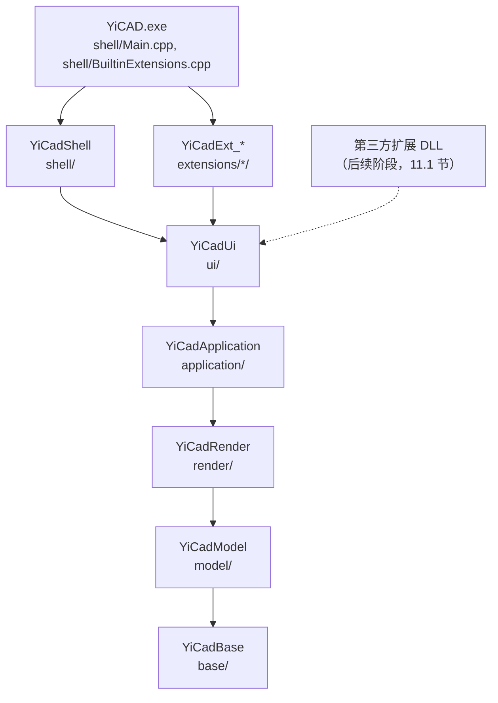
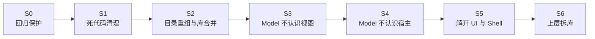

# YiCAD 分层重组分步执行方案

本文档给出把 YiCAD 的源码分层从当前的八个分区收敛为六个库的分步执行方案。
每一步独立可交付、独立可回退：一步做完，构建、测试、安装运行都保持绿色，再开始下一步。

> 本方案基于 `17aaeb5` 的代码基线，文中的行号、文件数、行数均为该基线的实测值。
>
> 本方案接续 `ARCHITECTURE_EVOLUTION_PLAN.md` 阶段 3 留下的事项（6.7 节：RENDER 以上的
> 分区合编进 `YiCadCore`，UI 与 SHELL 互相依赖），完成后第 2 节的目标结构取代该文档
> 6.3 节的目标库结构。
>
> **不做的事**：不改类名与类型前缀（`Dm*`、`Gui*`、`UI*` 保持）；不改渲染子系统内部实现；
> 不改块编辑模式（它在 `ExclusiveCommandBus` 里的设计另行重做，本方案只做最小适配）；
> 不改插件 C ABI。第三方自定义实体已定走 C++ SDK 路线（D7），但动态库化、实体类型开放与
> SDK 本身不在本方案排期内，列为后续阶段（第 11 节）；本方案只保证不给它设障。
>
> **停止确认**：S1 至 S6 每一步都会改动三个以上的核心文件，按 `AGENTS.md` 的停止确认规则，
> 每一步开工前先列出影响面、等确认后再执行。第 12 节的待确认决策在对应步骤开工前定下。

---

## 1. 现状

### 1.1 分区与规模

分区即 `YiCAD/CMakeLists.txt` 里的 `yicad_collect_sources` 调用。

| 分区 | 目录 | 目标库 | 文件 | 行数 |
|------|------|--------|-----:|-----:|
| MATH | `kernel/math`、`kernel/utility`、`kernel/debug` | `YiCadMath`（STATIC） | 53 | 14,261 |
| MODEL | `kernel/builder_model`（含 `dimension`、`text`）、`kernel/data_model`（同）、`kernel/history`、`kernel/modification`、`kernel/information`、`kernel/solver`、`kernel/generators` | `YiCadModel`（STATIC） | 258 | 68,944 |
| PERSISTENCE | `kernel/persistence`、`kernel/persistence/Meta`、`kernel/filters` | `YiCadPersistence`（STATIC） | 65 | 9,275 |
| RENDER | `kernel/painters`、`kernel/painters/opengl`、`kernel/view` | `YiCadCore`（OBJECT，合编） | 39 | 7,040 |
| APPLICATION | `application`、`application/framework`、`cmd` | 同上 | 38 | 6,728 |
| INTERACTION | `kernel/interaction` | 同上 | 2 | 768 |
| UI | `ui`、`ui/forms`、`ui/ribbon` | 同上 | 66 | 10,626 |
| SHELL | `main`、`plugin_runtime`、`kernel/fileio` | 同上 | 32 | 17,801 |
| 扩展 | `extensions/<扩展>`（13 个） | `YiCadExt_<扩展>`（OBJECT） | 266 | 51,920 |

库的依赖链：`YiCadMath ← YiCadModel ← YiCadPersistence ← YiCadCore ← 扩展与可执行文件`。

### 1.2 问题清单

编号保持稳定，不因增删而重排。L1–L8 由本方案处理，L9 由后续阶段处理。

| 编号 | 问题 | 证据 | 影响 |
|------|------|------|------|
| L1 | 持久化单独成层，文档保存自己的原生格式要绕经宿主 | `DmDocument::save` 调 `GUIDIALOGFACTORY->requestFileExport`（`DmDocument.cpp:266`），由 UI 层的 `UIDialogFactory.cpp:103` 转给 SHELL 的 `FileIO`，再到 PERSISTENCE 的 `FilterOcdIO`（`Fileio.cpp:136` 唯一注册的格式）、`Meta*Container`，最后回到 Model 的 `DmEntity::saveStream`；打开同理（`DmDocument.cpp:544`） | 没有界面就存不了盘；Model 与 Persistence 的依赖方向与常规 CAD 相反 |
| L2 | Model 认识视图 | `DmDocument::m_documentView`（`DmDocument.h:277`）；`Selection`、`Modification` 构造时持有 `IDocumentView*`，只用来调 `specifyDocumentModified()` 与 `redraw()`；`BlockEditEnterCmd`/`BlockEditExitCmd` 保存了 `IDocumentView*` 但从未使用（`BlockEditCmd.h:56`、`:85`） | 文档与视图 1:1，无法支持多视口 |
| L3 | Model 认识宿主 | `GuiDialogFactoryInterface`（命令选项栏、坐标控件、`setCommandWidget(UICommandWidget*)` 等宿主服务）放在 `kernel/builder_model/`；Model 内 24 处调用：`DmDocument.cpp` 15 处，标注实体 9 处 `requestActiveDocument()` | 标注实体在多文档下可能取错标注样式表（`ARCHITECTURE_EVOLUTION_PLAN.md` 6.7 节已记录） |
| L4 | UI 与 SHELL 互相依赖 | `ui/` 下 9 个文件包含 `ApplicationWindow.h`/`MDIWindow.h`（`UIActionHandler`、`UIBottomWidget`、`UICommandWidget`、`UICurrentActivePen`、`UIDialogFactory`、`UILineTypeBox`、`UITabDrawWidget`），`UIFileDialog.cpp:98` 调 SHELL 的 `FileIO`；扩展 `file`、`options` 包含 `UITabDrawWidget.h`，`IExtensionContext::tabDrawWidget()` 暴露具体类型 | UI 无法单独成库；扩展与主窗口实现耦合 |
| L5 | 目录名与内容不符 | `kernel/math/` 一半是序列化与编码基础设施；`builder_model/` 放实体与文档，`data_model/` 放 `*Data` 结构体；`kernel/history/` 放着符号表与空间索引；`kernel/` 下同时有 MODEL、RENDER、INTERACTION、SHELL 四个分区的目录 | "目录即边界"名不副实，新人找不到代码 |
| L6 | 过薄的分区与死代码 | INTERACTION 只有 `UIView` 一个类；`cmd/` 2 个文件；`kernel/solver/`（61 行）、`kernel/generators/`（168 行）全仓无包含方；`FilterJsonIO`（2,016 行）未注册、无调用方 | 分层多而不实 |
| L7 | 上层合编，边界只靠脚本 | RENDER、APPLICATION、INTERACTION、UI、SHELL 合编进 `YiCadCore`；`check_layering.py` 不检查 `ui/` 对 `main/` 的包含 | 边界可以被悄悄打穿 |
| L8 | 文件名含空格 | `kernel/builder_model/DmObject .cpp` | 工具链与脚本容易出错 |
| L9 | 实体类型封闭 | `DM::EntityType` 是枚举（`Datamodel.h:83`）；OCD 文件按类型分组、按固定顺序存取（`FilterOcdIO.cpp:386`、`:583`）；实体编辑器与属性编辑器按枚举登记（`CommandRegistry.h:221`、`:223`）；第三方插件只有 C ABI，不能派生实体与交互命令 | 内置扩展与第三方都不能新增实体类型。后续阶段处理，见 11.1 节 |

---

## 2. 目标结构

### 2.1 库与依赖



从八个分区收敛为六个库：PERSISTENCE 拆散（机制进 Base，原生格式进 Model），
INTERACTION 与 `cmd/` 并入 Application，MATH 更名 Base。每一层存在的理由是有使用方只需要它
与它以下的层：几何单测只要 Base，无界面转换与批处理只要 Model，离屏绘制只要 Render，
扩展不需要主窗口。

| 库 | 可以包含 | 本方案的库类型 | S6 之后由谁保证 |
|----|----------|---------------|----------------|
| `YiCadBase` | 第三方库 | STATIC | CMake include 路径 |
| `YiCadModel` | Base | STATIC | CMake |
| `YiCadRender` | Model 及以下 | STATIC（S6） | CMake |
| `YiCadApplication` | Render 及以下；`application/view/` 以外的文件不得包含 `application/view/` | STATIC（S6） | CMake + `check_layering.py` |
| `YiCadUi` | Application 及以下 | OBJECT（S6） | CMake |
| `YiCadShell` | 全部核心库 | OBJECT（S6） | — |
| `YiCadExt_<扩展>` | Ui 及以下，且只含本扩展的头文件 | OBJECT | CMake |

库类型是本方案的过渡选择（D3）。后续阶段做 C++ SDK 时，除 Shell 外的五个库改为 SHARED（11.1 节）。

### 2.2 目录

```
YiCAD/src/
├─ base/                YiCadBase
│  ├─ core/             类型系统、序列化机制、压缩、编码、Uuid、Datamodel
│  ├─ debug/            日志与计时
│  └─ geometry/         向量、矩形、Math2d、方程求解、凸包、KD 树、R 树
├─ model/               YiCadModel
│  ├─ document/         文档与全局对象
│  ├─ property/         颜色、画笔、图层、线型、填充图案
│  ├─ entity/           实体（dimension/、text/）
│  ├─ entity_data/      实体数据结构（dimension/、text/）
│  ├─ table/            符号表、实体表、空间索引
│  ├─ history/          撤销重做
│  ├─ edit/             Modification、Selection
│  ├─ algorithm/        求交、面积、闭合区域、三角剖分
│  └─ io/               原生格式与格式注册表（meta/）
├─ render/              YiCadRender
│  ├─ painter/          绘制抽象
│  ├─ opengl/           OpenGL 实现
│  └─ view/             画布 GuiDocumentView、IDocumentView、ISnapService、网格、预览窗
├─ application/         YiCadApplication（沿用 DS 的 Application 命名）
│  ├─ （根）            命令、命令总线与注册表、视图工具、捕捉、预览、命令别名、宿主服务接口、文档文件服务
│  ├─ framework/        进程内扩展框架、IDocumentManager
│  └─ view/             交互视图 UIView
├─ ui/                  YiCadUi：可复用控件、对话框运行器、文件对话框、Ribbon 注册表（forms/、ribbon/）
├─ shell/               YiCadShell：主窗口、图纸标签页、每图纸窗口、状态栏、命令行、宿主服务实现、
│  │                    Ribbon 装配器与只有壳层使用的表单
│  └─ plugin_runtime/   C ABI 插件运行时
└─ extensions/          不变
```

`shell/` 下不建 `forms/`、`ribbon/` 子目录：壳层只有 `UIExitDialog`、`UISnapMiddleOptions`、
`UIRibbonManager` 三个这类文件，与 `ui/forms/`、`ui/ribbon/` 同名会让人误以为重复。
`ui/` 与 `shell/` 的分界是"谁用它、它依赖谁"：扩展要用的、不依赖主窗口的留在 `ui/`，
只有壳层用的、依赖主窗口的进 `shell/`。

### 2.3 文件去向

`#include` 全部是扁平文件名，搬家只改 CMake 的 include 目录，不改源码。归属存疑的文件按
"谁包含它"决定，执行结果里列出。

| 现在 | 目标 | 步骤 |
|------|------|------|
| `kernel/math/` 的 `Archive`、`Base64`、`FileInfo`、`MD5`、`MetaType`、`MinizipNgArchive`、`Persistence`、`Reader`、`Stream`、`Swap`、`TimeInfo`、`Tools`、`Type`、`Uuid`、`Writer`、`gzstream`、`Datamodel.h` | `base/core/` | S2 |
| `kernel/builder_model/Datamodel.cpp`、`kernel/utility/TSingleton.hpp` | `base/core/` | S2 |
| `kernel/debug/` | `base/debug/` | S2 |
| `kernel/math/` 的 `ConvexHull`、`DmRect`、`DmVector`、`GeometryMethods`、`KDTree`、`Math2d`、`QuarticEquation`、`RTree` | `base/geometry/` | S2 |
| `builder_model/` 的 `DmDocument`、`DmSystem`、`DmSettings`、`DmClipboard`、`DmObject`、`DmFlags`、`DmObserver`、`DmId`、`DmIdManager`、`DmVariable`、`DmVariableDict`、`DmUnits` | `model/document/` | S2 |
| `builder_model/` 的 `DmColor`、`DmPen`、`DmPenList`、`DmLayer`、`DmLineType`、`DmPattern`、`DmPatternList` | `model/property/` | S2 |
| `builder_model/` 其余 25 个实体与实体工具类（`DmEntity`、`DmArc`……`DmEntityHelper`、`DmUtility`） | `model/entity/` | S2 |
| `builder_model/dimension/`、`builder_model/text/` | `model/entity/dimension/`、`model/entity/text/` | S2 |
| `data_model/`（含 `dimension/`、`text/`） | `model/entity_data/`（同） | S2 |
| `builder_model/` 的 `DmBlockTable`、`DmBlockTableListener`；`history/` 的 `DmDimensionStyleTable`、`DmLayerTable`、`DmLineTypeTable`、`DmTextStyleTable`、`EntityTable`、`TableBase`、`SpacialSearchTree` | `model/table/` | S2 |
| `history/` 其余（`Cmd`、`CmdManager`、`MacroCmd`、`Transaction` 与各 `*Cmd`） | `model/history/` | S2 |
| `modification/` | `model/edit/` | S2 |
| `information/` | `model/algorithm/` | S2 |
| `persistence/backuppolicy`、`persistence/Meta/MigratorBase`、`filters/FilterInterface`、`filters/FilterOcdIO` | `model/io/` | S2 |
| `persistence/Meta/` 的各 `Meta*` 容器 | `model/io/meta/` | S2 |
| `builder_model/` 的 `IDocumentView`、`ISnapService` | `model/host/`（过渡）→ `render/view/` | S2 → S3 |
| `builder_model/` 的 `GuiDialogFactory`、`GuiDialogFactoryAdapter`、`GuiDialogFactoryInterface` | `model/host/`（过渡）→ `application/` | S2 → S4 |
| `filters/FilterJsonIO`、`solver/`、`generators/` | 删除 | S1（D1） |
| `painters/`、`painters/opengl/`、`view/` | `render/painter/`、`render/opengl/`、`render/view/` | S2 |
| `cmd/` | `application/` | S2 |
| `kernel/interaction/` | `application/view/` | S2 |
| `main/` | `shell/` | S2 |
| `plugin_runtime/` | `shell/plugin_runtime/` | S2 |
| `kernel/fileio/` | `shell/fileio/`（过渡）→ 消解进 `model/io/` 的格式注册表 | S2 → S4 |
| `ui/` 的 `UITabDrawWidget`、`UIActionHandler`、`UIBottomWidget`、`UICommandWidget`、`UISnapWidget`、`UIDialogFactory` | `shell/` | S5 |
| `ui/forms/` 的 `UIExitDialog`、`UISnapMiddleOptions`；`ui/ribbon/UIRibbonManager` | `shell/` | S5 |

`model/host/` 与 `shell/fileio/` 是过渡目录：S2 先把文件放进去，让遗留依赖显而易见；
S3、S4 解开依赖后清空并删除。

---

## 3. 步骤总览



| 步骤 | 目标 | 解决 | 改变行为 | 工作量 |
|------|------|------|----------|--------|
| S0 | 补齐整文档读写的回归测试，记录构建基线 | 为 S4 兜底 | 否 | S |
| S1 | 删除死代码与未使用的形参，修正文件名 | L6、L8，L2 的一部分 | 否 | S |
| S2 | 按第 2 节搬目录，合并 `YiCadPersistence` 进 `YiCadModel`，`YiCadMath` 更名 `YiCadBase` | L5，L6 的一部分，L1 的物理前提 | 否 | M |
| S3 | 文档通过监听接口通知视图，Model 去掉 `IDocumentView` | L2 | 否（语义一一对应） | M |
| S4 | 原生格式与格式注册表进 Model，存盘策略移出 Model，宿主服务接口移到 Application | L1、L3 | 有风险：文件读写 | L |
| S5 | 新增 `IDocumentManager`，壳层部件搬进 `shell/` | L4 | 否 | M |
| S6 | `YiCadCore` 拆成 Render、Application、Ui、Shell 四个库 | L7 | 否 | M |

工作量：S 约数日，M 约 1–2 周，L 约 3–4 周，按单人投入估算。

**排序理由**：S2 是纯搬家，放在所有代码改动之前做，之后每一步的改动都落在最终路径上，
只有 `model/host/`、`shell/fileio/` 里的少数文件要再搬一次。S3 与 S4 都改 `DmDocument.cpp`，
必须串行。S5 依赖 S4：`UIFileDialog` 要先改查 Model 里的格式注册表，才能和 `FileIO` 脱钩。
S6 要等 S5 解开 UI 与 Shell 的循环依赖。

**每一步的通用验收**：Debug 与 Release 都能构建；`ctest --test-dir build/<config> -C <config> --output-on-failure`
全部通过，用例数不少于上一步；`python tools/check_layering.py` 通过；`cmake --install` 后运行
`build/<config>/bin/YiCAD.exe`，按 `INTERACTION_CHECKLIST.md` 的相关条目冒烟。

---

## 4. S0：回归保护

### 4.1 目标

S4 会改动文档读写路径，这是数据丢失风险最高的地方，而现有测试不覆盖它：
`tests/persistence` 只测单个实体的流往返与编码工具，`test_persistence_roundtrip.cpp:283`
的注释写明产品的文档读写走 `FilterOcdIO`，与已有用例无关。本步先把这条路径锁住。

### 4.2 任务

1. **整文档 OCD 往返测试**（`tests/persistence/`）
   - 构造一份文档：直线、圆、圆弧、椭圆、多段线、样条、单行与多行文字、五种标注与引线、
     填充、块定义与块引用（含属性）、多个图层、线型、文字样式、标注样式。
   - 经 `FilterOcdIO` 写临时文件，再读回新文档。
   - 比对：各类实体数量与类型、关键几何（端点、圆心、半径）、图层与样式表内容、
     块引用指向的块名。
2. **异常路径**：读损坏文件返回失败而不崩溃；如有旧版本样本，覆盖 `MigratorBase` 的迁移。
3. **交互清单**：`INTERACTION_CHECKLIST.md` 新增"文件读写"一节——保存、另存为、自动保存、
   `.bak` 备份、外部修改检测提示、打开损坏文件时询问是否打开备份、未命名图纸首次保存、
   DXF 插件的导入导出。
4. **构建基线**：用 `tools/measure_build.ps1` 记录全量构建与单文件增量构建时间，写入 `BASELINE.md`，
   供 S2、S6 对比。

### 4.3 验收

- 新用例在当前代码上全部通过。如果发现读写缺陷，按 `AGENTS.md` 的约定以 `DISABLED_` 保留并注明原因，
  不在本步修复。
- `BASELINE.md` 有本方案的起点数据。

### 4.4 风险

低。只加测试与文档。

### 4.5 执行结果

2026-09-26 完成，基线 `17aaeb5`。

**新增用例**：`tests/persistence/test_persistence_document.cpp`，31 个，分四组。样本文档含 4.2 节列的全部内容，
另加点、射线、构造线、二维实体（Solid）：

| 组 | 个数 | 内容 |
|----|-----:|------|
| `OcdDocumentWrite` | 4（启用） | 样本构造；压缩包的条目顺序与各条目是否有数据；用 `QXmlStreamReader` 独立解析 `Document.xml`，核对各表与各类实体的 `Count`、当前图层与样式、图层名（base64）；覆盖已有文件时 `FilterOcdIO` 自带的编号备份（`<文件名>1`） |
| `OcdDocumentRoundTrip` | 16（全部 `DISABLED_`） | 各类实体的数量与关键几何、图层与画笔、文字、五种标注与引线、填充、块定义与块引用（含属性）、图层表、线型、文字样式与标注样式、中文路径、再存再读的稳定性 |
| `OcdDocumentErrorPath` | 4（启用） | 空文件、非压缩包、截断、不存在：过滤器一律抛异常（断言现状，S4c 改为结果码后随之改写） |
| `DocumentSavePolicy` | 7（4 启用、3 `DISABLED_`） | 另存为经 `.tmp` 写出、再次保存生成 `.bak`、后缀与格式不符拒绝保存、外部修改检测；打开刚保存的文件、打开损坏文件时询问备份、没有备份时警告 |

宿主服务用测试里的 `OcdHost` 代替（`GuiDialogFactoryAdapter` 派生，按后缀与格式名分派到 `FilterOcdIO`，与 `FileIO`
对 `.ycd` 的分派相同）。用例总数 425 → 456（启用 422 → 434，`DISABLED_` 3 → 22）；Debug、Release 的 ctest 全部通过。

**偏差：读回路径整体不可用。** 按 4.3 节，缺陷以 `DISABLED_` 保留、本步不修。4.1 节设想 S0 为 S4 兜底，但 YiCAD
目前读不回自己写出的任何 `.ycd`，往返用例一个也启用不了。共查出 9 处，机理、位置与可达性写在测试文件头部：

| 编号 | 位置 | 现象 |
|------|------|------|
| R1 | `FilterOcdIO.cpp:154` | 打开压缩包后没有先 `nextEntry()` 就把流交给 `XMLReader`，解析到空流，抛异常。与 `test_persistence_roundtrip.cpp` 里 `Persistence::restoreFromStream` 的缺陷同一机理 |
| R2 | `Reader.cpp:152`–`:280` | `XMLReader` 在 pugixml 的 DOM 上模拟 SAX 读取器，`readEndElement` 实际向后找下一个同名"开始"标签，`readElement` 会重复读当前节点；`restoreXML` 读到线型数据后走到文档末尾，抛异常 |
| R3 | `DmPoint.cpp:233`、`DmRay.cpp:344`、`DmXline.cpp:242` | 先调的 `DmAtomicEntity::restoreStream(reader, revs)` 在当前格式分支什么也不读，实体头（id、图层、画笔）没读出，余下字节被当成更多实体：1 个点读回 6 个，射线、构造线各 4 个，每存开一次还会增多 |
| R4 | `MetaLayers.cpp:114` 等四处 | 新文档自带的 "0" 图层、"Standard" 文字样式、"ISO-25" 标注样式与 19 个箭头块，读入时又各加一份；按名字查找取到默认那份，文件里的同名条目被忽略；箭头块每存开一次多 19 个 |
| R5 | `MetaLineTypes.cpp:86` | 当前线型按"有没有 active 属性"判断，而每个线型都写了该属性，最后一个自定义线型成为当前线型 |
| R6 | `MetaLineTypes.cpp:96` | `QString::replace` 原地修改线型说明，读回的说明丢掉字母、数字与括号 |
| R7 | `DmDocument.cpp:544`、`:589`、`:597` | 过滤器的异常穿出 `DmDocument::open`，调用链上无人捕获；"是否打开备份"的询问与打开失败的警告都走不到 |
| R8 | `DmDocument.cpp:589` | 改开 `.bak` 仍按后缀选过滤器，`FilterOcdIO::canImport` 只认 `ycd`，`.bak` 永远打不开 |
| R9 | `DmXline.cpp:91` | `setBasePoint` 赋值给 `getBasePoint()` 返回的临时对象，读回的构造线基点停在原点 |

核对方法：在本地逐处临时修补（未提交），加 `--gtest_also_run_disabled_tests` 运行。只补 R1、R2 时，注明"依赖 R1、R2"
的 11 个用例全部通过，其余 8 个失败；再补 R3、R5–R9，只剩依赖 R4 的 2 个失败。R4 的修法有语义选择（读入时覆盖同名
默认条目，还是先清空默认表），未做探查修补。

影响：

- 写出一侧今天就锁住了 S4 必须保持的东西：压缩包的条目与顺序、`Document.xml` 的结构与计数、`.tmp`/`.bak`/编号备份、
  外部修改检测、格式不符的拒绝。
- 读回一侧在 R1、R2 修好之前没有回归保护，S4c 要搬的"打开失败询问备份"也无从验证（R7、R8）。是否以及何时修复，见 12 节 D8。
- 产品：交互清单 W6（打开 `.ycd`）在修好前必然失败；按代码推断异常会穿过 Qt 事件循环使程序退出，未实测。

**迁移**：仓库里没有旧版本的 `.ycd` 样本；全仓没有 `DmMigratorBase` 的派生类，也没有 `addMigrator` 调用，
`DmMigrateContext::postRestore` 恒为真；各持久化类型的修订号都是 0，`restoreStreamWithRev` 的旧版本分支都是空实现。
迁移路径是空的，本步无从覆盖。

**交互清单**：`INTERACTION_CHECKLIST.md` 新增 6G 节（W1–W10），覆盖 4.2 节第 3 项列的全部场景，期望按现有代码写，
已知缺陷标"既有"并引用 R 编号。另记一处既有行为：自动保存每个文档只做一次（`DmDocument.cpp:194`、`:223`，W5）。

**构建基线**（`BASELINE.md` 第 7 节）：Release 全量构建 203.2 秒；改 `DmArc.cpp`、`GuiDocumentView.h`、`Datamodel.h`
后的增量分别 10.9、21.5、163.4 秒。`measure_build.ps1` 测全量时会删掉并重配构建目录，而它不重放 `CMAKE_PREFIX_PATH`，
所以改在单独的 `build/measure-s0` 里测，做法写在 `BASELINE.md` 7.1 节，S2、S6 照此复测。

**通用验收**：Debug、Release 构建通过（Debug 增量构建又遇到 `ARCHITECTURE_EVOLUTION_PLAN.md` 8.6 节遗留问题 1 的
LNK1103，删掉 `build/Debug/YiCAD/*.dir/Debug` 下的 `.obj`、`.pdb` 后重建通过）；两种配置的 ctest 全部通过；
`check_layering.py` 通过；`cmake --install` 后启动 `YiCAD.exe`，10 秒后进程仍在运行、主窗口有响应。
交互清单未手工走查；新增的 6G 节供 S4 前后使用。

**其他观察**（不影响用例，未处理）：

- `OneException::what()`（`Tools.h:289`）不是 `std::exception::what()` 的覆盖（非 const），按 `std::exception` 捕获只能拿到
  "Unknown exception"；`XMLReader::readFiles` 抛出的消息指向已析构的局部字符串。R7 修复时应一并考虑错误信息怎么传出。
- 半径、直径标注构造并 `update()` 之后，`getDefinitionPoint()` 变成了箭头点，与 `DmDimRadial.h` 注释"definitionPoint 是圆弧中心"
  不符；与读写无关，用例按写出前的值比对。

---

## 5. S1：死代码清理

### 5.1 目标

先删掉不需要搬的东西，缩小 S2 的搬家范围。

### 5.2 任务

1. 删除 `kernel/solver/`（`SolverInterface`）与 `kernel/generators/`（`XMLWriterQXmlStreamWriter`、
   `XmlWriterInterface`）：全仓除自身外无包含方。同步从 `CMakeLists.txt` 的 MODEL 分区与
   `YiCadModel` 的 include 目录中移除。
2. 删除 `kernel/filters/FilterJsonIO.{h,cpp}`：未在 `FileIO::getFilters()` 注册，全仓无调用方（D1）。
3. 删除 `BlockEditEnterCmd`/`BlockEditExitCmd` 未使用的 `IDocumentView*` 形参与成员
   （`BlockEditCmd.h:41`、`:70`），同步改 `extensions/block/commands/BlockEditTool.cpp:112`、`:175`。
   块编辑模式待重新设计，本步只删不改其余逻辑。
4. 删除死 include：`kernel/view/GuiDocumentView.cpp:49` 的 `GuiDialogFactory.h`（文件内无调用）。
5. `kernel/builder_model/DmObject .cpp` 改名为 `DmObject.cpp`（`git mv`）。

### 5.3 验收

- 通用验收。
- `grep` 全仓不再出现 `SolverInterface`、`XMLWriterQXmlStreamWriter`、`FilterJsonIO`。

### 5.4 风险

低。删除前再核对一次无包含方；构建通过即证明无残留引用。

### 5.5 执行结果

（未开始）

---

## 6. S2：目录重组与库合并

### 6.1 目标

一次性把目录搬到第 2 节的结构（S5 的壳层部件除外），库从
`YiCadMath ← YiCadModel ← YiCadPersistence ← YiCadCore` 变为 `YiCadBase ← YiCadModel ← YiCadCore`。
**只移动文件和改构建脚本，不改任何 `.h`/`.cpp` 的内容。**

### 6.2 任务

1. **搬文件**：按 2.3 节标为 S2 的行执行，全部用 `git mv`，保证 `git log --follow` 可追溯。
   单独一个提交，不夹带内容改动。
2. **`YiCAD/CMakeLists.txt`**
   - 分区改为 BASE、MODEL、RENDER、APPLICATION、UI、SHELL；删除 PERSISTENCE 与 INTERACTION 分区
     （`model/io` 并入 MODEL，`application/view` 并入 APPLICATION）。
   - `YiCadMath` 更名 `YiCadBase`；删除 `YiCadPersistence`，其源文件与第三方依赖并入 `YiCadModel`。
     这是纯移动：PERSISTENCE 原本就只依赖 Model 与 Math。
   - 各库的 `target_include_directories` 换成新目录；预编译头改为 `shell/YiCadPch.h`；
     `Main.cpp`、`BuiltinExtensions.cpp` 的路径改为 `shell/`；`YiCadPluginSdk` 的头文件路径改为
     `shell/plugin_runtime/`（安装路径 `include/YiCAD/plugin-sdk` 不变）；`src/ui` 表单的 GLOB 不变。
   - 更新文件头部与各分区的说明注释。
3. **`tests/`**：`tests/persistence` 的 `LINK YiCadPersistence` 改为 `YiCadModel`；其余不变。
4. **`tools/check_layering.py`**：按新目录重写区域规则。
   - `base/`、`model/`、`render/` 不得包含 `application/`、`ui/`、`shell/` 与扩展；
   - `application/` 不得包含 `ui/`、`shell/` 与扩展；`application/view/` 以外不得包含 `application/view/`；
   - `ui/` 不得包含 `shell/` 与扩展（**新规则**）；现有 10 处违规（L4 所列 9 个文件与 `UIFileDialog.cpp`）
     登记进白名单，由 S4、S5 逐个清除；
   - 扩展不得包含 `shell/` 与别的扩展。
5. **其他路径引用**：`tools/measure_build.ps1` 的三个目标文件路径、`.github/workflows/build.yml` 的注释、
   `README.md`/`README_zh.md` 的架构表与模块依赖图、`AGENTS.md` 的目录结构与 Source File Collection 两段。
6. **翻译**：翻译上下文按类名，搬家不影响 `.qm`；`.ts` 里的源码位置会过期，本步末尾跑一次
   `cmake --build --preset Release --target update_translations` 刷新（只改位置，不改译文）。

### 6.3 验收

- 通用验收，用例数与 S1 相同。
- `git diff -M --stat` 中 `.h`/`.cpp` 只有重命名，没有内容变化。
- `YiCAD/src/kernel/`、`src/main/`、`src/cmd/`、`src/plugin_runtime/` 不再存在。
- 用 `tools/measure_build.ps1` 复测，写入 `BASELINE.md`。预期全量构建略快（项目链少一级），
  以实测为准。

### 6.4 风险

- 低，但改动面大。与未合并的分支会有大面积冲突，选在没有并行分支时执行。
- 头文件重名会让扁平 include 互相遮蔽；`check_layering.py` 会检测重名并报错。

### 6.5 执行结果

（未开始）

---

## 7. S3：Model 不认识视图

### 7.1 目标

文档不再持有视图指针，改为向任意多个监听者发通知。Model 里不再出现 `IDocumentView`，
它与 `ISnapService` 搬到实现它的 `render/view/`。

### 7.2 任务

1. **新增 `DmDocumentListener`**（`model/document/`，沿用 Model 层 `DmObserver`、`DmBlockTableListener`
   的命名）。三个纯虚方法与现有调用一一对应，不改语义：

   | 监听方法 | 取代的调用 |
   |----------|-----------|
   | `documentModified()` | `m_documentView->specifyDocumentModified()`（`DmDocument.cpp:174`、`:182`、`:762`） |
   | `redrawRequested()` | `m_documentView->redraw()`（`DmDocument.cpp:763`） |
   | `paintContainerChanged(DmEntityContainer*)` | `m_documentView->setDocumentPainterContainer(...)`（`DmDocument.cpp:464`、`:467`，块编辑进入与退出） |

   不用 Qt 信号：`DmDocument` 不是 `QObject`，纯虚接口也便于测试替身。
2. **`DmDocument`**：`m_documentView` 改为监听者列表，提供 `addListener`/`removeListener` 与转发用的
   通知方法；删除 `setDocumentView`/`getDocumentView`。
3. **`GuiDocumentView`** 实现 `DmDocumentListener`，在关联文档时注册（取代 `GuiDocumentView.cpp:101`
   的 `setDocumentView(this)`）、析构时注销。`MDIWindow.cpp:185`、`:227` 与 `HostApi.cpp:905`
   在保存前或重生成前补设视图的调用随之删除。
4. **`Selection`**：`Selection(DmDocument*, IDocumentView* = nullptr)` 改为 `Selection(DmDocument*)`，
   内部 4 处"标记修改 + 重绘"改调文档的通知方法；调用方 4 处（`application/SelectTool.cpp`、
   `ApplicationWindow.cpp`、`UIActionHandler.cpp`、`UITabDrawWidget.cpp`）。
5. **`Modification`**：`Modification(IDocumentView*)` 改为 `Modification(DmDocument*)`，
   `Modification.cpp:165` 的重绘改调文档的通知方法；调用方在 `application/` 1 个文件、
   `extensions/modify`、`extensions/edit` 共 9 个文件。
6. **`Preview`**：`Preview.cpp:36`、`:132`、`:169` 的 `m_pDocument->getDocumentView()` 改用构造时传入的视图。
   只构造文档的唯一调用方是 `UIView.cpp:55` 的 `std::make_unique<Preview>(doc)`，改为同时传入 `this`。
7. **搬移**：`IDocumentView.h`、`ISnapService.h` 从 `model/host/` 搬到 `render/view/`。
8. **测试**：`tests/support/FakeDocumentView.h` 随接口调整；`tests/interaction` 新增用例——
   `Modification`、`Selection` 操作后监听者收到 `documentModified` 与 `redrawRequested`；
   块编辑进入与退出时收到 `paintContainerChanged`。

### 7.3 验收

- 通用验收；交互清单第 1、3、4 节（选择、先选后建、块编辑）冒烟。
- `IDocumentView.h` 不在 `YiCadModel` 的 include 路径上，Model 包含它会编译失败。

### 7.4 风险

- 中。通知时机与原先逐处对应；最容易出错的是块编辑的绘制容器切换，由新用例与交互清单 B 系列覆盖。

### 7.5 执行结果

（未开始）

---

## 8. S4：Model 不认识宿主

### 8.1 目标

- Model 自己能读写原生格式，不经过宿主。
- "什么时候存、存之前要不要备份、失败了提示什么"这类存盘策略移出 Model。
- 格式注册表放在 Model，插件格式注册进去，`FileIO` 门面消解。
- `GuiDialogFactoryInterface` 在 Model 里不再有调用方，搬到 Application。

分四个子步骤，各自一个提交，逐个验收。

### 8.2 S4a：标注实体取自身文档

1. 9 处 `GUIDIALOGFACTORY->requestActiveDocument()`（`DmDimAngular`、`DmDimDiametric`、`DmDimLinear`、
   `DmDimRadial` 各 2 处，`DmLeader` 1 处）改为 `getDocument()`。
2. 替换前先核实：在 Debug 下断言两者一致且 `getDocument()` 非空，跑 `test_interaction`、交互清单
   6E 节（标注）、打开含标注的图纸。如果发现未挂到文档树上的路径（例如预览实体），对该路径显式传入文档，
   并在执行结果里记录。
3. 新增用例：两份文档各有不同的标注样式，非当前文档里的标注取自己文档的样式表。

### 8.3 S4b：格式注册表下沉

1. `model/io/` 新增 `FilterRegistry`（`Filter*` 是文件格式的类型前缀）：按扩展名找导入过滤器、
   按格式名找导出过滤器、列出文件对话框的过滤串。它取代 `FileIO` 的 `getFilters`、`getImportFilter`、
   `getExportFilter`、`pluginImportNameFilters`、`pluginExportNameFilters`、`exportFormatType`。
2. OCD 在 `DmSystem::init` 时注册。插件格式由 `shell/plugin_runtime` 在插件加载后把
   `PluginFileIOAdapter`（已实现 `FilterInterface`）注册进去，卸载时注销。取代 `FileIO::setPluginRuntime`。
3. `UIFileDialog.cpp:98`、`:145`、`:207` 改查 `FilterRegistry`：去掉一处 UI 对 Shell 的依赖，
   从 `check_layering.py` 白名单删除。
4. `Fileio.cpp:132` 的 `QMessageBox::critical` 移到调用方；删除 `FileIO` 与 `shell/fileio/`。

### 8.4 S4c：读写与存盘策略分离

1. **Model 只保留纯读写**：`DmDocument` 提供读文件与写文件两个操作，经 `FilterRegistry` 分派，
   返回结果码与错误文本。不弹框、不输出命令行消息、不决定是否备份。`.bak` 备份文件的具体读写操作
   （`backuppolicy`）留在 `model/io/`。
2. **存盘策略移到 Application**，新增文档文件服务（D5，建议命名 `DocumentFileService`），承接
   `DmDocument` 里现有的：
   - 自动保存定时器（`DmDocument.cpp:86`–`:93`）与 `enableAutoSave`；
   - 外部修改检测与提示（`DmDocument.cpp:249`）；
   - 保存前备份的决策与失败提示（`DmDocument.cpp:280`–`:320`）；
   - 未命名文档取名（`requestUntitledDocumentName`）；
   - 打开失败时询问是否打开备份（`DmDocument.cpp:585`）与无效文件警告（`DmDocument.cpp:627`）；
   - 保存成功或失败的命令行提示（`DmDocument.cpp:262`、`:337`、`:341`）。

   提示仍经 `GuiDialogFactoryInterface` 输出，文字与时机不变。
3. **调用方**：`MDIWindow.cpp:155`、`:188`、`:204`、`:228`；`extensions/block/commands/BlockFileCommands.cpp:186`、
   `:206`（写块与插入块时的临时文档）；`extensions/options/ui/UIDlgOptionsGeneral.cpp:198`（自动保存设置）。
   全部改调文档文件服务，保持现有提示行为。
4. `DmDocument` 删除 `m_timer`、`m_bHasAutoSaved` 等策略状态。

### 8.5 S4d：宿主服务接口移到 Application

1. `GuiDialogFactory`、`GuiDialogFactoryAdapter`、`GuiDialogFactoryInterface` 从 `model/host/` 搬到
   `application/`，删除 `model/host/`。
2. 接口删去已无调用方的 `requestActiveDocument`、`requestFileExport`、`requestFileImport`，
   `ui/UIDialogFactory` 同步删除实现。`requestUntitledDocumentName` 留到 S5 并入 `IDocumentManager`。

### 8.6 验收

- 通用验收；S0 的整文档往返与异常路径用例全部通过；S0 新增的"文件读写"清单全部走一遍。
- `YiCadModel` 源码里不再出现 `GUIDIALOGFACTORY`、`IDocumentView`：头文件已不在它的
  include 路径上，编译期保证。
- 写一个只链接 `YiCadModel` 的小用例：不起界面读写一份 OCD 文件。这证明 L1 已解决。

### 8.7 风险

- **高**：文件读写路径的任何回归都可能丢数据。缓解：S0 的测试先行；四个子步骤分开提交、
  分开验收；策略代码整段搬移，不在搬移时顺手改写逻辑。
- 自动保存从文档对象移到服务后，文档关闭时要同步停掉它的定时器，这点在执行时专门核对。

### 8.8 执行结果

（未开始）

---

## 9. S5：解开 UI 与 Shell

### 9.1 目标

`ui/` 只剩可复用的控件与对话框。管理图纸与主窗口的部件归 `shell/`，扩展通过接口访问文档管理，
不再看到具体的标签页控件。

### 9.2 任务

1. **新增 `IDocumentManager`**（`application/framework/`）。方法按现有调用方所需定：
   当前文档、当前视图、全部文档、全部视图（`OptionsExtension.cpp:51`、`:68`）、新建、打开、保存、
   另存为、导出图片（`FileExtension.cpp` 的五个命令）、未命名文档名（S4 留下的
   `requestUntitledDocumentName`）。由 Shell 实现，委托给 `UITabDrawWidget`。
2. **扩展接口**：`IExtensionContext::tabDrawWidget()` 与 `IExtensionHost::tabDrawWidget()` 改为
   `documentManager()`；`FileExtension.cpp`、`OptionsExtension.cpp` 改用接口，不再包含 `UITabDrawWidget.h`。
3. **留在 `ui/` 的部件**：`UICurrentActivePen.cpp:117`、`UILineTypeBox.cpp:47` 改为经注入的
   `IDocumentManager` 取当前文档，不再调 `ApplicationWindow::getAppWindow()`。
4. **搬移**：`UITabDrawWidget`、`UIActionHandler`、`UIBottomWidget`、`UICommandWidget`、`UISnapWidget`、
   `UIDialogFactory`、`UIExitDialog`、`UISnapMiddleOptions`、`UIRibbonManager` 搬到 `shell/`（不建子目录）。
   这几个部件互相包含，而且都要调主窗口，本来就是壳层；扩展实际使用的 `UIDialogRunner`、
   `UIRibbonRegistry`、`UIFileDialog`、`UIWidgetPen`、`UILayerBox`、`CustomComboboxItem` 都留在 `ui/`。
5. `CMakeLists.txt` 为 `shell/` 增加 `.ui` 表单的 GLOB；`check_layering.py` 白名单清空。

### 9.3 验收

- 通用验收；交互清单 6B（文件、图层、选项）、6F（命令行）冒烟。
- `check_layering.py` 白名单为空；`ui/` 与扩展里不再出现 `ApplicationWindow`、`MDIWindow`、`UITabDrawWidget`。

### 9.4 风险

- 中。`UITabDrawWidget` 与主窗口之间的信号连接（`UITabDrawWidget.cpp:467`–`:474`）随搬移原样保留，
  只改所在目录。

### 9.5 执行结果

（未开始）

---

## 10. S6：上层拆库

### 10.1 目标

`YiCadCore` 拆成四个库，依赖方向全部由 CMake 保证。

### 10.2 任务

1. **库划分与类型**（D3）
   - `YiCadRender`、`YiCadApplication` 用 STATIC：没有 `.qrc` 与表单，不存在静态库丢自动注册符号的问题；
     测试可以只链接需要的层。
   - `YiCadUi`、`YiCadShell` 用 OBJECT：含 `.ui` 表单，Shell 含 Ribbon 图标 `.qrc`，沿用 `YiCadCore`
     选 OBJECT 的理由。OBJECT 库的目标文件只从直接链接处带入，可执行目标与测试要逐个直接链接。
   - 这是过渡选择：后续阶段做 C++ SDK 时，除 Shell 外改为 SHARED（11.1 节）。到那时改库类型只是
     CMake 的一处改动，工作量在导出宏，本步不必为此提前做任何事。
2. **链接**：扩展改为链接 `YiCadUi`，看不到 `shell/` 的头文件，"扩展不得包含 Shell"从此由编译器保证；
   可执行目标链接 `YiCadShell`、`YiCadUi` 与全部扩展库。
3. **测试**：`test_interaction` 按用例实际需要链接；需要宿主的用例（`test_host_extensions` 等）继续链接 Shell。
4. **预编译头**：Ui、Shell 与扩展复用 `YiCadPch.h`；Render、Application 先不加预编译头，测量后再定。
5. **`check_layering.py`**：只保留 CMake 管不到的两条——头文件重名检测，以及"`application/view/` 以外
   不得包含 `application/view/`"。
6. **生成器**（D4）：六个库串成一条链，Visual Studio 生成器按项目串行构建（`ARCHITECTURE_EVOLUTION_PLAN.md`
   6.7 节实测拆库后全量构建从 144.3 秒变为 179.2 秒）。本步用 `tools/measure_build.ps1` 分别测
   Visual Studio 与 Ninja 生成器，数据写入 `BASELINE.md`；是否切换 Ninja 单独确认，切换会影响
   `CMakePresets.json` 与 CI。
7. **文档**：更新 `README.md`/`README_zh.md` 的模块依赖图，删去"合编进 `YiCadCore`"与"既有双向依赖"的说明；
   更新 `AGENTS.md`；在 `ARCHITECTURE_EVOLUTION_PLAN.md` 6.3 节加一条注记，指向本文第 2 节。

### 10.3 验收

- 通用验收。
- 在任一库里临时包含上层的头文件，编译失败（抽查 Render、Application、Ui 各一次）。
- 构建时间数据已记录，并与 S0 基线对比。

### 10.4 风险

- 中。可能暴露 `check_layering.py` 没检查到的隐藏依赖（例如 Render 通过扁平 include 间接用到
  Application 的头文件）。缓解：按 Render → Application → Ui → Shell 的顺序逐个拆，每拆一个就构建一次。

### 10.5 执行结果

（未开始）

---

## 11. 后续事项（不在本方案排期）

### 11.1 第三方自定义实体：C++ SDK（D7 已定）

**路线**：仿 ObjectARX 的 C++ SDK。第三方 DLL 导出一个工厂函数，返回 `IExtension`，与内置扩展走同一套
接口；实体直接派生 `DmEntity`，交互命令派生 `BaseExclusiveCommand` 等基类，能力与内置扩展相同。
现有 C ABI 保留给文件格式、即时命令这类轻量插件。`ARCHITECTURE_EVOLUTION_PLAN.md` 7.3 节的
"C ABI 对外，`IExtension` 对内"届时改为"C ABI 对外（轻量插件）+ C++ SDK 对外（深度扩展），
`IExtension` 对内"。

**兼容规则**：第三方必须用与 YiCAD 相同的 MSVC 工具集（v143）、同一 Qt 6 主版本、相同的运行库配置；
YiCAD 每个大版本发布后第三方重新编译。宿主加载时校验 SDK 版本号，不符即拒绝加载并提示。

**工作分两部分**，都在本方案之后进行：

**A. 实体类型开放**（前置：S4，原生格式已在 Model。可与 S5、S6 并行，改的文件基本不重叠）

| 事项 | 现状与依据 | 做法要点 |
|------|-----------|----------|
| 类型标识 | `DM::EntityType` 是枚举（`Datamodel.h:83`） | 用 Base 已有的运行期类型系统：`Type::createType`、`createInstanceByName`（`Type.h:108`、`:59`），`DmEntity` 已用 `TYPESYSTEM_HEADER`，自定义实体用同一套宏注册。枚举保留给内置类型，另加一个值统称扩展类型 |
| 原生格式 | 保存时按类型 switch 分组（`FilterOcdIO.cpp:386`），读取按写死的顺序（`:583` 的注释写明顺序不一致会出错），新类型没有位置 | 在现有段之后加一个按类型名自描述的扩展段；每种自定义类型沿用现有"每类型一个二进制文件 + 类型修订层级"的机制（`MetaArcs.cpp:47`），提高 `FileVersion` |
| 插件缺失 | 无 | 代理实体：原样保留数据并写回，用存下来的基本图元显示，只读（可删除、不可编辑几何） |
| 旧版兼容 | 已发布版本的读取行为改不了 | 核实旧版遇到扩展段是报错还是跳过；若跳过，旧版另存会静默丢数据，写进发行说明 |
| 渲染 | 复合实体经 `getSubEntities()` 分解显示（`DmCachePainter.cpp:227`），原子图元 `switch`（`:342`） | 要求自定义实体可分解为基本图元，Render 不改；需要新基本图元的需求另议 |
| 类型分支 | 内核 `information` 4 个文件、`modification` 1 个、`filters` 1 个按类型 switch | 逐处审：求交、偏移等改为虚函数，其余走分解 |
| 编辑器登记 | 实体编辑器、属性编辑器按枚举登记（`CommandRegistry.h:221`、`:223`，`IExtensionContext.h:90`、`:95`） | 改为按类型登记；`IExtensionContext` 增加注册实体类型的入口 |
| C ABI 导出 | `YiCadReadApi` 只枚举一等实体 | 对自定义实体给出分解后的基本图元，不改 ABI 布局，行为写进 `PLUGIN_SDK.md` |

**B. 动态库化与 C++ SDK**（前置：S6 与 A）

| 事项 | 现状与依据 | 做法要点 |
|------|-----------|----------|
| 库类型 | 本方案结束时 Base、Model、Render、Application 为 STATIC，Ui 为 OBJECT | 五个库改为 SHARED；Shell 仍编进可执行文件；内置扩展不变 |
| 为什么必须是 DLL | 单例与类型表只能有一份：`CommandRegistry`、`ExtensionManager`、`Commands`、`DmSystem`、`DmSettings`、`DmPenList`、`DmPatternList`、`DmClipboard`、`DmFontList`、`GuiDialogFactory`、`Debug` 的 `instance()`，以及 `Type` 的静态类型表（`Type.h:139`–`:141`） | 静态库被可执行文件与第三方 DLL 各链接一份就会出现两份。这些单例都定义在 `.cpp` 里，进 DLL 后自然唯一；唯一例外是 `TSingleton.hpp` 在头文件里定义静态成员，每个 DLL 各一份，目前只有 `MigratorBase` 使用，届时先改掉 |
| 导出 | 无 | `GenerateExportHeader` 为每个库生成导出宏，公开头文件里的类、自由函数、全局数据加宏（脚本批量加、人工核对）。不用 `WINDOWS_EXPORT_ALL_SYMBOLS`：它不导出数据符号，而 `Q_OBJECT` 类的 `staticMetaObject` 就是数据符号 |
| 加载 | C ABI 插件清单是 `<plugin dll="..."/>`，在 `registerExtensions()` 之后加载（`ApplicationWindow.cpp:334`、`:335`） | 清单增加 `<extension dll="..." sdkVersion="..."/>`；在 `registerExtensions()` 里 `BootAll`（`ApplicationWindow.cpp:399`）之前加载并注册，运行期间不卸载 |
| SDK 发布 | 已有 `PluginSDK` 安装组件 | 仿照它新增 C++ SDK 组件：头文件、导入库、CMake 包、文档，附一个带自定义实体的示例扩展 |

**本方案为它做的准备**：S2 让边界清楚；S4 让原生格式进 Model，自定义实体只需登记到一处；S5 用
`IDocumentManager` 取代具体控件；S6 让依赖方向由 CMake 保证。本方案新增的接口（`DmDocumentListener`、
`FilterRegistry`、`IDocumentManager`、文档文件服务）将来都会成为 SDK 的公开面，设计时不暴露具体控件类型、
写清所有权；本方案期间不新增在头文件里定义静态数据的单例。

### 11.2 其他

| 事项 | 现状 | 说明 |
|------|------|------|
| 选择集移出 Model | 选择状态是实体上的标志位（`DmEntity::setSelected`），`Selection` 操作这些标志 | 本方案把 `Selection` 留在 `model/edit/`（D2），只去掉它对视图的依赖 |
| 块编辑模式重做 | 编辑模式在 `ExclusiveCommandBus` 里 | 另行设计；本方案只在 S1、S3 做最小适配 |
| 渲染专项 | `ARCHITECTURE_EVOLUTION_PLAN.md` 已声明不在其排期 | 本方案同样不改 `render/` 内部实现 |

---

## 12. 待确认决策

| 编号 | 决策 | 建议或结论 | 状态 | 何时定 |
|------|------|-----------|------|--------|
| D1 | 删除 `kernel/solver/`、`kernel/generators/`、`FilterJsonIO` | 删除。若要保留 JSON 导出，改做扩展，在 S4 注册进 `FilterRegistry` | 待定 | S1 开工前 |
| D2 | `Selection` 留在 Model 还是移到 Application | 留在 `model/edit/`：选择状态存在实体上，移走是另一件事（11.2 节） | 待定 | S2 开工前 |
| D3 | 上层库的类型 | Render、Application 用 STATIC，Ui、Shell 用 OBJECT；后续阶段除 Shell 外改为 SHARED（11.1 节） | 待定 | S6 开工前 |
| D4 | 是否换 Ninja 生成器 | 以 S6 的实测数据定 | 待定 | S6 验收时 |
| D5 | 存盘策略服务放 Application 还是 Shell | Application：扩展（块的写块与插入）也要用，且能在 `test_interaction` 里测 | 待定 | S4 开工前 |
| D6 | 第 2.2 节的新目录命名 | 按 2.2 节；`shell/` 下不建子目录 | 待定 | S2 开工前 |
| D7 | 第三方自定义实体的接口 | C++ SDK（仿 ObjectARX），实施列为后续阶段（11.1 节） | 已定（2026-09-26） | — |
| D8 | S0 查出的读回缺陷（4.5 节 R1–R9）何时修 | 在 S4 之前单列一步修复 R1–R3、R5、R6、R9（均为局部修改，修好即可去掉对应用例的 `DISABLED_`）；R7、R8 与 S4c 的存盘策略搬移重叠，并入 S4c；R4 先定语义再修。放在 S2 之后，改动落在最终路径上 | 待定 | S2 开工前 |

---

## 13. 回退策略

- 每一步是一组独立提交，任何一步都可以整体 `git revert`，不影响前面的步骤。
- S2 的搬家提交与改构建脚本的提交分开：搬家提交只含重命名，回退时不会与后续内容改动纠缠。
- S4 的四个子步骤分别提交；如果 S4c 上线后发现读写问题，可以只回退 S4c，保留 S4a、S4b。
- 回退后如需重做，在该步的"执行结果"里记录原因与偏差，做法与 `ARCHITECTURE_EVOLUTION_PLAN.md` 相同。
