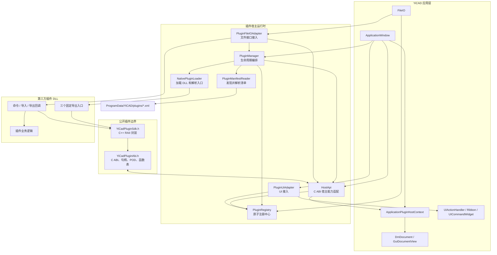
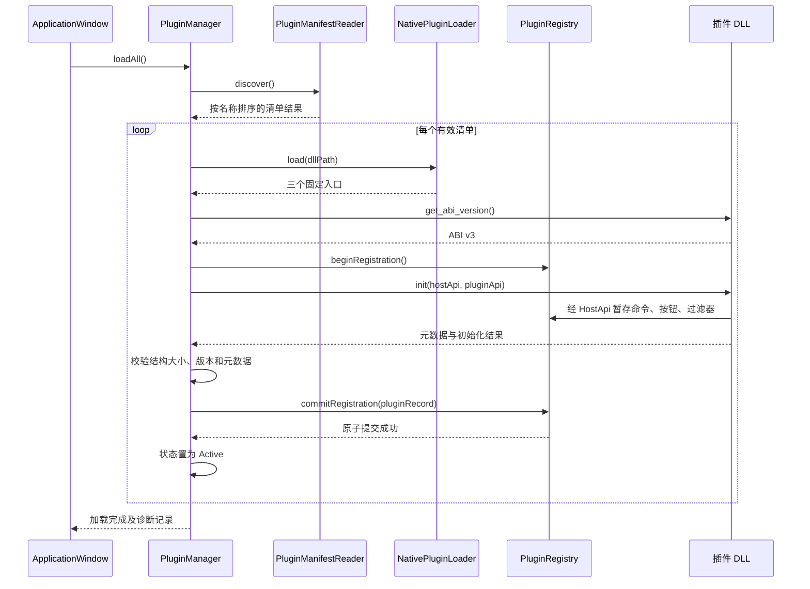
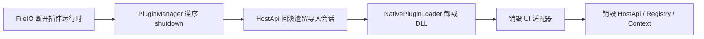

# YiCAD 插件系统架构

## 1. 系统定位

YiCAD 当前的插件系统是一个面向 Windows 原生 DLL 的扩展框架。它不使用 Qt 的 `QPluginLoader`、元对象接口或 C++ 虚函数作为二进制边界，而是使用稳定的 C ABI 函数表在宿主与插件之间通信。

这种设计把两侧分成三个层次：

1. 宿主运行时负责发现、校验、加载、注册和卸载插件；
2. C ABI 与 C++ SDK 负责定义稳定的跨 DLL 协议；
3. UI 和文件系统适配器把插件注册的能力接入 YiCAD 现有功能。

当前只支持 `YICAD_PLUGIN_ABI_V3`，仅允许在 UI 主线程调用插件 API，不支持热加载和运行中卸载。

## 2. 总体框架图



## 3. 核心类及作用

### 3.1 启动与宿主上下文

| 类 | 作用 |
| --- | --- |
| `ApplicationWindow` | 插件系统的组合根。按依赖关系创建上下文、注册中心、宿主 API、管理器和 UI 适配器；启动时加载插件，退出时按安全顺序关闭插件。 |
| `PluginHostContext` | 宿主内部能力的最小抽象接口，只暴露消息显示、当前文档、文档有效性和文档视图查询，避免 `HostApi` 直接依赖整个主窗口。 |
| `ApplicationPluginHostContext` | `PluginHostContext` 在主窗口中的具体实现，把请求转交给 `ApplicationWindow` 的文档和消息功能。 |

对象声明和析构顺序经过专门安排：`PluginManager` 必须先于 `HostApi`、`PluginRegistry` 和宿主上下文析构，确保 DLL 中的回调地址不再使用后才能卸载依赖对象。

### 3.2 发现、加载与生命周期

| 类或结构 | 作用 |
| --- | --- |
| `PluginManifest` | 清单解析后的不可变信息载体，保存 XML 路径、规范化 DLL 路径及 DLL 所在目录。 |
| `PluginManifestReader` | 扫描 `C:\ProgramData\YiCAD\plugins` 下的 `*.xml`，按文件名确定性排序，严格解析清单并验证 DLL 路径。 |
| `PluginManifestReadResult` | 保存单个清单的结果或错误码、消息及 XML 行列位置，使一个坏插件不会阻止其他插件被发现。 |
| `NativePluginLoader` | Windows DLL 的 RAII 封装；通过 `LoadLibraryExW` 加载，通过 `GetProcAddress` 取得三个固定入口，并在析构或失败清理时释放 DLL。 |
| `PluginManager` | 整个加载流程的编排器。完成发现、ABI 校验、初始化、注册提交、活动状态管理、失败回滚和逆序关闭。 |
| `PluginManagerRecord` | 记录每个插件达到的生命周期状态、元数据、ABI 版本及详细诊断信息。 |
| `ActivePlugin` | `PluginManager` 的内部对象，保存已加载 DLL、宿主 API 副本及初始化/注册状态。 |

清单格式刻意保持最小化，插件元数据由 DLL 初始化时返回：

```xml
<plugin dll="YiCadDemoPlugin.dll"/>
```

`dll` 可以是绝对路径，也可以是相对清单文件的路径。解析器拒绝子元素、正文、额外属性、DTD、非 `.dll` 文件和无法规范化的路径。

### 3.3 ABI 与 SDK

| 文件或结构 | 作用 |
| --- | --- |
| `YiCadPluginAbi.h` | 真正的二进制契约。定义 ABI 版本、调用约定、导出宏、结果码、不透明句柄、POD 数据结构、回调类型以及宿主/插件函数表。该头文件可从 C11 或 C++ 使用。 |
| `YiCadHostApi` | 宿主交给插件的函数表，包含注册命令和文件过滤器、访问文档、事务、只读遍历以及导入建模等能力。 |
| `YiCadPluginApi` | 插件在初始化时填写的输出表，确认结构大小、ABI 版本并提供插件 ID、名称和版本。 |
| `YiCadPluginSdk.h` | 面向 C++23 插件作者的高层封装，提供拥有型数据、RAII 会话和异常隔离工具，减少直接操作 C 函数表和裸句柄的错误。 |

每个插件 DLL 必须导出三个 `extern "C"` 入口：

```cpp
uint32_t yicad_plugin_get_abi_version();
YiCadResult yicad_plugin_init(
    const YiCadHostApi* hostApi,
    YiCadPluginApi* pluginApi);
void yicad_plugin_shutdown();
```

使用 C ABI 的核心原因是避免把 Qt 类型、STL 容器、C++ 异常、虚函数表和编译器名称修饰暴露到 DLL 边界。函数表带有 `structSize` 和 `abiVersion`，宿主与插件可以在访问字段前验证布局，防止越界读取不同版本的结构。

### 3.4 注册与能力接入

| 类或结构 | 作用 |
| --- | --- |
| `PluginRegistry` | 插件能力的宿主侧注册中心。插件初始化期间先暂存注册项，全部校验成功后原子提交；任何一项失败都会回滚整个插件的注册。 |
| `PluginCommandRecord` | 保存命令 ID、显示名、回调及插件持有的 `userData`。 |
| `PluginRibbonButtonRecord` | 描述按钮所在的 Ribbon 页、分组、关联命令和图标路径。 |
| `PluginImportFilterRecord` | 描述导入格式、扩展名、回调和上下文。 |
| `PluginExportFilterRecord` | 描述导出格式、扩展名、回调和上下文。 |
| `PluginUiAdapter` | 把注册记录物化为 `QAction` 和 Ribbon 页面/分组，并把 `pluginId/commandId` 注入命令窗口自动补全和执行器。 |
| `PluginFileIOAdapter` | 继承现有 `FilterInterface`，把 YiCAD 的导入/导出调用转换成插件 C 回调；调用前验证插件仍为活动状态、路径可安全转为 UTF-8、文档句柄有效。 |

注册中心将“插件声明能力”和“应用创建界面对象”分开。插件 DLL 不直接创建或持有 Qt 控件，因此插件不需要链接 YiCAD 或 Qt 内部库，宿主也能统一管理 UI 对象的所有权。

### 3.5 宿主能力桥接

`HostApi` 是系统中最重要的边界适配类。它把 `YiCadHostApi` 中的静态 C 回调转换成 YiCAD 内部 C++ 操作，主要包含：

- 显示消息以及取得当前文档；
- 注册命令、Ribbon 按钮、导入和导出过滤器；
- 创建和校验文档、事务、实体迭代器、导入会话等不透明句柄；
- 读取文档设置、资源、块和实体快照；
- 以事务方式创建图层、线型、文字样式、标注样式、块和各种 CAD 实体；
- 文档关闭或插件卸载时回滚未完成的导入会话。

`HostApi` 使用 `thread_local` 活动实例把无对象指针的 C 回调路由到当前宿主对象。因此同一线程只能有一个活动 `HostApi`，所有 ABI 调用都限定在创建它的 UI 线程。

## 4. 插件加载原理



详细流程如下：

1. `ApplicationWindow` 在 Ribbon、命令窗口和首个文档可用后创建插件运行时。
2. `PluginManifestReader` 扫描生产目录中的 XML 清单并逐个严格校验。
3. `NativePluginLoader` 加载 DLL，要求三个入口全部存在。
4. `PluginManager` 调用版本入口，当前必须精确等于 ABI v3。
5. 注册中心开启事务，随后调用插件 `init`。
6. 插件通过宿主函数表注册命令、Ribbon 按钮以及文件过滤器；此时记录只被暂存。
7. 插件填写 `YiCadPluginApi`。宿主检查结构容量、ABI 确认和非空元数据。
8. `PluginRegistry` 统一检查插件 ID、重复项、命令引用和格式冲突，然后原子提交。
9. 只有全部成功，插件状态才变为 `Active`，DLL 也才会被持续持有。
10. 任一步骤失败都会记录明确错误，回滚未提交注册项，必要时调用 `shutdown`，然后卸载该 DLL；其他清单仍可继续加载。

## 5. 命令调用原理

插件在 `init` 中注册命令回调，并可为命令声明 Ribbon 按钮。加载结束后，`PluginUiAdapter::materialize()` 读取已提交记录：

```text
用户点击 Ribbon 按钮
    → QAction::triggered
    → PluginRegistry::executeCommand(pluginId, commandId)
    → YiCadCommandCallback(userData)
    → 插件业务逻辑
    → 通过 YiCadHostApi 操作文档或显示消息
```

命令窗口使用同一条执行链。外部命令的规范形式为 `pluginId/commandId`，因此不同插件可以使用相同的局部命令 ID 而不会冲突。

## 6. 文件导入与导出原理

插件在初始化阶段注册文件格式。`FileIO` 将插件格式追加到文件对话框过滤列表，并在用户选择插件格式时创建临时的 `PluginFileIOAdapter`。

### 6.1 导入

```text
文件对话框选择插件扩展名
    → FileIO 查找 PluginImportFilterRecord
    → 检查所属插件是否 Active
    → PluginFileIOAdapter::fileImport()
    → 将 DmDocument 转为受校验的不透明句柄
    → 调用插件 YiCadImportCallback
    → 插件创建 ImportSession
    → 通过宿主 API 创建资源、块和实体
    → commit 提交，或失败/析构时 rollback
```

导入会话是事务性的。插件必须明确提交或回滚；文档关闭、插件失败或宿主退出时，`HostApi` 会回滚遗留会话，避免半成品进入文档。

### 6.2 导出

```text
文件对话框选择 pluginId/formatId
    → FileIO 查找 PluginExportFilterRecord
    → PluginFileIOAdapter::fileExport()
    → 调用插件 YiCadExportCallback
    → 插件通过只读 API 枚举设置、资源、块和实体
    → 插件编码并写出目标文件
```

只读 API 将数据复制到插件侧拥有的 C++ 值对象，避免插件长期引用宿主临时缓冲区。

## 7. 关闭与异常安全

应用退出时的顺序与加载相反：



关键安全规则包括：

- 插件回调地址和 `userData` 只保证在插件 `shutdown` 前有效；
- 卸载 DLL 前必须停止 `FileIO` 和 UI 对这些地址的访问；
- 成功初始化的插件按相反顺序关闭，以兼容潜在的先后依赖；
- C ABI 边界禁止异常穿透，宿主和 SDK 均使用异常捕获转换为失败结果；
- DLL 加载、初始化或注册失败时执行局部清理，不影响其他插件；
- 不透明句柄由宿主验证，插件不得自行释放或跨规定生命周期缓存；
- 注册使用事务，避免“命令注册成功但按钮或过滤器失败”的部分可见状态。

## 8. 插件开发视角

第三方插件只需依赖安装后的 `YiCAD::PluginSdk` 接口目标，不需要链接 YiCAD 可执行文件或其内部 Qt 库。典型开发步骤是：

1. 实现三个固定导出入口；
2. 在 `init` 中验证宿主 API，并填写插件元数据；
3. 注册命令、Ribbon 按钮或导入/导出过滤器；
4. 在回调中使用 C++ SDK 封装访问当前文档；
5. 在 `shutdown` 中释放插件拥有的状态；
6. 把 DLL 和对应 XML 清单部署到生产插件目录。

仓库中的 `plugins/demo_plugin` 展示基础命令、UI 和文件回调，`plugins/dxf_plugin` 展示完整的 DXF 导入与导出实现。

## 9. 当前边界与设计特点

当前实现的主要特点是：

- **稳定边界**：跨 DLL 只传递 C 函数、POD 数据和不透明句柄；
- **最小耦合**：插件 SDK 不暴露 YiCAD 内部类，也不要求插件直接操作 Qt UI；
- **原子注册**：一个插件的所有声明要么全部生效，要么全部回滚；
- **明确生命周期**：发现、校验、加载、初始化、活动、关闭都有状态与诊断；
- **事务化建模**：复杂导入失败时可以整体撤销；
- **版本严格**：当前仅接受 ABI v3，没有兼容旧 ABI 的降级路径；
- **运行限制**：Windows 优先、UI 主线程、启动时一次性加载，不支持热插拔；
- **依赖隔离**：插件业务通过公开 SDK 构建，宿主内部实现可以在不破坏 ABI 的情况下演进。

