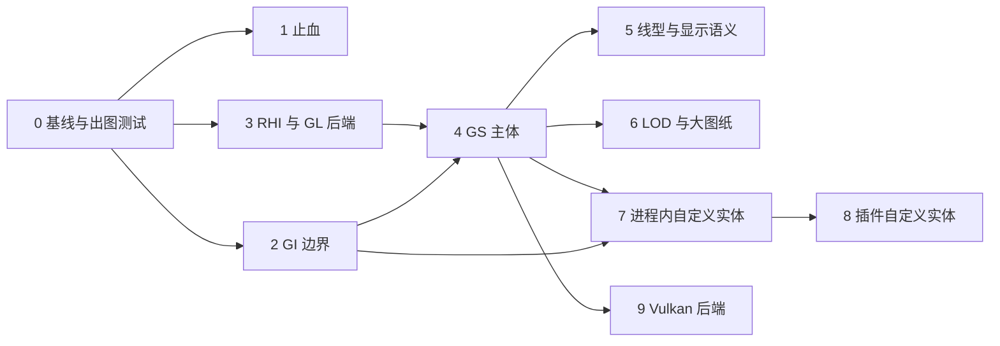

# YiCAD 渲染层重构方案

本文档给出渲染层的重构方案，内容是 `ARCHITECTURE_EVOLUTION_PLAN.md` 开头"范围说明"排除在外的"渲染专项"：
缓存增量化、后端接口化，以及 Vulkan 的引入方式。它同时为自定义实体（包括插件提供的实体）
定下渲染侧的接入契约。

> 本方案于 2026-09-27 提出，文中的行号与数量基于 `09c9768` 实测。引用 `ARCHITECTURE_EVOLUTION_PLAN.md`
> 时写作"演进方案 x.y 节"，引用 `LAYER_RESTRUCTURE_PLAN.md` 时写作"分层方案 x.y 节"。
> 状态：阶段 0、1、2、3、4、5、6 已完成（2026-09-27、2026-09-28、2026-09-28、2026-10-03、2026-10-04、2026-10-04、2026-10-05，见第 10 节；阶段 4 的全选与平移两项性能门槛没有完全达到，阶段 5 已用 AutoCAD 2026 核对，阶段 6 的渐进绘制没有在集成显卡上测过，见各节），其余阶段尚未动工。第 7 节已定（均为 2026-09-27）：D1（自建薄 RHI，先只做 OpenGL 实现）、
> D3（构建期 glslang + spirv-cross）、D5（插件实体的数据由宿主保管）、D6（代理图形随图纸存盘）、
> D7（圆弧用片段着色器解析绘制）、D8（渲染侧在本方案内支持任意仿射变换；Model 侧的非等比块参照、炸开与去复制
> 与 AutoCAD/ODA 一致，另立方案，见第 4.10 节）、D9（CI 用 Mesa 软件渲染跑出图测试）、D11（保留多重采样）、
> D10（采用 AutoCAD 的做法：块内虚线不随插入比例变化；开放曲线居中、闭合曲线按 `round` 整周期拉伸，已由对照图确认）、D12（文字用矢量字形）。
> D2（OpenGL 4.3 core）、D4（Vulkan 1.3 + volk + VMA）。全部决策已定。

---

## 1. 目标

### 1.1 需求

| 编号 | 需求 | 来源 |
|------|------|------|
| R1 | 大图纸可用：`BASELINE.md` 的 50 万实体基准图上，移动光标、悬停高亮、点选、框选、平移缩放都不随图纸规模线性变慢 | 性能 |
| R2 | 自定义实体：进程内扩展（`src/extensions/<name>/`）能新增实体类型，渲染层不需要为它改一行代码 | 用户要求 |
| R3 | 插件自定义实体：C ABI 插件 DLL 能新增实体类型；插件没装时，图纸里的这些实体仍能显示 | 用户要求 |
| R4 | 现在用 OpenGL，以后加 Vulkan 后端时不重写渲染层以上的任何代码，也不重写 GS | 用户要求 |
| R5 | 显示语义与 AutoCAD 一致：线型按世界长度、LTSCALE 与实体线型比例、多段线的线型生成（PLINEGEN）、线宽按像素显示、ByLayer/ByBlock、ACI 7 随背景变色、绘图次序 | 兼容性 |
| R6 | 大坐标不抖：测绘坐标（如 CGCS2000 投影坐标 Y≈3,500,000）放大到毫米级仍然稳定 | 正确性 |
| R7 | 可测：渲染结果能在无界面的测试里出图比对，重构每一步都有回归依据 | 工程 |

### 1.2 不做

- 三维（实体、视觉样式、光照）。GI 的接口按二维设计，第 4.2 节说明以后怎么扩。
- 图纸空间、布局与视口。只在设计上预留（多个 `GsView` 共享一个 `GsModel`、每视图的线型比例），不实现。
- 打印与矢量导出。GI 边界建好后，它们是 GI 的另一个消费者（第 4.2.5 节），另行规划。
- GPU 拾取。拾取与捕捉继续走空间索引与精确几何（`SpacialSearchTree`、`Snapper`），不依赖渲染。

---

## 2. 名词：RHI、GI、GS

### 2.1 RHI 是什么

RHI（Rendering Hardware Interface，渲染硬件接口）是夹在"画什么"与具体图形 API（OpenGL、Vulkan、D3D12、Metal）
之间的一层薄接口。它只抽象 GPU 本身的概念：缓冲、纹理、着色器、管线状态、渲染目标、命令录制、同步，
不认识实体、图层、线型。名字来自 Unreal Engine 的 `RHI` 模块；Qt 6 的 `QRhi` 是同类东西。

为什么需要它：OpenGL 是隐式的全局状态机（绑定什么、改什么状态，下一次绘制就用什么）；Vulkan 是显式的
（管线状态预先编译成不可变对象，资源通过描述符集绑定，命令先录制再提交，内存与同步都要自己管）。
如果上层代码直接写成 GL 状态机的样子，换 Vulkan 就等于重写。反过来，如果 RHI 按 Vulkan 的形状设计
（不可变管线对象、显式绑定组、命令列表、帧内资源生命周期），那么：

- GL 实现就是把这些概念映射回 GL 调用，写起来直接；
- Vulkan 实现与接口一一对应，不需要在 GL 语义上打补丁；
- 上层（GS）只面对 RHI，两个后端共用同一份 GS、同一份着色器源码。

本方案自建这层 RHI（D1），先只有 GL 4.3 实现，接口按 Vulkan 1.3 的形状设计（第 4.7 节）。

### 2.2 GI 与 GS

| 名词 | 全称 | 职责 | 在本方案中的位置 |
|------|------|------|------------------|
| GI | Graphics Interface | 实体描述"我由哪些几何组成"所用的抽象接口：一套固定的图元词汇加属性。实体只调用它，不知道谁在接收 | `src/model/graphics/`（纯接口，Model 层） |
| GS | Graphics System | 接收 GI 输出、缓存、增量更新、空间分块、裁剪、LOD、选中高亮状态、叠加层，最后通过 RHI 提交；与后端无关 | `src/render/gs/` |
| RHI | Rendering Hardware Interface | GPU API 抽象 | `src/render/rhi/`，实现在 `src/render/rhi/gl/`，以后加 `src/render/rhi/vulkan/` |
| 代理图形 | Proxy Graphics | 实体"上一次画出来的样子"（它输出过的线、弧、文字等图元），随图纸一起存盘。定义这个实体的程序（插件）不在时，图纸用它显示该实体：看得见，但不能按实体自己的参数编辑 | GI 流的一种用途（第 4.2.3、4.8.3 节） |

### 2.3 常规 CAD 程序怎么做

| 程序 | 做法 |
|------|------|
| AutoCAD（ObjectARX） | 实体实现 `AcDbEntity::subWorldDraw(AcGiWorldDraw*)`，向 `AcGiGeometry`（polyline、circle、circularArc、polygon、shell、text、xline、ray、nurbs、draw(嵌套可绘制对象)……）输出图元，用 `AcGiSubEntityTraits` 设颜色、图层、线型、线型比例、线宽、选择标记；需要随视图变化的部分在 `subViewportDraw` 里画。图形系统 AcGs 负责缓存与显示。自定义实体只实现这两个函数；未加载定义它的 ObjectARX 模块时，实体以代理对象（`AcDbProxyEntity`）出现，用存盘时保存的代理图形（PROXYGRAPHICS）显示 |
| ODA Drawings SDK | 与 AutoCAD 同构：`OdGiDrawable::subWorldDraw` → `OdGiGeometry`；图形系统 `OdGsModel`/`OdGsView`/`OdGsDevice`，每个实体一个 `OdGsEntityNode` 缓存其图元，块定义缓存在 `OdGsBlockNode` 里由所有插入共享；实体修改经 `OdGsModel::onModified` 只作废对应节点；高亮是节点状态；设备层有 OpenGL ES2、DirectX、Metal、Vulkan 等多个实现 |
| BricsCAD | 基于 ODA，结构同上 |
| QCAD / LibreCAD（YiCAD 的前身） | 实体直接向 `RS_Painter` 画（move_to/line_to 风格），块插入复制子实体；没有 GI/GS 分离，也没有增量缓存 |

共同点：**实体只描述几何，不碰图形 API；图形系统按实体缓存、按变化增量更新、块定义共享；选中高亮是状态不是几何；后端可替换。**
YiCAD 现在的结构来自 LibreCAD，第 3 节的问题大多由此而来。

---

## 3. 现状

### 3.1 数据流

```
GuiDocumentView::paintGL()                              每帧（包括每次鼠标移动）
 ├─ 背景层  GLPainter（立即模式，每次 stroke 上传一次顶点）：背景矩形、网格
 ├─ 文档层  DmCachePainter::draw()
 │    └─ 若 m_bIsModefied：cacheAll()
 │         ├─ removeAllCache()                          删除全部 VBO/VAO、图片纹理
 │         ├─ regroup()                                 遍历全部实体，getSubEntities() 展平，按 DmPen 分组
 │         │                                            （普通 / 选中 / 高亮三组）
 │         ├─ cacheEntity()                             switch(getEntityType())，取实体里存好的 GL 顶点
 │         └─ generateGLData()                          重新创建全部 VBO/VAO 并上传
 │    └─ GLCachePainter::stroke()                       按 3 组 × 13 种 CacheType × 画笔 逐个 draw
 ├─ 预览层  DmCachePainter（预览容器，同上，另有模型偏移）
 └─ 前景层  GLPainter：原点标记、选择框、光标、捕捉标记
```

### 3.2 问题清单

| 编号 | 问题 | 位置 | 影响 |
|------|------|------|------|
| P1 | 选择集或高亮集一变就整图重建：删除全部 VBO，遍历全部实体重新分组，全部顶点重新上传 | `UIView.cpp:61-73` 连到 `specifyDocumentModified()`；`DmCachePainter.cpp:99` `cacheAll()`、`:215` `regroup()` | 大图上点选一个实体、命令里鼠标移到候选实体上出现高亮，都是 O(全图) 的 CPU 与上传开销（R1） |
| P2 | 图片实体每次重建都重新创建纹理并从磁盘解码上传 | `DmCachePainter.cpp:449-480`（`glGenTextures` 在 `:467`） | 含图片的图纸，P1 的代价再加上解码与纹理上传 |
| P3 | 每帧重画全部内容，没有场景底图缓存 | `GuiDocumentView.cpp:1288` `paintGL()` | 只移动光标也要把全部 VBO 画一遍（R1） |
| P4 | 模型里存 GL 专用顶点：`(x,y,z,弧长参数,总长)`，并为 `GL_LINE_STRIP_ADJACENCY` 补首尾邻接点；取顶点的函数会就地重算缓存 | `ArcData.h:102`、`DmArc.cpp:842-948`，Circle/Ellipse/Line/LineStrip 同样；`DmCircle.cpp:640` | 模型依赖 GL 图元拓扑与几何着色器的输入格式（R4）；`getVerticesRef()` 修改对象，不能多线程生成 |
| P5 | 实体类型在渲染层写死：`CacheType` 枚举、两处 `switch(getEntityType())`、`useShader()` 的 switch；不认识的类型落到 `default` 被当成点或不画 | `GLCache.h:31`；`DmCachePainter.cpp:291`、`:368`；`GLCachePainter.cpp:729` | 新实体类型无处接入（R2、R3） |
| P6 | 渲染靠 `getSubEntities()` 展平；块参照为每个插入复制块内实体，文字为每个字符复制字形模板 | `DmCachePainter.cpp:253`；`DmBlockReference.cpp:86`、`:185`；`DmChar.cpp:64` | 内存随"插入数 × 块大小"增长，无法实例化绘制；块定义一改，所有插入都要重建 |
| P7 | 顶点与 MVP 都是 float，世界坐标直接进 GPU | `GLCacheUnit.h` `vertexes`；`GLPainterCommon.cpp` 的 `glm::mat4` | 坐标 3.5e6 时 float 精度约 0.25，放大后线条抖动、错位（R6） |
| P8 | 圆弧按固定分段数离散（整圆 120 段），与缩放无关 | `Datamodel.h:40` `CIRCLE_SEGMENT_COUNT` | 大圆放大后看得见折线；小圆缩小时浪费顶点 |
| P9 | 线宽、虚线、射线靠几何着色器；线型参数作为 uniform 数组逐画笔上传（`u_dashes[64]` 等） | `res/shaders/*.shader`（`#version 430`，带 geometry 段）；`common.inl:11` | Vulkan 能用但不推荐、Metal 没有几何着色器；每个画笔一次 uniform 上传与 draw（R4） |
| P10 | 没有视口裁剪，没有 LOD | `GLCachePainter::stroke()` `:431` | 视口外、小于一个像素的实体照样处理 |
| P11 | 后端抽象形同虚设：`Painter` 只有 `stroke()`；`PainterCreator` 返回具体 GL 类型；`render/view/` 的 `DmCachePainter` 直接调 `glGenTextures` | `Painter.h`、`PainterCreator.h`、`DmCachePainter.cpp:467` | 没有可以替换后端的边界（R4） |
| P12 | 颜色与线宽的特判：RGB 全 0 一律画成白色（其实是 ACI 7 的语义，应随背景变）；线宽按 `width * 0.05` 像素、至少 1 像素 | `DmCachePainter.cpp:353`、`:347` | 浅色背景下"黑色"实体看不见；线宽与 AutoCAD 的毫米到像素换算不一致（R5） |
| P13 | 夹点缓存要扫描全部实体找选中的，上限 100 个点 | `DmCachePainter.cpp:524-526` | 大图选中后重建夹点是 O(全图) |
| P14 | 两处潜在缺陷（目前没被调用的 `recache()` 路径上）：lambda 在 `find` 失败时仍 `erase(end())`，是未定义行为；`removeCacheByGroup()` 会删掉所有组的图片纹理 | `GLCachePainter.cpp:122`、`:81-105` | 以后启用部分更新时会出问题 |
| P15 | GL 上下文没指定版本与 profile，只设了 4 重采样；着色器却写 `#version 430` | `GuiDocumentView.cpp:111-113` | 实际最低要求是 GL 4.3，但没检查也没报错；在只给 3.x 兼容上下文的驱动上直接黑屏 |
| P16 | 线型只有简单图案；没有 LTSCALE、实体线型比例、多段线的线型生成 | `DmLineType.h:53` | R5 |
| P17 | 文档变更通知没有粒度：`documentModified()` 不带参数；撤销系统其实知道每个被增删改的对象，但只发粗粒度信号 | `DmDocumentListener.h:40`；`CmdManager.cpp:91` `commit()`、`MacroCmd.h:29` `CmdTypeObjectVector` | 渲染层只能整图重建（R1） |
| P18 | 命令为了显示预览直接改实体可见性，然后要求整图重建 | `ModifyTrimCommand.cpp:86`；`extensions/` 与 `application/` 里共 18 处 `setVisible(`（含修剪命令自己的） | 同 P1；而且实体的持久属性被当成临时显示状态用 |

### 3.3 可以保留的东西

- **按世界长度画虚线的算法**：`line.shader` 等的片段着色器已经按世界弧长（顶点里的 `parameter`、`total_length`）计算虚线，
  短于一个周期的画实线，余量平分到两端。第 4.5 节沿用这一语义，只换实现方式（去掉几何着色器、改用线型表）。
- **预览的模型偏移**：`setPreviewModelOffset()` 让移动类命令拖动时只改变换、不重建预览。第 4.3.9 节把它推广成任意变换。
- **空间索引**：`SpacialSearchTree`（R 树）与 `EntityTable::searchEntities()`。GS 的空间分块另建（第 4.3.5 节），拾取与捕捉继续用它。
- **约束三角剖分**：`ConstrainedDelaunayTriangulation`，GS 用它把填充区域变成三角形。
- **类型系统**：`MetaType`/`TYPESYSTEM_SOURCE` 按类名注册、按类名创建，是自定义实体注册的基础（第 4.8 节）。
- **撤销命令里的对象级信息**：`CmdTypeObjectVector` 已经列出每次提交涉及的对象，是增量更新的现成来源（第 4.3.6 节）。
- **视图边界**：命令与工具只认识 `IDocumentView`、`ISelectionSource`、`IHighlightSource`。GS 替换画布内部实现，这些接口只做小改（第 4.9 节）。

---

## 4. 目标结构

### 4.1 分层与目录

```
src/model/graphics/        GI：IGiDrawable、IGiWorldDraw、IGiGeometry、IGiSubEntityTraits、Gi* 值类型、
                           GI 流（GiStream，可序列化的图元记录）
src/model/entity/...       每个实体实现 worldDraw()；删除 m_vertices/getVerticesRef()
src/model/document/        DmChangeTracker、DmChangeSet（变更集），DmDocumentListener 新增按实体的通知

src/render/rhi/            Rhi* 接口：RhiDevice、RhiBuffer、RhiTexture、RhiPipeline、RhiBindGroup、
                           RhiRenderTarget、RhiCommandList、RhiSurface、RhiCaps
src/render/rhi/gl/         GLRhi*：OpenGL 4.3 core 实现（现有 GLShader/GLVertexArray 等收进来重写）
src/render/rhi/vulkan/     VulkanRhi*：以后加，CMake 选项 YICAD_WITH_VULKAN 控制是否编译
src/render/gs/             Gs*：GsDevice、GsModel、GsNode、GsSharedGeometry、GsCell、GsView、GsPipelines、
                           GsLinetypeTable、GsGlyphCache、GsTessellator、GsTransientModel
src/render/view/           画布 GuiDocumentView（改为持有 GsView），IDocumentView 等接口

src/application/           AppDocument 持有该文档的 GsModel，注入到各视图
```

依赖方向不变（分层方案 2 节）：`model/graphics/` 只依赖 Model 与 Base，不含任何图形 API 类型，
所以"Model 不认识视图"这条规则仍然成立。GI 接口放在 Model 层与 AutoCAD 一致：AcGi 的接口位于 AcDb 之下，
由图形系统实现。

新目录要加进 `YiCAD/CMakeLists.txt` 对应分区的 `yicad_collect_sources` 调用（`src/model/graphics` 进 MODEL，
`src/render/rhi`、`src/render/rhi/gl`、`src/render/gs` 进 RENDER）。新头文件名不得与现有的重名
（`tools/check_layering.py`），这也是 GL 后端叫 `GLRhiDevice.h` 而不叫 `GLDevice.h` 的原因。

新前缀（实施时补进 `AGENTS.md` 的命名约定）：

| 前缀 | 含义 | 例子 |
|------|------|------|
| `IGi*` / `Gi*` | GI 接口 / GI 值类型 | `IGiGeometry`、`GiTransform` |
| `Gs*` | 图形系统 | `GsModel`、`GsView` |
| `Rhi*` | RHI 接口 | `RhiDevice` |
| `GLRhi*` | RHI 的 GL 实现（沿用 `GL*` 前缀） | `GLRhiDevice` |
| `VulkanRhi*` | RHI 的 Vulkan 实现；不用 `Vk*`，免得与 Vulkan 自己的 `VkDevice` 等类型混淆 | `VulkanRhiDevice` |

### 4.2 GI：实体与图形系统的契约

GI 的图元词汇同时是两份契约：对上是实体（含插件实体，第 4.8 节）要用的全部绘图能力，对下是 GS 与各后端要支持的全部图元。
它一旦定下就很难改，所以宁可少而完整，也不做成"什么都能画"。

#### 4.2.1 接口草图

```cpp
/// @brief 可绘制对象。DmEntity 与 DmBlock（块定义）实现它
class IGiDrawable
{
public:
    virtual ~IGiDrawable() = default;
    /// @brief 描述自身几何；必须是 const、确定性的（同样的数据输出同样的图元），且除非 drawableFlags() 声明，
    ///        否则必须可以在工作线程上与其他实体并行调用
    virtual void worldDraw(IGiWorldDraw& wd) const = 0;
    /// @brief 随视图变化的部分；仅当 drawableFlags() 含 GiDrawableFlag::ViewDependent 时调用
    virtual void viewportDraw(IGiViewportDraw& vd) const {}
    virtual GiDrawableFlags drawableFlags() const { return {}; }
};

/// @brief worldDraw 的上下文
class IGiWorldDraw
{
public:
    virtual IGiGeometry& geometry() = 0;
    virtual IGiSubEntityTraits& traits() = 0;
    /// @brief 这次生成的用途：显示、代理图形、范围计算、导出。实体一般不需要区分
    virtual GiRegenType regenType() const = 0;
    /// @brief 实体自行离散曲线时应满足的弦高容差（世界单位）
    virtual double deviation() const = 0;
    /// @brief 是否在拖动预览中；实体可以输出简化图形
    virtual bool isDragging() const = 0;
};

/// @brief 图元属性。每个 worldDraw 开始时由 GS 按实体自身的属性初始化，实体可以逐图元覆盖
class IGiSubEntityTraits
{
public:
    virtual void setColor(const DmColor& color) = 0;          ///< 含 ByLayer、ByBlock、ACI、真彩色
    virtual void setLayer(const DmLayer* layer) = 0;
    virtual void setLineType(const DmLineType* lineType) = 0; ///< 含 ByLayer、ByBlock
    virtual void setLineTypeScale(double scale) = 0;          ///< 实体线型比例
    virtual void setLinePattern(const GiLinePattern& p) = 0;  ///< 填充图案线用：内联图案 + 相位，不做端点对齐；长度在实体自身坐标系里，随块缩放
    virtual void setLineWeight(DM::LineWidth weight) = 0;     ///< 含 ByLayer、ByBlock、默认
    virtual void setTransparency(std::uint8_t alpha) = 0;
    virtual void setSelectionMarker(std::int32_t marker) = 0; ///< 子实体标记，供子实体高亮与夹点
    virtual void setScreenSpace(const DmVector* anchor) = 0;  ///< 非空：后续图元以像素为单位、锚定在该世界点
};

/// @brief 图元词汇。坐标一律 double，处在当前模型变换下（块内实体即块定义坐标系）
class IGiGeometry
{
public:
    virtual void polyline(std::span<const DmVector> pts, std::span<const double> bulges, GiPolylineFlags flags) = 0;
    virtual void circle(const DmVector& center, double radius) = 0;
    virtual void arc(const DmVector& center, double radius, double startAngle, double sweepAngle) = 0;
    virtual void ellipseArc(const DmVector& center, const DmVector& majorAxis, double ratio,
                            double startParam, double endParam) = 0;
    virtual void nurbs(const GiNurbs& curve) = 0;
    virtual void fill(std::span<const GiLoop> loops, GiFillRule rule) = 0;               ///< 由 GS 三角剖分
    virtual void triangles(std::span<const DmVector> vertices, std::span<const std::uint32_t> indices) = 0;
    virtual void glyphRun(const GiGlyphRun& run) = 0;                                    ///< 已排版的字形
    virtual void image(const GiImage& image) = 0;
    virtual void point(const DmVector& pos) = 0;
    virtual void ray(const DmVector& base, const DmVector& dir) = 0;
    virtual void xline(const DmVector& base, const DmVector& dir) = 0;
    /// @brief 画一个共享的可绘制对象（块定义），由 GS 缓存一次、按变换实例化
    virtual void drawShared(const IGiDrawable& drawable, const GiTransform& xf, const GiByBlockTraits& byBlock) = 0;
    virtual void pushTransform(const GiTransform& xf) = 0;
    virtual void popTransform() = 0;
};
```

`GiPolylineFlags` 含 `Closed` 与 `ContinuousLinetype`（即多段线的"线型生成"特性）。`GiGlyphRun` 是字体句柄加一串
`{字符码, 位置, 每字符变换}`：排版（多行文字格式、对齐、宽度因子、倾斜）是实体的事，GS 只认已经排好的字形。

以上是草图。第 2 阶段实施时照 AutoCAD/ODA 补了 `IGiDrawable::setAttributes()`、嵌套绘制 `IGiGeometry::draw()`、多段线的线宽、
字体句柄 `IGiFont` 等，见第 10 节阶段 2；第 6 阶段照 ODA 的 `OdGiSubEntityTraits::setFill(OdGiHatchPattern)` 加了填充图案
`IGiSubEntityTraits::setFill(GiHatchPattern)`，见第 10 节阶段 6；接口以 `src/model/graphics/` 为准。

#### 4.2.2 为什么是解析图元而不是折线

圆、圆弧、椭圆弧、NURBS、带凸度的多段线都以解析形式进入 GS，而不是由实体先离散成折线：

- GS 可以用片段着色器按真实圆方程画圆弧（第 4.4 节），任何缩放下都是真圆，不需要按缩放重新离散；
- 圆弧的虚线参数可以用 `r × 角度` 精确算出；
- 数据量小：一个整圆现在要 123 个顶点、每个 5 个 float（约 2.4 KB），解析形式是一条约 32 字节的记录；
- 以后的矢量导出（PDF 的圆弧）、代理图形都保留精确几何。

实体确实需要自己离散时（例如自定义实体的某种特殊曲线），按 `IGiWorldDraw::deviation()` 给出的容差输出折线。

#### 4.2.3 GI 流

GS 用一个记录器实现 `IGiGeometry`，把 worldDraw 的输出写成紧凑的二进制记录流（`GiStream`，double 精度，带版本号）。
GI 流有四个用途：

1. GS 编译 GPU 数据的输入（第 4.3.3 节）；
2. 插件实体的代理图形，随图纸存盘（第 4.8.3 节）；
3. 自定义实体没有实现捕捉、拾取、范围计算时，宿主从 GI 流推导默认实现（第 4.8.4 节）；
4. 单元测试：记录内置实体的 worldDraw 输出，与期望比对（`test_graphics`）。

#### 4.2.4 随视图变化的图形

绝大多数"随视图变化"的需求是"固定像素大小的符号"（标记、箭头、夹点样式的图形）。GI 用
`setScreenSpace(anchor)` 直接表达：后续图元以像素为单位、锚定在世界点，由着色器处理，不需要每视图重新生成。
真正依赖视图的实体（`GiDrawableFlag::ViewDependent`）才走 `viewportDraw`：GS 为它按视图单独缓存，
相机变化超过阈值时重新生成。这条路径开销大，只留给确实需要的实体。

#### 4.2.5 以后的扩展

- 三维：在 `IGiGeometry` 上加 `shell`/`mesh` 等三维图元，坐标类型换成三维；现有二维图元不变。
- 矢量导出与打印：另写一个 `IGiGeometry` 实现，把图元转成 `QPainter`/PDF 路径。
- 插件 ABI 的 GI 表（第 4.8.3 节）是 `IGiGeometry` 的 C 版本，词汇与这里保持一一对应。

### 4.3 GS：图形系统

#### 4.3.1 对象与所有权

| 对象 | 数量 | 持有者 | 内容 |
|------|------|--------|------|
| `GsDevice` | 每个进程一个 | 共享所有权，由第一个视图初始化时建立 | `RhiDevice`、全部管线、字形缓存、图片纹理缓存、线宽表 |
| `GsModel` | 每个文档一个 | `AppDocument`（Application 层能看到 Render）；注册为该文档的 `DmDocumentListener` | 实体节点、共享几何（块、字形）、空间分块、GPU 数据区、对象状态缓冲、图层表、线型表 |
| `GsView` | 每个视图一个 | `GuiDocumentView` | 相机（double）、每视图高亮位图、场景底图、叠加层、临时模型（预览） |
| `GsTransientModel` | 每个视图一个 | `GsView` | 预览容器的图元，小而频繁重建 |

块预览窗 `GuiPreviewWidget` 也改成一个 `GsView`，直接复用 `GsModel` 里已缓存的块几何。

#### 4.3.2 从实体到 GPU 的三级表示

```
DmEntity ──worldDraw──▶ GiStream（double，每节点一份，常驻内存）
                           │ 编译（GsCompiler，按管线分类，坐标减去分块原点后转 float）
                           ▼
                        编译结果（CPU 临时数据，上传后丢弃）
                           │ 上传到分块在 GPU 数据区里的区段
                           ▼
                        GPU 数据区（按管线分类的大缓冲，子分配）
```

- GI 流常驻内存：分块整理、上下文丢失重建、改变 LTSCALE 等情况下，只需重新编译，不需要重新调用 worldDraw
  （插件实体的 worldDraw 在 UI 线程上执行，还可能很慢）。
- 编译结果上传后丢弃：GPU 里已有一份，CPU 再留一份浮点副本没有必要。
- 内存估算：一条直线的 GI 记录约 40 字节，一个圆约 36 字节，一个字符的字形引用约 48 字节，都远小于现在的表示。

#### 4.3.3 共享几何与实例

GS 只有一种绘制单元：**共享几何 + 实例**。

| 场景 | 共享几何 | 实例 |
|------|----------|------|
| 顶层实体 | 一个分块内全部顶层实体编译成的几何（分块原点坐标系） | 一个恒等实例（平移到分块原点） |
| 块参照 | 块定义编译成的几何（块坐标系），全文档只有一份 | 每个插入一个实例：变换、所属顶层对象、ByBlock 属性 |
| 文字 | 每个字形编译成的几何（字形坐标系），全进程只有一份 | 每个字符一个实例：位置、高度、旋转、宽度因子、倾斜合成的仿射变换 |

实例记录（约 40 字节）：2×3 仿射变换（float，相对分块原点）、顶层对象槽位、ByBlock 颜色、ByBlock 线型、ByBlock 线宽、实例线型比例。
嵌套块由 GS 展开成叶子实例，变换与 ByBlock 属性逐层合成。块定义修改时只重编译这份共享几何；
插入的增删改只改实例记录，不碰几何。

**块内的线型不随插入比例缩放**（D10，2026-09-27 由 AutoCAD 截图确认：同一个块按两个比例插入，两个三角形的划线长度相同）。
线型图案始终按世界长度画，块的插入比例只改变几何，不改变划线与空白的长度。现在的实现把块内实体复制到世界坐标再画，
结果也是如此，行为不变。共享几何下要做到这一点：

- 几何里存的弧长参数是块坐标系里的长度，着色器要把它换算成世界长度，A 型对齐需要的总长同样换算；
- **等比插入**（含镜像、旋转）：换算系数就是插入比例的绝对值，每个实例一个常数，放在实例记录里，共享几何不受影响；
- **非等比插入**：同一条线在不同方向上的换算系数不同，块里的圆在世界里是椭圆、弧长没有简单的换算式，多段线（线型生成启用时）
  的累计弧长也要逐段重算。因此非等比插入且块内有非连续线型的内容时，GS 为这个插入单独编译一份世界坐标下的几何
  （圆弧按椭圆离散，弧长参数在 double 下算好），不走共享；块内全是连续线型时仍然共享。
  判断时 ByBlock 线型按该插入的线型解析，ByLayer 线型按图层表解析；图层的线型改变时重新判断受影响的非等比插入（很少见）；
- 填充图案线不是线型：它的划线是填充图案的一部分，在填充自身的坐标系里定义，随块一起缩放（GI 的 `setLinePattern()`，第 4.5.1 节）。

非等比插入在实际图纸里较少，而其中又只有含虚线的才失去共享，所以这条例外对内存与性能的影响很小。

实例变换是完整的 2×3 仿射矩阵，所以 X、Y 比例不同、镜像、以及嵌套块里"旋转 + 外层非等比缩放"合成出来的错切，
渲染侧都直接支持，不需要把圆换成椭圆之类的类型转换（第 4.4 节的圆弧管线说明怎么在仿射下保持真实形状与像素线宽）。

块参照的内存优势要完全兑现，还需要 Model 层不再为每个插入复制子实体（P6）。那涉及捕捉、选择、炸开等大量代码，
不在本方案内，作为后续独立方案（D8，设计要点见第 4.10 节）。本方案完成后，渲染侧已经不再依赖这些复制品。

#### 4.3.4 GPU 数据区

- 每个管线类（第 4.4 节）一组大缓冲：几何缓冲、实例缓冲、间接绘制命令缓冲。按页增长（每页 4 MB 起，翻倍）。
- 子分配用偏移分配器（按区段大小分级的空闲表，O(1) 分配与释放），分配单位是"分块 × 管线类"的区段。
- 分块的区段满了或碎片超过阈值时，整理这一个分块：从 GI 流重新编译并连续写入新区段，旧区段延迟释放。
  整理的开销以分块大小为上限，不会波及整个文档。

#### 4.3.5 空间分块

- 用松散四叉树组织顶层实体与实例：实体按包围框放进能容纳它的最深一层；每个叶子是一个分块，
  图元数超过上限（按管线类计，初定 16k 条记录，基准测试后调整）时分裂，过少时与兄弟合并。
- 每个分块有一个 double 原点（包围框中心）。分块内的坐标减去原点后转 float，每次绘制的模型视图矩阵
  在 CPU 上用 double 计算"视图 × 平移(分块原点)"后再转 float。GPU 只见小数值，任何坐标量级都不丢精度（R6）。
- 构造线、射线等无限长对象不进四叉树，单独一个"总是可见"的列表。
- 裁剪：每帧用视口矩形（外扩一圈）查四叉树得到可见分块，把它们预先生成好的间接绘制命令拼成本帧的命令列表。
  50 万实体大约几百个分块，这一步是微秒级。

#### 4.3.6 增量更新

**Model 侧的变更集**（第 5 节第 4.1 步）：

- `DmDocument` 新增 `DmChangeTracker`。实体表与各符号表在增、删、改（包括 `add_direct` 一类不走命令的路径，
  以及 `EntityTable::startModify()`）时登记对象 ID。
- 在 `CmdManager::commit()`、`undo()`、`redo()` 结束时，以及文件加载完成、新建、关闭时，把累积的变更打包成 `DmChangeSet`：
  增加、删除、修改的实体 ID；修改过的图层、线型、文字样式、标注样式、块定义的 ID；变过的文档变量；
  以及"全部重建"标志（加载、`REGEN` 命令）。
- `DmDocumentListener` 新增 `entitiesChanged(const DmChangeSet&)`。现有的 `documentModified()` 保留给其他监听者（如 `SelectionSet`）。
- `DmObject` 新增单调递增的修订号，在 `startModify()` 与 `update()` 时递增。GS 节点记下生成时的修订号；
  调试构建里 `YICAD_GS_VERIFY=1` 时，每帧抽查可见节点，发现修订号不一致（有人改了实体却没登记）就记日志。
  这是防止"改了实体、画面不变"这类问题长期潜伏的手段。

**GS 侧的处理**：

| 变化 | GS 的动作 | 开销 |
|------|-----------|------|
| 实体增、删、改 | 重新 worldDraw 这些实体，更新 GI 流；标记所在分块需要重编译（包围框跨分块时迁移） | O(变化的实体 + 所在分块) |
| 块定义修改 | 重编译该块的共享几何；依赖它的块（嵌套）同样处理；插入的实例记录不变 | O(块大小) |
| 块参照增删改 | 只改实例记录；非等比插入且块内有虚线内容时，为该插入单独编译几何（第 4.3.3 节） | O(实例)，例外情况 O(块大小) |
| 图层颜色、线型、线宽、开关、冻结 | 只改图层表缓冲里的一项 | O(1) |
| 线型图案修改 | 只改线型表缓冲；超长实体的虚线分段（第 4.5.5 节）惰性重算 | O(1) 到 O(受影响的长实体) |
| 文字样式修改 | 按依赖索引（样式 → 实体）重新 worldDraw 用到它的文字 | O(相关文字) |
| LTSCALE 等文档变量 | 只改每帧常量 | O(1) |
| 选择集变化 | 只改对象状态缓冲里变化的那些槽位（第 4.3.7 节） | O(变化的对象) |
| 高亮集变化 | 只改该视图的高亮位图，场景底图不作废（第 4.3.8 节） | O(变化的对象) |

依赖索引（块 → 引用它的块与插入、文字样式 → 文字、标注样式 → 标注）由 GS 在 worldDraw 时顺带记录：
GI 的 `drawShared()` 与 `glyphRun()` 的字体句柄天然给出依赖。

#### 4.3.7 状态缓冲

几何里不存"选中""高亮""图层颜色"这类会变的东西，而是存索引，着色器运行时查表：

| 缓冲 | 粒度 | 内容 | 谁改 |
|------|------|------|------|
| 对象状态 | 每个顶层对象一个槽位（`DmId` → 槽位，删除后回收），16 字节 | 所在图层索引、绘图次序深度、选中、临时隐藏、淡显（块编辑模式预留）、透明度 | GsModel |
| 高亮位图 | 每视图，每槽位 1 位 | 命令拾取反馈的高亮 | GsView |
| 图层表 | 每个图层 16 字节 | 颜色、线型索引、线宽、开/关、冻结、锁定淡显 | GsModel |
| 线型表 | 每个线型约 64 字节 | 图案元素（最多 12 个，与 AutoCAD 简单线型上限一致）、周期长度、点的位置 | GsModel |
| 线宽表 | 24 个标准线宽 + 默认 | 毫米值；像素换算在着色器里乘每帧常量 | GsDevice |

几何记录里的"样式字"（8 字节）：颜色（类型 2 位 + ACI 索引或 RGB）、线型索引（含 ByLayer/ByBlock 哨兵值）、
线宽索引（含 ByLayer/ByBlock）、标志位。ByLayer 在着色器里查图层表，ByBlock 查实例记录，ACI 7 按背景亮度取黑或白。

全选 50 万实体只是写 50 万个状态字节（约 8 MB 的一次上传），不重建任何几何。

#### 4.3.8 帧流程

```
GsView::render()
 1. GsModel::applyPendingChanges()        处理变更集：worldDraw、编译、上传（可设时间预算）
 2. 场景是否作废？                          作废原因：相机、变更集、选择集、图层表、背景与显示设置、尺寸或 DPR
    是 → 裁剪得到可见分块 → 生成间接命令 → 场景通道：
         网格（全屏程序化着色器）→ 不透明图元（按管线类，多重间接绘制）→ 透明图元（按绘图次序）
         → 画进离屏场景底图（多重采样，结束时解析）
 3. 叠加通道（每帧都画，画进窗口）：
         贴场景底图 → 高亮强调 → 临时模型（预览）→ 夹点 → 捕捉标记 → 光标 → 选择框
```

- **只移动光标**时场景不作废，这一帧的开销是一次全屏贴图加几个叠加图元，与图纸大小无关（R1）。
- **高亮**在叠加通道里重画被高亮对象的区段（加宽、换色，关闭深度测试），场景底图不作废。
  高亮集超过阈值（初定 1000 个对象）时改走对象状态路径，作废场景底图。
- **选中**走对象状态：在场景通道里加宽、换色、深度前移。选择集可能很大，走状态比逐对象再画一遍便宜。
- 平移、缩放期间每帧重画场景；这时的开销是纯 GPU 开销（没有 CPU 重建），由 LOD（第 4.3.10 节）控制。

#### 4.3.9 预览与临时图形

- 预览容器里的实体由 `GsTransientModel` 用同一套 worldDraw 与编译流程生成，只是不分块、不留 GI 流，每次预览变化全部重建（预览一般很小）。
- `setPreviewModelOffset()` 推广成 `setPreviewTransform()`：移动、复制、旋转、缩放命令拖动时，预览几何只生成一次，拖动只改变换。
- 命令为了显示预览而临时隐藏实体（P18，如修剪时隐藏光标下的实体），改为视图上的"临时隐藏集"，与 `HighlightSet` 同样的设计：
  归 Application 层、每视图一份、命令结束时清空，画布通过接口读取。GS 用对象状态里的"临时隐藏"位实现，不再改实体的可见性。
- 前景层的原点标记、选择框、光标、捕捉标记改用每帧的动态批次（环形缓冲），不再每个图元一次上传。

#### 4.3.10 LOD

LOD 判定尽量放在着色器里做（按每帧常量"世界单位/像素"与记录里的尺寸），不需要 CPU 逐对象判断：

| 情况 | 处理 |
|------|------|
| 文字高度小于约 2 像素 | 顶点着色器折叠字形实例，改画一条沿基线的细长矩形（思路同 AutoCAD 的 QTEXT：它把文字画成矩形框） |
| 填充图案的线距小于约 2 像素 | 折叠图案线实例，改画按平均覆盖率着色的实心填充（填充三角形始终在，平时被折叠） |
| 对象包围框小于 1 像素 | 折叠为一个点，或不画 |
| 虚线周期小于约 2 像素 | 画实线（第 4.5.4 节） |
| 圆弧屏幕半径很小 | 减少覆盖带的分段数（第 4.4 节） |

样条与椭圆在编译时按"包围框尺寸 × 相对容差"离散；缩放到屏幕弦高超过半个像素时，只为可见的这类节点异步重新离散
（先用旧结果画，好了再换）。如果基准测试表明 50 万实体在平移时仍然掉帧，再加按帧时间预算的渐进绘制（先画粗的，空闲时补细节）。

#### 4.3.11 并行与线程

- worldDraw 与编译在线程池上并行（打开 50 万实体的图纸时最明显），GPU 上传在渲染线程（GL 下即 UI 线程）。
- 前提：内置实体的 worldDraw 是 const 且线程安全的。P4 的 `getVerticesRef()` 就地重算缓存，在第 2 步随顶点缓存一起删除。
- 字体：`DmFont` 的 FreeType 句柄不是线程安全的；字形几何缓存按 (字体, 字符码) 建，首次生成时加锁，之后只读。
- 插件实体的 worldDraw 默认在 UI 线程执行（插件 ABI 的现有规则），除非插件声明线程安全（第 4.8.3 节）。

#### 4.3.12 GPU 资源丢失

Windows 的驱动超时恢复（TDR）会让 GL 上下文或 Vulkan 设备丢失。GS 的全部 GPU 数据都能从 GI 流重新编译出来，
所以处理方式统一为：丢弃全部 RHI 对象，重建设备，按分块重新编译上传。`QOpenGLWidget` 的上下文销毁信号
（`QOpenGLContext::aboutToBeDestroyed`）与 Vulkan 的 `VK_ERROR_DEVICE_LOST` 都接到这条路径上。

### 4.4 绘制管线

不再用几何着色器。所有线都在顶点着色器里扩展成屏幕空间的四边形，由片段着色器做抗锯齿、线宽、端点与虚线。
这样 GL 与 Vulkan 的光栅化结果一致（不依赖各家对原生线段的光栅化规则与宽线支持），也为以后的 Metal（MoltenVK）留路。

| 管线类 | 图元 | 做法 |
|--------|------|------|
| 线段 | 直线、多段线的直线段、离散后的样条与椭圆、SHX 字形笔画 | 点缓冲按两个顶点绑定（偏移 0 与偏移 1 个点，步进为 1 实例），每个实例就是相邻两点连成的线段，共享点不重复存储；实例是折线末点时在顶点着色器里折叠。四边形按像素线宽外扩 + 1 像素抗锯齿边，端点与连接为圆头（片段着色器按距离计算） |
| 圆弧 | 圆、圆弧、多段线的凸度段 | 每个实例一条记录（圆心、半径、起始角、扫角、弧长参数起点、样式字、槽位）。顶点着色器生成覆盖圆弧的环带多边形（固定 8 段，外半径按 `r / cos(θ/2)` 保守外扩，再沿法向外扩线宽加抗锯齿边），片段着色器按到圆心的距离与角度判断是否在弧上，任何缩放下都是真圆；弧长参数 `r × (角度 − 起始角)` 精确。见下方"仿射变换下的圆弧" |
| 填充 | 实心填充、SOLID、TRACE、带宽度的多段线、TrueType 字形、区域 | 编译时三角剖分（CDT）；顶点可带弧长参数，使带宽度的虚线多段线也能画虚线 |
| 图片 | 光栅图像 | 纹理四边形；纹理按图片来源（路径 + 修改时间或内容哈希）在 `GsDevice` 里缓存、全进程共享；生成 mipmap；超过最大纹理尺寸时切片 |
| 点 | 点实体 | 屏幕空间精灵，按点样式（PDMODE/PDSIZE，预留）画符号 |
| 无限线 | 射线、构造线 | 顶点着色器用每帧常量里的视口矩形算出可见线段，然后走线段管线的扩展逻辑 |
| 叠加 | 网格、夹点、捕捉标记、光标、选择框、场景底图贴图 | 网格为全屏三角形 + 片段着色器按世界坐标画网格线；其余为动态批次 |

每个管线类有不透明与透明两个变体。高亮强调复用同一套管线，只换一组常量。

**仿射变换下的圆弧**（D7）：块参照 X、Y 比例不同时，块里的圆在屏幕上是椭圆。圆弧管线不把它转成椭圆，而是：

- 覆盖带在块坐标系里生成，每个带顶点沿法向外扩的量按"该法向经实例变换与视图变换后在屏幕上的长度"换算，
  所以外扩在屏幕上始终是线宽的一半加 1 像素，不随方向变化；
- 片段着色器把像素位置换回块坐标系，算圆方程 `f = |p − c| − r`，再除以 `f` 的屏幕空间梯度长度（由 `dFdx`/`dFdy` 得到），
  得到到那个椭圆的屏幕像素距离的一阶近似。线宽相对曲率半径很小时（CAD 的常态）这个近似的误差远小于一个像素；
- 虚线不随插入比例变化（第 4.3.3 节）：等比插入时弧长参数乘实例记录里的比例换算成世界长度；非等比插入且带虚线的内容
  由 GS 单独编译成世界坐标下的几何，不进这条管线的仿射路径。所以仿射路径上的圆弧只需要处理连续线型。

这样一个块定义只编译一份几何，等比插入、镜像插入、以及只含连续线型内容的非等比插入共用它。

**绘图次序**：对象状态里的"绘图次序深度"在顶点着色器里写入 z，开启深度测试，所以绘图次序与提交顺序、分块、管线类都无关。
默认次序是创建顺序；以后实现 DRAWORDER、TEXTTOFRONT、HPDRAWORDER 时只改状态缓冲。
透明图元在不透明图元之后按次序排序绘制（可见的透明对象一般很少）。

### 4.5 线型

#### 4.5.1 AutoCAD 的语义

AutoCAD 的简单线型在 `.lin` 文件里按图形单位（世界长度）定义：正数是划线，负数是空白，0 是点；
所以放大时划线在屏幕上变长，缩小时变短。现在的着色器已经是这个语义（第 3.3 节），本方案保留它，补齐以下内容：

- **比例链**：屏幕上的划线长度 = 图案长度 × 实体线型比例 × LTSCALE ÷ 每像素世界长度。块的插入比例不在链上：
  块内虚线不随插入比例变化（第 4.3.3 节）。块参照自身的线型比例对块的内容不起作用：显式线型、ByBlock 线型的实体都只按各自的
  线型比例画（2026-10-04 用 AutoCAD 2026 核对，第 10 节阶段 5）。
  以后有图纸空间视口时再乘每视图的系数（PSLTSCALE）。LTSCALE 与视图系数是每帧常量，改了不需要重建任何几何。
- **A 型对齐**：`.lin` 文件里每个线型的图案行以对齐字段开头，例如 `A,.5,-.25` 表示"划线 0.5、空白 0.25"，
  开头的 `A` 就是对齐方式（AutoCAD 只有这一种）。它要解决的问题是：图案从起点机械地重复下去，终点可能落在空白里。
  以这个图案（周期 0.75）画一条长 1.4 的线：

  ```
  机械重复：  划线 0~0.5 | 空白 0.5~0.75 | 划线 0.75~1.25 | 空白 1.25~1.4      ← 终点落在空白里，端点"看不见"
  ```

  A 型对齐保证直线和圆弧以划线开始、以划线结束，办法是调整两端的划线长度。YiCAD 现在的做法（`line.shader` 片段着色器）
  是把图案居中：从第一段划线的中点起算图案，"整数个周期之外的余量"平分到两端，并入两端的划线。同一条线画出来是：

  ```
  现在的做法：划线 0~0.575 | 空白 0.575~0.825 | 划线 0.825~1.4                  ← 两端都是划线，且两端等长
  ```

  2026-09-27 的 AutoCAD 对照图确认（数据见第 7 节 D10 说明），**开放曲线**（直线、圆弧、多段线的每一段）用的正是这个居中规则。
  写成公式：周期 `P`、曲线长 `L`，取 `n = floor(L/P)` 个完整周期，余量 `r = L − nP`；图案以第一段划线的中点对准起点，
  两端的划线各长 `第一段划线/2 + r/2`，中间的划线与空白保持定义长度。圆弧的 `L` 是弧长。
- **闭合曲线**（圆、整椭圆）：不用居中规则，而是**整周期拉伸**：周长不到一个周期时画实线；否则周期数 `n = round(L/P)`，至少为 2，
  图案按 `L/(nP)` 整体等比伸缩，使周长正好是 `n` 个周期；第一段划线从曲线的起点开始（圆为 0°，椭圆为长轴正端，按弧长均分，逆时针），接缝处没有半段划线。
  对照图：半径 1 的圆（8.38 个周期）画成 8 个周期，半径 1.15 的圆（9.63 个周期）画成 10 个，所以取整是 `round` 不是 `floor`；
  长短半轴 1 与 0.5 的椭圆（6.46 个周期）画成 6 个。旧渲染器的闭合曲线着色器（`line_strip_closed.shader`）取 `ceil(L/P)`，
  半径 1 的圆会画成 9 个压缩的周期，阶段 5 已改。2026-10-04 用 AutoCAD 2026 补测周长 0.95～3.55 个周期的一排圆：
  0.95 个周期画实线，1.02、1.2、1.45、1.55、2.45 个周期都画成 2 个周期，2.55、3.45 画成 3 个，3.55 画成 4 个，
  所以不到一个周期画实线、至少 2 个周期（阶段 5 起初按"至少为 1"实现，核对后改正）。闭合样条暂按同样的整周期规则处理，发现问题再改。
  着色器里的对齐规则按记录选择模式（开放曲线居中、闭合曲线整周期），不写死。
- **太短**：沿用 YiCAD 现在 `line.shader` 的做法：开放曲线短于一个完整周期时，图案里有划线的画实线，只有点的图案（如 DOT）只在两个端点各画一个点。
  含点图案（DOT、DASHDOT）与 AutoCAD 的截图原以为有出入，阶段 0 拿到对照图纸后查明是那两条直线短于一个周期，符合本规则（第 7 节 D10 说明）。
- **多段线**：由多段线自己的"线型生成"特性决定（AutoCAD 里在特性面板里是"线型生成：启用/禁用"，PEDIT 的"线型生成"选项可切换；
  系统变量 PLINEGEN 取 0 或 1，只决定新画的多段线的默认值）。禁用时（默认）每段单独按居中规则处理，闭合多段线也是如此，
  对照图里闭合四边形的四段分别居中，已确认；启用时整条多段线连续计算弧长、在顶点处不重新对齐。
  GI 用 `GiPolylineFlags::ContinuousLinetype` 表达，编译时决定每段的弧长参数起点。
- **填充图案线**：`.pat` 里的虚线相位锚定在图案原点，不做 A 型对齐。GI 用 `setLinePattern()` 传内联图案与相位。
  它是填充几何的一部分，长度在填充自身的坐标系里，所以块被缩放时随之缩放，这一点与线型相反。
- **点**：图案里的 0 画成直径等于线宽（至少 1 像素）的圆点，在片段着色器里按到点位置的像素距离计算。

#### 4.5.2 Model 侧要补的属性

| 属性 | 放在哪里 | 说明 |
|------|----------|------|
| LTSCALE | 文档变量 | 全局线型比例，默认 1 |
| 实体线型比例 | `DmEntity`（与颜色、线型、线宽同级的实体属性） | 默认 1；新建实体取当前值（CELTSCALE） |
| 线型生成 | `DmPolyline` 的标志（DXF 里 LWPOLYLINE 组码 70 的第 128 位） | 默认禁用；新建多段线取文档变量 PLINEGEN 的值 |

YiCAD 尚未发布，原生格式直接加字段，不需要兼容旧文件。

#### 4.5.3 着色器里的实现

- 线段与圆弧记录带"弧长参数起点"，片段着色器插值得到当前像素处的弧长 `s`；
- 相位 `φ = s − P·floor(s/P)`，`P` 是周期长度乘以比例链；
- 在线型表里按 `φ` 查所在元素（最多 12 个，线性查找即可）；
- 划线两端用 `fwidth(s)` 换算成像素做抗锯齿；点按像素距离画圆。

#### 4.5.4 过密画实线

`P` 在屏幕上小于约 2 像素时画实线，避免摩尔纹和缩放时的闪烁。这在片段着色器里用 `fwidth(s)` 逐像素判断，
同一条线的不同位置、不同缩放都自然过渡，不需要 CPU 参与。

#### 4.5.5 长实体的精度

弧长参数以 float 存储，`s/P` 超过约 2^14（一万六千个周期）后相位误差会变得可见。编译时对超长的虚线实体
（在 double 下计算）每约 8000 个周期插入一个"分段"，新分段的参数从 0 开始、并携带一个用 double 算好的起始相位。
分段位置依赖周期长度，所以 LTSCALE、实体线型比例、线型图案改变时，只为这些超长实体惰性重算（很少见）。

#### 4.5.6 复杂线型

带文字或形（SHX 形）的复杂线型现在不支持（`DmLineType` 只有 `std::vector<double>` 图案）。以后支持时，
嵌入的文字与形由 GS 编译阶段在 CPU 上沿路径生成字形实例，空白段仍由着色器处理。因为线型按世界长度定义，
这些生成结果与缩放无关，可以和其他几何一样缓存，只在比例链的非视图部分变化时重算。

### 4.6 线宽、颜色、透明度

- **线宽**：模型空间里线宽按像素显示，不随缩放变化（AutoCAD 的 LWDISPLAY 行为）。像素宽度 = 毫米值 × 显示比例设置 × DPR；
  0 与"默认"映射到 1 像素。显示比例作为设置项（对应 AutoCAD 线宽设置里的"调整显示比例"）。关闭线宽显示时全部按 1 像素画。
- **颜色**：ACI 7 在深色背景下画白、在浅色背景下画黑，取代 P12 的"RGB 全 0 画白色"特判。
  RGB 真彩色原样使用；ByLayer、ByBlock 按第 4.3.7 节查表。
- **高 DPI**：线宽、夹点、捕捉标记、LOD 阈值等所有以像素计的量都乘设备像素比。
- **透明度**：对象状态与图层表各有一个透明度，着色器相乘。

### 4.7 RHI

#### 4.7.1 原则

1. **按 Vulkan 1.3 的形状设计**：管线状态对象不可变且预先创建；资源通过固定的绑定组布局绑定；命令录制进命令列表；
   资源的释放延迟到使用它的帧结束之后。
2. **只抽象 GS 用得到的东西**：没有通用渲染图，没有材质系统，没有计算着色器接口（需要时再加）。
3. **能力显式查询**：`RhiCaps` 列出最大缓冲尺寸、采样数、各着色器阶段可用的存储缓冲数等，GS 按能力选路径，不靠猜。
4. **单线程录制**：GL 本来就单线程；Vulkan 以后若要多线程录制，再加每线程命令池，接口不变。

#### 4.7.2 接口草图

```cpp
/// @brief GPU 设备。GL 下对应一组共享的上下文；Vulkan 下对应 VkDevice
class RhiDevice
{
public:
    virtual ~RhiDevice() = default;
    virtual const RhiCaps& caps() const = 0;
    virtual RhiBufferPtr createBuffer(const RhiBufferDesc& desc) = 0;         ///< 用途：顶点、索引、常量、存储、纹素、间接
    virtual RhiTexturePtr createTexture(const RhiTextureDesc& desc) = 0;
    virtual RhiSamplerPtr createSampler(const RhiSamplerDesc& desc) = 0;
    virtual RhiShaderPtr createShader(const RhiShaderDesc& desc) = 0;         ///< 输入为构建期生成的各后端着色器
    virtual RhiPipelinePtr createPipeline(const RhiPipelineDesc& desc) = 0;   ///< 着色器、顶点布局、拓扑、混合、深度、光栅化、采样数、目标格式
    virtual RhiBindGroupPtr createBindGroup(const RhiBindGroupDesc& desc) = 0;
    virtual RhiRenderTargetPtr createRenderTarget(const RhiRenderTargetDesc& desc) = 0;
    /// @brief 经暂存环形缓冲把数据写入缓冲；在下一次 beginFrame 录制的命令之前生效
    virtual void upload(RhiBuffer& dst, std::size_t offset, std::span<const std::byte> data) = 0;
    virtual void upload(RhiTexture& dst, const RhiTextureRegion& region, std::span<const std::byte> data) = 0;
    virtual RhiCommandList& beginFrame(RhiSurface& surface) = 0;
    virtual void endFrame() = 0;                          ///< 提交、呈现、推进延迟释放队列
    /// @brief 把 GL 风格的投影变换到本后端裁剪空间（Vulkan 的 y 向下、深度 0..1）
    virtual const glm::mat4& clipSpaceCorrection() const = 0;
};

class RhiCommandList
{
public:
    virtual void beginRenderPass(const RhiRenderPassDesc& desc) = 0;          ///< 目标、清除值、加载与存储动作、多重采样解析目标
    virtual void endRenderPass() = 0;
    virtual void setPipeline(const RhiPipeline& pipeline) = 0;
    virtual void setBindGroup(std::uint32_t index, const RhiBindGroup& group, std::span<const std::uint32_t> dynamicOffsets = {}) = 0;
    virtual void setVertexBuffers(std::uint32_t first, std::span<const RhiVertexBufferBinding> bindings) = 0;
    virtual void setIndexBuffer(const RhiBuffer& buffer, std::size_t offset, RhiIndexFormat format) = 0;
    virtual void setViewport(const RhiViewport& vp) = 0;
    virtual void setScissor(const RhiRect& rect) = 0;
    virtual void draw(std::uint32_t vertexCount, std::uint32_t instanceCount, std::uint32_t firstVertex, std::uint32_t firstInstance) = 0;
    virtual void drawIndexed(std::uint32_t indexCount, std::uint32_t instanceCount, std::uint32_t firstIndex,
                             std::int32_t vertexOffset, std::uint32_t firstInstance) = 0;
    virtual void drawIndirect(const RhiBuffer& args, std::size_t offset, std::uint32_t drawCount, std::uint32_t stride) = 0;
    virtual void drawIndexedIndirect(const RhiBuffer& args, std::size_t offset, std::uint32_t drawCount, std::uint32_t stride) = 0;
    virtual void copyTextureToBuffer(const RhiTexture& src, const RhiBuffer& dst) = 0;   ///< 测试出图用
};
```

资源对象用引用计数句柄（`Rhi*Ptr`），最后一个引用释放时进入设备的延迟释放队列，等使用过它的帧完成后才真正销毁。

以上是草图。第 3 阶段实施时补了绑定组布局对象、离屏帧、读回与缓冲复制、能力里的读回行序等，见第 10 节阶段 3；接口以 `src/render/rhi/` 为准。

**绑定组约定**（着色器与两个后端共用）：

| 组 | 内容 | 更新频率 |
|----|------|----------|
| 0 | 每帧常量（视图投影、每像素世界长度、视口矩形、背景色、LTSCALE、线宽显示比例） | 每帧 |
| 1 | 表：对象状态（纹素缓冲）、图层表、线型表、线宽表、高亮位图 | 变化时 |
| 2 | 每次绘制的数据：分块的模型视图矩阵等，按绘制序号索引 | 每帧 |
| 3 | 纹理：图片 | 每次绘制 |

#### 4.7.3 GL 4.3 实现要点

现在的着色器已经要求 GL 4.3（`#version 430`），所以最低版本定为 4.3 core profile（D2），并在创建上下文时显式请求、
失败时给出明确的提示，而不是黑屏（P15）。要点：

| 问题 | 处理 |
|------|------|
| 实例序号：GL 的 `gl_InstanceID` 不含 `baseInstance`（要 4.6 或 `ARB_shader_draw_parameters`），Vulkan 的 `gl_InstanceIndex` 含 `firstInstance` | 着色器不用内建实例序号取记录，而用步进为 1 的实例属性：属性读取在两边都遵守 `baseInstance`/`firstInstance`，同一份着色器两边结果一致 |
| 顶点着色器里的存储缓冲：GL 4.3 只保证片段与计算着色器可用（顶点阶段的最低要求是 0） | 顶点阶段只用顶点属性、常量缓冲与纹素缓冲（GL 3.1 起的 TBO，Vulkan 的 uniform texel buffer）；存储缓冲只在片段着色器里用 |
| 没有推送常量 | 每次绘制的数据放在组 2 的缓冲里，按绘制序号（同样经实例属性传入）索引，不做逐次绘制的常量更新 |
| 裁剪空间：GL 的 y 向上、深度 -1..1 | 投影矩阵乘 `clipSpaceCorrection()`；读回图像时按后端翻转 |
| 容器对象（VAO、FBO）不能跨上下文共享 | 启用 `Qt::AA_ShareOpenGLContexts`（在 `Main.cpp` 创建 `QApplication` 之前设置）共享缓冲、纹理、程序；VAO、FBO 按 (上下文, 管线, 绑定) 在每个上下文里惰性创建并缓存 |
| 缓冲更新 | 有 `ARB_buffer_storage`（Windows 上的 4.3 驱动普遍提供）时用持久映射的环形缓冲，否则用 `glMapBufferRange` 的非同步映射；两者都用 `glFenceSync` 保证不覆盖 GPU 还在读的区域 |
| `QOpenGLWidget` 画在自己的 FBO 里 | 设备的"交换链图像"就是 `defaultFramebufferObject()` |
| 调试 | 调试构建开启 `KHR_debug`，把驱动报错接到 `YICAD_LOG(render, ...)` |
| GLEW 与 core profile | 初始化前设 `glewExperimental = GL_TRUE`，否则 core profile 下取不到部分函数 |

#### 4.7.4 着色器工具链（D3-A）

着色器代码由我们自己写，只写一份；各后端需要的形式由构建期工具生成：

- 源码写成 GLSL 450（Vulkan 方言），放在 `YiCAD/res/shaders/src/`，现有 `.shader` 文件的 `#shader include "common.inl"` 改用 GLSL 标准的
  `#include`（glslang 的 `GL_GOOGLE_include_directive` 扩展支持）。
- 构建期：`glslangValidator` 把每个阶段编译成 SPIR-V（语法与类型错误在构建时就报出来）；`spirv-cross` 从 SPIR-V 生成 GLSL 430 给 GL 后端，
  并按第 4.7.2 节的约定把 (组, 绑定) 重映射成 GL 的平铺绑定点。第 9 阶段的 Vulkan 后端直接加载 SPIR-V。
- 反射检查：`spirv-cross --reflect` 输出每个着色器的绑定布局（JSON），构建期脚本（放在 `tools/`）对照 RHI 管线描述里声明的绑定检查，
  不一致就让构建失败。
- `cmake --install` 把 SPIR-V 与生成的 GLSL 430 装到 `resources/shaders/`（与现在的加载位置一致）。
- 依赖：glslang 与 spirv-cross 都在 ConanCenter，作为构建期工具（`tool_requires`）引入，不进运行时包。按 `AGENTS.md`，
  版本要同步写进 `conanfile.py`、`conan.lock`、`README.md` 与 CI；二者的许可证（glslang 为 BSD-3-Clause 等宽松许可的组合，
  spirv-cross 为 Apache-2.0）在引入时核对并在 PR 里说明。因为它们只在构建期运行、不随产品分发，是否需要把许可证文本放进 `licenses/` 届时一并确认。

#### 4.7.5 Vulkan 实现要点（第 9 阶段）

- 最低 Vulkan 1.3：动态渲染（不需要 render pass 对象）、synchronization2（D4）。不支持 1.3 的显卡留在 GL。
- 函数加载用 volk（不在链接期依赖 `vulkan-1.dll`，没有 Vulkan 运行时的机器也能启动）；内存用 VMA；管线缓存存盘加快启动。
- 每帧 2 个在途帧；上传走同一队列的传输命令；延迟释放按帧序号。
- 调试构建开启验证层。
- 设备丢失走第 4.3.12 节的统一路径。
- 不依赖宽线、几何着色器等可选特性。

#### 4.7.6 视图宿主

GL 下画布继续是 `QOpenGLWidget`。Vulkan 需要一个 `QWindow`（`VulkanSurface` 类型）经 `QWidget::createWindowContainer` 嵌入。
第 9 阶段把 `GuiDocumentView` 拆成"画布宿主"（普通 `QWidget`，负责事件与 `IDocumentView`）加"后端表面"（GL 用
`QOpenGLWidget`，Vulkan 用窗口容器）两部分。窗口容器有焦点、叠放层次、输入法方面的已知问题，要逐一验证：
捕捉提示 `QLabel`（它是 `Qt::ToolTip` 窗口，不受影响）、坐标输入框、右键菜单、滚轮与键盘焦点。

### 4.8 自定义实体

#### 4.8.1 渲染侧的前提

完成第 2 步后，渲染层不再按实体类型分支：任何实体只要实现 `worldDraw()`，GS 就能缓存、裁剪、增量更新、选中、高亮它。
`DM::EntityType` 增加一个 `EntityCustom`，现有按类型 switch 的代码（捕捉、选择、属性面板等）对它走虚函数，
具体类型靠 `MetaType` 区分。

#### 4.8.2 进程内扩展

扩展在 `src/extensions/<name>/` 里派生 `DmEntity`，通过 `IExtensionContext::registerEntityClass()` 注册：

- 类名以扩展 ID 加点开头（`AGENTS.md` 的注册规则），如 `ext.pipe.PipeSegment`；
- 注册 `MetaType` 工厂与序列化版本，原生格式按类名存取；
- 属性面板沿用 `IExtensionContext::registerPropertyEditor()`；
- 必须实现：`worldDraw()`、包围框、`move/rotate/scale/mirror`、`clone`、序列化；
- 可选实现：夹点、捕捉点、到点的距离、炸开。没实现的由宿主从 GI 流推导（第 4.8.4 节）。

进程内扩展与宿主同编译器、同版本构建，可以直接用 C++ 接口。

#### 4.8.3 插件（C ABI）

插件跨 DLL 只能传 C 函数、POD 与不透明句柄（`PLUGIN_SYSTEM_ARCHITECTURE.md` 3.3 节）。

**实体的数据放在哪里（D5）**。以一个插件提供的"管道"实体为例，它的数据是一串折点和管径。有两种放法：

| | 做法 A：数据归宿主（建议） | 做法 B：对象归插件 |
|---|---|---|
| 数据在哪 | 宿主替每个管道保存一段字节（插件自己决定怎么编码折点和管径），宿主看不懂内容，只负责保管 | 插件在自己的 DLL 里 `new` 一个管道对象，宿主只拿到一个指针 |
| 画图 | 宿主调插件的 `worldDraw(字节)`，插件解码后画 | 宿主调插件的 `worldDraw(指针)` |
| 移动管道 | 宿主调 `transform(旧字节, 矩阵)`，插件返回新字节，宿主替换 | 宿主调 `transform(指针, 矩阵)`，插件就地修改对象 |
| 撤销、重做 | 宿主保存改动前后的字节，撤销就是换回旧字节，插件不参与 | 宿主要请插件克隆对象、保存状态、恢复状态，插件每一步都得配合正确 |
| 存盘、读盘 | 宿主直接把字节写进文件、读出来 | 宿主要请插件序列化、反序列化 |
| 插件没装时打开图纸 | 字节原样保留，再存盘也不丢；配合代理图形还能看见 | 没有插件就创建不出对象，数据只能另想办法原样保留 |
| 内存与崩溃风险 | 不跨 DLL 分配和释放内存 | 对象在插件里分配、在宿主里持有，生命周期和释放时机容易出错 |
| 性能 | 每次调用都要解码字节；插件可以登记"实例缓存"避免反复解码 | 不需要解码 |

采用做法 A（D5，已定），下面按它展开。宿主用一个通用类 `DmPluginEntity` 表示所有插件实体，它持有：类句柄、一段不透明的字节数据
（插件自己定义的编码）、GI 流（兼作代理图形）、包围框。插件提供的是一组纯函数，输入都是这段字节数据：

- 撤销与重做就是复制字节数据，不涉及插件对象的生命周期；
- 存盘写入"类名 + 类版本 + 字节数据 + 代理图形"，读盘不需要插件在场；
- 不存在跨 DLL 的内存分配与释放；
- 插件如需避免反复解码，可以注册"实例缓存"的创建与销毁回调，宿主为每个实体保存一个不透明指针，字节数据变化时作废。

ABI 草图（命名沿用 `YiCadPluginAbi.h` 的风格；ABI 严格单版本，所以这是 v4，仓库里的 `demo_plugin`、`dxf_plugin` 同步升级）：

```c
typedef void* YiCadGiContextHandle;
typedef struct YiCadByteView { const uint8_t* data; size_t size; } YiCadByteView;
typedef struct YiCadByteSink YiCadByteSink;   /* 宿主提供的输出缓冲，插件经回调写入 */

/* 宿主提供：GI 的 C 版本，与 IGiGeometry、IGiSubEntityTraits 一一对应，坐标一律 double */
typedef struct YiCadGiApiV4
{
    uint32_t structSize;
    uint32_t abiVersion;
    YiCadResult (YICAD_PLUGIN_CALL* setColor)(YiCadGiContextHandle ctx, const YiCadColorData* color);
    YiCadResult (YICAD_PLUGIN_CALL* setLineType)(YiCadGiContextHandle ctx, YiCadReadResourceHandle lineType);
    YiCadResult (YICAD_PLUGIN_CALL* setLineTypeScale)(YiCadGiContextHandle ctx, double scale);
    YiCadResult (YICAD_PLUGIN_CALL* setLineWeight)(YiCadGiContextHandle ctx, int32_t weight);
    YiCadResult (YICAD_PLUGIN_CALL* setSelectionMarker)(YiCadGiContextHandle ctx, int32_t marker);
    YiCadResult (YICAD_PLUGIN_CALL* polyline)(YiCadGiContextHandle ctx, const YiCadPoint2dArrayView* pts,
                                              const YiCadDoubleArrayView* bulges, uint32_t flags);
    YiCadResult (YICAD_PLUGIN_CALL* circle)(YiCadGiContextHandle ctx, YiCadPoint2d center, double radius);
    YiCadResult (YICAD_PLUGIN_CALL* arc)(YiCadGiContextHandle ctx, YiCadPoint2d center, double radius,
                                         double startAngle, double sweepAngle);
    YiCadResult (YICAD_PLUGIN_CALL* fill)(YiCadGiContextHandle ctx, const YiCadPoint2dArrayView* loops,
                                          uint32_t loopCount, uint32_t fillRule);
    YiCadResult (YICAD_PLUGIN_CALL* text)(YiCadGiContextHandle ctx, YiCadStringView utf8,
                                          YiCadReadResourceHandle textStyle, const YiCadTextPlacement* placement);
    YiCadResult (YICAD_PLUGIN_CALL* drawBlock)(YiCadGiContextHandle ctx, YiCadReadResourceHandle block,
                                               const YiCadMatrix2d* transform);
    YiCadResult (YICAD_PLUGIN_CALL* pushTransform)(YiCadGiContextHandle ctx, const YiCadMatrix2d* transform);
    YiCadResult (YICAD_PLUGIN_CALL* popTransform)(YiCadGiContextHandle ctx);
    /* ellipseArc、nurbs、triangles、image、point、ray、xline、setScreenSpace …… 同理 */
} YiCadGiApiV4;

/* 插件提供：一个实体类 */
typedef struct YiCadEntityClassV4
{
    uint32_t structSize;
    uint32_t abiVersion;
    YiCadStringView className;        /* "pluginId.ClassName" */
    uint32_t classVersion;            /* 数据编码版本，读盘时低于它则调用 upgrade */
    uint32_t flags;                   /* 代理权限（可删除、可变换、可复制）、worldDraw 线程安全 */
    void* userData;
    YiCadResult (YICAD_PLUGIN_CALL* worldDraw)(void* userData, YiCadByteView data,
                                               const YiCadGiApiV4* gi, YiCadGiContextHandle ctx);
    YiCadResult (YICAD_PLUGIN_CALL* getExtents)(void* userData, YiCadByteView data, YiCadExtents2d* out);
    YiCadResult (YICAD_PLUGIN_CALL* transform)(void* userData, YiCadByteView data,
                                               const YiCadMatrix2d* m, YiCadByteSink* out);
    /* 以下可为空，为空时宿主按 GI 流推导或禁止相应操作 */
    YiCadResult (YICAD_PLUGIN_CALL* getGrips)(void* userData, YiCadByteView data, YiCadGripSink* out);
    YiCadResult (YICAD_PLUGIN_CALL* moveGrips)(void* userData, YiCadByteView data, const uint32_t* indices,
                                               uint32_t count, YiCadPoint2d offset, YiCadByteSink* out);
    YiCadResult (YICAD_PLUGIN_CALL* getSnapPoints)(void* userData, YiCadByteView data, uint32_t snapMode,
                                                   YiCadPoint2d pick, YiCadSnapSink* out);
    YiCadResult (YICAD_PLUGIN_CALL* explode)(void* userData, YiCadByteView data, YiCadImportContainerHandle out);
    YiCadResult (YICAD_PLUGIN_CALL* upgrade)(void* userData, uint32_t fromVersion, YiCadByteView data, YiCadByteSink* out);
    YiCadResult (YICAD_PLUGIN_CALL* createCache)(void* userData, YiCadByteView data, void** cache);
    void (YICAD_PLUGIN_CALL* destroyCache)(void* userData, void* cache);
} YiCadEntityClassV4;
```

- **注册**：`YiCadHostApi` 新增 `registerEntityClass`，在 `yicad_plugin_init` 中调用，经 `PluginRegistry` 与其他注册项一起原子提交。
- **创建与修改**：事务内的 `createCustomEntity(txn, className, bytes)`、`setCustomEntityData(txn, entity, bytes)`，与现有导入 API 同样走事务。
- **批量调用**：GI 表的函数都接受数组，一条 1000 个点的多段线是一次调用，避免逐点跨边界。
- **代理图形（D6，已定：存盘）**：每次 worldDraw 成功后，GI 流就是该实体最新的"样子"，随实体存盘。
  把图纸发给没装这个插件的人，对方打开时管道仍按存下的线和弧显示出来，只是不能再改管径这类参数；
  允许的操作（删除、移动、复制）由注册时的代理权限决定。AutoCAD 的做法相同：用纯 AutoCAD 打开含 Civil 3D 对象的图纸，
  那些对象以代理对象显示。代价是图纸变大（每个插件实体多存一份图元）。不存的话，没装插件时这些实体在图上看不见。
- **线程**：默认在 UI 线程调用（现有 ABI 规则）；`flags` 声明 worldDraw 线程安全的类才进入并行生成。
- **健壮性**：沿用"异常不得穿过边界"的规则；宿主对单次 worldDraw 输出的图元数设上限，超出则截断并记日志，防止失控的插件拖垮整张图。
- **DXF**：`dxf_plugin` 导出插件实体时默认写入炸开结果；插件没提供 `explode` 时写入代理图形的几何（D6）。

#### 4.8.4 宿主提供的默认实现

| 能力 | 实体没实现时宿主怎么做 |
|------|------------------------|
| 包围框 | 由 GI 流计算 |
| 拾取（点选、框选、交叉选） | 按 GI 流里的图元求距离与相交 |
| 捕捉：端点、中点、圆心、最近点、交点 | 按 GI 流里的图元计算 |
| 夹点 | 不显示夹点，只能整体移动 |
| 炸开 | 炸开成 GI 流对应的基本实体 |

这样插件作者只写 worldDraw、包围框、变换三个函数就能得到一个可用的实体。

### 4.9 与其他子系统的接口变化

| 接口 | 变化 |
|------|------|
| `DmDocumentListener` | 新增 `entitiesChanged(const DmChangeSet&)` |
| `ISelectionSource` | 新增枚举选中实体的方法（现在只有 `isSelected()`）；GS 与上一次的集合求差，只更新变化的槽位 |
| `IHighlightSource` | 不变（已有 `highlightedEntities()`）；GS 同样求差 |
| `IDocumentView::specifyDocumentModified()` | 删除。三个调用方：`UIView` 的选择集与高亮集（改为通知 GS 的状态接口）、`ModifyTrimCommand::onFinish()`（改用临时隐藏集）、`GuiDocumentView::emitSelectedChanged()` |
| `IDocumentView::setPreviewModelOffset()` | 改为 `setPreviewTransform()` |
| `IDocumentView::getOverlayContainer()` | 已标"TODO 删除"，随旧渲染器一起删除 |
| 新增：视图的临时隐藏集 | Application 层，与 `HighlightSet` 同样的结构，画布经接口读取 |
| 块编辑模式 | `paintContainerChanged()` 现在切换被绘制的容器；GS 下改为切换 `GsView` 的根（画块定义而不是模型空间）。块编辑模式以后要重做，这里只做最小适配 |
| `AppDocument` | 持有 `GsModel`，创建视图时注入 |

### 4.10 非等比块参照与炸开（D8）

#### 4.10.1 渲染侧：本方案内完成

- 每个插入是一个实例，实例变换是完整的 2×3 仿射矩阵：X、Y 比例不同、负比例（镜像）、嵌套块里内层旋转加外层非等比缩放合成的错切，都是同一条路径；
- 圆弧在仿射下保持真实形状与像素线宽（第 4.4 节"仿射变换下的圆弧"）；
- 文字的字形实例带合成后的仿射矩阵；填充图案线是块坐标系里的普通几何，随实例变换；
- 线宽按像素，不受插入比例影响；线型的划线长度也不受插入比例影响（按世界长度，第 4.3.3 节）；填充图案随块缩放；
- 阵列插入（行数、列数、间距）每个阵列单元一个实例。

渲染从此不需要把块内实体转换类型，也不需要复制品。

#### 4.10.2 现状：Model 侧的问题

| 问题 | 位置 | 用户看到的 |
|------|------|------------|
| 只在 `X 比例 − Y 比例 > 1e-6`（有符号）时才把圆、圆弧换成椭圆 | `DmBlockReference.cpp:166` | 块里有圆，按 X=2、Y=1 插入显示为椭圆；按 X=1、Y=2 插入却仍显示为半径不变的圆，捕捉也按圆算 |
| 圆、圆弧的非等比缩放只用 X 比例 | `DmCircle.cpp:599`、`DmArc.cpp:737` | 同上 |
| 椭圆的非等比缩放假定长轴沿 X 方向 | `DmEllipse.cpp:1243-1244` | 块里有斜放的椭圆，非等比插入后形状不对 |
| 多段线的非等比缩放只移动顶点，凸度不变 | `DmPolyline.cpp:552-565` | 带圆弧段的多段线非等比插入后，弧段仍是圆弧（应为椭圆弧） |
| 块参照的数据只有 X、Y 比例加旋转，表示不了错切 | `BlockReferenceData` | 嵌套块内层旋转、外层非等比缩放时，内层块的结果不正确 |
| 炸开用 `getSubEntities()` 一路展平到底，并把所有碎片设为块参照的图层与画笔 | `ModifyExplodeCommand.cpp:101-107` | 炸开一次，嵌套块全部炸到底、块里的文字变成一笔一笔的线；块里原本各自的图层、颜色全部丢失（AutoCAD 炸开只炸一层，碎片保留块定义里的属性） |

#### 4.10.3 做法（后续独立方案"块参照方案"）

原则（D8，已定）：Model 侧的行为与 AutoCAD/ODA 一致。下表里标"与 AutoCAD/ODA 一致"的项，写块参照方案时逐项查
ObjectARX/ODA 的文档并用对照图纸核对，把具体规则写进那份方案，不在 YiCAD 里另创规则。

**1. 仿射变换接口**。Base 层新增 `DmMatrix2d`（2×3，double）；`DmBlockReference` 给出每个阵列单元的块变换。
实体的变换接口仿照 ObjectARX：

- `DmEntity::transformBy(const DmMatrix2d&)`：能用自身类型表示变换结果时就地变换，否则返回失败（对应 ObjectARX 的 `eCannotScaleNonUniformly`）；
- `DmEntity::getTransformedCopy(const DmMatrix2d&)`：返回变换后的新实体，类型可以不同（对应 `AcDbEntity::getTransformedCopy`，ObjectARX 里圆的非等比变换正是由它返回椭圆）。

**2. 各类实体的规则**

| 实体 | 非等比或错切变换后 |
|------|--------------------|
| 直线、点、射线、构造线、SOLID、三角形、样条（控制点做仿射即可）、图片（插入点与 u、v 向量做仿射） | 类型不变，`transformBy` 直接完成 |
| 圆 | 椭圆 |
| 圆弧 | 椭圆弧（端点角换算成椭圆参数） |
| 椭圆 | 椭圆（按共轭直径重新求长短轴，取代现在只适用于轴对齐的算法） |
| 多段线 | 无凸度段：类型不变；有凸度段：凸度表示不了椭圆弧，转换结果（拆成直线加椭圆弧，或转样条）与 AutoCAD/ODA 一致 |
| 单行文字 | 旋转、字高、宽度因子、倾斜角正好是 4 个自由度，能表示任意非退化的 2×2 线性变换（再加反向、倒置标志处理镜像）；倾斜角超出 ±85° 时才炸成字形几何 |
| 多行文字 | 整体没有宽度因子与倾斜角，非等比时的处理与 AutoCAD/ODA 一致 |
| 填充 | 边界按上面的规则变换；图案线（角度、原点、行距向量、划线长度）做仿射后仍是合法的图案定义，结果精确 |
| 标注、引线 | 炸成基本图元（失去关联） |
| 嵌套块参照 | 合成变换没有错切时仍为块参照（合成比例与旋转）；有错切时的处理与 AutoCAD/ODA 一致 |
| 属性 | 与 AutoCAD/ODA 一致 |

**3. 炸开的语义与 AutoCAD/ODA 一致**：只炸一层；碎片保留块定义里的图层、颜色、线型，ByBlock 属性炸开后的处理与 AutoCAD/ODA 一致；
类型转换走上面的 `getTransformedCopy`。

**4. 去掉复制品**：`DmBlockReference` 不再保存 `m_subEntities`。捕捉与选择改为在块坐标系里做：

- 框选、交叉选：仿射变换保持包含与相交关系，把选择框换到块坐标系（变成平行四边形）里判断，结果精确，不需要复制品；
- 端点、直线中点、圆心捕捉：这些点在仿射变换下不变（直线中点仍是中点、圆心变成椭圆中心），在块坐标系里求出再变换出来；
- 最近点、垂足、切点、圆弧中点、象限点、按距离点选：非等比变换下不保持，用逆变换后的搜索框在块定义的空间索引里找出候选，
  只为这几个候选临时生成变换后的副本计算，并用一个小的最近使用缓存保存；
- 块定义建自己的空间索引（大块时有用）。

**5. 测试**：每类实体 × 等比、非等比、镜像、嵌套错切，分别测显示（`test_render`）、捕捉、选择、炸开结果。

与本方案的关系：本方案第 4 阶段完成后，渲染已不再读复制品，块参照方案可以随后进行；其中第 1、2 项（变换接口与各类实体的规则）
不依赖渲染，也可以提前做。

---

## 5. 实施步骤

每一步结束时都能构建、测试、运行。阶段之间的依赖：



第 1 阶段改的是以后要删除的旧渲染器，但它很小，而第 4 阶段完成前还有相当长的时间，值得先做。
第 2、3 阶段可以并行。

### 阶段 0：基线与出图测试

| 步 | 内容 |
|----|------|
| 0.1 | 按 `BASELINE.md` 采集三份基准图的运行期数据（现在表是空的）。新增计数器：`render.regen`（整图重建次数与耗时）、`render.uploadBytes`、`render.drawCalls`，以及悬停高亮、点选、全选后的首帧耗时 |
| 0.2 | 新建 `tests/render/`（测试程序 `test_render`）：在离屏上下文里把一组参考图纸画成图像，与基准图像按容差比对。参考图纸手工制作，覆盖每种实体、每种线型（含点、A 型对齐、短于一个周期）、线宽、ByLayer/ByBlock、嵌套块、文字（SHX 与 TrueType）、填充、图片、离原点 3.5e6 的坐标 |
| 0.3 | CI 提供软件 GL：Mesa 的 llvmpipe（Windows 版 `opengl32.dll`，支持 GL 4.5），出图测试在 CI 上运行（D9） |

验收：基线数据写入 `BASELINE.md`；`test_render` 在本机与 CI 上通过。

### 阶段 1：止血（旧渲染器上的小改动）

| 步 | 内容 |
|----|------|
| 1.1 | 选择集、高亮集变化只重建选中组与高亮组：`regroup()` 拆开，普通组不动；选中组从选择集枚举，不再遍历全图（需要 `ISelectionSource` 的枚举方法，第 4.9 节）。夹点同样从选择集枚举（P13） |
| 1.2 | 图片纹理按图片来源缓存，重建时复用（P2） |
| 1.3 | 场景底图：背景层与文档层画进离屏 FBO，只在场景作废时重画；只有预览与前景变化时贴底图再画叠加层（P3）。作废原因见第 4.3.8 节 |
| 1.4 | 修复 P14 的两处缺陷 |

验收：大图上移动光标的帧耗时与图纸大小无关；点选、悬停高亮不再触发 `render.regen`；出图测试不变。

### 阶段 2：GI 边界

| 步 | 内容 |
|----|------|
| 2.1 | 新建 `src/model/graphics/`：GI 接口、`Gi*` 值类型、`GiStream` 与记录器（含序列化）。新建 `tests/graphics/`（`test_graphics`） |
| 2.2 | 每个内置实体实现 `worldDraw()`：点、直线、圆弧、圆、椭圆、样条、多段线（凸度、宽度）、LineStrip、SOLID、三角形、填充、区域、图片、射线、构造线、辅助线、单行文字、多行文字、属性、属性定义、五类标注、引线、块参照（`drawShared`）、叠加实体。每种实体一组 `test_graphics` 用例 |
| 2.3 | 旧渲染器改走 worldDraw：写一个适配器，把 GI 图元转成 `GLCachePainter` 现有的顶点格式（圆弧在这里离散）；删除 `DmCachePainter` 里按类型的两个 switch 与 `getSubEntities()` 展平。出图测试结果应不变，这一步证明 worldDraw 完整 |
| 2.4 | 删除 Model 里的渲染数据：`ArcData`/`CircleData`/`EllipseData`/`LineData`/`LineStripData` 的 `m_vertices`，各实体的 `getVerticesRef()`/`updateVertices()` 与修改标志 |

验收：`test_graphics`、`test_render` 通过；`python tools/check_layering.py` 通过；Model 不再包含任何与 GL 顶点格式有关的代码。

### 阶段 3：RHI 与 GL 后端

| 步 | 内容 |
|----|------|
| 3.1 | `src/render/rhi/` 接口（第 4.7.2 节） |
| 3.2 | `src/render/rhi/gl/`：GL 4.3 core 实现，第 4.7.3 节的全部要点；显式请求 4.3 core 上下文，失败时给出提示；`Main.cpp` 设置 `AA_ShareOpenGLContexts` |
| 3.3 | 着色器工具链（第 4.7.4 节，D3） |
| 3.4 | RHI 一致性测试（进 `test_render`）：缓冲上传与读回、每种绑定类型、多重间接绘制配合 `baseInstance` 的实例属性、裁剪空间校正、离屏目标读回、多重采样解析、延迟释放 |

验收：一致性测试在本机与 CI（llvmpipe）上通过。这一阶段不改变应用的绘制结果。

### 阶段 4：GS 主体（与旧渲染器并存）

| 步 | 内容 |
|----|------|
| 4.1 | Model 的变更集：`DmChangeTracker`、`DmChangeSet`、`DmDocumentListener::entitiesChanged()`、`DmObject` 修订号（第 4.3.6 节）。审计全部不走命令的修改路径（`add_direct` 等在 Model 以外有 7 处在 `BlockFileCommands.cpp`，其余在各表、命令与读盘代码里） |
| 4.2 | `GsModel`、节点、GI 流缓存、松散四叉树分块、GPU 数据区与偏移分配器、依赖索引、分块整理 |
| 4.3 | 管线：线段、圆弧、填充、图片、点、无限线（第 4.4 节），着色器按第 4.7.4 节的工具链编写 |
| 4.4 | 状态缓冲：对象状态、图层表、线型表、线宽表、高亮位图；选中与高亮接入；ByLayer、ByBlock、ACI 7 |
| 4.5 | 共享几何：块与字形的实例化，嵌套块展开，ByBlock 合成 |
| 4.6 | `GsView`：double 相机、裁剪、场景通道与叠加通道、场景底图、网格、夹点、捕捉标记、光标、选择框；临时模型与预览变换；临时隐藏集 |
| 4.7 | 切换：环境变量 `YICAD_RENDERER=legacy|gs` 选择渲染器，默认仍为旧的；两者出图对比、性能对比；达到第 8 节的标准后默认切到 GS |
| 4.8 | 删除旧渲染器：`src/render/opengl/`、`src/render/painter/`、`DmCachePainter`、`IDocumentView::specifyDocumentModified()`、`getOverlayContainer()`；`GuiPreviewWidget` 改用 `GsView` |

验收：第 8 节的全部性能与正确性标准；删除后 `python tools/check_layering.py` 通过。

### 阶段 5：线型与显示语义补齐

| 步 | 内容 |
|----|------|
| 5.1 | Model：LTSCALE、实体线型比例、多段线的线型生成与文档变量 PLINEGEN（第 4.5.2 节），属性面板与读写盘；DXF 插件映射对应的组码 |
| 5.2 | 着色器：开放曲线的居中规则、闭合曲线的整周期规则（按第 7 节 D10 的对照结果）、点、过密画实线、超长实体分段（第 4.5 节） |
| 5.3 | 线宽的毫米到像素换算与显示比例设置；关闭线宽显示 |
| 5.4 | 填充图案线的相位（`setLinePattern`） |

验收：与 AutoCAD 对同一批 DXF 的截图对比（第 8 节）。

### 阶段 6：LOD 与大图纸

| 步 | 内容 |
|----|------|
| 6.1 | 着色器 LOD：小字画细长矩形、密填充画实心、亚像素对象（第 4.3.10 节） |
| 6.2 | 打开图纸时并行生成与编译（第 4.3.11 节） |
| 6.3 | 样条与椭圆按缩放异步重新离散 |
| 6.4 | 若基准测试仍不达标：按帧时间预算的渐进绘制 |

### 阶段 7：进程内自定义实体

| 步 | 内容 |
|----|------|
| 7.1 | `DM::EntityCustom`；`IExtensionContext::registerEntityClass()`；捕捉、选择、属性面板中按类型分支的代码对自定义实体走虚函数 |
| 7.2 | 宿主的默认实现（第 4.8.4 节） |
| 7.3 | 代理图形存盘（为第 8 阶段准备，进程内实体也可以用：扩展被移除时图纸仍能显示） |
| 7.4 | 测试用示例扩展（放在 `tests/` 下，不随产品发布），覆盖创建、撤销、存盘、读盘、捕捉、夹点 |

### 阶段 8：插件自定义实体（ABI v4）

| 步 | 内容 |
|----|------|
| 8.1 | `YiCadPluginAbi.h` v4：`YiCadGiApiV4`、`YiCadEntityClassV4`、注册与事务内的创建修改 API；宿主的 `DmPluginEntity` |
| 8.2 | `YiCadPluginSdk.h` 的 C++ 封装：用 C++ 类写实体类，SDK 生成函数表、处理异常隔离 |
| 8.3 | 插件缺失时的代理显示与代理权限 |
| 8.4 | `demo_plugin` 增加一个示例实体；`dxf_plugin` 的导出处理；两个插件升级到 v4；更新 `PLUGIN_SDK.md`、`PLUGIN_ABI_V3_REFERENCE.md`（改名为 v4） |

### 阶段 9：Vulkan 后端

| 步 | 内容 |
|----|------|
| 9.1 | `src/render/rhi/vulkan/`（CMake 选项 `YICAD_WITH_VULKAN`），第 4.7.5 节；依赖 volk、VMA（D4） |
| 9.2 | 视图宿主拆分（第 4.7.6 节） |
| 9.3 | 后端选择：设置项，默认按能力自动选择；Vulkan 初始化失败自动回退 GL，并在状态栏说明 |
| 9.4 | 出图测试在两个后端上都跑（CI 用 Mesa 的 lavapipe 做软件 Vulkan），结果按容差一致；性能对比写入 `BASELINE.md` |

---

## 6. 行为差异

| 变化 | 用户看到的 |
|------|------------|
| 圆弧改用解析绘制 | 放大很大的圆也看不到折线 |
| 选中效果 | 选中的实体加宽、换色、画在其他实体之上（现在是半透明叠色） |
| ACI 7 | 浅色背景下，颜色为 7 号或 RGB 全 0 的实体画成黑色（现在总是白色，浅色背景下看不见） |
| 线宽 | 按毫米值与显示比例换算成像素，与 AutoCAD 接近（现在是 `宽度 × 0.05` 像素） |
| 绘图次序 | 按创建顺序叠放（现在按类型：图片最后画，盖在所有线上） |
| 非等比插入的块 | 块里的圆、圆弧、斜放的椭圆、多段线的弧段按真实的仿射结果显示（现在 X<Y 时圆仍画成圆，见第 4.10.2 节）。但在块参照方案完成前，捕捉与选择仍按 Model 里的复制品计算，这几种情况下会出现"看到的是椭圆、捕捉到的是圆"，见第 9 节 |
| 缩小后的小字与密填充 | 小于约 2 像素高的文字画成沿基线的细长矩形；图案线距小于约 2 像素的填充画成实心色块 |
| 缩小后极小的对象 | 包围框不到 1 个像素的对象画成一个点（原先有的会因为一个采样也盖不到而看不见） |
| 大图纸的平移、缩放 | 一帧画不完的场景先画大的对象，停下后接着几帧补齐细节（第 4.3.10 节的渐进绘制） |
| 放大很大的样条、椭圆 | 放大到折线看得出来时，片刻之后换成更密的折线 |
| 过密的虚线 | 屏幕上周期小于约 2 像素时画实线 |
| 显卡要求 | 不支持 OpenGL 4.3 的机器启动时给出明确提示（现在是黑屏） |

---

## 7. 待确认决策

| 编号 | 问题 | 选项 | 建议 | 状态 |
|------|------|------|------|------|
| D1 | RHI | 自建薄 RHI / Qt QRhi / bgfx、Diligent | 自建 | **已定**（2026-09-27）：自建薄 RHI，先只做 GL 实现 |
| D2 | GL 最低版本 | 4.3 core / 4.5 core（有直接状态访问与 `glClipControl`，代码更简单） | 4.3：着色器现在已要求 4.3，不再抬高门槛；4.5 的便利由第 4.7.3 节的做法替代 | **已定**（2026-09-27）：4.3 core |
| D3 | 着色器工具链 | D3-A / D3-B / D3-C，见下方说明 | D3-B | **已定**（2026-09-27）：D3-A，构建期 glslang + spirv-cross（第 4.7.4 节） |
| D4 | Vulkan 最低版本与依赖 | 1.3 + volk + VMA / 1.2 + render pass 对象 | 1.3 | **已定**（2026-09-27）：Vulkan 1.3，依赖 volk 与 VMA（第 9 阶段引入，届时按 `AGENTS.md` 同步依赖清单与许可证说明） |
| D5 | 插件实体的数据放在哪里 | 做法 A：数据是宿主保管的一段字节、插件提供纯函数 / 做法 B：插件在自己的 DLL 里持有实体对象 | 做法 A（第 4.8.3 节的对比表） | **已定**（2026-09-27）：做法 A |
| D6 | 代理图形 | 随实体存盘（没装插件也能看见，图纸变大）/ 不存（没装插件时看不见） | 存盘；DXF 导出默认写炸开结果 | **已定**（2026-09-27）：存盘 |
| D7 | 圆弧绘制 | 片段着色器解析绘制 / CPU 离散并按缩放重新离散 | 解析绘制 | **已定**（2026-09-27）：片段着色器解析绘制，含仿射变换下的做法（第 4.4 节） |
| D8 | 非等比块参照、炸开与去复制 | 另立方案 / 并入本方案 | 渲染侧并入本方案，Model 侧另立方案 | **已定**（2026-09-27）：渲染侧在本方案内支持任意仿射；Model 侧与 AutoCAD/ODA 一致，按第 4.10.3 节另立"块参照方案" |
| D9 | CI 上的出图测试 | 用 Mesa 软件渲染在 CI 上跑 / 只在开发机上跑 | Mesa | **已定**（2026-09-27）：用 Mesa，说明见下方 |
| D10 | 线型的对齐与比例规则 | 采用 AutoCAD 的做法 | — | **已定**（2026-09-27）：采用 AutoCAD 的做法。块内虚线不随插入比例变化（AutoCAD 截图确认，第 4.3.3 节）；开放曲线（直线、圆弧、禁用线型生成的多段线的每一段）用居中规则，圆与椭圆按 `round` 整周期拉伸（对照图确认，第 4.5.1 节）；含点线型沿用现有做法，发现问题再改，说明见下方 |
| D11 | 多重采样 | 保留 4 重（填充边缘需要）/ 关闭（线已有解析抗锯齿） | 保留 | **已定**（2026-09-27）：保留 |
| D12 | 文字 | 矢量字形实例化 / MSDF 纹理 | 矢量 | **已定**（2026-09-27）：矢量字形，任何缩放都精确，与打印一致 |

**D3 说明**。glslang 与 spirv-cross 不是着色器语言，是两个编译工具；着色器代码始终由我们自己写：

- **GLSL** 是着色器语言本身，现在 `res/shaders/*.shader` 里写的就是它。它有两种方言：给 OpenGL 用的与给 Vulkan 用的（差别不大，主要在资源绑定的写法与几个内建变量名）。
- **SPIR-V** 是 Vulkan 规定的着色器二进制中间格式，不是给人写的。**Vulkan 驱动只接受 SPIR-V**，不接受 GLSL 源码。
- **glslang** 是 Khronos 官方的编译器，把 GLSL 源码编译成 SPIR-V，相当于着色器的"编译器"。
- **spirv-cross** 把 SPIR-V 反向翻译成给 OpenGL 用的 GLSL（也能翻成 D3D 的 HLSL、Metal 的 MSL），并能列出着色器用到的资源绑定。

因此：到 Vulkan 阶段（第 9 阶段）必须有一个 GLSL → SPIR-V 的编译器，glslang 是现实的选择（自己写一个 GLSL 编译器不现实）；
spirv-cross 则可以用我们自己的预处理器代替。现在的 `GLShader` 已经有自己的着色器文件格式（`#shader vertex`、`#shader include`），可以沿这条路扩展：

| 选项 | 做法 | 优点 | 缺点 |
|------|------|------|------|
| D3-A | 现在就引入 glslang + spirv-cross（构建期工具）：写 Vulkan 方言的 GLSL，构建时编译成 SPIR-V，再翻译成 OpenGL 方言 | 着色器只写一份；构建时就能发现语法错误与绑定不一致 | 现在就多两个构建期依赖 |
| D3-B | 扩展现有的着色器文件格式：在文件头用我们自己的语法声明资源（缓冲、纹理、绑定组），由我们自己的预处理器生成两种方言的声明，同时生成 C++ 侧的绑定表；GL 阶段不需要任何外部工具，第 9 阶段只引入 glslang 编译出 SPIR-V | 现在零新依赖；资源声明只有一处，C++ 与着色器的绑定天然一致；格式完全由我们掌握 | 预处理器要自己写和维护；语法错误要到运行时（或测试里）编译时才发现 |
| D3-C | 自己设计一门新的着色器语言，编译成 GLSL 或 SPIR-V | 完全自主 | 等于写一个编译器（词法、语法、类型检查、代码生成），工作量远超渲染层本身，收益很小，不建议 |

需要确认"后续需要自己写着色器语言"指的是哪一种：如果指"着色器代码自己写、外部工具只做编译"，D3-A 与 D3-B 都满足，
建议 D3-B（与现有格式一脉相承、现在不加依赖）；如果指 D3-C，建议先不做，理由见表。最终选定 D3-A（2026-09-27）。

**D9 说明**。CI（持续集成）是每次推送代码后，GitHub Actions 在云端虚拟机上自动构建并运行测试（`.github/workflows/build.yml`）。
这些虚拟机没有显卡，也就没有 OpenGL 驱动，出图测试在上面无法运行。Mesa 是开源的图形驱动库，其中 llvmpipe 用 CPU 实现 OpenGL 4.5、
lavapipe 用 CPU 实现 Vulkan；CI 运行测试前下载它的 `opengl32.dll` 放到测试程序旁边，出图测试就能在没有显卡的机器上跑，
而且每次结果完全一样，适合做比对基准。不这样做的话，出图测试只能在开发机上手动跑，CI 会跳过它们，改坏了显示要等人发现。
Mesa 的 Windows 版本从固定版本的发布包下载，工作流里写死版本号与校验和，升级时与其他依赖一样显式修改（`AGENTS.md` 的依赖同步要求）。

**D10 说明**。已确认的两点：

- 块内虚线不随插入比例变化。依据是 2026-09-27 的 AutoCAD 截图：同一个块的两个块参照，比例相差约 5 倍，两个三角形的划线长度相同。
  实现见第 4.3.3 节。
- 截图里三角形的每条边都以划线开始、以划线结束（A 型对齐）；中间的划线与空白保持线型定义的长度，不为凑整而拉伸。

**对照结果**（2026-09-27，AutoCAD，`acad.lin`，LTSCALE 与 CELTSCALE 均为 1）。截图的缩放没有按固定比例设置，所以不把像素换算成图形单位，
只用段数和同一图形内各段长度之比判断；基本正确即可，后面发现问题再改。

| 图形 | 线型 | AutoCAD 截图（段数、比例） | 规则的预测 |
|------|------|----------------------------|------------|
| 直线，长 1.4、1.6、2.2 | DASHED | 两端划线都等长（比约 0.97～0.98）；中间划线与空白为 2:1；长 1.6 时两端划线是中间划线的 0.6 倍，长 2.2 时是 1.2 倍 | 居中规则：0.30/0.50 = 0.6，0.60/0.50 = 1.2 |
| 圆弧，半径 1，0° 到 100° | DASHED | 3 段划线、2 段空白；两端等长，约为中间划线的 0.74 倍 | 居中规则：0.3725/0.50 = 0.745 |
| 闭合多段线（线型生成禁用），四段 | DASHED | 每段两端划线都等长（比 1.00～1.03），划线与空白为 2:1 | 每段单独按居中规则 |
| 圆，半径 1 | DASHED | 8 段划线、8 段空白，2:1，第一段划线从 0° 开始 | 周长是 8.38 个周期 → 8 |
| 圆，半径 1.15 | DASHED | 10 段划线、10 段空白，2:1 | 9.63 个周期 → `round` 得 10（`floor` 会得 9） |
| 椭圆，长短半轴 1 与 0.5 | DASHED | 6 段划线、6 段空白，按弧长 2:1，从长轴正端开始 | 6.46 个周期 → 6 |
| 直线，长 1.6 | DOT（图纸里周期 6.35） | 只有两端各一个点 | 短于一个周期，只画两端的点（阶段 0 补，见下） |
| 直线，长 1.6 | DASHDOT（图纸里周期 25.4） | 整条实线 | 短于一个周期，画实线（阶段 0 补，见下） |

结论（D10 定稿）：

- 开放曲线（直线、圆弧、禁用线型生成的多段线的每一段）用居中规则，与 YiCAD 现在的 `line.shader` 一致，保留；
- 圆与椭圆按整周期拉伸，周期数取 `round`，从起点开始，现有闭合曲线着色器（取 `ceil`）要改；
- 含点的线型（DOT、DASHDOT）截图结果与"线长超过一个周期"时应有的点、划线对不上，原因没有追查。先沿用 YiCAD 现有着色器的做法
  （短于一个周期时：有划线的图案画实线，只有点的图案只画两端的点；超过一个周期时按居中规则画），发现与 AutoCAD 不一致时再改。
  2026-09-27 补（阶段 0 拿到对照图纸 `tests/render/drawings/autocad_linetype.dxf` 后）：图纸里的 DOT 是 `0,-6.35`（周期 6.35）、
  DASHDOT 是 `12.7,-6.35,0,-6.35`（周期 25.4），即 `acad.lin` 的英制定义乘 25.4，都比长 1.6 的直线长。所以两条直线都短于一个周期，
  截图（DOT 只有两端的点、DASHDOT 整条实线）正是上面"太短"规则的结果，没有出入；
- 启用"线型生成"的多段线、闭合样条暂按文档描述实现（前者整条连续、在顶点处不重新对齐；后者与圆、椭圆一样按整周期拉伸），发现问题再改。

对照用的图纸放进 `test_render` 的参考图，作为以后修改时的回归依据（阶段 0 已放入：`tests/render/drawings/autocad_linetype.dxf`）。

---

## 8. 验证

每一步：`cmake --build --preset <config>`、`cmake --install`、`ctest`、运行安装后的程序、`python tools/check_layering.py`。

**测试程序**

| 程序 | 内容 |
|------|------|
| `test_graphics`（新） | 每个内置实体的 worldDraw 输出；GI 流序列化往返；线型生成与分段弧长参数；超长实体分段；依赖索引 |
| `test_render`（新） | RHI 一致性；参考图纸出图比对（阶段 4 起旧渲染器与 GS 各跑一遍，阶段 9 起 GL 与 Vulkan 各跑一遍） |
| `test_persistence` | 实体线型比例、多段线的线型生成、LTSCALE、自定义实体数据与代理图形的读写往返 |
| `test_interaction` | 选择、高亮、临时隐藏、预览变换经视图接口的行为 |

**性能标准**（50 万实体基准图，阶段 0 测出基线后按实际机器修订）

| 场景 | 标准 |
|------|------|
| 只移动光标 | 每帧 CPU 小于 1 ms，与图纸大小无关 |
| 点选一个实体、悬停高亮变化 | 不触发任何几何重建；帧耗时小于 5 ms |
| 全选 | 状态更新小于 50 ms |
| 修改一个实体 | 重建与上传小于 5 ms |
| 平移、缩放 | 中端独显 60 帧，集显 30 帧 |
| 显存占用 | 记录并与现状对比，不得高于现状 |

**正确性**

- 离原点 3.5e6 的参考图放大到每像素 0.001 单位，线条不抖动、不错位；
- 与 AutoCAD 对同一批 DXF 的截图对比：线型（开放曲线的居中规则、闭合曲线的整周期规则、太短时的处理、点、多段线的线型生成、LTSCALE、块内虚线不随插入比例变化——等比、非等比、镜像各一例、块参照自身线型比例对 ByBlock 内容的作用、块内填充图案随块缩放）、线宽、ACI 7、绘图次序；
- `YICAD_GS_VERIFY=1` 下跑完 `test_interaction` 与手工走查，没有修订号不一致的日志。

---

## 9. 风险

| 风险 | 应对 |
|------|------|
| 有修改路径绕过变更集，画面不更新 | 修订号校验（第 4.3.6 节）；`REGEN` 命令作为兜底 |
| 驱动差异（尤其是老集显） | 能力查询 + 启动检查；Mesa 软件渲染作为 CI 基准；`KHR_debug` 日志 |
| 解析圆弧在极端缩放下的精度 | 分块原点使圆心与半径都是小数值；参考图覆盖极端缩放 |
| 大量不同字形（中文）导致间接命令多 | 阶段 4 测量；必要时按字形页合批 |
| 插件 worldDraw 慢或输出过多 | UI 线程执行但有图元数上限；GI 流缓存，只在数据变化时重新生成 |
| Vulkan 窗口容器与 Qt 部件的焦点、叠放问题 | 第 4.7.6 节的逐项验证；自动回退 GL |
| 工作量大、周期长 | 每个阶段都可独立交付；第 1 阶段先解决最痛的交互卡顿；旧渲染器在第 4 阶段完成前一直可用 |
| 第 4 阶段后、块参照方案前，非等比块的显示与捕捉不一致（第 6 节） | 块参照方案的第 1、2 项（变换接口与各类实体的规则，第 4.10.3 节）不依赖渲染，安排在第 4 阶段切换默认渲染器之前完成，让复制品也按正确的仿射结果生成 |

---

## 10. 执行记录

### 阶段 0（2026-09-27 完成）

**开工前的摸底与用户的决定**

- `yicad::Profiler::report()` 在程序里没有调用处，`document.open` 计数器也没接入，`BASELINE.md` 第 2 节的手工步骤读不出数字；
  我也没法可靠地操作界面。用户决定：写自动采集用例（下文 0.1）。
- Qt 自带的 `opengl32sw.dll` 是 Mesa 11.2.2（最高 GL 3.3），跑不了现有 `#version 430` 加几何着色器的着色器，要用 pal1000/mesa-dist-win。
  `build/<cfg>/bin` 除 `test_*`、`*.lib`、`*.exp` 外整个被 `cmake --install` 装进发布包，D9 原话"把 `opengl32.dll` 放到测试程序旁边"
  会把 Mesa 打进包，构建树里的 `YiCAD.exe` 也会改用软件渲染。用户决定：Mesa 解压到 `external/mesa/`，`test_render` 延迟加载
  `opengl32.dll`（GLEW 是静态库，Qt 的 DLL 不静态导入 `opengl32.dll`，这样可行）。版本 26.2.3，
  `mesa3d-26.2.3-release-msvc.7z`，71,063,681 字节，sha256 `3f3613adb43cfd0f2e665ce2400b130c275f0b3317cb3a05566320a3a67589ed`（用户下载，校验一致）。
- 参考图纸：用户决定用 DXF（脚本生成，外加用户的 AutoCAD 对照图纸）。
- 字体：SHX 字体按许可不入库，CI 上没有。用户决定：缺字体就跳过。

**0.1 基线**

- 新增计数器（`YiCAD/src/base/debug/ScopedTimer.h`）：
  - `render.regen`：文档画笔的整图重建。`DmCachePainter::rebuild()` 从 `draw()` 里拆出，`GuiDocumentView::drawDocumentLayer()` 在重建时单独计时；
  - `render.frameAfterHighlight`、`render.frameAfterSelection`：`UIView` 在高亮集、选择集变化时经新增的
    `GuiDocumentView::setNextFrameCounter()` 标记，下一帧的耗时另记一份；点选与全选的区别由采集用例分开取样；
  - `render.uploadBytes`、`render.drawCalls`：新增的数量计数器 `yicad::ValueCounter`（汇总里单列一张表），由
    `opengl::GLFrameStats` 在 `glBufferData`、图片的 `glTexImage2D`、`glDrawArrays`/`glMultiDrawArrays` 处记账，`paintGL` 结束时每帧取样一次；
  - `document.open` 接到 `DmDocument::readFile()`；`Main.cpp` 在埋点开启时退出前调 `Profiler::report()`（经 qDebug 输出，在调试器输出里看）。
- 采集：`tests/interaction/test_baseline_runtime.cpp`，设 `YICAD_BENCHMARK_DIR` 才运行（同 `test_dxf_encoding` 的基准用例）。
  在本机显卡上打开真实的 `UIView` 窗口，用代码依次做稳态帧、换高亮、点选（`Snapper::catchEntity`）、全选框选、虚拟交点，打印 Markdown 表。
  重绘不用 `repaint()`：Qt 6 在合成窗口上把一个刷新周期内的多次 `repaint()` 合并成一次，连续调用只画一帧；改为 `update()` 后处理事件，
  直到 `paintGL` 真的执行。数据与采集环境见 `BASELINE.md` 第 8 节。
- 数据印证了 P1：大图纸（50 万实体）上换一次高亮、点选一个实体都要整图重建约 4 秒，全选后首帧约 7 秒；稳态帧的绘制调用固定 119 次，
  与图纸大小无关（按画笔与类型合批）。

**0.2 出图测试**

- `tests/render/`（`test_render`，链接 `YiCadShell`：读 DXF 的插件运行时在里面；DXF 运行时从 `test_dxf_encoding.cpp` 抽到
  `tests/support/DxfTestRuntime.h`，三处共用）：
  - `MesaLoader.cpp`：`main` 之前设 `GALLIUM_DRIVER=llvmpipe`（mesa-dist-win 在有 D3D12 的机器上默认走 d3d12，又回到显卡）、
    `QT_ENABLE_HIGHDPI_SCALING=0`（同 `Main.cpp`）、`YICAD_SHADER_DIR`，再按完整路径装入 `external/mesa/x64/opengl32.dll`；
  - `RenderHarness.cpp`：读图纸，`GuiDocumentView` 离屏 `grabFramebuffer()`，与 `tests/render/baseline/*.png` 比对（通道差大于 16 算不同，
    不同像素超过 0.2% 算不一致）；不一致时把实际图与差异图写到 `build/<cfg>/tests/render/output/`；`YICAD_RENDER_UPDATE_BASELINE=1` 时改写基准图像；
  - 用例：环境检查 2 个（已装入 Mesa；GL 是 llvmpipe 且不低于 4.3）、参考图纸 13 个（实体全集、带网格、带选中与高亮、线型、线宽显示关与开、
    颜色、块、离原点 3.5e6、图片、AutoCAD 线型对照、SHX 文字与标注、TrueType 文字）。
- 参考图纸：`tools/gen_render_references.py` 生成 `tests/render/drawings/` 下 9 张 DXF 与一张测试图片（与生成结果一起提交），
  `autocad_linetype.dxf` 是用户用 AutoCAD 画的 D10 对照图纸。基准图像 13 张，共约 200 KB。
- 为测试补的产品代码：
  - `GuiDocumentView::setView(中心, 每像素世界长度)`，`zoomAuto()` 改为调用它。测试按有限实体的范围取景：射线、构造线把实体表的范围撑到无穷大，
    `zoomAuto()` 会缩到极远（程序里"全图"遇到构造线也是这样；AutoCAD 的范围缩放不计构造线，留待以后）；
  - `GLPainterCommon` 认环境变量 `YICAD_SHADER_DIR`，`test_render` 直接读源码树的着色器（构建目录里没有，着色器由 `cmake --install` 复制）；
  - 不显示在屏幕上的画布要 `WA_DontShowOnScreen` 加 `show()`：从不 `show()` 的 `QOpenGLWidget` 收不到尺寸事件，`resizeGL` 不被调用，画笔的设备尺寸是 0。
- **Mesa 与显卡的差异及修正**：起初 Mesa 画出的直线、圆弧、椭圆、多段线的虚线全是实线，本机显卡（RTX 3070 Ti）画的是虚线。原因是
  `YiCAD/res/shaders/common.inl` 的 `set_line_blank()`、`set_line_blank_no_width()` 在空白处既不写输出颜色也不 `discard`，
  片段输出是未定义值：NVIDIA 恰好当透明，llvmpipe 画成不透明。闭合曲线的着色器末尾本来就有 `if(!color_set) discard;`，这里补上同一句。
  修正后同一组参考图用 Mesa 与本机显卡各画一遍，每张不同像素都在 0.2% 以内（最多是 `entities` 的 0.16%，边缘光栅化的差别）。
  用户说明着色器第 4 阶段要重写，旧着色器只补这一句。
- 基准图像按现状记录，以下是图里看得到的已知问题，阶段 0 不修：
  - 闭合样条画得断断续续：用户说明是几何着色器在线宽为 1 时效果不好（第 4 阶段去掉几何着色器）；
  - 以多段线为边界的实心填充画不出来：`Edge::getPoints()`（`FindClosedRegion.cpp:104`）没有多段线分支，DXF 导入把多段线边界建成一条
    `DmPolyline`（`HostApi.cpp:4817`），剖分得不到三角形。AutoCAD 的填充边界大多是多段线，三份基准图纸里的填充也是，所以基线没测到填充的绘制开销。
    已另开任务；以直线边为边界的填充正常；
  - 实心填充画成白色：`DmHatch::update()` 的实心分支建填充容器时父对象为空，三角形的 ByBlock 颜色解析不到填充，最后按 RGB 全 0 画白色（P12）；
  - 块里 0 层、颜色随层的实体不随块参照所在的图层（`colors` 图后两个块参照里的白色对角线）；
  - 非等比块参照 Y 比例大于 X 时圆仍画成圆（第 4.10.2 节）；
  - 离原点 3.5e6 的图连背景都画不出，只剩一条线（P7）；
  - 图片盖在直线上（第 6 节的绘图次序）；RGB 全 0 的实体画成白色（P12）；引线没有箭头（原因未查）。
- DXF 读入的限制：控制点形式的闭合样条导入失败（未查原因），参考图纸改用首尾重合的拟合点；实体线型比例（组码 48）不导入。
- 覆盖不到的：图案填充（`.pat` 由用户自备，本机与 CI 都没有）；SHX 文字与标注只在本机有 `txt.shx` 时出图（CI 上跳过），
  测试把 `YiCAD/support/fonts` 设为字体目录（`DMSETTINGS` 的 `/Paths/Fonts`，结束时恢复）。

**0.3 CI**

- `tools/fetch_mesa.py`：写死版本与 sha256，下载后用 7-Zip 只解压 `x64/opengl32.dll`、`x64/libgallium_wgl.dll` 到 `external/mesa/x64/`；
  版本一致时什么也不做；`--archive` 用已下载的包。
- `.github/workflows/build.yml`：测试前缓存并运行 `tools/fetch_mesa.py`；出图测试失败时上传 `build/Release/tests/render/output/`。
  README 的第三方表与许可说明加上 Mesa（只用于测试，不链接、不随产品分发）；`AGENTS.md` 的测试说明同步。
- 本次没有推送，CI 未实际跑过。首次运行时要确认：CI 机器的 CPU 与本机不同，llvmpipe 的 JIT 代码可能有细微差别（容差应能覆盖）；
  Windows Server 2022 的 Arial 若与本机不同，`text_truetype` 可能不过。

**验证**：`cmake --build`、`ctest`（5 个测试程序全部通过，`test_render` 约 24 秒）、`cmake --install`、启动安装后的程序
（加载的是系统 `OPENGL32.dll` 与 NVIDIA 驱动，没有混进 Mesa）、`python tools/check_layering.py` 通过。
用例数：`test_math` 87（+4，数量计数器与新计数器）、`test_interaction` 336（+1，基线采集，默认跳过）、`test_render` 15（新）。

### 阶段 1（2026-09-28 完成）

**开工前的摸底与用户的决定**

- 点选另有一条整图重建的路径：`SelectTool` 改完选择集后调 `IDocumentView::emitSelectedChanged()`，它除了发信号还调
  `specifyDocumentModified()`。另外三个调用方（`ModifyEntityCommand`、`ModifyMTextCommand`、`ApplicationWindow::slotKillAllActions`）
  也都是改了选择集之后调它。第 4.9 节已把它列为 `specifyDocumentModified()` 要删的调用方之一，这里改为只发信号：
  选择集自己的 `changed` 已经让画笔重建选中组。
- 图片纹理按画笔 ID 存（`GLCache::m_imageTextures[penId]`）：同一画笔（同图层、同颜色，最常见）的多张图片都贴最后一张的纹理，
  前面建的纹理泄漏。1.2 按来源缓存后每张图片本来就要有自己的纹理，一并修掉。
- 基线的"稳态帧"只量 CPU 提交（大图纸 1.43 ms），画整图的 GPU 开销没量，验收"移动光标的帧耗时与图纸大小无关"看不出来。
  采集用例加了 GPU 耗时，先在改动前的代码上补测一次作对照。
- 用户确认：叠加层按第 4.3.8 节的次序画（见 1.3），`image.dxf` 加第二张图片并更新基准图像，基线在改动前后各采一次。

**1.1 选择集、高亮集变化只重建局部**

- `ISelectionSource` 新增 `selectedEntities()`（顺序不定）。`SelectionSet` 按 id 在实体表里查，开销只随选中数；
  原有的 `entities()` 按实体表的顺序，要遍历全表，画布不用它。
- `DmCachePainter` 的修改标记分三级：整图（`specifyModified()`）、选择集（`specifySelectChanged()`，重建选中组、夹点与高亮组：
  高亮组不含选中的实体，选中优先）、高亮集（`specifyHighlightChanged()`，只重建高亮组）。`update()` 按标记重建，
  `regroup()` 拆成普通组（遍历实体集）、选中组（从选择来源枚举）、高亮组（从高亮来源取）三处，分组表改为局部变量，不再在两次重建之间攥着全部实体的指针。
  `setSelectionSource()`、`setHighlightSource()` 也只标对应的局部修改。
- `UIView` 的两个信号改调 `GuiDocumentView::specifySelectChanged()`（原先是空函数）与新增的 `specifyHighlightChanged()`。
  `GuiDocumentView::updateDocumentCache()` 在每帧开头按标记重建并分别计时：`render.regen`、新增的 `render.regenSelection`、`render.regenHighlight`。
- 夹点从选择来源枚举（P13）。"夹点超过 100 个就一个也不画"保留；原先在遍历到下一个实体时才判断，
  最后一个实体使总数超过 100 时仍会画出来，现在总数超过 100 就不画（顺序改成选择集的顺序后，原来的边界情况本来也对不上）。

**1.2 图片纹理按来源缓存**

- `render/opengl/GLImageTextureCache`：键是图片来源，有文件时是"绝对路径 + 修改时间 + 大小"（文件在磁盘上改了就是新来源，与原先每次重建都重新读盘的效果一致），
  没有文件时是内嵌像素的尺寸与内容哈希。整图重建时标记—清除：`GLCachePainter::removeAllCache()` 把全部纹理记为没用到，
  重建中取到的记为用到，`generateGLData()` 释放没用到的。选中组、高亮组里的实体也都在普通组里，局部重建不会引入新纹理，所以局部重建不清除。
- `glGenTextures` 等 GL 调用从 `render/view/DmCachePainter` 移到 `render/opengl/`。图片单元（`GLCacheUnit::textures`）记下每张图片的纹理，
  每张图片绑自己的纹理各画一次。
- `image.dxf` 加了一张与原图同画笔的棋盘格图片（`render_image_checker.png`，`tools/gen_render_references.py` 生成）。
  改动前的程序画出来两张都是渐变图，改动后各是各的；`image.png` 基准图像随之更新。

**1.3 场景底图**

- `render/opengl/GLSceneBuffer`：离屏帧缓存，尺寸、采样数、颜色格式都按目标（`QOpenGLWidget` 的帧缓存）查询后建。
  场景画进来后每帧用 `glBlitFramebuffer` 拷到目标上：两边都是多重采样且采样数相同，直接拷采样、不先解析，
  最后由 Qt 统一解析，所以结果与直接画在目标上一样。帧缓存不完整或驱动给的采样数与目标对不上时记一条警告，退回每帧直接画。
- `GuiDocumentView::paintGL()`：场景（背景色、网格、文档的普通组与选中组）只在作废时重画进底图（计数器 `render.scene`），
  之后按第 4.3.8 节的次序画叠加层：高亮组、预览、夹点、前景（原点标记、选择框、光标、捕捉标记）。
  `GLCachePainter::stroke()` 只画普通组与选中组，另有 `strokeHighlight()`、`strokeSelectedPoints()`，各自设好混合与深度状态。
- 作废原因（第 4.3.8 节的列表落到旧渲染器上）：缩放、平移、`setView()`；尺寸；整图重建与选择集修改；背景色、网格色、选中色；
  线宽显示开关。网格开关是文档变量（`$GRIDMODE`），改它的 `UIActionHandler::slotViewGrid` 只请求重绘、不通知画布，
  所以画布记下画底图时的开关，每帧比对。高亮集变化、高亮色改变不作废（高亮在叠加层）。
- 看得到的变化：夹点原先画在高亮之下、预览之下，现在画在它们之上（第 4.3.8 节的次序），例如拖夹点时夹点压在预览图形上面。
  12 张没有改动的基准图像在出图测试的容差内都不变，含同时有选中、夹点与高亮的 `entities_selected_highlighted`。
- 底图属于画布的 GL 上下文：析构时先 `makeCurrent()` 再释放；`initializeGL()` 再次调用时上下文是新建的，旧对象已随旧上下文释放，只丢下对象名。

**1.4 P14**

- `removeCache()` 的 lambda 在找不到时不再 `erase(end())`；`removeCacheByGroup()` 不再删纹理（纹理归 `GLImageTextureCache`），
  这条路径阶段 1 的局部重建正在用。`recache()`、`recacheEntities()` 仍没有调用方，随旧渲染器在第 4 阶段删除。

**测试**

- 出图测试的公共部分加了 `RenderScene`：读图纸、建离屏画布并取景之后留着，测试可以改选择、高亮、视图再取图。
  选择来源与高亮来源改为按列表（`ListSelection`、`ListHighlight`），原来的按类型判断选中的来源实现不了 `selectedEntities()` 的"开销只随选中数"。
  参考图纸的取图现在是第三帧，走的正是"场景底图没作废、直接拷贝"的路径。
- `tests/render/test_render_incremental.cpp`：选择集变化（选中、取消选中）、高亮集变化、选中高亮着的实体，
  局部更新的图都与同一状态下整图重建的图比对，同时查计数器（只查图会漏掉"又整图重建了一次"，只查计数器会漏掉"没重建、画面没变"）；
  没有变化时不重画底图；平移、缩放、线宽显示、背景色、选中色、文档修改、尺寸各重画一次，高亮色不重画；网格开关改变时重画并与 `entities_grid` 基准一致；
  整图重建那一帧的上传量小于两张图片纹理的字节数（每次都重新上传纹理时会超过）。`GLImageTextureCache` 另有一个用例查标记—清除。
- 这批用例与参考图纸比对也在本机显卡上跑了一遍（`YICAD_MESA_DIR` 指向不存在的目录，退回系统的 `opengl32.dll`，GL_RENDERER 是 RTX 3070 Ti），
  全部通过，所以显卡上的多重采样拷贝与 Mesa 的结果在容差以内一致。
- 基线采集用例（`BaselineRuntimeTest`）加了稳态帧的 GPU 耗时（测试里派生 `UIView`，用 `GL_TIME_ELAPSED` 查询包住 `paintGL`）
  与局部重建、场景底图重画的几行。

**验收**（数据见 `BASELINE.md` 第 8.1 节"阶段 1"）

- 移动光标的帧（稳态帧）：GPU 耗时 0.29 / 0.24 / 0.23 ms（1k / 50k / 500k 实体），与图纸大小无关；阶段 0 为 0.26 / 0.76 / 6.03 ms。
- 点选、悬停高亮不再触发 `render.regen`：各换 20 次，整图重建 0 次。换高亮后首帧 0.48 ms（阶段 0 为 3,765 ms），
  不重画场景；点选后首帧 CPU 1.51 ms（阶段 0 为 4,030 ms），重画一次场景。
- 出图测试：12 张没改动的基准图像不变，`image` 因参考图纸加了第二张图片而更新。

**遗留**

- 全选仍要重建整个选中组（大图纸 5.1 秒），平移、缩放每帧重画整个场景：分别由阶段 4 的对象状态缓冲与阶段 6 的 LOD 解决。
- 修剪命令结束时仍整图重建一次（`ModifyTrimCommand::onFinish()`，P18），阶段 4 改用临时隐藏集。
- 点选后重画场景的 GPU 开销没有单独量（与阶段 0 的稳态帧相当，大图纸约 6 ms）。

**验证**：`cmake --build`、`ctest`（5 个测试程序全部通过，`test_render` 约 40 秒）、`cmake --install`、启动安装后的程序
（系统 `OPENGL32.dll` 与 NVIDIA 驱动，正常退出）、`python tools/check_layering.py` 通过。
用例数：`test_math` 88（+1，新计数器）、`test_render` 23（+8）。

### 阶段 2（2026-09-28 完成）

**开工前的摸底与用户的决定**

- worldDraw 按实体的真实语义输出（块参照走 `drawShared` 与完整的仿射变换，填充按自己的属性画），旧渲染器经适配器画出来时，
  阶段 0 记下的几个已知问题会随之消失，与 2.3 步"出图测试结果应不变"不符。用户决定接受基准图像的变化，逐项说明原因（下文"出图的变化"）。
  代价：Model 里块参照的复制品还在（块参照方案未做），非等比块从本阶段起就会"看到的是椭圆、捕捉到的是圆"，第 6、9 节原本预计在阶段 4 之后。
- 摸底所见：辅助线 `DmConstructionLine` 只作临时计算用，不进文档；叠加实体 `DmOverlayLine/Circle/Point` 没有构造处；
  区域 `DmRegion` 只作填充的边界，不作顶层实体出现，原先也不画。这几类照样实现 worldDraw，不影响出图。

**2.1 GI 与 GI 流**

- `src/model/graphics/`（MODEL 分区）：`IGiDrawable.h`（`IGiDrawable`、`IGiWorldDraw`、`IGiViewportDraw`）、`IGiGeometry.h`、
  `IGiSubEntityTraits.h`、`IGiFont.h`、`GiTypes.h`（标志位、`GiSegmentWidth`、`GiLoop`、`GiLinePattern`、`GiByBlockTraits`、`GiGlyph`、
  `GiGlyphRun`、`GiImage`）、`GiTransform`（2×3 仿射，double）、`GiNurbs`、`GiStream`。
- 相对第 4.2.1 节草图的补充，做法都照 AutoCAD/ODA：
  - `IGiDrawable::setAttributes()`（对应 `subSetAttributes`）：GS 按对象自身的属性初始化 traits 的途径，调用时 traits 为全 ByBlock、图层为空。
    `DmEntity` 的实现原样给出画笔的颜色、线宽、线型与图层；无效画笔（`DM::FlagInvalid`，原先多段线的子实体用它表示"全随父实体"）三项给 ByBlock；
    图层为空表示取外层的图层。
  - 嵌套绘制 `IGiGeometry::draw()`（对应 `AcGiGeometry::draw`）：按子对象自己的属性画，ByBlock 取外层，GS 不单独缓存它。
    解析规则与原先 `DmEntity::getPen(true)` 沿父实体的解析相同，所以复合实体按原先的父实体关系嵌套即可出图不变：
    标注与引线的尺寸线、界线、箭头、文字容器都以标注为父实体（不是它的容器），文字以文字容器为父实体，填充图案线以填充的容器为父实体。
  - 多段线带每段的起止宽度（对应 AutoCAD 的 `pline`、ODA 的 `OdGiPolyline`）：第 4.4 节的填充管线要中心线的弧长才能画带宽度的虚线多段线；
    `GiLoop` 带凸度。
  - 字体句柄 `IGiFont`：`glyph(字符码)` 给出字形，`DmFont` 实现（字形即文字模板 `DmCharTemplate`）；字形里的 ByBlock 取字形串当时的属性，如同 `drawShared`。
  - `GiImage`：原点与两条边、像素尺寸、路径与实体里已解码的 `QImage`（不持有）。
  - `drawShared` 的 `GiByBlockTraits` 每项可以是 ByLayer（按调用方的图层）或 ByBlock（取调用方的外层）；块参照传自己的画笔。
- `GiStream`：记录的布局是"属性记录、`AttributesEnd`、图元记录"；嵌套绘制记成带段长的一段，重放时整段当作一个可绘制对象交给接收方的 `draw()`，
  嵌套关系原样保留。图层、线型、共享对象、字体、图片像素记成引用表的下标，序列化（`write`/`read`，版本号 1）时经 `IGiReferenceCodec` 换成名字，
  换不回来的读回为空（共享对象跳过）。`Stream` 的字符串以换行结尾，记录逐字节写出。文档级的 `IGiReferenceCodec` 没有做，代理图形存盘是 7.3 步的事。
- `GiNurbs::sample()`：`DmSpline::getPoints()` 的离散算法原样搬来，样条自己与适配器共用（`DmSpline::getPoints()` 改为调用它，`getPointsRecursive()` 删除）。

**2.2 各实体的 worldDraw**

`DmEntity::worldDraw()` 为纯虚，全部具体实体类实现：

| 实体 | 输出 |
|------|------|
| 点、射线、构造线、辅助线 | `point`、`ray`、`xline`、`xline` |
| 直线 | 两点的 `polyline` |
| 圆弧 | `arc`：按"翻正"后的角度逆时针（法向朝 -Z 的圆弧换算，同 `getStartAngleNormal()`） |
| 圆、椭圆 | `circle`；`ellipseArc`，整椭圆参数 0 到 2π，椭圆弧同样按翻正后的参数 |
| 样条 | `nurbs` |
| 多段线 | `polyline`：凸度、各段宽度（全为 0 时不传）、闭合 |
| 线串（样条原先的离散结果） | 线型生成的 `polyline`（整条连续） |
| SOLID、三角形 | `triangles`：SOLID 的角点是多边形顺序（DXF 的 Z 字顺序导入时已换过），以第一个角点为扇心 |
| 填充 | 实心：`fill`，边界与孔洞的取点同原先的 `DmRegion::getTriangles()`，剖分交给接收方；图案：嵌套画 `update()` 生成的线段容器 |
| 区域 | 按区域自己的属性画边界与孔洞的轮廓（AutoCAD 的二维线框也是这样） |
| 图片 | `image` |
| 单行文字、属性、属性定义、多行文字（及其段落、行、字符） | 字形串，见下 |
| 五类标注、引线 | 各部分逐个嵌套绘制 |
| 块参照 | 每个阵列单元一次 `drawShared`，变换为 插入点·旋转·阵列偏移·缩放·(−基点)，与原先生成复制品的顺序相同；属性逐个嵌套绘制 |
| 实体容器 | 子实体逐个嵌套绘制 |
| 块定义 `DmBlock`、文字模板 | 实体、笔画逐个嵌套绘制；块定义不画属性定义（原先生成复制品时就跳过） |

文字：`DmChar` 新增从字形模板到当前位置的变换（`getGlyphTransform()`），合成生成字符时的切变与宽度系数
（`x' = (x + y·tan 倾斜角)·宽度系数`，与 `getShearedEntityFor*` 相同）以及此后的移动、旋转、缩放、镜像；字符的笔画副本保留，捕捉与选择在用。
`DmChar::drawChars()` 把相邻且画笔、图层、字体都相同的字符合成一个字形串，作为一次嵌套绘制，属性取首个字符的
（颜色 ByBlock 即取文字，线宽 0、实线，与原先字符的画笔相同）；空白字符的模板没有笔画，不占字形；下划线、上划线、删除线嵌套绘制。
字符没有字形时（模板不属于某个字体，或名字不是单个字符）退回直接画自己的笔画。

**2.3 旧渲染器改走 worldDraw**

- `render/view/GLCacheWorldDraw`（适配器）：每层嵌套一个帧，存本层设的属性、外层解析后的属性与模型变换；属性按 `getPen(true)` 的规则解析成
  `DmPen`，经 `DmPenList` 取画笔 ID，画笔的线宽、虚线、颜色的设置与原先 `DmCachePainter::cacheEntity` 相同（RGB 全 0 画白色、线型名与小写的
  "continuous" 比较这些旧行为都照旧）。各类图元的顶点生成从各实体的 `updateVertices()` 原样搬来，float 运算相同。
- 变换：相似变换下圆与圆弧仍是圆弧（含镜像时起止角互换）；非等比缩放或错切下圆、圆弧、椭圆都换成椭圆（共轭半径换成主轴）；
  多段线的凸度段在相似变换下先变换端点再由凸度求圆弧，与原先复制品的做法相同；样条变换控制点后离散；字形按字形变换，如同 `drawShared`。
- `DmCachePainter`：删除按类型分支的两处（`getCacheTypeOfEntity()`、`cacheEntity()` 的 switch）与展平（`addToGroups()`/`getSubEntities()`），
  以及没有调用方、又用到前一个 switch 的 `recache()`、`recacheEntities()`、`isEntityMatchTypes()`，连同 `GLCachePainter::removeCache()`。
  普通组、选中组、高亮组都是逐个顶层实体经适配器画。
- 样条离散结果的缓存 `GLCacheWorldDraw::NurbsSamples`（`DmCachePainter` 持有）：按曲线内容查找，整图重建时标记—清除。
  2.4 步删掉顶点缓存后，基线采集显示中图纸的整图重建里 2 千条样条占了 0.6 秒（76%），原先离散结果缓存在 `DmSpline` 里；加了这个缓存后，
  文档修改后的整图重建比原先带顶点缓存时还快（`BASELINE.md` 第 8.1 节"阶段 2"）。

**2.4 删除 Model 里的渲染数据**

- `ArcData`、`CircleData`、`EllipseData`、`LineData`、`LineStripData` 的 `m_vertices` 与存取函数；`DmLine`、`DmArc`、`DmCircle`、`DmEllipse`、
  `DmLineStrip` 的 `getVerticesRef()`、`updateVertices()`；11 个实体的修改标志 `isModify`（点、射线、SOLID、三角形、构造线、图片上的只写不读）。
  圆弧、圆、椭圆的 `update()` 只剩空函数，与基类相同，删掉这三个重写。`DmEllipse.cpp` 不再用 glm。
- Model 里已没有 GL 顶点格式的代码（`GL_`、邻接顶点、弧长参数与总长这些都只在 `render/` 里）。

**出图的变化**（基准图像更新：`entities`、`entities_grid`、`entities_selected_highlighted`、`blocks`）

- `entities` 三张：
  - 以直线为边界的实心填充从白色变成它自己的 6 号品红（阶段 0 的已知问题：原先剖分出的三角形 ByBlock 解析不到填充）；
  - 右侧宽度 0.25 的多段线（"Λ"）两条腿补上了缺的部分：原先 `DmPolyline` 把直线段的宽度四边形按 Z 字顺序（起点两侧、终点两侧）交给
    按多边形顺序画扇形的 `DmSolid`，每段缺一个以一条长边为底、中心为顶点的三角形，中间变细；适配器按多边形顺序构造四边形。
    圆弧段原先就是多边形顺序，左侧变宽度多段线不变。开工前的确认里没有这一项，放大基准图时发现，与填充颜色在同一张图里一并更新。
  - 以多段线为边界的实心填充仍画不出来（`Edge::getPoints`，另有任务；`test_graphics` 里对应用例为 `DISABLED_`）。
- `blocks`：X 比例 2、Y 比例 1 与 X 比例 1、Y 比例 2 的外层块，以及镜像插入的外层块。原先的复制品只能表示"X、Y 比例加旋转"：
  Y 比例大于 X 时圆、圆弧仍画成圆（第 4.10.2 节）；外层非等比或镜像、内层块旋转 30° 时，原先把外层的比例直接乘到内层块的比例上而内层旋转不变，
  相当于先缩放再旋转，内层的圆与直线方向都不对。现在是完整的仿射结果。旋转 45°、阵列、块内虚线（D10）三组不变。
- 其余 9 张在容差内不变，包括 `colors`（块内 ByBlock 与 0 层）、`text_shx`、`text_truetype`（字形串）、`linetypes`、`autocad_linetype`。
- 同一组测试在本机显卡上也跑了一遍（`YICAD_MESA_DIR` 指向不存在的目录）：除两个 Mesa 环境检查外全部通过，新基准图像在显卡上也在容差内。

**顺带变化、没有参考图纸覆盖的**

- 标注文字容器里的直线（`DmDimensionStyle::createTextForStrs()` 生成的分数线）原先不画：展平时只取容器里文字的子实体。现在按嵌套绘制画出来。
- 放在顶层实体容器里的文字、标注等原先不画（展平后落到 switch 的 `default`），现在画。

**测试**

- `tests/graphics/`（`test_graphics`，链接 `YiCadModel`）：`GiTextDump` 把 GI 的输出写成文本（嵌套段缩进，数值 6 位有效数字、角度写成度），用例按文本比对。
  - 仿射变换 5 个、样条离散 3 个；
  - GI 流 6 个：用到全部图元与属性（含嵌套绘制、`drawShared`、字形串、图片）的对象记录后重放与直接绘制一致；属性段与图元段分开；
    序列化往返；找不到的引用读回为空、共享对象跳过；版本号不认识时读回失败；
  - 各实体 20 个：简单实体逐行比对（含顺时针圆弧、跨 0° 的圆弧与椭圆弧、无效画笔），填充（实心的环、图案线的容器）、区域、容器、
    块参照（阵列的变换、`GiByBlockTraits`、块定义不画属性定义、属性嵌套）、标注与引线的结构；样本文档（`tests/support/OcdSampleDocument.h`）
    里每个实体都有输出、经 GI 流记录再重放与直接绘制一致。以多段线为边界的实心填充 1 个为 `DISABLED_`；
  - 文字 4 个：字形模板的三角形经字符的字形变换正好落在字符自己的笔画上（倾斜 15°、宽度系数 0.7，再缩放、旋转、镜像、移动），
    单行文字、带宽度系数与倾斜的单行文字、两段的多行文字的字形串与笔画一一对应。用系统的 Arial，没有时跳过。
- 基线采集用例加了两行整图重建（显示后首帧、文档修改后），见 `BASELINE.md` 第 2 节。

**验证**：`cmake --build`、`ctest`（6 个测试程序全部通过，`test_render` 约 40 秒）、`cmake --install`、启动安装后的程序
（系统 `OPENGL32.dll` 与 NVIDIA 驱动，正常退出）、`python tools/check_layering.py` 通过。用例数：`test_graphics` 38（新，1 个 `DISABLED_`），其余不变。

### 阶段 3（2026-10-03 完成）

**开工前的摸底与用户的决定**

- ConanCenter 上 `glslang/1.4.357.0` 与 `spirv-cross/1.4.357.0` 都有本机构建配置（msvc 194，`conan profile detect` 的默认 cppstd 14）的预编译包，
  CI 的 `conan install` 不用自己编；Conan 的 CMakeToolchain 把 `tool_requires` 的 bin 目录加进 `CMAKE_PROGRAM_PATH`，CMake 里 `find_program` 就能找到。
- spirv-cross 的命令行没有给 GLSL 输出改绑定号的选项，而 GL 没有组的概念，去掉组号后不同组的同号绑定会撞上
  （例如第 1 组 0 号的纹素缓冲与第 3 组 0 号的纹理都成了 `binding = 0`）。所以由构建脚本先改写 SPIR-V 里的 `Binding`/`DescriptorSet` 修饰，再交给 spirv-cross。
- 第 3.2 步要显式请求 4.3 core 上下文，旧渲染器从此跑在 core 上下文里。摸底：它画图都绑了 VAO，着色器的 GLSL 版本不低于 1.40，
  只有宽线（`GLPainter` 的 `glLineWidth`）在 forward-compatible 上下文里是错误，所以上下文不带 forward-compatible 标志。
- 用户的决定：
  - 旧着色器不迁到新工具链。第 4.7.4 节"现有 `.shader` 文件的 `#shader include` 改用 GLSL 标准的 `#include`"说的是新源码里包含文件的写法；
    旧着色器依赖几何着色器、用块外的散 uniform（Vulkan 方言不允许），迁过去等于重写一遍再由第 4.8 步删掉。阶段 3 的工具链由 RHI 一致性测试自己的着色器验证，
    产品着色器从第 4.3 步开始按工具链写；
  - 第 4.7.4 节"RHI 管线描述里声明的绑定"落成着色器目录里的清单 `shaders.json`（有名字的绑定组布局与每个程序用到的组），构建时生成 C++ 布局头文件，C++ 据此建绑定组布局；
  - 许可证照 Mesa 的先例：README 的第三方表与许可说明写明只在构建时使用、不随产品分发，`licenses/` 不放文本。

**3.1 RHI 接口**（`src/render/rhi/`）

- `RhiTypes.h`（枚举、描述结构、`RhiCaps`、间接绘制参数）、`RhiResources.h`（资源基类与 `RhiSurface`）、`RhiCommandList.h`、`RhiDevice.h`，
  以及读入工具链产物的 `RhiShaderLibrary`（`rhiLoadProgram()` 按设备的着色器形式读 `<程序>.<阶段>.glsl` 或 `.spv`；`rhiCreateBindGroupLayouts()` 按生成头文件建布局）。
- 相对第 4.7.2 节草图的补充：
  - 绑定组布局是对象（`createBindGroupLayout()`），管线描述按组号给出各组的布局（Vulkan 的描述符集布局与管线布局）；布局项相同即兼容；
  - 绑定类型只有四种：常量缓冲（可带动态偏移）、只读存储缓冲、纹素缓冲、纹理与采样器合一。没有推送常量、分离的采样器、存储图像（第 4.7.1 节"只抽象 GS 用得到的东西"）；
  - `beginOffscreenFrame()`：只画离屏目标的帧，没有交换链图像（测试与以后的离屏出图用）；
  - 读回：缓冲有 `Device` 与 `Readback` 两种内存，命令列表有 `copyBuffer()`，设备有 `waitIdle()`、`readBuffer()`；
  - 视口与裁剪矩形以帧缓冲左上角为原点（同 Vulkan），GL 后端按目标高度换算；
  - `RhiCaps::framebufferOriginBottomLeft`：第 4.7.3 节"读回图像时按后端翻转"的依据（GL 为真：渲染结果的第 0 行是画面底部）。
    纹理上传不翻转：数据的第 0 行就是采样坐标 v = 0 处，两个后端相同；
  - 句柄是带删除器的 `std::shared_ptr`，删除器把对象放进设备的延迟释放队列；设备先于句柄销毁时删除器不再碰 GL。

**3.2 GL 4.3 core 实现**（`src/render/rhi/gl/`：`GLRhiDevice`、`GLRhiResources`、`GLRhiCommandList`、`GLRhiSurface`）

第 4.7.3 节各条的落法：

| 要点 | 做法 |
|------|------|
| 实例序号 | 顶点布局有步进为 1 的实例属性（`glVertexBindingDivisor`），绘制一律用 `*BaseInstance` 与多重间接绘制；工具链拒绝 `gl_InstanceIndex`、`gl_BaseInstance` 等内建变量 |
| 顶点阶段的存储缓冲 | 工具链拒绝（清单里声明给顶点阶段也报错）；`RhiCaps` 给出各阶段的存储缓冲数 |
| 没有推送常量 | 工具链拒绝 `push_constant` |
| 裁剪空间 | `clipSpaceCorrection()` 为恒等；读回行序见上 |
| 容器对象 | 每个上下文一份 `GLRhiContextState`：VAO 按管线、FBO 按渲染目标惰性创建，键是资源的序号而不是地址（地址会被复用）；管线、渲染目标销毁时，不是当前的上下文里的容器等它下次成为当前再删；上下文销毁时只丢记录。设备自带一个与 Qt 全局共享上下文共享的离屏上下文，没有当前上下文时用它建资源 |
| 缓冲更新 | 上传环形缓冲：有 `ARB_buffer_storage`（或 GL 4.4）时持久、一致映射，否则 `glMapBufferRange` 非同步映射；区段按帧回收，一帧的上传放不下时翻倍扩容。`upload()` 先复制到 CPU 侧，下一次 `beginFrame` 在帧的上下文里写进环形缓冲再复制到目标，所以共享对象的修改都发生在使用它的上下文里。每帧结束插 fence；换了上下文画下一帧时先在 GPU 上等上一帧的 fence，设备自己的上下文建过资源后同样插 fence 让下一帧等（GL 4.3 规范附录 D） |
| `QOpenGLWidget` | `GLRhiWidgetSurface`：交换链图像是 `defaultFramebufferObject()` |
| 调试 | 调试构建或环境变量 `YICAD_GL_DEBUG=1` 时上下文为调试上下文，设备在用到的每个上下文里装 `KHR_debug` 回调，接到 `YICAD_LOG(render, ...)`（GL 错误为 Warning，提示类消息不要）；`debugErrorCount()` 计 GL 错误数 |
| GLEW | 设备初始化前设 `glewExperimental`；旧渲染器的两处 `glewInit`（`GLPainterCommon`、`GuiPreviewWidget`）现在也跑在 core 上下文里，一并设上 |

- 建管线时按程序反射（`glGetProgramResourceiv`）核对每个常量块、存储块、采样器落在管线布局给出的平铺绑定点上，不一致就失败。
  构建期检查之外再加一道：C++ 的布局与着色器对不上时在建管线时就发现，而不是画出错的东西。
- 上下文：`GLRhiDevice::surfaceFormat()` 是程序里全部 GL 上下文的格式（4.3 core；带 `DeprecatedFunctions`，Windows 上的 Qt 据此不加 forward-compatible 标志，
  环境用例核对；调试时加 `DebugContext`）。`Main.cpp` 在建 `QApplication` 之前设置 `Qt::AA_ShareOpenGLContexts` 与这个默认格式；
  `GuiDocumentView`（另加 4 重采样）与 `GuiPreviewWidget` 显式用它。启动时 `GLRhiDevice::checkSupport()` 建一个上下文看驱动给出的版本与 profile，
  不是 4.3 及以上的 core 就弹框说明（实际的版本与显卡名，提示更新驱动）并退出，代替原来的黑屏（第 6 节）。提示文字已进 `YiCAD_zh_cn.ts`。

**3.3 着色器工具链**（第 4.7.4 节，D3-A）

- `conanfile.py` 的 `build_requirements()` 加 `tool_requires`：`glslang/1.4.357.0`、`spirv-cross/1.4.357.0`；`conan.lock` 的 `build_requires` 只增加这两个包与它们的依赖
  `spirv-tools`、`spirv-headers`（`conan lock add`，已有条目不动）。CI 工作流不用改（预编译包、Python 已装）。
- `cmake/YiCadShaders.cmake` 的 `yicad_add_shaders(<目标> SOURCE_DIR OUTPUT_DIR HEADER NAMESPACE [INSTALL_DESTINATION])` 调 `tools/compile_shaders.py`，对每个程序：
  1. `glslangValidator -V --target-env vulkan1.3` 编成 SPIR-V（`<程序>.<阶段>.spv`，第 9 阶段的 Vulkan 后端用）；
  2. `spirv-cross --reflect` 取各阶段用到的资源，对照清单检查组、绑定、类型、阶段，并拒绝顶点阶段的存储缓冲、内建实例序号、推送常量、资源数组、分离的纹理与采样器；
  3. 按与 `GLRhiPipeline` 相同的平铺规则（按组号、组内按绑定号依次编号，常量缓冲、存储缓冲、纹理单元各自从 0 起）改写 SPIR-V 的绑定号，
     再 `spirv-cross --version 430 --no-es` 生成 GLSL 430（`<程序>.<阶段>.glsl`）；输出里出现 spirv-cross 的辅助 uniform（`SPIRV_Cross_*`）也算失败；
  4. 生成 C++ 头文件：各绑定组布局（`RhiBindGroupLayoutEntry` 数组）与每个程序按组号排列的布局。
  只在内容变化时改写输出；源码目录里任何文件变了都重编整组（着色器不多，比维护 `#include` 依赖简单）。构建因此需要 Python 3（README 的依赖列表已加）。
- `INSTALL_DESTINATION` 把 `.spv` 与 `.glsl` 装进安装目录。本阶段还没有产品着色器，第 4 阶段第一次用到；
  届时 `YiCAD/CMakeLists.txt` 里把 `res/shaders/` 整个装进 `resources/shaders` 的规则要排除 `src/`，免得把源码也装进去。

**3.4 测试**

- `tests/render/test_render_rhi.cpp`（进 `test_render`）：9 个用例，每个在持久映射与非同步映射两条上传路径上各跑一遍，结束时要求 GL 调试输出没有报错、全部资源都已销毁：
  - 缓冲上传后经复制读回（后上传的覆盖先上传的）；上传环形缓冲回绕（40 帧共约 200 KB 经过 64 KB 的环形缓冲）与扩容（一次 200 KB）；
  - 每种绑定类型：常量缓冲的两个动态偏移、顶点阶段的纹素缓冲、片段阶段的存储缓冲、2×2 纹理按行序采样，像素颜色由四者相乘得到；
  - 多重间接绘制按 baseInstance 读实例属性：`drawIndirect` 与 `drawIndexedIndirect` 各三条，每条的 firstInstance 选一条记录（位置与颜色），`firstInstance` 不生效时六块会叠在一处、同一种颜色；
  - 裁剪空间校正与视口、裁剪矩形以左上角为原点；离屏目标读回按 `framebufferOriginBottomLeft` 翻转；
  - 多重采样解析：4 重采样的斜边有半覆盖的像素，单采样没有；
  - 延迟释放：帧内放掉句柄，对象等本帧完成才销毁，复制照样完成；绑定组持有它的缓冲；
  - 画到 `QOpenGLWidget`：资源在设备的上下文里建，在窗口部件的上下文里用；
  - 布局与着色器不一致时建管线失败（第 1、2 组对调），布局里多出着色器没用到的绑定不要紧。
  另有一个用例确认 GL 错误确实会被调试输出计数，免得"错误数为 0"的检查形同虚设。
- 测试着色器在 `tests/render/shaders/`（清单、`common.glsl` 经 `#include` 引入、`solid` 与 `records` 两个程序），构建时编到构建目录，布局头文件 `RhiTestShaders.h` 同时生成。
- `MesaLoader.cpp` 在 `main` 之前做与 `Main.cpp` 相同的设置（共享上下文、默认格式），并设 `YICAD_GL_DEBUG=1`；环境用例加一条：有全局共享上下文、是 core profile、不是 forward-compatible、`checkSupport()` 通过。
- CTest 新增 `shader_toolchain`：`tools/test_compile_shaders.py` 的 8 个用例，查平铺后的绑定号与生成的头文件，以及与清单不一致（不在布局里、类型不同、阶段不同）、
  顶点阶段的存储缓冲、`gl_InstanceIndex`、推送常量、语法错误时都失败。
- 用 Mesa 的 `MESA_GL_VERSION_OVERRIDE=3.3` 假装驱动只有 3.3：`checkSupport()` 判为不支持。弹框本身没有在真实的旧驱动上看过。

**出图**

- 13 张参考图纸在容差内全部一致。逐像素看（改写基准图像后对比）：12 张完全相同；`colors` 差 3 个像素，但第 2 阶段提交（HEAD）的程序在本机画出来与本阶段逐像素相同，
  入库的 `colors.png` 是阶段 0 生成的，阶段 1、2 在容差内没有改写它，所以这 3 个像素不是本阶段引起的，基准图像不动。
  对照试验里把上下文换回兼容 profile、不共享、非调试上下文，结果也一样。
- 同一组测试在本机显卡上也跑了一遍（`YICAD_MESA_DIR` 指向不存在的目录）：除两个 Mesa 环境检查外全部通过，RHI 用例在 NVIDIA 驱动上同样没有 GL 错误。

**遗留**

- 在一个窗口部件的上下文里建的资源，第一次在另一个窗口部件的帧里用时，靠的是帧之间的 fence（换了上下文画下一帧时先等上一帧）；
  只在设备自己的上下文里建资源时才另插 fence。第 4 阶段多视图共享 `GsModel` 时按实际用法再看要不要每次建资源都插。
- 扩展的 `.ts` 文件里有以前的提交留下的行号漂移（`update_translations` 会改），与本阶段无关，没有提交。
- 只验证了 Release 构建；Debug 构建（默认开调试上下文与 `KHR_debug`）没有编译运行过。

**验证**：`cmake --build`、`ctest`（7 项全部通过：6 个测试程序加 `shader_toolchain`，`test_render` 约 49 秒）、`cmake --install`、启动安装后的程序
（系统 `OPENGL32.dll` 与 NVIDIA 驱动，主窗口与画布的网格、原点、光标正常，正常退出）、`python tools/check_layering.py` 通过。
用例数：`test_render` 43（+20：RHI 18、调试输出 1、环境 1），`shader_toolchain` 8（新）。

### 阶段 4（2026-10-04 完成）

**开工前的用户决定**

- 验收边界：GS 照搬旧渲染器的线型、线宽语义（开放曲线居中、闭合曲线按 `ceil(L/P)` 至少 2 个周期、太短时的处理；
  显示线宽时宽度为线宽代码 × 0.05 像素、至少 1 像素，不显示时 1 像素），AutoCAD 语义补齐留给第 5 阶段。
  默认切到 GS 的门槛取第 8 节里不依赖第 5、6 阶段的各项：只移动光标的帧 CPU 小于 1 ms；悬停、点选不重建几何且帧耗时小于 5 ms；
  全选的状态更新小于 50 ms；修改一个实体小于 5 ms；显存不高于旧渲染器；离原点 3.5e6 不抖动；`YICAD_GS_VERIFY` 下没有修订号不一致。
  平移、缩放只要求不比旧渲染器差（帧率要等第 6 阶段的 LOD）。
- 预览窗：按方案复用，块面板、块删除、块另存为、嵌套块选择直接画文档 `GsModel` 里缓存的块几何；多行文字编辑器用自己的容器模型。
- 选中样式（第 6 节"加宽、换色、画在其他实体之上"对面状对象怎么画）：实心填充、TrueType 文字、图片保留原色、与选中色各半叠色并画在上面；
  线（含 SHX 字形的笔画）换成选中色并加宽 4 像素。
- 一次做完到 4.8 再汇报。

**4.1 变更集**（`model/document/DmChangeSet.h`）

- `DmChangeTracker`（`DmDocument` 持有，有监听者时才记录）：`touchEntity(实体, 所属块)`、`destroyEntity`、`touchBlock`、`destroyBlock`、`touchTable`（图层、线型、文字样式、标注样式）、
  `touchVariables`、`beginBulk`/`endBulk`（期间的改动合成"全部重建"）、`requestFullRebuild`；`takeChanges()` 交出 `DmChangeSet`。
  实体记地址而不是 `DmId`：删除时登记 `destroyEntity`，之前对同一地址的修改作废（块删除时块里的图元一并作废），所以监听者拿到的指针都是活的。
- `DmObject::revision()`：`update()` 与登记修改时递增（15 个 `update()` 重写都先递增）。
- 登记点（审计"不走命令的修改路径"）：`EntityTable` 的 `add`/`add_direct`、`remove_direct`/`clear_direct`、`startModify`、`notifyEntityModified`，
  `EntityTableCmd` 的删除标记切换与修改的执行、撤销、重做；各符号表与块表的 `add_direct`、`remove_direct`、`startModify`；块的构造、克隆、析构；
  `CmdManager` 在提交、撤销、重做、回滚之后按命令类型登记表与块再 `flushChanges()`，`updateWhen*Changed`（改图层、样式后更新用到它的实体）逐个登记实体；
  读盘（`importInto`）包在 `beginBulk`/`endBulk` 里；插件 ABI 的 `documentRegen` 要求全部重建。`BlockFileCommands.cpp` 的 7 处 `add_direct` 经 `add_direct` 本身登记。
- `DmDocumentListener::entitiesChanged()`；`notifyDocumentModified()` 先交出累积的变更再发 `documentModified()`。
- 与第 4.3.6 节的差别：文字样式、标注样式改了不靠 GS 的依赖索引，而是 Model 侧已有的 `updateWhen*Changed` 逐个登记用到它的实体，GS 当作实体修改处理；
  文档变量只登记，GS 暂不处理（还没有 LTSCALE，第 5 阶段）。
- `tests/interaction/test_change_set.cpp`：11 个用例。

**4.2 `GsModel`**（`render/gs/`）

- 文档模型（`AppDocument` 持有，监听文档，同一文档的视图共用；进入、退出块编辑时根换成被编辑块的实体表，全部重建）与容器模型（预览、多行文字编辑器、样式对话框，内容改了整体重建）。
- 节点：每个顶层实体一个，常驻 GI 流（`GiStreamRecorder`）、修订号、槽位、包围框、各管线类在分块里的区段。
- 分块：松散四叉树，叶子的节点 GI 流总量超过 64 KB 时分裂；分裂过的节点留在本层的（比子节点大的）实体超过预算时另开溢出分块，
  不然上层分块会无限长、改其中一个实体要重编几千个节点。包围框过大（射线、构造线）的放进总是可见的 0 号分块；根按需向外长。每个分块一个 double 原点。
  每个分块的间接绘制命令在编译时备好，收集可见分块时整段复制。
- GPU 数据区：每个管线类一个几何缓冲，另有图元记录、实例记录两个缓冲；区段由最佳适配、合并相邻空闲的偏移分配器分配，满了翻倍，旧内容经 GPU 复制搬过去。
- 共享几何（块定义、字形）：每份 `GsModel` 一份；记录用到它的节点与上层块（依赖索引），块定义改了只重编它与依赖它的节点所在分块；重编分块时依赖索引只增删变化的部分。
- 收到的变更集当场合并（删除抵消之前对同一地址的修改），下一帧处理：删除、块定义、实体修改（重新记录 GI 流、迁移分块）、图层与线型表；然后编译脏的共享几何与分块，上传。
- 绘图次序：实体首次进模型时取递增的次序号（按实体表顺序），删除后撤销时恢复原值；用完 2^22 时重新编号。
- 样条离散结果按曲线内容缓存，整图重建时标记—清除（不清空：REGEN、进出块编辑不用重新离散）。图片纹理在重编期间留着，设备缓存里找得到就不重新解码。
- `YICAD_GS_VERIFY=1`：每次更新抽查 64 个节点的修订号，对不上又不在待处理变更里就记日志并计数（`verifyMismatches()`）。

**4.3 管线与着色器**（`res/shaders/`，清单 `shaders.json`，构建时经第 3 阶段的工具链编译）

- 管线类：线段、圆弧（解析，48 个顶点的环带，片段着色器求距离与弧长）、填充（三角形）、点、图片、无限线（射线、构造线按视口裁剪）；
  另有细线（线段按 GPU 线图元画）与网格、贴图、叠加层三个屏幕空间程序。
- 几何记录放在纹素缓冲里，顶点着色器按 `gl_VertexIndex`（GL 后端含 `firstVertex`）取记录；实例记录（64 字节）是步进为 1 的实例属性。
- 精度（R6）：几何相对分块原点（float），视图每帧把"分块原点 − 视点"按 double 算好放进分块偏移表；无限线的基点按 hi/lo 两个 float 存。
- 线型：图元记录里有累计弧长与总长，片段着色器按旧渲染器的规则画划线（开放居中、闭合整周期、太短画实线、点按像素放大）。
- 抗锯齿：多重采样目标里按样本算覆盖（`interpolateAtSample` 与 `gl_SampleMask`），不用 alpha-to-coverage（细线会出抖动纹）。
- 细线：不显示线宽、高亮集不大、选中的不超过 2 万个时，场景里的线段按线图元画（每段 2 个顶点，片段只判划线），
  选中的另按四边形加宽画在上面（`GsModel::collectSelected`）；否则全部按四边形画。平移时大图纸的 GPU 开销由此降了一半多。

**4.4 状态**

- 对象状态（每槽位：绘图次序、选中、实体不可见、图层）、图层表（颜色、线型与线宽、冻结/关闭）、线型表（每个 64 字节）。
- 颜色、线型、线宽的 ByLayer、ByBlock 在记录里保持符号形式，着色器按图层表与实例记录解析；ACI 7（存为 RGB 全 0）在暗背景上画白、亮背景上画黑。
- 每视图的状态位图：临时隐藏，以及高亮集超过 1000 个对象时的高亮。
- 选中：场景通道里按对象状态换色、加宽 4 像素，深度前移（画在其他实体之上）；面状对象按上面的决定叠色。
  选择集变了只改变化的槽位：选中的多时遍历全部对象问选择集，少时逐个找槽位；改动少时逐段上传状态，多时按范围上传。

**4.5 共享几何**

- 块参照、字形经 `drawShared()` 编成共享几何的实例；嵌套块展开到叶子，变换与 ByBlock 属性逐层合成。
- 非等比插入且块里有非连续线型的内容时，这个插入在节点里按世界坐标编译（不共享，第 4.3.3 节）；图层、线型改了重新判断。

**4.6 `GsView`**

- 相机（画布中心的 double 坐标与每像素的世界长度）归画布，原先存在旧渲染器的各画笔里；`toGui`/`toGraph` 改由画布自己算。
- 场景通道画进离屏的多重采样场景底图（网格 → 几何，深度表达绘图次序），只在模型版本、相机、尺寸、显示设置、临时隐藏或大高亮集变了时重画；
  场景的间接参数只在重画时上传。叠加通道每帧：贴底图 → 高亮（不测深度）→ 预览的容器模型 → 动态批次（夹点 15 像素蓝色方块、原点标记、选择框、光标、捕捉标记）。
- 预览：`IDocumentView::setPreviewTransform()` 取代 `setPreviewModelOffset()`，`Preview::setTransform()`、清空时复位。移动、旋转、缩放、单份复制拖动时预览几何只生成一次，
  拖动只改实例记录（多份复制每份偏移不同，仍每次生成）。
- 临时隐藏集 `HiddenSet`（Application 层，每视图一个，命令结束时清空，`ICommandHost::hidden()`）、`IHiddenSource`；修剪、延伸、打断改用它，不再改实体的可见性。
  多行文字就地编辑时隐藏原文字仍是事务里的修改（可撤销），没有改。

**4.7 切换与对照**

- 开发期间以 `YICAD_RENDERER=legacy|gs` 并存：13 张参考图纸两边各画一遍逐张对比（并排拼图看），基准采集两边各跑一遍（`BASELINE.md` 第 8 节阶段 4）。
- 门槛的结果见下面"性能"；两项没有完全达到，旧渲染器仍按用户"一次做完到 4.8"的决定删除，删除前的对照数据都留在了 `BASELINE.md`。

**4.8 删除旧渲染器**

- 删除 `render/painter/`、`render/opengl/`、`DmCachePainter`、`GLCacheWorldDraw` 与旧着色器（`res/shaders/*.shader`、`common.inl`）；GS 的着色器源码从 `res/shaders/src/` 移到 `res/shaders/`。
  帧统计从 `opengl::GLFrameStats` 移到 RHI（`RhiFrameStats`，后端在上传与绘制处记账）。`OpenGL::GLU` 不再链接。
- `IDocumentView`：删 `specifyDocumentModified()`、`getOverlayContainer()`（只有捕捉器清它，从没往里放过东西）、`setPreviewModelOffset()`，加 `setPreviewTransform()`、`graphicsModel()`。
  `DM::OverlayDocument` 一并删除。
- `GuiPreviewWidget` 改用 `GsView`：`setBlock(文档模型, 块)` 画块的共享几何，`setContainer()` 用控件自己的容器模型；`MTextEditWidget` 的相机改由 `syncCamera()` 设置。
  样式对话框不再等预览控件初始化（`initialized()` 删除），GPU 资源在第一次画时才建。
- 着色器目录的环境变量 `YICAD_SHADER_DIR` 现在由 `GsDevice` 读，测试指向构建目录里编好的着色器。
- 全部测试程序的 `main` 设置 `Qt::AA_ShareOpenGLContexts` 与 4.3 core 默认格式（同 `Main.cpp`）：GS 建设备要用全局共享上下文，
  `test_interaction` 的基线采集原先没有它，GS 下设备建不成、随后经 GLEW 的空函数指针崩溃。

**性能**（`BASELINE.md` 第 8 节阶段 4 有新旧两列与门槛逐项的结果）

- 达到：只移动光标的帧（大图纸 0.63 ms）、悬停与点选（不重建几何，1.34 / 2.68 ms）、修改一个实体（3.11 ms，原先整图重建 2.5 秒）、
  显存（447 MB，旧渲染器 905 MB）、离原点 3.5e6（`far_coords`）、修订号抽查（用例）。
- 没有达到：全选的状态更新大图纸 274 ms（门槛 50 ms，旧渲染器 3.2 秒）。GS 自己只是改状态位、传 8 MB，耗时在逐个问 `SelectionSet` 是否选中：
  它按 UUID 字符串存 ID，50 万次哈希查找加访问实体约 0.5 µs 一次；框选本身（往同一个集合里插字符串）也要 553 ms。要改选择集的存法，不在本阶段。
- 没有完全达到：平移一帧大图纸 GPU 7.27 ms、CPU 2.27 ms，旧渲染器整幅重画 6.03 ms、1.43 ms（中图纸 GPU 1.07 对 0.76，小图纸持平）。
  大图纸里线段（细线）约 3.5 ms、圆弧约 1.3 ms、底图清除与贴图约 0.9 ms；远看时大量几像素大小的字形、圆弧要第 6 阶段的 LOD 处理。
- 开发中途的问题与改动（都在本阶段内解决）：
  - 样条离散过密：`GiNurbs::sampleRecursive` 在一小段转角超过 3° 时整段等分 15 份再递归，转弯处一段 225 个点；改为二分，仍保证每段转角不超过 3°，
    中图纸线段记录从 83 万降到 34 万，`DmSpline::getPoints()`（捕捉、求交用）同样受益，几何与持久化测试照常通过；
  - 修改一个实体：分块预算从 512 KB 降到 64 KB 并加溢出分块（大图纸 11 ms → 3 ms）；
  - 重画场景时每次新建装几万条命令的 vector、RHI 每次上传都新分配暂存，大块内存每次缺页，比复制本身贵几倍；改为复用（`GLRhiDevice` 的上传暂存池）；
  - `std::hash<DmId>` 每次求哈希都经 `asString()` 复制一份字符串；`asString()` 改返回常量引用，另加 `DmObject::getIdRef()` 给选择集判断用（`getId()` 仍按值返回，免得调用方把引用留到实体释放之后）；
  - REGEN 每次清空样条缓存（大图纸 9.6 秒），改为标记—清除（4.1 秒；旧渲染器 2.6 秒，首帧的整图重建 GS 反而快：6.0 对 8.6 秒）。

**行为变化**

- 选中：线换成选中色并加宽，面状对象半透明叠色，选中的画在最上面。旧渲染器是选中色的宽线中间再叠一条原色细线。
- 离原点很远的图纸不再抖动、错位（`far_coords` 原基准整幅错位）；闭合样条首尾相接、样条不再画成断续的点（阶段 0 记录的问题）；非等比插入的块里的圆画成椭圆。
- 修剪、延伸、打断预览时被替换的实体只是不画，仍然可见、可捕捉；原先要求整图重建。
- 缩放命令不给中心时绕鼠标（不在画布上时绕画布中心）缩放，原先算了缩放中心却绕世界原点缩放。
- 样式、块对话框的预览按 4 重采样画，内容在控件第一次显示前设置也能画出来。
- 不显示线宽时线段按 GPU 的线图元画（多重采样光栅化），原先也是 1 像素宽的线，看上去一致；网格线每条只画在一列像素上。
- 13 张基准图像全部按 GS 重新生成（`entities_grid`、`entities_selected_highlighted`、`far_coords` 与原基准超出容差，其余在容差内，一并改写，免得以后的比对夹着新旧渲染器的差别）。
  在本机显卡上（`YICAD_MESA_DIR` 指向不存在的目录）除两个 Mesa 环境检查外全部在容差内。

**与方案的偏差**

- 几何经纹素缓冲按顶点序号取，不是第 4.4 节草图的"点缓冲按两个顶点绑定"；每个管线类一个可增长的缓冲（满了翻倍、GPU 复制），不是按 4 MB 页增长。
- 分块不合并，没有"碎片超过阈值时整理一个分块"：分块重编译时整段重新分配，空闲区段由分配器合并；上层分块满了另开溢出分块（方案没有说上层分块怎么限大小）。
- 字形的共享几何每个 `GsModel` 一份（第 4.3.1 节说全进程一份、放在 `GsDevice`）。
- 抗锯齿按样本算覆盖，不是解析的 alpha；不显示线宽时线段走线图元（第 4.4 节只有四边形）。
- 超过最大纹理尺寸的图片等比缩小，没有切片。
- 第 4.3.12 节 GPU 资源丢失的重建没有做。
- 线宽表不在 GPU 上：线宽代码直接打包在记录与图层表里，像素换算是每帧常量（照搬旧语义，第 5 阶段按毫米换算时再定）。
- worldDraw 与编译还在 UI 线程上（第 4.3.11 节的并行留待以后）。

**遗留问题**

- 全选、平移两项门槛（见上面"性能"）。
- DXF 读入时把图片与块参照推迟到实体表末尾（`resolvePendingImages`/`resolvePendingInserts`），GS 按实体表顺序画，所以它们总在其他实体之上；要在读盘时保持原顺序（Model 侧）。
- 点在 Mesa 上比旧渲染器略淡（覆盖按样本算）。
- `HighlightSet::entities()` 按实体表顺序扫一遍取高亮的实体，O(N)。
- Debug 构建没有编译运行过（同阶段 3）。

**验证**：`cmake --build`、`ctest`（7 项全部通过；`test_render` 48 个用例约 60 秒）、`cmake --install`、启动安装后的程序（NVIDIA 驱动，
画布、网格、原点标记、光标正常，正常退出）、`python tools/check_layering.py` 通过。用例数：`test_math` 89（+1：GS 计数器）、`test_interaction` 349（+13：变更集 11、预览变换 2）、
`test_render` 48（+5：增量更新原 7 个与图片纹理缓存 1 个换成 GS 的 13 个；参考图纸 13 个改为只画 GS）。

### 阶段 5（2026-10-04 完成）

**开工前的用户决定**

- 原生格式存整个文档变量字典（同 DXF 的 HEADER 段），不只存本阶段的变量。
- 线宽固定 5 像素/毫米（沿用阶段 4 的换算），不做第 4.6 节的"显示比例"设置项。
- PLINEGEN 与多段线的"线型生成"本阶段都不做，多段线一律每段单独对齐。
- 不改插件 ABI：DXF 的实体线型比例（组码 48）与表头 `$CELTSCALE` 不读写，`$LTSCALE` 原先就读写。
  （当时我说读写组码 48 要改 ABI，不对：实体属性结构里本来就有 `lineTypeScale` 字段，只是宿主要求为 1。
  AutoCAD 核对之后用户要求插件也支持，见下面"插件"；`$CELTSCALE` 要给文档设置加字段，仍没做。）
- 摸底发现随层、随块线型有两套对象：全局静态的 `DmLineTypeTable::ByLayer`/`ByBlock`，与每个文档线型表里的同名记录。
  `getPen` 与 GS 只认静态对象，而属性对话框、`.ocd` 读盘给出的是记录，DXF 导入又把 BYBLOCK 当成随层。表现为三个缺陷：
  DXF 块里线型为 BYBLOCK 的实体变成随层；属性对话框把线型改成 ByLayer 后画成实线；`.ocd` 存盘重开后随层线型都不再随层。
  用户要求"导入有问题改导入""保证架构合理""和 ODA/AutoCAD 对齐"。查本机 ODA 头文件与 ObjectARX 参考：两者都没有 `isByLayer()` 一类的方法，
  而是拿对象 ID 与数据库的保留记录比较（ODA 的 `OdDbDatabase::getLinetypeByLayerId()`、`OdDbLinetypeTable::getLinetypeByLayerId()`，
  ObjectARX 的 `AcDbDatabase::byLayerLinetype()`），名字另有 `OdDbSymUtil::isLinetypeByLayerName()` 等。用户确认按此改。

**随层、随块线型（对齐 ODA/AutoCAD）**

- 唯一表示：每个文档线型表里的 ByLayer、ByBlock、Continuous 保留记录（`getLineTypeByLayer()`、`getLineTypeByBlock()`、`getLineTypeContinuous()`）。
  ByLayer、ByBlock 只有名字（外观串只给线型下拉框画一条实线），不能删除（`DmLineTypeTable::remove` 拒绝）。全局静态的 `ByLayer`、`ByBlock` 删除。
- 记录加入线型表时记下所属文档；`DmLineTypeTable::isByLayer()`、`isByBlock()` 由记录找到文档，再与文档的保留记录比较，如同 ODA 由 ID 找到数据库。
  `DmEntity::getPen`、`GsCompiler`、`GsModel`、`DmBlockReference`、跨文档复制（`DmDocumentTransfer`）、块文件命令都改用它。
- 名字工具照 `OdDbSymUtil`：`LineType::isLinetypeByLayerName()` 等，不区分大小写，读盘（`MetaLineTypes`）与宿主导入用。
- 没有文档的内部画笔（字形模板的笔画、多行文字生成的实心块）改用无效画笔（三项都取外层，即随块）。GI 里线型为空即随块：
  `DmEntity::setAttributes` 对无效画笔给空线型，块参照的 `GiByBlockTraits` 也一样。
- 标注样式的尺寸线、尺寸界线线型（`DimVars`）缺省为空；标注样式、标注、引线加入文档时（`setDocument`）取文档的随层记录。
  复制到别的文档时，这两个线型与标注样式里的一起换成目标文档的（原先不换，复制后仍指着原文档的记录）。
- 导入：DXF 插件在导入开始时建好 ByBlock 线型资源，BYBLOCK 与其他线型一样传资源（原先跳过，宿主当成随层）；宿主遇到空线型时取文档的 ByLayer 记录。
- 先写测试复现再修：出图 2 个（属性对话框给出的 ByLayer、ByBlock 记录）、`.ocd` 往返 2 个、DXF 导入 3 个，改动前全部失败。
  出图用例改用新加的逐像素比对 `expectIdenticalImage`：随块那个起初在 0.2% 的容差内"通过"了（两个三角形的虚线画成实线，只差两百多个像素）。
- `Continuous`、`DashLine` 两个静态对象没有随层、随块的语义（GS 按"有没有图案"判断连续线），文字、填充内部生成的子实体还在用，没有动。

**5.1 线型比例与文档变量**

- `DmEntity` 新增实体线型比例：默认 1，加入文档时取 `$CELTSCALE`；存盘写在 `DmEntity::saveStream` 末尾；`setAttributes` 在不为 1 时经 GI 给出（GI 里初值为 1）。
  宿主导入把它设为插件给的值（实体属性的 `lineTypeScale`，DXF 插件读组码 48），不取文档的 CELTSCALE。
- `.ocd` 的 `Document.xml` 新增 `<Variables>` 段：全部文档变量按名字排序写出（名字、组码、类型、值；double 写 17 位有效数字，字符串转义）。
  读回时覆盖文档里已有的，文件里没有的保持新文档的缺省值。未发布，旧文件不再能读（实体流多了一个字段）。
- `ModifyDocVariablesCmd`（可撤销地改文档变量）原先直接改变量字典、不登记变更，图形系统收不到。现在执行、撤销、重做都登记。
- 界面：
  - 属性对话框（直线、圆弧、圆、椭圆、点、样条、多段线、图片、块参照）的画笔区加"线型比例"一行（`UIWidgetPen` 里默认隐藏，图层对话框不显示）；
  - 线型管理器（线型下拉框选"其他…"打开）里原先写死 1.000、没有接线的"全局比例因子""当前对象缩放比例"，接到 `$LTSCALE`、`$CELTSCALE`：
    须大于 0（可以是表达式），确定时经可撤销命令写入；
  - 新增 2 条译文已补进 `YiCAD_zh_cn.ts`。各扩展的 `.ts` 只有行号漂移，照阶段 3 的先例没有提交。

**插件**（实体线型比例）

- 插件接口的实体属性 `YiCadEntityAttributes::lineTypeScale` 原先要求为 1（宿主导入时不为 1 就拒绝），导出时宿主总给 1。
  改为：导入时必须大于 0（否则按无效参数拒绝），导出时给实体自身的线型比例。结构与接口版本都没有变，只是约束放宽，
  原先的插件只传 1，不受影响；`YiCadPluginAbi.h`、`YiCadPluginSdk.h` 的注释同步。
- DXF 插件：导入时把 libdxfrw 读到的组码 48（`DRW_Entity::ltypeScale`）交给宿主，非法值按 1；导出原本就把 `lineTypeScale` 交给 libdxfrw，
  但 libdxfrw 写盘时不写组码 48，补上（R13 及以上、不为 1 时写），按 `third_party/libdxfrw/UPSTREAM.md` 的规定在修改处加注并登记。
- `linetype_scale.dxf` 原先另用图层名 `LTS-<比例>` 表示实体线型比例，出图测试读入后按图层名补上；插件支持后去掉了图层名与补比例的那一步
  （连同 `RenderRequest::prepare`），出图测试与在 YiCAD 里打开这张图都经组码 48 得到比例，与 AutoCAD 一致。

**5.2 着色器**

- 比例链：图案 × 实体线型比例 × 外层的线型比例 × LTSCALE。
  - 实体线型比例放在图元记录里，嵌套绘制逐层相乘；
  - drawShared 调用方的线型比例放在实例记录的 w，嵌套逐层相乘；
  - LTSCALE 是每帧常量 `strokeStyle.x`；
  - 块的插入比例不在链上（D10）。
  块参照自身的线型比例不交给块的内容（`DmBlockReference::setAttributes` 恢复为 1），与 AutoCAD 相同，见下面"AutoCAD 核对"。
- 线型参数的计算移到顶点着色器（`gs_vertex.glsl` 的 `strokeOf`）：按对齐方式定画法（居中、周期重复、实线、只画两端的点），
  并算出参数（相位、头部划线终点、尾部划线起点）。片段着色器（`gs_dash.glsl`）只按这些参数求距离。
- 闭合曲线：周长不到一个周期画实线；否则周期数取 `round`、至少 2 个，图案按 周长 ÷（周期数 × 周期）伸缩，从起点开始，
  接缝处不再按线端画圆头。原先（旧渲染器的语义）取 `ceil`，其余相同。
  `autocad_linetype` 里半径 1 的圆由 9 段变为 8 段、椭圆由 7 段变为 6 段，与 AutoCAD 截图一致；半径 1.15 的圆仍为 10 段。
- 点：直径等于线宽，至少 1 像素（原先半径至少 1 像素）。
- 周期在屏幕上短于 2 像素（× 设备像素比）时画实线。开放曲线、闭合曲线、无限线、填充图案线都一样（原先只有无限线有）。
- 超长实体分段（第 4.5.5 节）：
  - 超过 16384 个周期的线，编译时按 double 每 8192 个周期分一段（最后一段含余下的），每段的弧长参数从 0 起；
  - 每段带上自己的参数：开放曲线是相位、头部终点、尾部起点，闭合曲线是拉伸后的相位与拉伸比例；另有"这一段含不含线的起点、终点"两位。
    段与段相接处不画圆头，段外照样按图案延伸；
  - 只分文档模型的顶层几何：共享几何的各插入线型比例不同，预览等容器模型的整体变换可能带缩放；
  - 分段要用到 LTSCALE 与线型的周期（double，模型里另存一份，表里的 float 不够准）。分块记下每种线型的最长线长（÷ 实体线型比例）与有没有分段，
    LTSCALE、线型的图案、图层的线型改了时，只重编有分段或该分段的分块（`GsModel::resplitLongRuns`）。
- 数据布局：图元记录由 32 字节扩到 48 字节（多一个纹素放上面的参数），对齐方式改为 3 位并新增 `Pattern`；
  每帧常量由 240 字节扩到 256 字节，新增 `strokeStyle`（LTSCALE、过密的像素阈值、最细线宽）。

**5.3 线宽**

- 固定 5 像素/毫米（用户的决定）。线宽、选中加宽、点的像素都乘设备像素比；0、默认与解析不了的随层随块画 1 个像素 × 设备像素比（原先最细 1 像素、不乘）。
  不显示线宽时 1 像素。程序在 `Main.cpp` 里关了高 DPI 缩放，设备像素比为 1，现在看起来不变。

**5.4 填充图案线的相位**

- `DmHatch::update()` 在原先切划线的同一个循环里另记"图案线"（`DmHatchPatternRun`）：边界内的一整段、它的图案、起点在图案里的位置（相位锚定在图案原点）。
  `worldDraw` 每条图案线经 `setLinePattern` 画一次；原先是嵌套画逐段切好的划线实体。
  切好的划线实体留着，供选择、捕捉、炸开用。移动、旋转、缩放、镜像时图案线跟着变换（这几个函数原本就不重新生成）。
- 图案线的颜色、线宽随填充自己的（原先内部画笔的线宽是 0）；实线的图案线按连续线画，不随填充的线型。
- GS 把 `setLinePattern` 之后的线按 `Pattern` 画：
  - 线型取内联图案，在线型表里按内容去重，占一项；
  - 相位给定，不做端点对齐，不受 LTSCALE 影响；
  - 图案长度随块缩放，非等比展开时按这一段的长度比例伸缩；
  - 超长的同样分段，共享几何里也分（图案与插入无关）。
- GI 的 `GiLinePattern::phase` 明确为"曲线起点在图案里的位置"。
- 顺带修正：`DmRegion::isPointInside` 的射线法不计整圆边界的交点，圆环（外圆加圆形孔洞）的图案填充一条图案线也生成不了，原先的划线实体同样是空的。
  补上整圆这一支，射线与圆相切时换角度重试。这是用户要求加的圆环用例发现的。

**对照图纸**

`tools/gen_render_references.py` 新增 `linetype_scale.dxf`，内容：
- LTSCALE 2；
- 实体线型比例 0.5、1、2 的直线；
- 块参照线型比例为 1 与 3 的插入，块里各有一条显式线型、一条随块线型、一条自带比例 0.5 的直线；
- 周长 0.42～2.09 个周期的小圆；
- DOT 线型按三种线宽画的直线。

实体线型比例写在组码 48 里，AutoCAD 与 YiCAD 都从这里读（起初 DXF 导入不读组码 48，另用图层名表示，见上面"插件"）。

**AutoCAD 核对**（2026-10-04，本机 AutoCAD 2026）

- 做法：命令行版 `accoreconsole.exe`（`/i 图纸 /s 脚本`）打开图纸，`-PLOT` 经 `PublishToWeb PNG.pc3` 按范围、布满打印成 PNG，
  量每条线的划线起止；另用 LISP 读回块参照的组码 48 与 LTSCALE，确认 AutoCAD 读到了。
- 生成的参考图纸原先 AutoCAD 打不开（"缺少 SymbolTable: VIEW"，"DXF 输入无效或不完整"）。`gen_render_references.py` 补上视口、视图、
  UCS 三张空表；图层的打印样式（组码 390）原先指向不存在的对象，删掉也不行（"未收到打印样式名"），改为指向 OBJECTS 段里的 Normal 占位对象
  （另写 CLASSES 段）；实心填充不再写像素尺寸（组码 47，AutoCAD 报"需要组码 98"）。重新生成后除 `text_shx.dxf`（标注没有匿名块）外都能打开，
  AUDIT 没有错误；`image.dxf` 里的图片 AutoCAD 不认（缺 IMAGE 的类定义）。图纸内容不变，基准图像不受影响。
- 一致的：LTSCALE 与实体线型比例（0.5、1、2 的直线周期 0.75、1.5、3）；块里自带线型比例 0.5 的直线；DOT 线 19 个点、两端都有点，
  打印出来的点径等于线宽。
- 块参照的线型比例：线型比例 3 的块参照与线型比例 1 的完全相同，显式 DASHED、随块、自带 0.5 的三条都不受影响。原先按"对块内全部内容相乘"
  实现，改为块参照不把自己的线型比例交给块的内容（Model 侧，`DmBlockReference::setAttributes`）；GS 里外层比例乘进嵌套内容的机制不变。
- 闭合曲线：另画一排周长 0.95～3.55 个周期的圆核对，结果见第 4.5.1 节。原先按"round，至少 1"实现，周长不到一个周期的圆画出了空白、
  1～1.5 个周期的少一段空白，改为"不到一个周期画实线，round 且至少 2"（`strokeOf`；超长闭合线分段的 `GsCompiler::planRun` 同步）。
- 改正后 `linetype_scale` 的基准图像重新生成，九条直线的划线起止与 AutoCAD 的出图相差不超过 0.02 个单位（1～2 像素）。
  这两处改动在画面上只差几百个像素，在参考图纸比对的 0.2% 容差以内，所以另加了直接数空白段数的用例。
- 没有核对的：屏幕上的线宽显示（AutoCAD 的 LWDISPSCALE）打印反映不出来；其余参考图纸 AutoCAD 已能打开，本阶段没有逐张对照。

**测试**

- `test_render`：
  - 参考图纸 14 个（+1 `linetype_scale`）；`linetypes`、`autocad_linetype` 两张基准图像更新（整周期、点）；
  - 新文件 `test_render_linetype.cpp` 8 个：
    - 随层、随块记录 2 个；
    - LTSCALE 只改每帧常量 1 个（不整图重建、不编译、场景重画一次，与整图重建逐像素一致，撤销回到原图）；
    - 超长线分段 1 个：在头部、分界、第二段中间、尾部，比较分段的线与同样画法、不分段的线的划线起止列，容差 1 像素
      （分段的相位按 double 算，不分段的在着色器里按 float 算，端点会差零点几个像素）；改 LTSCALE 后重编、与整图重建一致；
    - 编译器给出的分段参数 1 个；
    - 闭合曲线的整周期 1 个：周长 0.8、1.2、2.4、2.6 个周期的圆，数空白的段数（0、2、2、3）；换成核对前的着色器时失败；
    - 填充图案线与 Model 里逐段切好的划线一致 2 个（矩形、圆环，圆环含穿过孔洞分成两段的行）。
- `test_graphics`：实体线型比例 1 个、块参照不把线型比例交给块的内容 1 个；填充 3 个（实线图案线、虚线图案线的相位与移动缩放、圆环）。原"图案填充的线段在以填充为父实体的容器里"按新做法改写。
- `test_persistence`：保留记录 1 个、随层随块往返 2 个、实体线型比例与文档变量往返 1 个、实体线型比例的流往返 1 个。
- `test_interaction`：DXF 的随层随块 3 个；实体线型比例经组码 48 导出后读回不变 1 个（直线、块参照、块里的实体）；改文档变量的命令登记变更 1 个。
- `test_geometry`：剪贴板用例补查复制后随层线型与标注线型是剪贴板文档的记录。

**行为变化**

- 从 AutoCAD 来的 DXF 图纸按 `$LTSCALE` 与各实体的线型比例（组码 48）画虚线（LTSCALE 原先读入了但不用，组码 48 原先不读），
  虚线疏密与 AutoCAD 一致；导出 DXF 时写出实体线型比例。
- 圆、整椭圆、闭合样条的虚线按 round 取整周期（至少 2 个）；接缝处没有半段划线，也不再有圆头。
- 线型里的点变小了：直径等于线宽，线宽为 0 时是 1 像素的点。
- 缩小到虚线周期不足 2 像素时画实线。
- 实体的线型比例起作用（属性对话框里可以改）；块参照的线型比例与 AutoCAD 一样不影响块的内容。
- 填充图案线的线宽随填充（显示线宽时）；带虚线的填充图案画得出来（本机与 CI 都没有 `.pat`，靠测试里用代码建的图案验证）。
- DXF 块里线型为 BYBLOCK 的实体随块参照的线型；属性对话框选 ByLayer、`.ocd` 重开后都正确随层。

**与方案的偏差**

- 过密判断用每帧常量"每像素世界长度"，不用 `fwidth(s)`：二维正交投影下两者相同，而且可以在顶点着色器里判断一次。
- 线宽表仍不在 GPU 上（线宽代码直接换算），也没有显示比例设置（用户的决定）。
- 分段只做文档模型的顶层几何，块定义里按线型画的超长线不分段。
- 无限线（射线、构造线）的相位从基点起按 float 算，没有分段：离基点很远、放得很大时相位会不准。

**性能**（大图纸，基线采集用例，毫秒，与阶段 4 的图形系统一列比）

| 指标 | 阶段 4 | 阶段 5 |
|------|-----:|-----:|
| 显示后首帧的整图重建 | 5,969.72 | 6,132.45 |
| 要求整图重建（REGEN） | 4,141.73 | 4,879.10 |
| 稳态帧 CPU / GPU | 0.63 / 0.30 | 1.10 / 0.10 |
| 平移一帧 CPU / GPU | 2.27 / 7.27 | 2.93 / 8.42 |
| 移动一条直线后首帧 | 3.11 | 3.16 |
| 换高亮后首帧 / 点选后首帧 | 1.34 / 2.68 | 1.02 / 2.78 |
| 全选后首帧 | 277.41 | 278.91 |

基准图纸全是连续线与实心填充，量的是线型改动给不用线型的图纸添的开销。平移一帧 GPU 多 1.1 ms（约 15%），REGEN 多约 18%；
顶点着色器改为只在用得到时才取分段参数与线型表头之后，平移 GPU 不变（改前 8.41 ms），差距不在这两次取数上。没有逐项拆开测量，
用户认为差距不大，不再追查。完整数字与可能的来源见 `BASELINE.md` 第 8.1 节阶段 5。

**遗留问题**

- `text_shx.dxf` 在 AutoCAD 里打不开（标注没有匿名块），`image.dxf` 的图片 AutoCAD 不认（缺 IMAGE 的类定义），以后需要对照时再补（用户的决定）。
- DXF 表头的 `$CELTSCALE`、`$PLINEGEN` 不读写：要给插件接口的文档设置加字段，留给阶段 8 的 v4。
- PLINEGEN 与多段线的"线型生成"没做（用户的决定）。
- 带宽度的多段线不画虚线：填充管线没有弧长参数（第 4.4 节说可以带，没有做）。
- `Continuous`、`DashLine` 两个全局静态线型还在（见上文"随层、随块线型"）。
- 大图纸平移一帧 GPU 比阶段 4 多约 15%、REGEN 多约 18%（见上面"性能"），没有追查。
- `DmHatch` 的拷贝构造没有调用基类的拷贝构造，克隆出的填充丢掉画笔、图层与线型比例。不在本阶段范围，已另开任务。

**验证**：`cmake --build`、`ctest`（7 项全部通过；`test_render` 57 个用例，约 69 秒）、`cmake --install`、启动安装后的程序
（NVIDIA 驱动，画布、网格、原点标记、光标正常，线型下拉框显示随层记录，关闭窗口后退出）、`python tools/check_layering.py` 通过。
用例数：`test_graphics` 42（+4）、`test_persistence` 73（+5）、`test_interaction` 354（+5）、`test_render` 57（+9），明细见 `BASELINE.md` 第 8.2 节。

### 阶段 6（2026-10-05 完成）

**开工前的摸底与用户的决定**

- 摸底测量（大图纸全图，每像素约 111 个单位，本机 RTX 3070 Ti，临时探针，不入库）：平移一帧 GPU 约 7～9 ms（笔记本独显的频率浮动大，
  三轮交替测量取平均）。轮流去掉一类再测：圆弧约 3.3 ms（顶层与块里共约 17 万条、每条 48 个顶点，810 万个顶点）、字形实例约 3.3 ms
  （40.5 万个，宋体与 txt 的笔画约 1400 万个顶点；字高 2.5～12，全图时不到 0.1 像素）、顶层线段约 2.2 ms（670 万个顶点）、
  块实例约 0、清屏与贴底图 0.2 ms。显示后首帧的整图重建约 6.1 秒：worldDraw 记录 GI 流 1.8 秒、编译 4.0 秒、上传 0.13 秒。
  （开工前向用户报的"圆弧 81 万条"把顶点数当成了条数，实为约 17 万条。）
- 用户的决定：
  - 密填充（第 4.3.10 节）要改 GI：原先填充的 worldDraw 只逐条交出切好的图案线，图形系统不知道线距、拿不到边界。
    用户选照 ODA 改：GI 加 `setFill(图案定义)`，填充交出边界的 `fill`，图案线由图形系统切（对应 ODA 的
    `OdGiSubEntityTraits::setFill(OdGiHatchPattern)` 与 `OdGiGeometrySimplifier::generateShellFill`，后者"图案过密时返回 false、改画实心"，
    本机 ODA 头文件核对过）；
  - 亚像素对象（第 4.3.10 节"折叠为一个点，或不画"）：画成 1 像素的点；
  - 6.4（按帧时间预算的渐进绘制）不看测量结果，都做；
  - 线程用标准库（`std::thread`），不用 Qt 的线程池。

**6.1 着色器 LOD**（第 4.3.10 节）

阈值放在每帧常量 `lod`（设备像素；画布的 `setLevelOfDetail(false)` 时为 0，全部不起作用，测试作对照用）：字高 2、图案线距 2、对象尺寸 1、
圆弧只画一个四边形的半径 4 像素。

- 小字：字形实例的实例记录带字高（`GsInstanceRecord::textHeight`，世界长度，垂直于基线的那个分量，倾斜不影响），着色器在取任何纹素之前
  就按它折叠；编译器给每个字形串加一条沿基线、跨整个字形串的细条（线段记录，图元标志 `TextBar`，`dash[2]` 是字高），
  字高小于阈值时才画，线宽取字高（至少 1 个像素）。细条按字形串一条，不是方案说的按字形实例各画一个矩形：小于 2 像素时两者看不出差别，
  一个字形串一条省得多。
- 亚像素对象：对象状态的保留字放包围框较长的一边（`GsObjectState::size`），实例记录带整体变换的比例（`rootScale`，预览拖动时的缩放）。
  屏幕上小于 1 像素的：细线至少拉长到 1 个像素（短于一个像素的线图元可能一个采样也不盖）、填充的三角形按顶点撑开到一个像素以上、
  圆弧画中点附近一个像素见方的四边形。显示线宽时的线段本来就有圆头，不用改；图片没有处理。
- 小圆弧：屏幕半径不超过阈值时只画一个盖住整个圆的四边形（片段着色器照常按圆方程算覆盖），另外 42 个顶点只取一个纹素就折叠。
  与画 8 段环带逐像素一致（用例）。
- 密填充：见下面"填充图案"。图案线（图元标志 `HatchLine`，`dash[2]` 是线距）线距小于阈值时不画；同一份边界三角形按每族图案线各编一份
  替身（`HatchCover`），只在线距小于阈值时画，覆盖率 = （划线占周期的比例 + 每条划线、每个点两端的圆头）× 线宽 ÷ 线距；
  图案的周期在屏幕上过密时（阶段 5 的规则，图案线画成实线）替身同样按实线算，两边在阈值处衔接。覆盖率小于 1 时片段着色器按
  4×4 Bayer 有序抖动只写一部分多重采样（不混合），所以绘图次序（深度）照常起作用；各族按图元记录序号错开，叠在一起时盖住的采样不重叠。
- 命令级的跳过：只在顶点着色器里折叠，大图纸上字形仍要约 2.7 ms（1400 万次顶点着色器的启动）。分块的绘制命令里，字形实例组记下
  组里实例的字高上界，圆弧区段记下"半径 × 实例变换的最大伸缩"的上界（`GsModel::buildCommands`）；收集可见分块时，整组字形都小于阈值
  就不发出（着色器里本来也会全部折叠），整段圆弧都小于阈值就改用每条 6 个顶点的小圆弧程序（`gs_arc_small.vert`，与 48 个顶点的
  `gs_arc.vert` 共用 `gs_arc_vertex.glsl`）。判断条件与着色器里相同，画面不变。这是按命令（分块 × 共享几何）判断，不是按对象。

**填充图案改由图形系统切线**（用户的决定，照 ODA）

- GI：`GiHatchPatternLine`（基点、方向、行距位移、划线，都在当前坐标里，对应 `OdHatchPatternLine`、AutoCAD HATCH 的组码 53/43/44/45/46/49；
  方向、位移用向量，任意仿射变换后仍是合法的定义）、`GiHatchPattern`，`IGiSubEntityTraits::setFill(const GiHatchPattern*)`
  （为空是实心，初值）。GI 流加一种记录 `SetFill`，序列化版本号 1 → 2（未发布，旧版本读回失败即可）。
- 切线算法 `model/algorithm/HatchPatternClipper`：图案线与边界环（顶点与凸度，圆弧精确）求交，交点沿线排序后按奇偶规则两两成段；
  顶点正好在线上时按"在线上算在正侧"计数（半开规则），穿过顶点只计一次、擦过不计；圆弧按符号序列计数（起点、根之间各区间、终点），
  与相邻直线边用同一个规则；线与圆相切时整段弧取圆心一侧的符号。一族超过 100 万条（AutoCAD 的 HPMAXLINES 默认值）就不切。
  `DmHatch`（切出供选择、捕捉、炸开的划线实体）与 `GsCompiler`（画图）共用它，两边切出的线一致（出图用例逐列比对划线）。
- `DmHatch` 记下当前坐标里的图案线定义（`getPatternLines()`），随移动、旋转、缩放（基点、位移照常变，方向缩放后取单位向量，划线与相位
  乘方向上的伸缩）、镜像一起变换，与跟着变换的整段图案线一致；`worldDraw` 改交 `setFill` 加边界的 `fill`。
  原先 `update()` 里按包围框扫描、与边界实体求交再判中点在不在区域里的写法连同 4 个辅助函数删除。
- 边界环 `DmRegion::getLoops`：直线、圆弧、圆（两段凸度为 1 的半圆）、多段线（含凸度）精确，椭圆、样条离散成点；一个轮廓里的边按首尾
  相接连成环（接不上的按直线连过去，第二条边接在第一条的起点上时第一条掉头），圆、闭合多段线、整椭圆、闭合样条各自成环。
  实心填充也改用它：阶段 0 记下的"以多段线为边界的实心填充画不出来"（`Edge::getPoints` 没有多段线分支）随之修好，
  `test_graphics` 里对应的 `DISABLED_` 用例启用；`entities` 三张基准图像因此多了一块蓝色五边形，别处不变。
  `DmRegion::getTriangles`（Model 里选择用的三角形）仍走原来的取点。

**6.2 并行生成与编译**（第 4.3.11 节）

- `render/gs/GsParallel`：`gsParallelFor` 每次开 `std::thread`（硬件线程数，含当前线程），按原子计数领下标；工作量小时在当前线程上顺序执行。
  `gsSetMaxWorkers()` 限制线程数（测试用 1 对照）。
- 整图重建：节点先在当前线程上建（槽位、绘图次序），再并行记录 GI 流（`recordNode`，只读实体、只写节点），对象状态回到当前线程写。
  审过各内置实体的 worldDraw：只读实体；唯一的写是 `DmBlockReference::getBlockForInsert` 的块指针缓存，只在该实体自己的记录线程里写。
- 分块编译拆成 `buildCell`（并行：编译节点、展开实例，只写本分块的节点与构建结果）与 `commitCell`（当前线程：数据区分配、上传、
  依赖索引、绘制命令）。每个线程一个编译器与一份带缓存的上下文（`GsModel::WorkerContext`：查过的图层、线型、共享几何记在本线程，
  第一次查时才加模型的递归锁）；共享几何在锁里编译（它要分配数据区），展开实例只读已编译好的子对象指针（`Shared::childShared`）；
  字形查询加全局的字体锁（`IGiFont::glyph` 要求调用方串行化）；样条缓存可并发（查、插加锁，离散在锁外，结果按共享指针交出）。
  分块按大小从大到小领，最后剩下的都是小的。
- 结果与单线程逐像素一致（用例，两万个实体十几个分块）。

**6.3 样条与椭圆按缩放重新离散**（第 4.3.10 节）

- 默认容差：样条按控制点包围框的尺寸 × 2×10⁻⁴ 的弦高离散（`GiNurbs::sample(点, 容差)`：每段节点区间先等分 degree × 5 份，再二分到中点离弦
  不超过容差、相邻切线夹角不超过 30°），点数与原先每段转角 3° 相当；`DmSpline::getPoints()`（捕捉、求交）仍用原来的离散。
  椭圆默认仍是整椭圆 120 段、开放椭圆弧按扫角比例至少 10 段：参数等分时弦高与长半轴成正比，这正是"包围框 × 相对容差"（约 1.7×10⁻⁴），参考图纸不变。
- 视图画场景时（`GsModel::refineVisible`）：可见的顶层节点里离散的曲线弦高在屏幕上超过半个像素的，容差换成每像素 1/8
  （比阈值细，再放大一些不用马上又重算；不比分块原点相对的 float 精度更细）。只有椭圆的节点下一次更新时直接重编（离散很便宜）；
  有样条的，在模型的后台线程（`GsModel::Refiner`，`std::thread`）上按同样的变换与容差离散进样条缓存，这期间照旧用旧结果画，
  好了下一次更新时换上节点的容差、重编所在分块（命中缓存）；画布在有还没换上的结果时每 30 毫秒再画一帧。
  整图重建后之前提交的任务作废（代次）；实体删了的跳过。
- 缩小回去：加密过的节点默认容差又够用时恢复默认（方案没说；不恢复的话加密的几何越积越多）。
- 只处理顶层几何：块里的曲线不重新离散（同阶段 5 超长线分段的先例）。

**6.4 按帧时间预算的渐进绘制**（第 4.3.10 节，用户决定无论测量结果都做）

- RHI：时间戳查询 `RhiQuerySet`、`RhiCommandList::writeTimestamp`、`RhiDevice::readTimestamps`（不等待，结果几帧后才可读）、
  `RhiCaps::timestampQueries`。GL 后端用 `glQueryCounter(GL_TIMESTAMP)`；查询对象不在上下文之间共享，按上下文惰性建在 `GLRhiContextState` 里，
  销毁时当前上下文的当场删、别的上下文下次成为当前时删（同 VAO、FBO）。一致性用例在两条上传路径上各跑一遍。
- `GsModel::collectVisible` 把可见分块按四叉树深度从浅到深排（松散四叉树里浅层的分块装的是大对象，即先粗后细），每个分块的命令记成一段
  （`GsDrawList::chunks`），无限线最先。`GsView` 按段的顶点数（细线的线段按 2 个顶点算）累计，一帧画到预算为止（至少一段）：
  预算 = 实测的每毫秒顶点数 × 10 毫秒（场景通道前后写时间戳，几帧后读出，指数平均；还没测出时按 4×10⁶/毫秒，至少 20 万个顶点）。
  没画完时场景底图保留颜色与深度（`Load`，深度改为 `Store`），后面的帧接着画；相机、模型版本等变了从头画。
  网格、选中的加宽线在第一批画。画布在场景没画完时接着请求下一帧（`GuiDocumentView::isSceneComplete()`）。
  分几帧画完与一次画完逐像素一致（用例）。
- `GuiDocumentView::setSceneBudget(顶点数)`：测试用固定预算（结果与机器快慢无关）；出图测试与基线采集的可比各行用不限预算。

**性能**（大图纸，基线采集用例，毫秒；全文见 `BASELINE.md` 第 8.1 节阶段 6）

| 指标 | 阶段 5 | 阶段 6 |
|------|-----:|-----:|
| 显示后首帧的整图重建 `render.regen` | 6,132.45 | 1,940.85 |
| 要求整图重建后的整图重建 `render.regen` | 4,879.10 | 2,162.73 |
| 平移一帧 `render.paintGL` | 2.93 | 1.88 |
| 平移一帧 GPU 耗时 | 8.42 | 3.20 |
| 按预算平移一帧 GPU 耗时 | — | 2.66 |
| 按预算停下后画完整幅的帧数 | — | 1 |
| 稳态帧上传（字节/帧） | 2,656 | 3,680 |
| 显存占用（MB） | 552.5 | 455.0 |

- 平移一帧 GPU 降到 3.20 ms（中图纸 0.54 ms），低于阶段 4 门槛对照的旧渲染器整幅重画（大图纸 6.03、中图纸 0.76 ms）；
  大图纸的 CPU 1.88 ms 仍比旧渲染器的 1.43 ms 慢，第 8 节"平移、缩放不比现状差"一项 GPU 侧达到、大图纸 CPU 侧还差约 0.4 ms。
  分步：只在顶点着色器里折叠时 7.85 ms，加命令级的跳过与小圆弧程序（同时有 6.2）后 5.37 ms，最后 3.20 ms；后两次之间加的是
  样条按容差离散（6.3）与分块按深度排序（6.4），没有逐项拆开测量，笔记本独显的频率浮动也大。
- 显示后首帧的整图重建 6.1 → 1.9 秒、REGEN 4.9 → 2.2 秒，来自 6.2 的并行（本机 16 个硬件线程）。
- 稳态帧上传多 1,024 字节：每帧常量加了 16 字节的 `lod`（256 → 272 字节），按 256 对齐后四个通道各占 512 字节。
- 三份基准图纸里的实心填充都以多段线为边界，阶段 0 起一直画不出来，这次画出来了，各行的数字含它的开销。
- 按预算的一行与整幅重画的一行画的内容相同（预算内一帧画完），两者的差是波动。

**行为变化**

- 缩小后：字高不到 2 像素的文字画成与字同色、跨整串文字的细条；图案线距不到 2 像素的填充画成按覆盖率抖动的实心；
  包围框不到 1 像素的对象画成一个点（原先有的一个采样也盖不到，看不见）。
- 大图纸平移、缩放时一帧画不完的，先画大的对象，停下后几帧内补齐细节（本机独显上三份基准图纸都是一帧画完，看不到这个过程，见遗留问题）。
- 放大到样条、椭圆的折线看得出来时，片刻之后换成更密的折线；缩小回去恢复原来的密度。
- 以多段线、圆为边界的实心填充画得出来了（原先多段线边界的画不出来）；图案填充的线由图形系统按定义切出，结果与原先 Model 切的一致。
- 样条的离散改按弦高容差，点数与原先相当，画面在参考图纸的容差内不变。

**与方案的偏差**

- 小字的细条按字形串一条（线段，线宽取字高），不是每个字形实例一个矩形。
- 亚像素对象画成点的做法按管线类各不相同（见 6.1），显示线宽时的线段、图片没有改。
- 除着色器里的判断外，加了命令级的跳过与小圆弧程序（按一组命令的上界整组判断，不按对象）：只靠顶点着色器折叠，顶点的启动开销省不掉。
- 密填充的 GI 照 ODA 改（用户的决定），图案线由图形系统切；替身按每族图案线各一份，按覆盖率抖动写采样掩码，不是半透明混合。
- 样条默认按控制点包围框的相对容差离散（不是节点的包围框）；只为顶层几何重新离散；缩小回去恢复默认（方案没有说）；椭圆不进后台。
- 渐进绘制的预算按顶点数估（实测的每毫秒顶点数 × 10 毫秒），分批按分块。
- 线程每次调用时开、用完即收，没有常驻的线程池。

**遗留问题**

- 渐进绘制在本机独显上没有起作用：加了 LOD 以后大图纸全图平移一帧的场景约 3 ms，在 10 毫秒的预算以内，每帧都一次画完
  （基线的"按预算停下后画完整幅的帧数"三份图纸都是 1）。分批画的路径只有固定预算的用例在 Mesa 上覆盖；集成显卡本机没有，没有测。
- 顶层细线不受 LOD 影响：大图纸约 670 万个顶点、约 2 ms，亚像素的线仍各画两个顶点。要省得按分块记下线长的上界、整组改画点或跳过，没有做。
- 要求整图重建（REGEN）比显示后首帧的整图重建慢（两次采集 2.2、2.6 秒对 1.9、2.0 秒），多出的可能是先在当前线程上逐个释放 50 万个节点，没有查。
- 密填充的替身按每族图案线各编一份边界三角形，族多的图案（混凝土、砂石一类的建筑图案）三角形按族数成倍增加。
- 块里的样条、椭圆不重新离散；图片、显示线宽时的线段没有按亚像素处理。

**验证**：`cmake --build`、`ctest`（7 项全部通过；`test_render` 67 个用例，约 109 秒）、`cmake --install`、启动安装后的程序
（窗口出现、10 秒内响应正常后结束进程）、`python tools/check_layering.py` 通过；基线采集用例在本机独显上把三份基准图纸各跑完一遍。
用例数：`test_graphics` 43（+1，`DISABLED_` 的一个启用）、`test_render` 67（+10），明细见 `BASELINE.md` 第 8.2 节。
