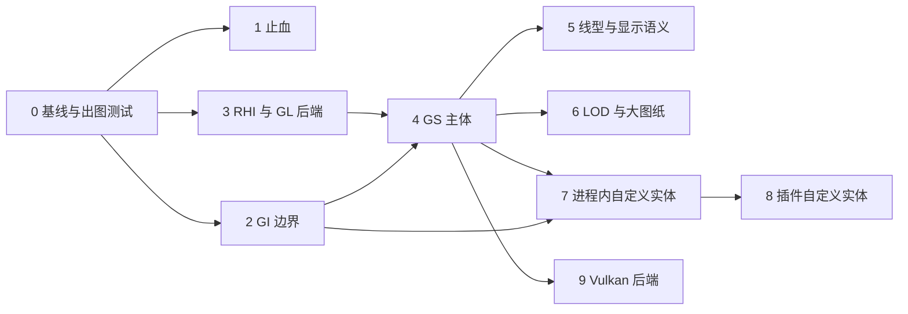

# YiCAD 渲染层重构方案

本文档给出渲染层的重构方案，内容是 `ARCHITECTURE_EVOLUTION_PLAN.md` 开头"范围说明"排除在外的"渲染专项"：
缓存增量化、后端接口化，以及 Vulkan 的引入方式。它同时为自定义实体（包括插件提供的实体）
定下渲染侧的接入契约。

> 本方案于 2026-09-27 提出，文中的行号与数量基于 `09c9768` 实测。引用 `ARCHITECTURE_EVOLUTION_PLAN.md`
> 时写作"演进方案 x.y 节"，引用 `LAYER_RESTRUCTURE_PLAN.md` 时写作"分层方案 x.y 节"。
> 状态：方案阶段，尚未动工。第 7 节已定（均为 2026-09-27）：D1（自建薄 RHI，先只做 OpenGL 实现）、
> D3（构建期 glslang + spirv-cross）、D5（插件实体的数据由宿主保管）、D6（代理图形随图纸存盘）、
> D7（圆弧用片段着色器解析绘制）、D8（渲染侧在本方案内支持任意仿射变换；Model 侧的非等比块参照、炸开与去复制
> 与 AutoCAD/ODA 一致，另立方案，见第 4.10 节）、D9（CI 用 Mesa 软件渲染跑出图测试）、D11（保留多重采样）、
> D10（采用 AutoCAD 的做法：块内虚线不随插入比例变化；开放曲线居中、闭合曲线按 `round` 整周期拉伸，已由对照图确认）、D12（文字用矢量字形）。
> D2（OpenGL 4.3 core）、D4（Vulkan 1.3 + volk + VMA）。全部决策已定。

---

## 1. 目标

### 1.1 需求

| 编号 | 需求 | 来源 |
|------|------|------|
| R1 | 大图纸可用：`BASELINE.md` 的 50 万实体基准图上，移动光标、悬停高亮、点选、框选、平移缩放都不随图纸规模线性变慢 | 性能 |
| R2 | 自定义实体：进程内扩展（`src/extensions/<name>/`）能新增实体类型，渲染层不需要为它改一行代码 | 用户要求 |
| R3 | 插件自定义实体：C ABI 插件 DLL 能新增实体类型；插件没装时，图纸里的这些实体仍能显示 | 用户要求 |
| R4 | 现在用 OpenGL，以后加 Vulkan 后端时不重写渲染层以上的任何代码，也不重写 GS | 用户要求 |
| R5 | 显示语义与 AutoCAD 一致：线型按世界长度、LTSCALE 与实体线型比例、多段线的线型生成（PLINEGEN）、线宽按像素显示、ByLayer/ByBlock、ACI 7 随背景变色、绘图次序 | 兼容性 |
| R6 | 大坐标不抖：测绘坐标（如 CGCS2000 投影坐标 Y≈3,500,000）放大到毫米级仍然稳定 | 正确性 |
| R7 | 可测：渲染结果能在无界面的测试里出图比对，重构每一步都有回归依据 | 工程 |

### 1.2 不做

- 三维（实体、视觉样式、光照）。GI 的接口按二维设计，第 4.2 节说明以后怎么扩。
- 图纸空间、布局与视口。只在设计上预留（多个 `GsView` 共享一个 `GsModel`、每视图的线型比例），不实现。
- 打印与矢量导出。GI 边界建好后，它们是 GI 的另一个消费者（第 4.2.5 节），另行规划。
- GPU 拾取。拾取与捕捉继续走空间索引与精确几何（`SpacialSearchTree`、`Snapper`），不依赖渲染。

---

## 2. 名词：RHI、GI、GS

### 2.1 RHI 是什么

RHI（Rendering Hardware Interface，渲染硬件接口）是夹在"画什么"与具体图形 API（OpenGL、Vulkan、D3D12、Metal）
之间的一层薄接口。它只抽象 GPU 本身的概念：缓冲、纹理、着色器、管线状态、渲染目标、命令录制、同步，
不认识实体、图层、线型。名字来自 Unreal Engine 的 `RHI` 模块；Qt 6 的 `QRhi` 是同类东西。

为什么需要它：OpenGL 是隐式的全局状态机（绑定什么、改什么状态，下一次绘制就用什么）；Vulkan 是显式的
（管线状态预先编译成不可变对象，资源通过描述符集绑定，命令先录制再提交，内存与同步都要自己管）。
如果上层代码直接写成 GL 状态机的样子，换 Vulkan 就等于重写。反过来，如果 RHI 按 Vulkan 的形状设计
（不可变管线对象、显式绑定组、命令列表、帧内资源生命周期），那么：

- GL 实现就是把这些概念映射回 GL 调用，写起来直接；
- Vulkan 实现与接口一一对应，不需要在 GL 语义上打补丁；
- 上层（GS）只面对 RHI，两个后端共用同一份 GS、同一份着色器源码。

本方案自建这层 RHI（D1），先只有 GL 4.3 实现，接口按 Vulkan 1.3 的形状设计（第 4.7 节）。

### 2.2 GI 与 GS

| 名词 | 全称 | 职责 | 在本方案中的位置 |
|------|------|------|------------------|
| GI | Graphics Interface | 实体描述"我由哪些几何组成"所用的抽象接口：一套固定的图元词汇加属性。实体只调用它，不知道谁在接收 | `src/model/graphics/`（纯接口，Model 层） |
| GS | Graphics System | 接收 GI 输出、缓存、增量更新、空间分块、裁剪、LOD、选中高亮状态、叠加层，最后通过 RHI 提交；与后端无关 | `src/render/gs/` |
| RHI | Rendering Hardware Interface | GPU API 抽象 | `src/render/rhi/`，实现在 `src/render/rhi/gl/`，以后加 `src/render/rhi/vulkan/` |
| 代理图形 | Proxy Graphics | 实体"上一次画出来的样子"（它输出过的线、弧、文字等图元），随图纸一起存盘。定义这个实体的程序（插件）不在时，图纸用它显示该实体：看得见，但不能按实体自己的参数编辑 | GI 流的一种用途（第 4.2.3、4.8.3 节） |

### 2.3 常规 CAD 程序怎么做

| 程序 | 做法 |
|------|------|
| AutoCAD（ObjectARX） | 实体实现 `AcDbEntity::subWorldDraw(AcGiWorldDraw*)`，向 `AcGiGeometry`（polyline、circle、circularArc、polygon、shell、text、xline、ray、nurbs、draw(嵌套可绘制对象)……）输出图元，用 `AcGiSubEntityTraits` 设颜色、图层、线型、线型比例、线宽、选择标记；需要随视图变化的部分在 `subViewportDraw` 里画。图形系统 AcGs 负责缓存与显示。自定义实体只实现这两个函数；未加载定义它的 ObjectARX 模块时，实体以代理对象（`AcDbProxyEntity`）出现，用存盘时保存的代理图形（PROXYGRAPHICS）显示 |
| ODA Drawings SDK | 与 AutoCAD 同构：`OdGiDrawable::subWorldDraw` → `OdGiGeometry`；图形系统 `OdGsModel`/`OdGsView`/`OdGsDevice`，每个实体一个 `OdGsEntityNode` 缓存其图元，块定义缓存在 `OdGsBlockNode` 里由所有插入共享；实体修改经 `OdGsModel::onModified` 只作废对应节点；高亮是节点状态；设备层有 OpenGL ES2、DirectX、Metal、Vulkan 等多个实现 |
| BricsCAD | 基于 ODA，结构同上 |
| QCAD / LibreCAD（YiCAD 的前身） | 实体直接向 `RS_Painter` 画（move_to/line_to 风格），块插入复制子实体；没有 GI/GS 分离，也没有增量缓存 |

共同点：**实体只描述几何，不碰图形 API；图形系统按实体缓存、按变化增量更新、块定义共享；选中高亮是状态不是几何；后端可替换。**
YiCAD 现在的结构来自 LibreCAD，第 3 节的问题大多由此而来。

---

## 3. 现状

### 3.1 数据流

```
GuiDocumentView::paintGL()                              每帧（包括每次鼠标移动）
 ├─ 背景层  GLPainter（立即模式，每次 stroke 上传一次顶点）：背景矩形、网格
 ├─ 文档层  DmCachePainter::draw()
 │    └─ 若 m_bIsModefied：cacheAll()
 │         ├─ removeAllCache()                          删除全部 VBO/VAO、图片纹理
 │         ├─ regroup()                                 遍历全部实体，getSubEntities() 展平，按 DmPen 分组
 │         │                                            （普通 / 选中 / 高亮三组）
 │         ├─ cacheEntity()                             switch(getEntityType())，取实体里存好的 GL 顶点
 │         └─ generateGLData()                          重新创建全部 VBO/VAO 并上传
 │    └─ GLCachePainter::stroke()                       按 3 组 × 13 种 CacheType × 画笔 逐个 draw
 ├─ 预览层  DmCachePainter（预览容器，同上，另有模型偏移）
 └─ 前景层  GLPainter：原点标记、选择框、光标、捕捉标记
```

### 3.2 问题清单

| 编号 | 问题 | 位置 | 影响 |
|------|------|------|------|
| P1 | 选择集或高亮集一变就整图重建：删除全部 VBO，遍历全部实体重新分组，全部顶点重新上传 | `UIView.cpp:61-73` 连到 `specifyDocumentModified()`；`DmCachePainter.cpp:99` `cacheAll()`、`:215` `regroup()` | 大图上点选一个实体、命令里鼠标移到候选实体上出现高亮，都是 O(全图) 的 CPU 与上传开销（R1） |
| P2 | 图片实体每次重建都重新创建纹理并从磁盘解码上传 | `DmCachePainter.cpp:449-480`（`glGenTextures` 在 `:467`） | 含图片的图纸，P1 的代价再加上解码与纹理上传 |
| P3 | 每帧重画全部内容，没有场景底图缓存 | `GuiDocumentView.cpp:1288` `paintGL()` | 只移动光标也要把全部 VBO 画一遍（R1） |
| P4 | 模型里存 GL 专用顶点：`(x,y,z,弧长参数,总长)`，并为 `GL_LINE_STRIP_ADJACENCY` 补首尾邻接点；取顶点的函数会就地重算缓存 | `ArcData.h:102`、`DmArc.cpp:842-948`，Circle/Ellipse/Line/LineStrip 同样；`DmCircle.cpp:640` | 模型依赖 GL 图元拓扑与几何着色器的输入格式（R4）；`getVerticesRef()` 修改对象，不能多线程生成 |
| P5 | 实体类型在渲染层写死：`CacheType` 枚举、两处 `switch(getEntityType())`、`useShader()` 的 switch；不认识的类型落到 `default` 被当成点或不画 | `GLCache.h:31`；`DmCachePainter.cpp:291`、`:368`；`GLCachePainter.cpp:729` | 新实体类型无处接入（R2、R3） |
| P6 | 渲染靠 `getSubEntities()` 展平；块参照为每个插入复制块内实体，文字为每个字符复制字形模板 | `DmCachePainter.cpp:253`；`DmBlockReference.cpp:86`、`:185`；`DmChar.cpp:64` | 内存随"插入数 × 块大小"增长，无法实例化绘制；块定义一改，所有插入都要重建 |
| P7 | 顶点与 MVP 都是 float，世界坐标直接进 GPU | `GLCacheUnit.h` `vertexes`；`GLPainterCommon.cpp` 的 `glm::mat4` | 坐标 3.5e6 时 float 精度约 0.25，放大后线条抖动、错位（R6） |
| P8 | 圆弧按固定分段数离散（整圆 120 段），与缩放无关 | `Datamodel.h:40` `CIRCLE_SEGMENT_COUNT` | 大圆放大后看得见折线；小圆缩小时浪费顶点 |
| P9 | 线宽、虚线、射线靠几何着色器；线型参数作为 uniform 数组逐画笔上传（`u_dashes[64]` 等） | `res/shaders/*.shader`（`#version 430`，带 geometry 段）；`common.inl:11` | Vulkan 能用但不推荐、Metal 没有几何着色器；每个画笔一次 uniform 上传与 draw（R4） |
| P10 | 没有视口裁剪，没有 LOD | `GLCachePainter::stroke()` `:431` | 视口外、小于一个像素的实体照样处理 |
| P11 | 后端抽象形同虚设：`Painter` 只有 `stroke()`；`PainterCreator` 返回具体 GL 类型；`render/view/` 的 `DmCachePainter` 直接调 `glGenTextures` | `Painter.h`、`PainterCreator.h`、`DmCachePainter.cpp:467` | 没有可以替换后端的边界（R4） |
| P12 | 颜色与线宽的特判：RGB 全 0 一律画成白色（其实是 ACI 7 的语义，应随背景变）；线宽按 `width * 0.05` 像素、至少 1 像素 | `DmCachePainter.cpp:353`、`:347` | 浅色背景下"黑色"实体看不见；线宽与 AutoCAD 的毫米到像素换算不一致（R5） |
| P13 | 夹点缓存要扫描全部实体找选中的，上限 100 个点 | `DmCachePainter.cpp:524-526` | 大图选中后重建夹点是 O(全图) |
| P14 | 两处潜在缺陷（目前没被调用的 `recache()` 路径上）：lambda 在 `find` 失败时仍 `erase(end())`，是未定义行为；`removeCacheByGroup()` 会删掉所有组的图片纹理 | `GLCachePainter.cpp:122`、`:81-105` | 以后启用部分更新时会出问题 |
| P15 | GL 上下文没指定版本与 profile，只设了 4 重采样；着色器却写 `#version 430` | `GuiDocumentView.cpp:111-113` | 实际最低要求是 GL 4.3，但没检查也没报错；在只给 3.x 兼容上下文的驱动上直接黑屏 |
| P16 | 线型只有简单图案；没有 LTSCALE、实体线型比例、多段线的线型生成 | `DmLineType.h:53` | R5 |
| P17 | 文档变更通知没有粒度：`documentModified()` 不带参数；撤销系统其实知道每个被增删改的对象，但只发粗粒度信号 | `DmDocumentListener.h:40`；`CmdManager.cpp:91` `commit()`、`MacroCmd.h:29` `CmdTypeObjectVector` | 渲染层只能整图重建（R1） |
| P18 | 命令为了显示预览直接改实体可见性，然后要求整图重建 | `ModifyTrimCommand.cpp:86`；`extensions/` 与 `application/` 里共 18 处 `setVisible(`（含修剪命令自己的） | 同 P1；而且实体的持久属性被当成临时显示状态用 |

### 3.3 可以保留的东西

- **按世界长度画虚线的算法**：`line.shader` 等的片段着色器已经按世界弧长（顶点里的 `parameter`、`total_length`）计算虚线，
  短于一个周期的画实线，余量平分到两端。第 4.5 节沿用这一语义，只换实现方式（去掉几何着色器、改用线型表）。
- **预览的模型偏移**：`setPreviewModelOffset()` 让移动类命令拖动时只改变换、不重建预览。第 4.3.9 节把它推广成任意变换。
- **空间索引**：`SpacialSearchTree`（R 树）与 `EntityTable::searchEntities()`。GS 的空间分块另建（第 4.3.5 节），拾取与捕捉继续用它。
- **约束三角剖分**：`ConstrainedDelaunayTriangulation`，GS 用它把填充区域变成三角形。
- **类型系统**：`MetaType`/`TYPESYSTEM_SOURCE` 按类名注册、按类名创建，是自定义实体注册的基础（第 4.8 节）。
- **撤销命令里的对象级信息**：`CmdTypeObjectVector` 已经列出每次提交涉及的对象，是增量更新的现成来源（第 4.3.6 节）。
- **视图边界**：命令与工具只认识 `IDocumentView`、`ISelectionSource`、`IHighlightSource`。GS 替换画布内部实现，这些接口只做小改（第 4.9 节）。

---

## 4. 目标结构

### 4.1 分层与目录

```
src/model/graphics/        GI：IGiDrawable、IGiWorldDraw、IGiGeometry、IGiSubEntityTraits、Gi* 值类型、
                           GI 流（GiStream，可序列化的图元记录）
src/model/entity/...       每个实体实现 worldDraw()；删除 m_vertices/getVerticesRef()
src/model/document/        DmChangeTracker、DmChangeSet（变更集），DmDocumentListener 新增按实体的通知

src/render/rhi/            Rhi* 接口：RhiDevice、RhiBuffer、RhiTexture、RhiPipeline、RhiBindGroup、
                           RhiRenderTarget、RhiCommandList、RhiSurface、RhiCaps
src/render/rhi/gl/         GLRhi*：OpenGL 4.3 core 实现（现有 GLShader/GLVertexArray 等收进来重写）
src/render/rhi/vulkan/     VulkanRhi*：以后加，CMake 选项 YICAD_WITH_VULKAN 控制是否编译
src/render/gs/             Gs*：GsDevice、GsModel、GsNode、GsSharedGeometry、GsCell、GsView、GsPipelines、
                           GsLinetypeTable、GsGlyphCache、GsTessellator、GsTransientModel
src/render/view/           画布 GuiDocumentView（改为持有 GsView），IDocumentView 等接口

src/application/           AppDocument 持有该文档的 GsModel，注入到各视图
```

依赖方向不变（分层方案 2 节）：`model/graphics/` 只依赖 Model 与 Base，不含任何图形 API 类型，
所以"Model 不认识视图"这条规则仍然成立。GI 接口放在 Model 层与 AutoCAD 一致：AcGi 的接口位于 AcDb 之下，
由图形系统实现。

新目录要加进 `YiCAD/CMakeLists.txt` 对应分区的 `yicad_collect_sources` 调用（`src/model/graphics` 进 MODEL，
`src/render/rhi`、`src/render/rhi/gl`、`src/render/gs` 进 RENDER）。新头文件名不得与现有的重名
（`tools/check_layering.py`），这也是 GL 后端叫 `GLRhiDevice.h` 而不叫 `GLDevice.h` 的原因。

新前缀（实施时补进 `AGENTS.md` 的命名约定）：

| 前缀 | 含义 | 例子 |
|------|------|------|
| `IGi*` / `Gi*` | GI 接口 / GI 值类型 | `IGiGeometry`、`GiTransform` |
| `Gs*` | 图形系统 | `GsModel`、`GsView` |
| `Rhi*` | RHI 接口 | `RhiDevice` |
| `GLRhi*` | RHI 的 GL 实现（沿用 `GL*` 前缀） | `GLRhiDevice` |
| `VulkanRhi*` | RHI 的 Vulkan 实现；不用 `Vk*`，免得与 Vulkan 自己的 `VkDevice` 等类型混淆 | `VulkanRhiDevice` |

### 4.2 GI：实体与图形系统的契约

GI 的图元词汇同时是两份契约：对上是实体（含插件实体，第 4.8 节）要用的全部绘图能力，对下是 GS 与各后端要支持的全部图元。
它一旦定下就很难改，所以宁可少而完整，也不做成"什么都能画"。

#### 4.2.1 接口草图

```cpp
/// @brief 可绘制对象。DmEntity 与 DmBlock（块定义）实现它
class IGiDrawable
{
public:
    virtual ~IGiDrawable() = default;
    /// @brief 描述自身几何；必须是 const、确定性的（同样的数据输出同样的图元），且除非 drawableFlags() 声明，
    ///        否则必须可以在工作线程上与其他实体并行调用
    virtual void worldDraw(IGiWorldDraw& wd) const = 0;
    /// @brief 随视图变化的部分；仅当 drawableFlags() 含 GiDrawableFlag::ViewDependent 时调用
    virtual void viewportDraw(IGiViewportDraw& vd) const {}
    virtual GiDrawableFlags drawableFlags() const { return {}; }
};

/// @brief worldDraw 的上下文
class IGiWorldDraw
{
public:
    virtual IGiGeometry& geometry() = 0;
    virtual IGiSubEntityTraits& traits() = 0;
    /// @brief 这次生成的用途：显示、代理图形、范围计算、导出。实体一般不需要区分
    virtual GiRegenType regenType() const = 0;
    /// @brief 实体自行离散曲线时应满足的弦高容差（世界单位）
    virtual double deviation() const = 0;
    /// @brief 是否在拖动预览中；实体可以输出简化图形
    virtual bool isDragging() const = 0;
};

/// @brief 图元属性。每个 worldDraw 开始时由 GS 按实体自身的属性初始化，实体可以逐图元覆盖
class IGiSubEntityTraits
{
public:
    virtual void setColor(const DmColor& color) = 0;          ///< 含 ByLayer、ByBlock、ACI、真彩色
    virtual void setLayer(const DmLayer* layer) = 0;
    virtual void setLineType(const DmLineType* lineType) = 0; ///< 含 ByLayer、ByBlock
    virtual void setLineTypeScale(double scale) = 0;          ///< 实体线型比例
    virtual void setLinePattern(const GiLinePattern& p) = 0;  ///< 填充图案线用：内联图案 + 相位，不做端点对齐；长度在实体自身坐标系里，随块缩放
    virtual void setLineWeight(DM::LineWidth weight) = 0;     ///< 含 ByLayer、ByBlock、默认
    virtual void setTransparency(std::uint8_t alpha) = 0;
    virtual void setSelectionMarker(std::int32_t marker) = 0; ///< 子实体标记，供子实体高亮与夹点
    virtual void setScreenSpace(const DmVector* anchor) = 0;  ///< 非空：后续图元以像素为单位、锚定在该世界点
};

/// @brief 图元词汇。坐标一律 double，处在当前模型变换下（块内实体即块定义坐标系）
class IGiGeometry
{
public:
    virtual void polyline(std::span<const DmVector> pts, std::span<const double> bulges, GiPolylineFlags flags) = 0;
    virtual void circle(const DmVector& center, double radius) = 0;
    virtual void arc(const DmVector& center, double radius, double startAngle, double sweepAngle) = 0;
    virtual void ellipseArc(const DmVector& center, const DmVector& majorAxis, double ratio,
                            double startParam, double endParam) = 0;
    virtual void nurbs(const GiNurbs& curve) = 0;
    virtual void fill(std::span<const GiLoop> loops, GiFillRule rule) = 0;               ///< 由 GS 三角剖分
    virtual void triangles(std::span<const DmVector> vertices, std::span<const std::uint32_t> indices) = 0;
    virtual void glyphRun(const GiGlyphRun& run) = 0;                                    ///< 已排版的字形
    virtual void image(const GiImage& image) = 0;
    virtual void point(const DmVector& pos) = 0;
    virtual void ray(const DmVector& base, const DmVector& dir) = 0;
    virtual void xline(const DmVector& base, const DmVector& dir) = 0;
    /// @brief 画一个共享的可绘制对象（块定义），由 GS 缓存一次、按变换实例化
    virtual void drawShared(const IGiDrawable& drawable, const GiTransform& xf, const GiByBlockTraits& byBlock) = 0;
    virtual void pushTransform(const GiTransform& xf) = 0;
    virtual void popTransform() = 0;
};
```

`GiPolylineFlags` 含 `Closed` 与 `ContinuousLinetype`（即多段线的"线型生成"特性）。`GiGlyphRun` 是字体句柄加一串
`{字符码, 位置, 每字符变换}`：排版（多行文字格式、对齐、宽度因子、倾斜）是实体的事，GS 只认已经排好的字形。

#### 4.2.2 为什么是解析图元而不是折线

圆、圆弧、椭圆弧、NURBS、带凸度的多段线都以解析形式进入 GS，而不是由实体先离散成折线：

- GS 可以用片段着色器按真实圆方程画圆弧（第 4.4 节），任何缩放下都是真圆，不需要按缩放重新离散；
- 圆弧的虚线参数可以用 `r × 角度` 精确算出；
- 数据量小：一个整圆现在要 123 个顶点、每个 5 个 float（约 2.4 KB），解析形式是一条约 32 字节的记录；
- 以后的矢量导出（PDF 的圆弧）、代理图形都保留精确几何。

实体确实需要自己离散时（例如自定义实体的某种特殊曲线），按 `IGiWorldDraw::deviation()` 给出的容差输出折线。

#### 4.2.3 GI 流

GS 用一个记录器实现 `IGiGeometry`，把 worldDraw 的输出写成紧凑的二进制记录流（`GiStream`，double 精度，带版本号）。
GI 流有四个用途：

1. GS 编译 GPU 数据的输入（第 4.3.3 节）；
2. 插件实体的代理图形，随图纸存盘（第 4.8.3 节）；
3. 自定义实体没有实现捕捉、拾取、范围计算时，宿主从 GI 流推导默认实现（第 4.8.4 节）；
4. 单元测试：记录内置实体的 worldDraw 输出，与期望比对（`test_graphics`）。

#### 4.2.4 随视图变化的图形

绝大多数"随视图变化"的需求是"固定像素大小的符号"（标记、箭头、夹点样式的图形）。GI 用
`setScreenSpace(anchor)` 直接表达：后续图元以像素为单位、锚定在世界点，由着色器处理，不需要每视图重新生成。
真正依赖视图的实体（`GiDrawableFlag::ViewDependent`）才走 `viewportDraw`：GS 为它按视图单独缓存，
相机变化超过阈值时重新生成。这条路径开销大，只留给确实需要的实体。

#### 4.2.5 以后的扩展

- 三维：在 `IGiGeometry` 上加 `shell`/`mesh` 等三维图元，坐标类型换成三维；现有二维图元不变。
- 矢量导出与打印：另写一个 `IGiGeometry` 实现，把图元转成 `QPainter`/PDF 路径。
- 插件 ABI 的 GI 表（第 4.8.3 节）是 `IGiGeometry` 的 C 版本，词汇与这里保持一一对应。

### 4.3 GS：图形系统

#### 4.3.1 对象与所有权

| 对象 | 数量 | 持有者 | 内容 |
|------|------|--------|------|
| `GsDevice` | 每个进程一个 | 共享所有权，由第一个视图初始化时建立 | `RhiDevice`、全部管线、字形缓存、图片纹理缓存、线宽表 |
| `GsModel` | 每个文档一个 | `AppDocument`（Application 层能看到 Render）；注册为该文档的 `DmDocumentListener` | 实体节点、共享几何（块、字形）、空间分块、GPU 数据区、对象状态缓冲、图层表、线型表 |
| `GsView` | 每个视图一个 | `GuiDocumentView` | 相机（double）、每视图高亮位图、场景底图、叠加层、临时模型（预览） |
| `GsTransientModel` | 每个视图一个 | `GsView` | 预览容器的图元，小而频繁重建 |

块预览窗 `GuiPreviewWidget` 也改成一个 `GsView`，直接复用 `GsModel` 里已缓存的块几何。

#### 4.3.2 从实体到 GPU 的三级表示

```
DmEntity ──worldDraw──▶ GiStream（double，每节点一份，常驻内存）
                           │ 编译（GsCompiler，按管线分类，坐标减去分块原点后转 float）
                           ▼
                        编译结果（CPU 临时数据，上传后丢弃）
                           │ 上传到分块在 GPU 数据区里的区段
                           ▼
                        GPU 数据区（按管线分类的大缓冲，子分配）
```

- GI 流常驻内存：分块整理、上下文丢失重建、改变 LTSCALE 等情况下，只需重新编译，不需要重新调用 worldDraw
  （插件实体的 worldDraw 在 UI 线程上执行，还可能很慢）。
- 编译结果上传后丢弃：GPU 里已有一份，CPU 再留一份浮点副本没有必要。
- 内存估算：一条直线的 GI 记录约 40 字节，一个圆约 36 字节，一个字符的字形引用约 48 字节，都远小于现在的表示。

#### 4.3.3 共享几何与实例

GS 只有一种绘制单元：**共享几何 + 实例**。

| 场景 | 共享几何 | 实例 |
|------|----------|------|
| 顶层实体 | 一个分块内全部顶层实体编译成的几何（分块原点坐标系） | 一个恒等实例（平移到分块原点） |
| 块参照 | 块定义编译成的几何（块坐标系），全文档只有一份 | 每个插入一个实例：变换、所属顶层对象、ByBlock 属性 |
| 文字 | 每个字形编译成的几何（字形坐标系），全进程只有一份 | 每个字符一个实例：位置、高度、旋转、宽度因子、倾斜合成的仿射变换 |

实例记录（约 40 字节）：2×3 仿射变换（float，相对分块原点）、顶层对象槽位、ByBlock 颜色、ByBlock 线型、ByBlock 线宽、实例线型比例。
嵌套块由 GS 展开成叶子实例，变换与 ByBlock 属性逐层合成。块定义修改时只重编译这份共享几何；
插入的增删改只改实例记录，不碰几何。

**块内的线型不随插入比例缩放**（D10，2026-09-27 由 AutoCAD 截图确认：同一个块按两个比例插入，两个三角形的划线长度相同）。
线型图案始终按世界长度画，块的插入比例只改变几何，不改变划线与空白的长度。现在的实现把块内实体复制到世界坐标再画，
结果也是如此，行为不变。共享几何下要做到这一点：

- 几何里存的弧长参数是块坐标系里的长度，着色器要把它换算成世界长度，A 型对齐需要的总长同样换算；
- **等比插入**（含镜像、旋转）：换算系数就是插入比例的绝对值，每个实例一个常数，放在实例记录里，共享几何不受影响；
- **非等比插入**：同一条线在不同方向上的换算系数不同，块里的圆在世界里是椭圆、弧长没有简单的换算式，多段线（线型生成启用时）
  的累计弧长也要逐段重算。因此非等比插入且块内有非连续线型的内容时，GS 为这个插入单独编译一份世界坐标下的几何
  （圆弧按椭圆离散，弧长参数在 double 下算好），不走共享；块内全是连续线型时仍然共享。
  判断时 ByBlock 线型按该插入的线型解析，ByLayer 线型按图层表解析；图层的线型改变时重新判断受影响的非等比插入（很少见）；
- 填充图案线不是线型：它的划线是填充图案的一部分，在填充自身的坐标系里定义，随块一起缩放（GI 的 `setLinePattern()`，第 4.5.1 节）。

非等比插入在实际图纸里较少，而其中又只有含虚线的才失去共享，所以这条例外对内存与性能的影响很小。

实例变换是完整的 2×3 仿射矩阵，所以 X、Y 比例不同、镜像、以及嵌套块里"旋转 + 外层非等比缩放"合成出来的错切，
渲染侧都直接支持，不需要把圆换成椭圆之类的类型转换（第 4.4 节的圆弧管线说明怎么在仿射下保持真实形状与像素线宽）。

块参照的内存优势要完全兑现，还需要 Model 层不再为每个插入复制子实体（P6）。那涉及捕捉、选择、炸开等大量代码，
不在本方案内，作为后续独立方案（D8，设计要点见第 4.10 节）。本方案完成后，渲染侧已经不再依赖这些复制品。

#### 4.3.4 GPU 数据区

- 每个管线类（第 4.4 节）一组大缓冲：几何缓冲、实例缓冲、间接绘制命令缓冲。按页增长（每页 4 MB 起，翻倍）。
- 子分配用偏移分配器（按区段大小分级的空闲表，O(1) 分配与释放），分配单位是"分块 × 管线类"的区段。
- 分块的区段满了或碎片超过阈值时，整理这一个分块：从 GI 流重新编译并连续写入新区段，旧区段延迟释放。
  整理的开销以分块大小为上限，不会波及整个文档。

#### 4.3.5 空间分块

- 用松散四叉树组织顶层实体与实例：实体按包围框放进能容纳它的最深一层；每个叶子是一个分块，
  图元数超过上限（按管线类计，初定 16k 条记录，基准测试后调整）时分裂，过少时与兄弟合并。
- 每个分块有一个 double 原点（包围框中心）。分块内的坐标减去原点后转 float，每次绘制的模型视图矩阵
  在 CPU 上用 double 计算"视图 × 平移(分块原点)"后再转 float。GPU 只见小数值，任何坐标量级都不丢精度（R6）。
- 构造线、射线等无限长对象不进四叉树，单独一个"总是可见"的列表。
- 裁剪：每帧用视口矩形（外扩一圈）查四叉树得到可见分块，把它们预先生成好的间接绘制命令拼成本帧的命令列表。
  50 万实体大约几百个分块，这一步是微秒级。

#### 4.3.6 增量更新

**Model 侧的变更集**（第 5 节第 4.1 步）：

- `DmDocument` 新增 `DmChangeTracker`。实体表与各符号表在增、删、改（包括 `add_direct` 一类不走命令的路径，
  以及 `EntityTable::startModify()`）时登记对象 ID。
- 在 `CmdManager::commit()`、`undo()`、`redo()` 结束时，以及文件加载完成、新建、关闭时，把累积的变更打包成 `DmChangeSet`：
  增加、删除、修改的实体 ID；修改过的图层、线型、文字样式、标注样式、块定义的 ID；变过的文档变量；
  以及"全部重建"标志（加载、`REGEN` 命令）。
- `DmDocumentListener` 新增 `entitiesChanged(const DmChangeSet&)`。现有的 `documentModified()` 保留给其他监听者（如 `SelectionSet`）。
- `DmObject` 新增单调递增的修订号，在 `startModify()` 与 `update()` 时递增。GS 节点记下生成时的修订号；
  调试构建里 `YICAD_GS_VERIFY=1` 时，每帧抽查可见节点，发现修订号不一致（有人改了实体却没登记）就记日志。
  这是防止"改了实体、画面不变"这类问题长期潜伏的手段。

**GS 侧的处理**：

| 变化 | GS 的动作 | 开销 |
|------|-----------|------|
| 实体增、删、改 | 重新 worldDraw 这些实体，更新 GI 流；标记所在分块需要重编译（包围框跨分块时迁移） | O(变化的实体 + 所在分块) |
| 块定义修改 | 重编译该块的共享几何；依赖它的块（嵌套）同样处理；插入的实例记录不变 | O(块大小) |
| 块参照增删改 | 只改实例记录；非等比插入且块内有虚线内容时，为该插入单独编译几何（第 4.3.3 节） | O(实例)，例外情况 O(块大小) |
| 图层颜色、线型、线宽、开关、冻结 | 只改图层表缓冲里的一项 | O(1) |
| 线型图案修改 | 只改线型表缓冲；超长实体的虚线分段（第 4.5.5 节）惰性重算 | O(1) 到 O(受影响的长实体) |
| 文字样式修改 | 按依赖索引（样式 → 实体）重新 worldDraw 用到它的文字 | O(相关文字) |
| LTSCALE 等文档变量 | 只改每帧常量 | O(1) |
| 选择集变化 | 只改对象状态缓冲里变化的那些槽位（第 4.3.7 节） | O(变化的对象) |
| 高亮集变化 | 只改该视图的高亮位图，场景底图不作废（第 4.3.8 节） | O(变化的对象) |

依赖索引（块 → 引用它的块与插入、文字样式 → 文字、标注样式 → 标注）由 GS 在 worldDraw 时顺带记录：
GI 的 `drawShared()` 与 `glyphRun()` 的字体句柄天然给出依赖。

#### 4.3.7 状态缓冲

几何里不存"选中""高亮""图层颜色"这类会变的东西，而是存索引，着色器运行时查表：

| 缓冲 | 粒度 | 内容 | 谁改 |
|------|------|------|------|
| 对象状态 | 每个顶层对象一个槽位（`DmId` → 槽位，删除后回收），16 字节 | 所在图层索引、绘图次序深度、选中、临时隐藏、淡显（块编辑模式预留）、透明度 | GsModel |
| 高亮位图 | 每视图，每槽位 1 位 | 命令拾取反馈的高亮 | GsView |
| 图层表 | 每个图层 16 字节 | 颜色、线型索引、线宽、开/关、冻结、锁定淡显 | GsModel |
| 线型表 | 每个线型约 64 字节 | 图案元素（最多 12 个，与 AutoCAD 简单线型上限一致）、周期长度、点的位置 | GsModel |
| 线宽表 | 24 个标准线宽 + 默认 | 毫米值；像素换算在着色器里乘每帧常量 | GsDevice |

几何记录里的"样式字"（8 字节）：颜色（类型 2 位 + ACI 索引或 RGB）、线型索引（含 ByLayer/ByBlock 哨兵值）、
线宽索引（含 ByLayer/ByBlock）、标志位。ByLayer 在着色器里查图层表，ByBlock 查实例记录，ACI 7 按背景亮度取黑或白。

全选 50 万实体只是写 50 万个状态字节（约 8 MB 的一次上传），不重建任何几何。

#### 4.3.8 帧流程

```
GsView::render()
 1. GsModel::applyPendingChanges()        处理变更集：worldDraw、编译、上传（可设时间预算）
 2. 场景是否作废？                          作废原因：相机、变更集、选择集、图层表、背景与显示设置、尺寸或 DPR
    是 → 裁剪得到可见分块 → 生成间接命令 → 场景通道：
         网格（全屏程序化着色器）→ 不透明图元（按管线类，多重间接绘制）→ 透明图元（按绘图次序）
         → 画进离屏场景底图（多重采样，结束时解析）
 3. 叠加通道（每帧都画，画进窗口）：
         贴场景底图 → 高亮强调 → 临时模型（预览）→ 夹点 → 捕捉标记 → 光标 → 选择框
```

- **只移动光标**时场景不作废，这一帧的开销是一次全屏贴图加几个叠加图元，与图纸大小无关（R1）。
- **高亮**在叠加通道里重画被高亮对象的区段（加宽、换色，关闭深度测试），场景底图不作废。
  高亮集超过阈值（初定 1000 个对象）时改走对象状态路径，作废场景底图。
- **选中**走对象状态：在场景通道里加宽、换色、深度前移。选择集可能很大，走状态比逐对象再画一遍便宜。
- 平移、缩放期间每帧重画场景；这时的开销是纯 GPU 开销（没有 CPU 重建），由 LOD（第 4.3.10 节）控制。

#### 4.3.9 预览与临时图形

- 预览容器里的实体由 `GsTransientModel` 用同一套 worldDraw 与编译流程生成，只是不分块、不留 GI 流，每次预览变化全部重建（预览一般很小）。
- `setPreviewModelOffset()` 推广成 `setPreviewTransform()`：移动、复制、旋转、缩放命令拖动时，预览几何只生成一次，拖动只改变换。
- 命令为了显示预览而临时隐藏实体（P18，如修剪时隐藏光标下的实体），改为视图上的"临时隐藏集"，与 `HighlightSet` 同样的设计：
  归 Application 层、每视图一份、命令结束时清空，画布通过接口读取。GS 用对象状态里的"临时隐藏"位实现，不再改实体的可见性。
- 前景层的原点标记、选择框、光标、捕捉标记改用每帧的动态批次（环形缓冲），不再每个图元一次上传。

#### 4.3.10 LOD

LOD 判定尽量放在着色器里做（按每帧常量"世界单位/像素"与记录里的尺寸），不需要 CPU 逐对象判断：

| 情况 | 处理 |
|------|------|
| 文字高度小于约 2 像素 | 顶点着色器折叠字形实例，改画一条沿基线的细长矩形（思路同 AutoCAD 的 QTEXT：它把文字画成矩形框） |
| 填充图案的线距小于约 2 像素 | 折叠图案线实例，改画按平均覆盖率着色的实心填充（填充三角形始终在，平时被折叠） |
| 对象包围框小于 1 像素 | 折叠为一个点，或不画 |
| 虚线周期小于约 2 像素 | 画实线（第 4.5.4 节） |
| 圆弧屏幕半径很小 | 减少覆盖带的分段数（第 4.4 节） |

样条与椭圆在编译时按"包围框尺寸 × 相对容差"离散；缩放到屏幕弦高超过半个像素时，只为可见的这类节点异步重新离散
（先用旧结果画，好了再换）。如果基准测试表明 50 万实体在平移时仍然掉帧，再加按帧时间预算的渐进绘制（先画粗的，空闲时补细节）。

#### 4.3.11 并行与线程

- worldDraw 与编译在线程池上并行（打开 50 万实体的图纸时最明显），GPU 上传在渲染线程（GL 下即 UI 线程）。
- 前提：内置实体的 worldDraw 是 const 且线程安全的。P4 的 `getVerticesRef()` 就地重算缓存，在第 2 步随顶点缓存一起删除。
- 字体：`DmFont` 的 FreeType 句柄不是线程安全的；字形几何缓存按 (字体, 字符码) 建，首次生成时加锁，之后只读。
- 插件实体的 worldDraw 默认在 UI 线程执行（插件 ABI 的现有规则），除非插件声明线程安全（第 4.8.3 节）。

#### 4.3.12 GPU 资源丢失

Windows 的驱动超时恢复（TDR）会让 GL 上下文或 Vulkan 设备丢失。GS 的全部 GPU 数据都能从 GI 流重新编译出来，
所以处理方式统一为：丢弃全部 RHI 对象，重建设备，按分块重新编译上传。`QOpenGLWidget` 的上下文销毁信号
（`QOpenGLContext::aboutToBeDestroyed`）与 Vulkan 的 `VK_ERROR_DEVICE_LOST` 都接到这条路径上。

### 4.4 绘制管线

不再用几何着色器。所有线都在顶点着色器里扩展成屏幕空间的四边形，由片段着色器做抗锯齿、线宽、端点与虚线。
这样 GL 与 Vulkan 的光栅化结果一致（不依赖各家对原生线段的光栅化规则与宽线支持），也为以后的 Metal（MoltenVK）留路。

| 管线类 | 图元 | 做法 |
|--------|------|------|
| 线段 | 直线、多段线的直线段、离散后的样条与椭圆、SHX 字形笔画 | 点缓冲按两个顶点绑定（偏移 0 与偏移 1 个点，步进为 1 实例），每个实例就是相邻两点连成的线段，共享点不重复存储；实例是折线末点时在顶点着色器里折叠。四边形按像素线宽外扩 + 1 像素抗锯齿边，端点与连接为圆头（片段着色器按距离计算） |
| 圆弧 | 圆、圆弧、多段线的凸度段 | 每个实例一条记录（圆心、半径、起始角、扫角、弧长参数起点、样式字、槽位）。顶点着色器生成覆盖圆弧的环带多边形（固定 8 段，外半径按 `r / cos(θ/2)` 保守外扩，再沿法向外扩线宽加抗锯齿边），片段着色器按到圆心的距离与角度判断是否在弧上，任何缩放下都是真圆；弧长参数 `r × (角度 − 起始角)` 精确。见下方"仿射变换下的圆弧" |
| 填充 | 实心填充、SOLID、TRACE、带宽度的多段线、TrueType 字形、区域 | 编译时三角剖分（CDT）；顶点可带弧长参数，使带宽度的虚线多段线也能画虚线 |
| 图片 | 光栅图像 | 纹理四边形；纹理按图片来源（路径 + 修改时间或内容哈希）在 `GsDevice` 里缓存、全进程共享；生成 mipmap；超过最大纹理尺寸时切片 |
| 点 | 点实体 | 屏幕空间精灵，按点样式（PDMODE/PDSIZE，预留）画符号 |
| 无限线 | 射线、构造线 | 顶点着色器用每帧常量里的视口矩形算出可见线段，然后走线段管线的扩展逻辑 |
| 叠加 | 网格、夹点、捕捉标记、光标、选择框、场景底图贴图 | 网格为全屏三角形 + 片段着色器按世界坐标画网格线；其余为动态批次 |

每个管线类有不透明与透明两个变体。高亮强调复用同一套管线，只换一组常量。

**仿射变换下的圆弧**（D7）：块参照 X、Y 比例不同时，块里的圆在屏幕上是椭圆。圆弧管线不把它转成椭圆，而是：

- 覆盖带在块坐标系里生成，每个带顶点沿法向外扩的量按"该法向经实例变换与视图变换后在屏幕上的长度"换算，
  所以外扩在屏幕上始终是线宽的一半加 1 像素，不随方向变化；
- 片段着色器把像素位置换回块坐标系，算圆方程 `f = |p − c| − r`，再除以 `f` 的屏幕空间梯度长度（由 `dFdx`/`dFdy` 得到），
  得到到那个椭圆的屏幕像素距离的一阶近似。线宽相对曲率半径很小时（CAD 的常态）这个近似的误差远小于一个像素；
- 虚线不随插入比例变化（第 4.3.3 节）：等比插入时弧长参数乘实例记录里的比例换算成世界长度；非等比插入且带虚线的内容
  由 GS 单独编译成世界坐标下的几何，不进这条管线的仿射路径。所以仿射路径上的圆弧只需要处理连续线型。

这样一个块定义只编译一份几何，等比插入、镜像插入、以及只含连续线型内容的非等比插入共用它。

**绘图次序**：对象状态里的"绘图次序深度"在顶点着色器里写入 z，开启深度测试，所以绘图次序与提交顺序、分块、管线类都无关。
默认次序是创建顺序；以后实现 DRAWORDER、TEXTTOFRONT、HPDRAWORDER 时只改状态缓冲。
透明图元在不透明图元之后按次序排序绘制（可见的透明对象一般很少）。

### 4.5 线型

#### 4.5.1 AutoCAD 的语义

AutoCAD 的简单线型在 `.lin` 文件里按图形单位（世界长度）定义：正数是划线，负数是空白，0 是点；
所以放大时划线在屏幕上变长，缩小时变短。现在的着色器已经是这个语义（第 3.3 节），本方案保留它，补齐以下内容：

- **比例链**：屏幕上的划线长度 = 图案长度 × 实体线型比例 × LTSCALE ÷ 每像素世界长度。块的插入比例不在链上：
  块内虚线不随插入比例变化（第 4.3.3 节）。块参照自身的线型比例对块内 ByBlock 线型内容怎么起作用，实施时与 AutoCAD 核对。
  以后有图纸空间视口时再乘每视图的系数（PSLTSCALE）。LTSCALE 与视图系数是每帧常量，改了不需要重建任何几何。
- **A 型对齐**：`.lin` 文件里每个线型的图案行以对齐字段开头，例如 `A,.5,-.25` 表示"划线 0.5、空白 0.25"，
  开头的 `A` 就是对齐方式（AutoCAD 只有这一种）。它要解决的问题是：图案从起点机械地重复下去，终点可能落在空白里。
  以这个图案（周期 0.75）画一条长 1.4 的线：

  ```
  机械重复：  划线 0~0.5 | 空白 0.5~0.75 | 划线 0.75~1.25 | 空白 1.25~1.4      ← 终点落在空白里，端点"看不见"
  ```

  A 型对齐保证直线和圆弧以划线开始、以划线结束，办法是调整两端的划线长度。YiCAD 现在的做法（`line.shader` 片段着色器）
  是把图案居中：从第一段划线的中点起算图案，"整数个周期之外的余量"平分到两端，并入两端的划线。同一条线画出来是：

  ```
  现在的做法：划线 0~0.575 | 空白 0.575~0.825 | 划线 0.825~1.4                  ← 两端都是划线，且两端等长
  ```

  2026-09-27 的 AutoCAD 对照图确认（数据见第 7 节 D10 说明），**开放曲线**（直线、圆弧、多段线的每一段）用的正是这个居中规则。
  写成公式：周期 `P`、曲线长 `L`，取 `n = floor(L/P)` 个完整周期，余量 `r = L − nP`；图案以第一段划线的中点对准起点，
  两端的划线各长 `第一段划线/2 + r/2`，中间的划线与空白保持定义长度。圆弧的 `L` 是弧长。
- **闭合曲线**（圆、整椭圆）：不用居中规则，而是**整周期拉伸**：周期数 `n = round(L/P)`（至少为 1），图案按 `L/(nP)` 整体等比伸缩，
  使周长正好是 `n` 个周期；第一段划线从曲线的起点开始（圆为 0°，椭圆为长轴正端，按弧长均分，逆时针），接缝处没有半段划线。
  对照图：半径 1 的圆（8.38 个周期）画成 8 个周期，半径 1.15 的圆（9.63 个周期）画成 10 个，所以取整是 `round` 不是 `floor`；
  长短半轴 1 与 0.5 的椭圆（6.46 个周期）画成 6 个。YiCAD 现在的闭合曲线着色器（`line_strip_closed.shader`）取 `ceil(L/P)`，
  半径 1 的圆会画成 9 个压缩的周期，要改。闭合样条暂按同样的整周期规则处理，发现问题再改。
  着色器里的对齐规则按记录选择模式（开放曲线居中、闭合曲线整周期），不写死。
- **太短**：沿用 YiCAD 现在 `line.shader` 的做法：开放曲线短于一个完整周期时，图案里有划线的画实线，只有点的图案（如 DOT）只在两个端点各画一个点。
  含点图案（DOT、DASHDOT）与 AutoCAD 的截图有出入，原因没有追查，发现问题再改（第 7 节 D10 说明）。
- **多段线**：由多段线自己的"线型生成"特性决定（AutoCAD 里在特性面板里是"线型生成：启用/禁用"，PEDIT 的"线型生成"选项可切换；
  系统变量 PLINEGEN 取 0 或 1，只决定新画的多段线的默认值）。禁用时（默认）每段单独按居中规则处理，闭合多段线也是如此，
  对照图里闭合四边形的四段分别居中，已确认；启用时整条多段线连续计算弧长、在顶点处不重新对齐。
  GI 用 `GiPolylineFlags::ContinuousLinetype` 表达，编译时决定每段的弧长参数起点。
- **填充图案线**：`.pat` 里的虚线相位锚定在图案原点，不做 A 型对齐。GI 用 `setLinePattern()` 传内联图案与相位。
  它是填充几何的一部分，长度在填充自身的坐标系里，所以块被缩放时随之缩放，这一点与线型相反。
- **点**：图案里的 0 画成直径等于线宽（至少 1 像素）的圆点，在片段着色器里按到点位置的像素距离计算。

#### 4.5.2 Model 侧要补的属性

| 属性 | 放在哪里 | 说明 |
|------|----------|------|
| LTSCALE | 文档变量 | 全局线型比例，默认 1 |
| 实体线型比例 | `DmEntity`（与颜色、线型、线宽同级的实体属性） | 默认 1；新建实体取当前值（CELTSCALE） |
| 线型生成 | `DmPolyline` 的标志（DXF 里 LWPOLYLINE 组码 70 的第 128 位） | 默认禁用；新建多段线取文档变量 PLINEGEN 的值 |

YiCAD 尚未发布，原生格式直接加字段，不需要兼容旧文件。

#### 4.5.3 着色器里的实现

- 线段与圆弧记录带"弧长参数起点"，片段着色器插值得到当前像素处的弧长 `s`；
- 相位 `φ = s − P·floor(s/P)`，`P` 是周期长度乘以比例链；
- 在线型表里按 `φ` 查所在元素（最多 12 个，线性查找即可）；
- 划线两端用 `fwidth(s)` 换算成像素做抗锯齿；点按像素距离画圆。

#### 4.5.4 过密画实线

`P` 在屏幕上小于约 2 像素时画实线，避免摩尔纹和缩放时的闪烁。这在片段着色器里用 `fwidth(s)` 逐像素判断，
同一条线的不同位置、不同缩放都自然过渡，不需要 CPU 参与。

#### 4.5.5 长实体的精度

弧长参数以 float 存储，`s/P` 超过约 2^14（一万六千个周期）后相位误差会变得可见。编译时对超长的虚线实体
（在 double 下计算）每约 8000 个周期插入一个"分段"，新分段的参数从 0 开始、并携带一个用 double 算好的起始相位。
分段位置依赖周期长度，所以 LTSCALE、实体线型比例、线型图案改变时，只为这些超长实体惰性重算（很少见）。

#### 4.5.6 复杂线型

带文字或形（SHX 形）的复杂线型现在不支持（`DmLineType` 只有 `std::vector<double>` 图案）。以后支持时，
嵌入的文字与形由 GS 编译阶段在 CPU 上沿路径生成字形实例，空白段仍由着色器处理。因为线型按世界长度定义，
这些生成结果与缩放无关，可以和其他几何一样缓存，只在比例链的非视图部分变化时重算。

### 4.6 线宽、颜色、透明度

- **线宽**：模型空间里线宽按像素显示，不随缩放变化（AutoCAD 的 LWDISPLAY 行为）。像素宽度 = 毫米值 × 显示比例设置 × DPR；
  0 与"默认"映射到 1 像素。显示比例作为设置项（对应 AutoCAD 线宽设置里的"调整显示比例"）。关闭线宽显示时全部按 1 像素画。
- **颜色**：ACI 7 在深色背景下画白、在浅色背景下画黑，取代 P12 的"RGB 全 0 画白色"特判。
  RGB 真彩色原样使用；ByLayer、ByBlock 按第 4.3.7 节查表。
- **高 DPI**：线宽、夹点、捕捉标记、LOD 阈值等所有以像素计的量都乘设备像素比。
- **透明度**：对象状态与图层表各有一个透明度，着色器相乘。

### 4.7 RHI

#### 4.7.1 原则

1. **按 Vulkan 1.3 的形状设计**：管线状态对象不可变且预先创建；资源通过固定的绑定组布局绑定；命令录制进命令列表；
   资源的释放延迟到使用它的帧结束之后。
2. **只抽象 GS 用得到的东西**：没有通用渲染图，没有材质系统，没有计算着色器接口（需要时再加）。
3. **能力显式查询**：`RhiCaps` 列出最大缓冲尺寸、采样数、各着色器阶段可用的存储缓冲数等，GS 按能力选路径，不靠猜。
4. **单线程录制**：GL 本来就单线程；Vulkan 以后若要多线程录制，再加每线程命令池，接口不变。

#### 4.7.2 接口草图

```cpp
/// @brief GPU 设备。GL 下对应一组共享的上下文；Vulkan 下对应 VkDevice
class RhiDevice
{
public:
    virtual ~RhiDevice() = default;
    virtual const RhiCaps& caps() const = 0;
    virtual RhiBufferPtr createBuffer(const RhiBufferDesc& desc) = 0;         ///< 用途：顶点、索引、常量、存储、纹素、间接
    virtual RhiTexturePtr createTexture(const RhiTextureDesc& desc) = 0;
    virtual RhiSamplerPtr createSampler(const RhiSamplerDesc& desc) = 0;
    virtual RhiShaderPtr createShader(const RhiShaderDesc& desc) = 0;         ///< 输入为构建期生成的各后端着色器
    virtual RhiPipelinePtr createPipeline(const RhiPipelineDesc& desc) = 0;   ///< 着色器、顶点布局、拓扑、混合、深度、光栅化、采样数、目标格式
    virtual RhiBindGroupPtr createBindGroup(const RhiBindGroupDesc& desc) = 0;
    virtual RhiRenderTargetPtr createRenderTarget(const RhiRenderTargetDesc& desc) = 0;
    /// @brief 经暂存环形缓冲把数据写入缓冲；在下一次 beginFrame 录制的命令之前生效
    virtual void upload(RhiBuffer& dst, std::size_t offset, std::span<const std::byte> data) = 0;
    virtual void upload(RhiTexture& dst, const RhiTextureRegion& region, std::span<const std::byte> data) = 0;
    virtual RhiCommandList& beginFrame(RhiSurface& surface) = 0;
    virtual void endFrame() = 0;                          ///< 提交、呈现、推进延迟释放队列
    /// @brief 把 GL 风格的投影变换到本后端裁剪空间（Vulkan 的 y 向下、深度 0..1）
    virtual const glm::mat4& clipSpaceCorrection() const = 0;
};

class RhiCommandList
{
public:
    virtual void beginRenderPass(const RhiRenderPassDesc& desc) = 0;          ///< 目标、清除值、加载与存储动作、多重采样解析目标
    virtual void endRenderPass() = 0;
    virtual void setPipeline(const RhiPipeline& pipeline) = 0;
    virtual void setBindGroup(std::uint32_t index, const RhiBindGroup& group, std::span<const std::uint32_t> dynamicOffsets = {}) = 0;
    virtual void setVertexBuffers(std::uint32_t first, std::span<const RhiVertexBufferBinding> bindings) = 0;
    virtual void setIndexBuffer(const RhiBuffer& buffer, std::size_t offset, RhiIndexFormat format) = 0;
    virtual void setViewport(const RhiViewport& vp) = 0;
    virtual void setScissor(const RhiRect& rect) = 0;
    virtual void draw(std::uint32_t vertexCount, std::uint32_t instanceCount, std::uint32_t firstVertex, std::uint32_t firstInstance) = 0;
    virtual void drawIndexed(std::uint32_t indexCount, std::uint32_t instanceCount, std::uint32_t firstIndex,
                             std::int32_t vertexOffset, std::uint32_t firstInstance) = 0;
    virtual void drawIndirect(const RhiBuffer& args, std::size_t offset, std::uint32_t drawCount, std::uint32_t stride) = 0;
    virtual void drawIndexedIndirect(const RhiBuffer& args, std::size_t offset, std::uint32_t drawCount, std::uint32_t stride) = 0;
    virtual void copyTextureToBuffer(const RhiTexture& src, const RhiBuffer& dst) = 0;   ///< 测试出图用
};
```

资源对象用引用计数句柄（`Rhi*Ptr`），最后一个引用释放时进入设备的延迟释放队列，等使用过它的帧完成后才真正销毁。

**绑定组约定**（着色器与两个后端共用）：

| 组 | 内容 | 更新频率 |
|----|------|----------|
| 0 | 每帧常量（视图投影、每像素世界长度、视口矩形、背景色、LTSCALE、线宽显示比例） | 每帧 |
| 1 | 表：对象状态（纹素缓冲）、图层表、线型表、线宽表、高亮位图 | 变化时 |
| 2 | 每次绘制的数据：分块的模型视图矩阵等，按绘制序号索引 | 每帧 |
| 3 | 纹理：图片 | 每次绘制 |

#### 4.7.3 GL 4.3 实现要点

现在的着色器已经要求 GL 4.3（`#version 430`），所以最低版本定为 4.3 core profile（D2），并在创建上下文时显式请求、
失败时给出明确的提示，而不是黑屏（P15）。要点：

| 问题 | 处理 |
|------|------|
| 实例序号：GL 的 `gl_InstanceID` 不含 `baseInstance`（要 4.6 或 `ARB_shader_draw_parameters`），Vulkan 的 `gl_InstanceIndex` 含 `firstInstance` | 着色器不用内建实例序号取记录，而用步进为 1 的实例属性：属性读取在两边都遵守 `baseInstance`/`firstInstance`，同一份着色器两边结果一致 |
| 顶点着色器里的存储缓冲：GL 4.3 只保证片段与计算着色器可用（顶点阶段的最低要求是 0） | 顶点阶段只用顶点属性、常量缓冲与纹素缓冲（GL 3.1 起的 TBO，Vulkan 的 uniform texel buffer）；存储缓冲只在片段着色器里用 |
| 没有推送常量 | 每次绘制的数据放在组 2 的缓冲里，按绘制序号（同样经实例属性传入）索引，不做逐次绘制的常量更新 |
| 裁剪空间：GL 的 y 向上、深度 -1..1 | 投影矩阵乘 `clipSpaceCorrection()`；读回图像时按后端翻转 |
| 容器对象（VAO、FBO）不能跨上下文共享 | 启用 `Qt::AA_ShareOpenGLContexts`（在 `Main.cpp` 创建 `QApplication` 之前设置）共享缓冲、纹理、程序；VAO、FBO 按 (上下文, 管线, 绑定) 在每个上下文里惰性创建并缓存 |
| 缓冲更新 | 有 `ARB_buffer_storage`（Windows 上的 4.3 驱动普遍提供）时用持久映射的环形缓冲，否则用 `glMapBufferRange` 的非同步映射；两者都用 `glFenceSync` 保证不覆盖 GPU 还在读的区域 |
| `QOpenGLWidget` 画在自己的 FBO 里 | 设备的"交换链图像"就是 `defaultFramebufferObject()` |
| 调试 | 调试构建开启 `KHR_debug`，把驱动报错接到 `YICAD_LOG(render, ...)` |
| GLEW 与 core profile | 初始化前设 `glewExperimental = GL_TRUE`，否则 core profile 下取不到部分函数 |

#### 4.7.4 着色器工具链（D3-A）

着色器代码由我们自己写，只写一份；各后端需要的形式由构建期工具生成：

- 源码写成 GLSL 450（Vulkan 方言），放在 `YiCAD/res/shaders/src/`，现有 `.shader` 文件的 `#shader include "common.inl"` 改用 GLSL 标准的
  `#include`（glslang 的 `GL_GOOGLE_include_directive` 扩展支持）。
- 构建期：`glslangValidator` 把每个阶段编译成 SPIR-V（语法与类型错误在构建时就报出来）；`spirv-cross` 从 SPIR-V 生成 GLSL 430 给 GL 后端，
  并按第 4.7.2 节的约定把 (组, 绑定) 重映射成 GL 的平铺绑定点。第 9 阶段的 Vulkan 后端直接加载 SPIR-V。
- 反射检查：`spirv-cross --reflect` 输出每个着色器的绑定布局（JSON），构建期脚本（放在 `tools/`）对照 RHI 管线描述里声明的绑定检查，
  不一致就让构建失败。
- `cmake --install` 把 SPIR-V 与生成的 GLSL 430 装到 `resources/shaders/`（与现在的加载位置一致）。
- 依赖：glslang 与 spirv-cross 都在 ConanCenter，作为构建期工具（`tool_requires`）引入，不进运行时包。按 `AGENTS.md`，
  版本要同步写进 `conanfile.py`、`conan.lock`、`README.md` 与 CI；二者的许可证（glslang 为 BSD-3-Clause 等宽松许可的组合，
  spirv-cross 为 Apache-2.0）在引入时核对并在 PR 里说明。因为它们只在构建期运行、不随产品分发，是否需要把许可证文本放进 `licenses/` 届时一并确认。

#### 4.7.5 Vulkan 实现要点（第 9 阶段）

- 最低 Vulkan 1.3：动态渲染（不需要 render pass 对象）、synchronization2（D4）。不支持 1.3 的显卡留在 GL。
- 函数加载用 volk（不在链接期依赖 `vulkan-1.dll`，没有 Vulkan 运行时的机器也能启动）；内存用 VMA；管线缓存存盘加快启动。
- 每帧 2 个在途帧；上传走同一队列的传输命令；延迟释放按帧序号。
- 调试构建开启验证层。
- 设备丢失走第 4.3.12 节的统一路径。
- 不依赖宽线、几何着色器等可选特性。

#### 4.7.6 视图宿主

GL 下画布继续是 `QOpenGLWidget`。Vulkan 需要一个 `QWindow`（`VulkanSurface` 类型）经 `QWidget::createWindowContainer` 嵌入。
第 9 阶段把 `GuiDocumentView` 拆成"画布宿主"（普通 `QWidget`，负责事件与 `IDocumentView`）加"后端表面"（GL 用
`QOpenGLWidget`，Vulkan 用窗口容器）两部分。窗口容器有焦点、叠放层次、输入法方面的已知问题，要逐一验证：
捕捉提示 `QLabel`（它是 `Qt::ToolTip` 窗口，不受影响）、坐标输入框、右键菜单、滚轮与键盘焦点。

### 4.8 自定义实体

#### 4.8.1 渲染侧的前提

完成第 2 步后，渲染层不再按实体类型分支：任何实体只要实现 `worldDraw()`，GS 就能缓存、裁剪、增量更新、选中、高亮它。
`DM::EntityType` 增加一个 `EntityCustom`，现有按类型 switch 的代码（捕捉、选择、属性面板等）对它走虚函数，
具体类型靠 `MetaType` 区分。

#### 4.8.2 进程内扩展

扩展在 `src/extensions/<name>/` 里派生 `DmEntity`，通过 `IExtensionContext::registerEntityClass()` 注册：

- 类名以扩展 ID 加点开头（`AGENTS.md` 的注册规则），如 `ext.pipe.PipeSegment`；
- 注册 `MetaType` 工厂与序列化版本，原生格式按类名存取；
- 属性面板沿用 `IExtensionContext::registerPropertyEditor()`；
- 必须实现：`worldDraw()`、包围框、`move/rotate/scale/mirror`、`clone`、序列化；
- 可选实现：夹点、捕捉点、到点的距离、炸开。没实现的由宿主从 GI 流推导（第 4.8.4 节）。

进程内扩展与宿主同编译器、同版本构建，可以直接用 C++ 接口。

#### 4.8.3 插件（C ABI）

插件跨 DLL 只能传 C 函数、POD 与不透明句柄（`PLUGIN_SYSTEM_ARCHITECTURE.md` 3.3 节）。

**实体的数据放在哪里（D5）**。以一个插件提供的"管道"实体为例，它的数据是一串折点和管径。有两种放法：

| | 做法 A：数据归宿主（建议） | 做法 B：对象归插件 |
|---|---|---|
| 数据在哪 | 宿主替每个管道保存一段字节（插件自己决定怎么编码折点和管径），宿主看不懂内容，只负责保管 | 插件在自己的 DLL 里 `new` 一个管道对象，宿主只拿到一个指针 |
| 画图 | 宿主调插件的 `worldDraw(字节)`，插件解码后画 | 宿主调插件的 `worldDraw(指针)` |
| 移动管道 | 宿主调 `transform(旧字节, 矩阵)`，插件返回新字节，宿主替换 | 宿主调 `transform(指针, 矩阵)`，插件就地修改对象 |
| 撤销、重做 | 宿主保存改动前后的字节，撤销就是换回旧字节，插件不参与 | 宿主要请插件克隆对象、保存状态、恢复状态，插件每一步都得配合正确 |
| 存盘、读盘 | 宿主直接把字节写进文件、读出来 | 宿主要请插件序列化、反序列化 |
| 插件没装时打开图纸 | 字节原样保留，再存盘也不丢；配合代理图形还能看见 | 没有插件就创建不出对象，数据只能另想办法原样保留 |
| 内存与崩溃风险 | 不跨 DLL 分配和释放内存 | 对象在插件里分配、在宿主里持有，生命周期和释放时机容易出错 |
| 性能 | 每次调用都要解码字节；插件可以登记"实例缓存"避免反复解码 | 不需要解码 |

采用做法 A（D5，已定），下面按它展开。宿主用一个通用类 `DmPluginEntity` 表示所有插件实体，它持有：类句柄、一段不透明的字节数据
（插件自己定义的编码）、GI 流（兼作代理图形）、包围框。插件提供的是一组纯函数，输入都是这段字节数据：

- 撤销与重做就是复制字节数据，不涉及插件对象的生命周期；
- 存盘写入"类名 + 类版本 + 字节数据 + 代理图形"，读盘不需要插件在场；
- 不存在跨 DLL 的内存分配与释放；
- 插件如需避免反复解码，可以注册"实例缓存"的创建与销毁回调，宿主为每个实体保存一个不透明指针，字节数据变化时作废。

ABI 草图（命名沿用 `YiCadPluginAbi.h` 的风格；ABI 严格单版本，所以这是 v4，仓库里的 `demo_plugin`、`dxf_plugin` 同步升级）：

```c
typedef void* YiCadGiContextHandle;
typedef struct YiCadByteView { const uint8_t* data; size_t size; } YiCadByteView;
typedef struct YiCadByteSink YiCadByteSink;   /* 宿主提供的输出缓冲，插件经回调写入 */

/* 宿主提供：GI 的 C 版本，与 IGiGeometry、IGiSubEntityTraits 一一对应，坐标一律 double */
typedef struct YiCadGiApiV4
{
    uint32_t structSize;
    uint32_t abiVersion;
    YiCadResult (YICAD_PLUGIN_CALL* setColor)(YiCadGiContextHandle ctx, const YiCadColorData* color);
    YiCadResult (YICAD_PLUGIN_CALL* setLineType)(YiCadGiContextHandle ctx, YiCadReadResourceHandle lineType);
    YiCadResult (YICAD_PLUGIN_CALL* setLineTypeScale)(YiCadGiContextHandle ctx, double scale);
    YiCadResult (YICAD_PLUGIN_CALL* setLineWeight)(YiCadGiContextHandle ctx, int32_t weight);
    YiCadResult (YICAD_PLUGIN_CALL* setSelectionMarker)(YiCadGiContextHandle ctx, int32_t marker);
    YiCadResult (YICAD_PLUGIN_CALL* polyline)(YiCadGiContextHandle ctx, const YiCadPoint2dArrayView* pts,
                                              const YiCadDoubleArrayView* bulges, uint32_t flags);
    YiCadResult (YICAD_PLUGIN_CALL* circle)(YiCadGiContextHandle ctx, YiCadPoint2d center, double radius);
    YiCadResult (YICAD_PLUGIN_CALL* arc)(YiCadGiContextHandle ctx, YiCadPoint2d center, double radius,
                                         double startAngle, double sweepAngle);
    YiCadResult (YICAD_PLUGIN_CALL* fill)(YiCadGiContextHandle ctx, const YiCadPoint2dArrayView* loops,
                                          uint32_t loopCount, uint32_t fillRule);
    YiCadResult (YICAD_PLUGIN_CALL* text)(YiCadGiContextHandle ctx, YiCadStringView utf8,
                                          YiCadReadResourceHandle textStyle, const YiCadTextPlacement* placement);
    YiCadResult (YICAD_PLUGIN_CALL* drawBlock)(YiCadGiContextHandle ctx, YiCadReadResourceHandle block,
                                               const YiCadMatrix2d* transform);
    YiCadResult (YICAD_PLUGIN_CALL* pushTransform)(YiCadGiContextHandle ctx, const YiCadMatrix2d* transform);
    YiCadResult (YICAD_PLUGIN_CALL* popTransform)(YiCadGiContextHandle ctx);
    /* ellipseArc、nurbs、triangles、image、point、ray、xline、setScreenSpace …… 同理 */
} YiCadGiApiV4;

/* 插件提供：一个实体类 */
typedef struct YiCadEntityClassV4
{
    uint32_t structSize;
    uint32_t abiVersion;
    YiCadStringView className;        /* "pluginId.ClassName" */
    uint32_t classVersion;            /* 数据编码版本，读盘时低于它则调用 upgrade */
    uint32_t flags;                   /* 代理权限（可删除、可变换、可复制）、worldDraw 线程安全 */
    void* userData;
    YiCadResult (YICAD_PLUGIN_CALL* worldDraw)(void* userData, YiCadByteView data,
                                               const YiCadGiApiV4* gi, YiCadGiContextHandle ctx);
    YiCadResult (YICAD_PLUGIN_CALL* getExtents)(void* userData, YiCadByteView data, YiCadExtents2d* out);
    YiCadResult (YICAD_PLUGIN_CALL* transform)(void* userData, YiCadByteView data,
                                               const YiCadMatrix2d* m, YiCadByteSink* out);
    /* 以下可为空，为空时宿主按 GI 流推导或禁止相应操作 */
    YiCadResult (YICAD_PLUGIN_CALL* getGrips)(void* userData, YiCadByteView data, YiCadGripSink* out);
    YiCadResult (YICAD_PLUGIN_CALL* moveGrips)(void* userData, YiCadByteView data, const uint32_t* indices,
                                               uint32_t count, YiCadPoint2d offset, YiCadByteSink* out);
    YiCadResult (YICAD_PLUGIN_CALL* getSnapPoints)(void* userData, YiCadByteView data, uint32_t snapMode,
                                                   YiCadPoint2d pick, YiCadSnapSink* out);
    YiCadResult (YICAD_PLUGIN_CALL* explode)(void* userData, YiCadByteView data, YiCadImportContainerHandle out);
    YiCadResult (YICAD_PLUGIN_CALL* upgrade)(void* userData, uint32_t fromVersion, YiCadByteView data, YiCadByteSink* out);
    YiCadResult (YICAD_PLUGIN_CALL* createCache)(void* userData, YiCadByteView data, void** cache);
    void (YICAD_PLUGIN_CALL* destroyCache)(void* userData, void* cache);
} YiCadEntityClassV4;
```

- **注册**：`YiCadHostApi` 新增 `registerEntityClass`，在 `yicad_plugin_init` 中调用，经 `PluginRegistry` 与其他注册项一起原子提交。
- **创建与修改**：事务内的 `createCustomEntity(txn, className, bytes)`、`setCustomEntityData(txn, entity, bytes)`，与现有导入 API 同样走事务。
- **批量调用**：GI 表的函数都接受数组，一条 1000 个点的多段线是一次调用，避免逐点跨边界。
- **代理图形（D6，已定：存盘）**：每次 worldDraw 成功后，GI 流就是该实体最新的"样子"，随实体存盘。
  把图纸发给没装这个插件的人，对方打开时管道仍按存下的线和弧显示出来，只是不能再改管径这类参数；
  允许的操作（删除、移动、复制）由注册时的代理权限决定。AutoCAD 的做法相同：用纯 AutoCAD 打开含 Civil 3D 对象的图纸，
  那些对象以代理对象显示。代价是图纸变大（每个插件实体多存一份图元）。不存的话，没装插件时这些实体在图上看不见。
- **线程**：默认在 UI 线程调用（现有 ABI 规则）；`flags` 声明 worldDraw 线程安全的类才进入并行生成。
- **健壮性**：沿用"异常不得穿过边界"的规则；宿主对单次 worldDraw 输出的图元数设上限，超出则截断并记日志，防止失控的插件拖垮整张图。
- **DXF**：`dxf_plugin` 导出插件实体时默认写入炸开结果；插件没提供 `explode` 时写入代理图形的几何（D6）。

#### 4.8.4 宿主提供的默认实现

| 能力 | 实体没实现时宿主怎么做 |
|------|------------------------|
| 包围框 | 由 GI 流计算 |
| 拾取（点选、框选、交叉选） | 按 GI 流里的图元求距离与相交 |
| 捕捉：端点、中点、圆心、最近点、交点 | 按 GI 流里的图元计算 |
| 夹点 | 不显示夹点，只能整体移动 |
| 炸开 | 炸开成 GI 流对应的基本实体 |

这样插件作者只写 worldDraw、包围框、变换三个函数就能得到一个可用的实体。

### 4.9 与其他子系统的接口变化

| 接口 | 变化 |
|------|------|
| `DmDocumentListener` | 新增 `entitiesChanged(const DmChangeSet&)` |
| `ISelectionSource` | 新增枚举选中实体的方法（现在只有 `isSelected()`）；GS 与上一次的集合求差，只更新变化的槽位 |
| `IHighlightSource` | 不变（已有 `highlightedEntities()`）；GS 同样求差 |
| `IDocumentView::specifyDocumentModified()` | 删除。三个调用方：`UIView` 的选择集与高亮集（改为通知 GS 的状态接口）、`ModifyTrimCommand::onFinish()`（改用临时隐藏集）、`GuiDocumentView::emitSelectedChanged()` |
| `IDocumentView::setPreviewModelOffset()` | 改为 `setPreviewTransform()` |
| `IDocumentView::getOverlayContainer()` | 已标"TODO 删除"，随旧渲染器一起删除 |
| 新增：视图的临时隐藏集 | Application 层，与 `HighlightSet` 同样的结构，画布经接口读取 |
| 块编辑模式 | `paintContainerChanged()` 现在切换被绘制的容器；GS 下改为切换 `GsView` 的根（画块定义而不是模型空间）。块编辑模式以后要重做，这里只做最小适配 |
| `AppDocument` | 持有 `GsModel`，创建视图时注入 |

### 4.10 非等比块参照与炸开（D8）

#### 4.10.1 渲染侧：本方案内完成

- 每个插入是一个实例，实例变换是完整的 2×3 仿射矩阵：X、Y 比例不同、负比例（镜像）、嵌套块里内层旋转加外层非等比缩放合成的错切，都是同一条路径；
- 圆弧在仿射下保持真实形状与像素线宽（第 4.4 节"仿射变换下的圆弧"）；
- 文字的字形实例带合成后的仿射矩阵；填充图案线是块坐标系里的普通几何，随实例变换；
- 线宽按像素，不受插入比例影响；线型的划线长度也不受插入比例影响（按世界长度，第 4.3.3 节）；填充图案随块缩放；
- 阵列插入（行数、列数、间距）每个阵列单元一个实例。

渲染从此不需要把块内实体转换类型，也不需要复制品。

#### 4.10.2 现状：Model 侧的问题

| 问题 | 位置 | 用户看到的 |
|------|------|------------|
| 只在 `X 比例 − Y 比例 > 1e-6`（有符号）时才把圆、圆弧换成椭圆 | `DmBlockReference.cpp:166` | 块里有圆，按 X=2、Y=1 插入显示为椭圆；按 X=1、Y=2 插入却仍显示为半径不变的圆，捕捉也按圆算 |
| 圆、圆弧的非等比缩放只用 X 比例 | `DmCircle.cpp:599`、`DmArc.cpp:737` | 同上 |
| 椭圆的非等比缩放假定长轴沿 X 方向 | `DmEllipse.cpp:1243-1244` | 块里有斜放的椭圆，非等比插入后形状不对 |
| 多段线的非等比缩放只移动顶点，凸度不变 | `DmPolyline.cpp:552-565` | 带圆弧段的多段线非等比插入后，弧段仍是圆弧（应为椭圆弧） |
| 块参照的数据只有 X、Y 比例加旋转，表示不了错切 | `BlockReferenceData` | 嵌套块内层旋转、外层非等比缩放时，内层块的结果不正确 |
| 炸开用 `getSubEntities()` 一路展平到底，并把所有碎片设为块参照的图层与画笔 | `ModifyExplodeCommand.cpp:101-107` | 炸开一次，嵌套块全部炸到底、块里的文字变成一笔一笔的线；块里原本各自的图层、颜色全部丢失（AutoCAD 炸开只炸一层，碎片保留块定义里的属性） |

#### 4.10.3 做法（后续独立方案"块参照方案"）

原则（D8，已定）：Model 侧的行为与 AutoCAD/ODA 一致。下表里标"与 AutoCAD/ODA 一致"的项，写块参照方案时逐项查
ObjectARX/ODA 的文档并用对照图纸核对，把具体规则写进那份方案，不在 YiCAD 里另创规则。

**1. 仿射变换接口**。Base 层新增 `DmMatrix2d`（2×3，double）；`DmBlockReference` 给出每个阵列单元的块变换。
实体的变换接口仿照 ObjectARX：

- `DmEntity::transformBy(const DmMatrix2d&)`：能用自身类型表示变换结果时就地变换，否则返回失败（对应 ObjectARX 的 `eCannotScaleNonUniformly`）；
- `DmEntity::getTransformedCopy(const DmMatrix2d&)`：返回变换后的新实体，类型可以不同（对应 `AcDbEntity::getTransformedCopy`，ObjectARX 里圆的非等比变换正是由它返回椭圆）。

**2. 各类实体的规则**

| 实体 | 非等比或错切变换后 |
|------|--------------------|
| 直线、点、射线、构造线、SOLID、三角形、样条（控制点做仿射即可）、图片（插入点与 u、v 向量做仿射） | 类型不变，`transformBy` 直接完成 |
| 圆 | 椭圆 |
| 圆弧 | 椭圆弧（端点角换算成椭圆参数） |
| 椭圆 | 椭圆（按共轭直径重新求长短轴，取代现在只适用于轴对齐的算法） |
| 多段线 | 无凸度段：类型不变；有凸度段：凸度表示不了椭圆弧，转换结果（拆成直线加椭圆弧，或转样条）与 AutoCAD/ODA 一致 |
| 单行文字 | 旋转、字高、宽度因子、倾斜角正好是 4 个自由度，能表示任意非退化的 2×2 线性变换（再加反向、倒置标志处理镜像）；倾斜角超出 ±85° 时才炸成字形几何 |
| 多行文字 | 整体没有宽度因子与倾斜角，非等比时的处理与 AutoCAD/ODA 一致 |
| 填充 | 边界按上面的规则变换；图案线（角度、原点、行距向量、划线长度）做仿射后仍是合法的图案定义，结果精确 |
| 标注、引线 | 炸成基本图元（失去关联） |
| 嵌套块参照 | 合成变换没有错切时仍为块参照（合成比例与旋转）；有错切时的处理与 AutoCAD/ODA 一致 |
| 属性 | 与 AutoCAD/ODA 一致 |

**3. 炸开的语义与 AutoCAD/ODA 一致**：只炸一层；碎片保留块定义里的图层、颜色、线型，ByBlock 属性炸开后的处理与 AutoCAD/ODA 一致；
类型转换走上面的 `getTransformedCopy`。

**4. 去掉复制品**：`DmBlockReference` 不再保存 `m_subEntities`。捕捉与选择改为在块坐标系里做：

- 框选、交叉选：仿射变换保持包含与相交关系，把选择框换到块坐标系（变成平行四边形）里判断，结果精确，不需要复制品；
- 端点、直线中点、圆心捕捉：这些点在仿射变换下不变（直线中点仍是中点、圆心变成椭圆中心），在块坐标系里求出再变换出来；
- 最近点、垂足、切点、圆弧中点、象限点、按距离点选：非等比变换下不保持，用逆变换后的搜索框在块定义的空间索引里找出候选，
  只为这几个候选临时生成变换后的副本计算，并用一个小的最近使用缓存保存；
- 块定义建自己的空间索引（大块时有用）。

**5. 测试**：每类实体 × 等比、非等比、镜像、嵌套错切，分别测显示（`test_render`）、捕捉、选择、炸开结果。

与本方案的关系：本方案第 4 阶段完成后，渲染已不再读复制品，块参照方案可以随后进行；其中第 1、2 项（变换接口与各类实体的规则）
不依赖渲染，也可以提前做。

---

## 5. 实施步骤

每一步结束时都能构建、测试、运行。阶段之间的依赖：



第 1 阶段改的是以后要删除的旧渲染器，但它很小，而第 4 阶段完成前还有相当长的时间，值得先做。
第 2、3 阶段可以并行。

### 阶段 0：基线与出图测试

| 步 | 内容 |
|----|------|
| 0.1 | 按 `BASELINE.md` 采集三份基准图的运行期数据（现在表是空的）。新增计数器：`render.regen`（整图重建次数与耗时）、`render.uploadBytes`、`render.drawCalls`，以及悬停高亮、点选、全选后的首帧耗时 |
| 0.2 | 新建 `tests/render/`（测试程序 `test_render`）：在离屏上下文里把一组参考图纸画成图像，与基准图像按容差比对。参考图纸手工制作，覆盖每种实体、每种线型（含点、A 型对齐、短于一个周期）、线宽、ByLayer/ByBlock、嵌套块、文字（SHX 与 TrueType）、填充、图片、离原点 3.5e6 的坐标 |
| 0.3 | CI 提供软件 GL：Mesa 的 llvmpipe（Windows 版 `opengl32.dll`，支持 GL 4.5），出图测试在 CI 上运行（D9） |

验收：基线数据写入 `BASELINE.md`；`test_render` 在本机与 CI 上通过。

### 阶段 1：止血（旧渲染器上的小改动）

| 步 | 内容 |
|----|------|
| 1.1 | 选择集、高亮集变化只重建选中组与高亮组：`regroup()` 拆开，普通组不动；选中组从选择集枚举，不再遍历全图（需要 `ISelectionSource` 的枚举方法，第 4.9 节）。夹点同样从选择集枚举（P13） |
| 1.2 | 图片纹理按图片来源缓存，重建时复用（P2） |
| 1.3 | 场景底图：背景层与文档层画进离屏 FBO，只在场景作废时重画；只有预览与前景变化时贴底图再画叠加层（P3）。作废原因见第 4.3.8 节 |
| 1.4 | 修复 P14 的两处缺陷 |

验收：大图上移动光标的帧耗时与图纸大小无关；点选、悬停高亮不再触发 `render.regen`；出图测试不变。

### 阶段 2：GI 边界

| 步 | 内容 |
|----|------|
| 2.1 | 新建 `src/model/graphics/`：GI 接口、`Gi*` 值类型、`GiStream` 与记录器（含序列化）。新建 `tests/graphics/`（`test_graphics`） |
| 2.2 | 每个内置实体实现 `worldDraw()`：点、直线、圆弧、圆、椭圆、样条、多段线（凸度、宽度）、LineStrip、SOLID、三角形、填充、区域、图片、射线、构造线、辅助线、单行文字、多行文字、属性、属性定义、五类标注、引线、块参照（`drawShared`）、叠加实体。每种实体一组 `test_graphics` 用例 |
| 2.3 | 旧渲染器改走 worldDraw：写一个适配器，把 GI 图元转成 `GLCachePainter` 现有的顶点格式（圆弧在这里离散）；删除 `DmCachePainter` 里按类型的两个 switch 与 `getSubEntities()` 展平。出图测试结果应不变，这一步证明 worldDraw 完整 |
| 2.4 | 删除 Model 里的渲染数据：`ArcData`/`CircleData`/`EllipseData`/`LineData`/`LineStripData` 的 `m_vertices`，各实体的 `getVerticesRef()`/`updateVertices()` 与修改标志 |

验收：`test_graphics`、`test_render` 通过；`python tools/check_layering.py` 通过；Model 不再包含任何与 GL 顶点格式有关的代码。

### 阶段 3：RHI 与 GL 后端

| 步 | 内容 |
|----|------|
| 3.1 | `src/render/rhi/` 接口（第 4.7.2 节） |
| 3.2 | `src/render/rhi/gl/`：GL 4.3 core 实现，第 4.7.3 节的全部要点；显式请求 4.3 core 上下文，失败时给出提示；`Main.cpp` 设置 `AA_ShareOpenGLContexts` |
| 3.3 | 着色器工具链（第 4.7.4 节，D3） |
| 3.4 | RHI 一致性测试（进 `test_render`）：缓冲上传与读回、每种绑定类型、多重间接绘制配合 `baseInstance` 的实例属性、裁剪空间校正、离屏目标读回、多重采样解析、延迟释放 |

验收：一致性测试在本机与 CI（llvmpipe）上通过。这一阶段不改变应用的绘制结果。

### 阶段 4：GS 主体（与旧渲染器并存）

| 步 | 内容 |
|----|------|
| 4.1 | Model 的变更集：`DmChangeTracker`、`DmChangeSet`、`DmDocumentListener::entitiesChanged()`、`DmObject` 修订号（第 4.3.6 节）。审计全部不走命令的修改路径（`add_direct` 等在 Model 以外有 7 处在 `BlockFileCommands.cpp`，其余在各表、命令与读盘代码里） |
| 4.2 | `GsModel`、节点、GI 流缓存、松散四叉树分块、GPU 数据区与偏移分配器、依赖索引、分块整理 |
| 4.3 | 管线：线段、圆弧、填充、图片、点、无限线（第 4.4 节），着色器按第 4.7.4 节的工具链编写 |
| 4.4 | 状态缓冲：对象状态、图层表、线型表、线宽表、高亮位图；选中与高亮接入；ByLayer、ByBlock、ACI 7 |
| 4.5 | 共享几何：块与字形的实例化，嵌套块展开，ByBlock 合成 |
| 4.6 | `GsView`：double 相机、裁剪、场景通道与叠加通道、场景底图、网格、夹点、捕捉标记、光标、选择框；临时模型与预览变换；临时隐藏集 |
| 4.7 | 切换：环境变量 `YICAD_RENDERER=legacy|gs` 选择渲染器，默认仍为旧的；两者出图对比、性能对比；达到第 8 节的标准后默认切到 GS |
| 4.8 | 删除旧渲染器：`src/render/opengl/`、`src/render/painter/`、`DmCachePainter`、`IDocumentView::specifyDocumentModified()`、`getOverlayContainer()`；`GuiPreviewWidget` 改用 `GsView` |

验收：第 8 节的全部性能与正确性标准；删除后 `python tools/check_layering.py` 通过。

### 阶段 5：线型与显示语义补齐

| 步 | 内容 |
|----|------|
| 5.1 | Model：LTSCALE、实体线型比例、多段线的线型生成与文档变量 PLINEGEN（第 4.5.2 节），属性面板与读写盘；DXF 插件映射对应的组码 |
| 5.2 | 着色器：开放曲线的居中规则、闭合曲线的整周期规则（按第 7 节 D10 的对照结果）、点、过密画实线、超长实体分段（第 4.5 节） |
| 5.3 | 线宽的毫米到像素换算与显示比例设置；关闭线宽显示 |
| 5.4 | 填充图案线的相位（`setLinePattern`） |

验收：与 AutoCAD 对同一批 DXF 的截图对比（第 8 节）。

### 阶段 6：LOD 与大图纸

| 步 | 内容 |
|----|------|
| 6.1 | 着色器 LOD：小字画细长矩形、密填充画实心、亚像素对象（第 4.3.10 节） |
| 6.2 | 打开图纸时并行生成与编译（第 4.3.11 节） |
| 6.3 | 样条与椭圆按缩放异步重新离散 |
| 6.4 | 若基准测试仍不达标：按帧时间预算的渐进绘制 |

### 阶段 7：进程内自定义实体

| 步 | 内容 |
|----|------|
| 7.1 | `DM::EntityCustom`；`IExtensionContext::registerEntityClass()`；捕捉、选择、属性面板中按类型分支的代码对自定义实体走虚函数 |
| 7.2 | 宿主的默认实现（第 4.8.4 节） |
| 7.3 | 代理图形存盘（为第 8 阶段准备，进程内实体也可以用：扩展被移除时图纸仍能显示） |
| 7.4 | 测试用示例扩展（放在 `tests/` 下，不随产品发布），覆盖创建、撤销、存盘、读盘、捕捉、夹点 |

### 阶段 8：插件自定义实体（ABI v4）

| 步 | 内容 |
|----|------|
| 8.1 | `YiCadPluginAbi.h` v4：`YiCadGiApiV4`、`YiCadEntityClassV4`、注册与事务内的创建修改 API；宿主的 `DmPluginEntity` |
| 8.2 | `YiCadPluginSdk.h` 的 C++ 封装：用 C++ 类写实体类，SDK 生成函数表、处理异常隔离 |
| 8.3 | 插件缺失时的代理显示与代理权限 |
| 8.4 | `demo_plugin` 增加一个示例实体；`dxf_plugin` 的导出处理；两个插件升级到 v4；更新 `PLUGIN_SDK.md`、`PLUGIN_ABI_V3_REFERENCE.md`（改名为 v4） |

### 阶段 9：Vulkan 后端

| 步 | 内容 |
|----|------|
| 9.1 | `src/render/rhi/vulkan/`（CMake 选项 `YICAD_WITH_VULKAN`），第 4.7.5 节；依赖 volk、VMA（D4） |
| 9.2 | 视图宿主拆分（第 4.7.6 节） |
| 9.3 | 后端选择：设置项，默认按能力自动选择；Vulkan 初始化失败自动回退 GL，并在状态栏说明 |
| 9.4 | 出图测试在两个后端上都跑（CI 用 Mesa 的 lavapipe 做软件 Vulkan），结果按容差一致；性能对比写入 `BASELINE.md` |

---

## 6. 行为差异

| 变化 | 用户看到的 |
|------|------------|
| 圆弧改用解析绘制 | 放大很大的圆也看不到折线 |
| 选中效果 | 选中的实体加宽、换色、画在其他实体之上（现在是半透明叠色） |
| ACI 7 | 浅色背景下，颜色为 7 号或 RGB 全 0 的实体画成黑色（现在总是白色，浅色背景下看不见） |
| 线宽 | 按毫米值与显示比例换算成像素，与 AutoCAD 接近（现在是 `宽度 × 0.05` 像素） |
| 绘图次序 | 按创建顺序叠放（现在按类型：图片最后画，盖在所有线上） |
| 非等比插入的块 | 块里的圆、圆弧、斜放的椭圆、多段线的弧段按真实的仿射结果显示（现在 X<Y 时圆仍画成圆，见第 4.10.2 节）。但在块参照方案完成前，捕捉与选择仍按 Model 里的复制品计算，这几种情况下会出现"看到的是椭圆、捕捉到的是圆"，见第 9 节 |
| 缩小后的小字与密填充 | 小于约 2 像素高的文字画成沿基线的细长矩形；图案线距小于约 2 像素的填充画成实心色块 |
| 过密的虚线 | 屏幕上周期小于约 2 像素时画实线 |
| 显卡要求 | 不支持 OpenGL 4.3 的机器启动时给出明确提示（现在是黑屏） |

---

## 7. 待确认决策

| 编号 | 问题 | 选项 | 建议 | 状态 |
|------|------|------|------|------|
| D1 | RHI | 自建薄 RHI / Qt QRhi / bgfx、Diligent | 自建 | **已定**（2026-09-27）：自建薄 RHI，先只做 GL 实现 |
| D2 | GL 最低版本 | 4.3 core / 4.5 core（有直接状态访问与 `glClipControl`，代码更简单） | 4.3：着色器现在已要求 4.3，不再抬高门槛；4.5 的便利由第 4.7.3 节的做法替代 | **已定**（2026-09-27）：4.3 core |
| D3 | 着色器工具链 | D3-A / D3-B / D3-C，见下方说明 | D3-B | **已定**（2026-09-27）：D3-A，构建期 glslang + spirv-cross（第 4.7.4 节） |
| D4 | Vulkan 最低版本与依赖 | 1.3 + volk + VMA / 1.2 + render pass 对象 | 1.3 | **已定**（2026-09-27）：Vulkan 1.3，依赖 volk 与 VMA（第 9 阶段引入，届时按 `AGENTS.md` 同步依赖清单与许可证说明） |
| D5 | 插件实体的数据放在哪里 | 做法 A：数据是宿主保管的一段字节、插件提供纯函数 / 做法 B：插件在自己的 DLL 里持有实体对象 | 做法 A（第 4.8.3 节的对比表） | **已定**（2026-09-27）：做法 A |
| D6 | 代理图形 | 随实体存盘（没装插件也能看见，图纸变大）/ 不存（没装插件时看不见） | 存盘；DXF 导出默认写炸开结果 | **已定**（2026-09-27）：存盘 |
| D7 | 圆弧绘制 | 片段着色器解析绘制 / CPU 离散并按缩放重新离散 | 解析绘制 | **已定**（2026-09-27）：片段着色器解析绘制，含仿射变换下的做法（第 4.4 节） |
| D8 | 非等比块参照、炸开与去复制 | 另立方案 / 并入本方案 | 渲染侧并入本方案，Model 侧另立方案 | **已定**（2026-09-27）：渲染侧在本方案内支持任意仿射；Model 侧与 AutoCAD/ODA 一致，按第 4.10.3 节另立"块参照方案" |
| D9 | CI 上的出图测试 | 用 Mesa 软件渲染在 CI 上跑 / 只在开发机上跑 | Mesa | **已定**（2026-09-27）：用 Mesa，说明见下方 |
| D10 | 线型的对齐与比例规则 | 采用 AutoCAD 的做法 | — | **已定**（2026-09-27）：采用 AutoCAD 的做法。块内虚线不随插入比例变化（AutoCAD 截图确认，第 4.3.3 节）；开放曲线（直线、圆弧、禁用线型生成的多段线的每一段）用居中规则，圆与椭圆按 `round` 整周期拉伸（对照图确认，第 4.5.1 节）；含点线型沿用现有做法，发现问题再改，说明见下方 |
| D11 | 多重采样 | 保留 4 重（填充边缘需要）/ 关闭（线已有解析抗锯齿） | 保留 | **已定**（2026-09-27）：保留 |
| D12 | 文字 | 矢量字形实例化 / MSDF 纹理 | 矢量 | **已定**（2026-09-27）：矢量字形，任何缩放都精确，与打印一致 |

**D3 说明**。glslang 与 spirv-cross 不是着色器语言，是两个编译工具；着色器代码始终由我们自己写：

- **GLSL** 是着色器语言本身，现在 `res/shaders/*.shader` 里写的就是它。它有两种方言：给 OpenGL 用的与给 Vulkan 用的（差别不大，主要在资源绑定的写法与几个内建变量名）。
- **SPIR-V** 是 Vulkan 规定的着色器二进制中间格式，不是给人写的。**Vulkan 驱动只接受 SPIR-V**，不接受 GLSL 源码。
- **glslang** 是 Khronos 官方的编译器，把 GLSL 源码编译成 SPIR-V，相当于着色器的"编译器"。
- **spirv-cross** 把 SPIR-V 反向翻译成给 OpenGL 用的 GLSL（也能翻成 D3D 的 HLSL、Metal 的 MSL），并能列出着色器用到的资源绑定。

因此：到 Vulkan 阶段（第 9 阶段）必须有一个 GLSL → SPIR-V 的编译器，glslang 是现实的选择（自己写一个 GLSL 编译器不现实）；
spirv-cross 则可以用我们自己的预处理器代替。现在的 `GLShader` 已经有自己的着色器文件格式（`#shader vertex`、`#shader include`），可以沿这条路扩展：

| 选项 | 做法 | 优点 | 缺点 |
|------|------|------|------|
| D3-A | 现在就引入 glslang + spirv-cross（构建期工具）：写 Vulkan 方言的 GLSL，构建时编译成 SPIR-V，再翻译成 OpenGL 方言 | 着色器只写一份；构建时就能发现语法错误与绑定不一致 | 现在就多两个构建期依赖 |
| D3-B | 扩展现有的着色器文件格式：在文件头用我们自己的语法声明资源（缓冲、纹理、绑定组），由我们自己的预处理器生成两种方言的声明，同时生成 C++ 侧的绑定表；GL 阶段不需要任何外部工具，第 9 阶段只引入 glslang 编译出 SPIR-V | 现在零新依赖；资源声明只有一处，C++ 与着色器的绑定天然一致；格式完全由我们掌握 | 预处理器要自己写和维护；语法错误要到运行时（或测试里）编译时才发现 |
| D3-C | 自己设计一门新的着色器语言，编译成 GLSL 或 SPIR-V | 完全自主 | 等于写一个编译器（词法、语法、类型检查、代码生成），工作量远超渲染层本身，收益很小，不建议 |

需要确认"后续需要自己写着色器语言"指的是哪一种：如果指"着色器代码自己写、外部工具只做编译"，D3-A 与 D3-B 都满足，
建议 D3-B（与现有格式一脉相承、现在不加依赖）；如果指 D3-C，建议先不做，理由见表。最终选定 D3-A（2026-09-27）。

**D9 说明**。CI（持续集成）是每次推送代码后，GitHub Actions 在云端虚拟机上自动构建并运行测试（`.github/workflows/build.yml`）。
这些虚拟机没有显卡，也就没有 OpenGL 驱动，出图测试在上面无法运行。Mesa 是开源的图形驱动库，其中 llvmpipe 用 CPU 实现 OpenGL 4.5、
lavapipe 用 CPU 实现 Vulkan；CI 运行测试前下载它的 `opengl32.dll` 放到测试程序旁边，出图测试就能在没有显卡的机器上跑，
而且每次结果完全一样，适合做比对基准。不这样做的话，出图测试只能在开发机上手动跑，CI 会跳过它们，改坏了显示要等人发现。
Mesa 的 Windows 版本从固定版本的发布包下载，工作流里写死版本号与校验和，升级时与其他依赖一样显式修改（`AGENTS.md` 的依赖同步要求）。

**D10 说明**。已确认的两点：

- 块内虚线不随插入比例变化。依据是 2026-09-27 的 AutoCAD 截图：同一个块的两个块参照，比例相差约 5 倍，两个三角形的划线长度相同。
  实现见第 4.3.3 节。
- 截图里三角形的每条边都以划线开始、以划线结束（A 型对齐）；中间的划线与空白保持线型定义的长度，不为凑整而拉伸。

**对照结果**（2026-09-27，AutoCAD，`acad.lin`，LTSCALE 与 CELTSCALE 均为 1）。截图的缩放没有按固定比例设置，所以不把像素换算成图形单位，
只用段数和同一图形内各段长度之比判断；基本正确即可，后面发现问题再改。

| 图形 | 线型 | AutoCAD 截图（段数、比例） | 规则的预测 |
|------|------|----------------------------|------------|
| 直线，长 1.4、1.6、2.2 | DASHED | 两端划线都等长（比约 0.97～0.98）；中间划线与空白为 2:1；长 1.6 时两端划线是中间划线的 0.6 倍，长 2.2 时是 1.2 倍 | 居中规则：0.30/0.50 = 0.6，0.60/0.50 = 1.2 |
| 圆弧，半径 1，0° 到 100° | DASHED | 3 段划线、2 段空白；两端等长，约为中间划线的 0.74 倍 | 居中规则：0.3725/0.50 = 0.745 |
| 闭合多段线（线型生成禁用），四段 | DASHED | 每段两端划线都等长（比 1.00～1.03），划线与空白为 2:1 | 每段单独按居中规则 |
| 圆，半径 1 | DASHED | 8 段划线、8 段空白，2:1，第一段划线从 0° 开始 | 周长是 8.38 个周期 → 8 |
| 圆，半径 1.15 | DASHED | 10 段划线、10 段空白，2:1 | 9.63 个周期 → `round` 得 10（`floor` 会得 9） |
| 椭圆，长短半轴 1 与 0.5 | DASHED | 6 段划线、6 段空白，按弧长 2:1，从长轴正端开始 | 6.46 个周期 → 6 |
| 直线 | DOT | 只有两端各一个点 | 见下 |
| 直线 | DASHDOT | 整条实线 | 见下 |

结论（D10 定稿）：

- 开放曲线（直线、圆弧、禁用线型生成的多段线的每一段）用居中规则，与 YiCAD 现在的 `line.shader` 一致，保留；
- 圆与椭圆按整周期拉伸，周期数取 `round`，从起点开始，现有闭合曲线着色器（取 `ceil`）要改；
- 含点的线型（DOT、DASHDOT）截图结果与"线长超过一个周期"时应有的点、划线对不上，原因没有追查。先沿用 YiCAD 现有着色器的做法
  （短于一个周期时：有划线的图案画实线，只有点的图案只画两端的点；超过一个周期时按居中规则画），发现与 AutoCAD 不一致时再改；
- 启用"线型生成"的多段线、闭合样条暂按文档描述实现（前者整条连续、在顶点处不重新对齐；后者与圆、椭圆一样按整周期拉伸），发现问题再改。

对照用的图纸放进 `test_render` 的参考图，作为以后修改时的回归依据。

---

## 8. 验证

每一步：`cmake --build --preset <config>`、`cmake --install`、`ctest`、运行安装后的程序、`python tools/check_layering.py`。

**测试程序**

| 程序 | 内容 |
|------|------|
| `test_graphics`（新） | 每个内置实体的 worldDraw 输出；GI 流序列化往返；线型生成与分段弧长参数；超长实体分段；依赖索引 |
| `test_render`（新） | RHI 一致性；参考图纸出图比对（阶段 4 起旧渲染器与 GS 各跑一遍，阶段 9 起 GL 与 Vulkan 各跑一遍） |
| `test_persistence` | 实体线型比例、多段线的线型生成、LTSCALE、自定义实体数据与代理图形的读写往返 |
| `test_interaction` | 选择、高亮、临时隐藏、预览变换经视图接口的行为 |

**性能标准**（50 万实体基准图，阶段 0 测出基线后按实际机器修订）

| 场景 | 标准 |
|------|------|
| 只移动光标 | 每帧 CPU 小于 1 ms，与图纸大小无关 |
| 点选一个实体、悬停高亮变化 | 不触发任何几何重建；帧耗时小于 5 ms |
| 全选 | 状态更新小于 50 ms |
| 修改一个实体 | 重建与上传小于 5 ms |
| 平移、缩放 | 中端独显 60 帧，集显 30 帧 |
| 显存占用 | 记录并与现状对比，不得高于现状 |

**正确性**

- 离原点 3.5e6 的参考图放大到每像素 0.001 单位，线条不抖动、不错位；
- 与 AutoCAD 对同一批 DXF 的截图对比：线型（开放曲线的居中规则、闭合曲线的整周期规则、太短时的处理、点、多段线的线型生成、LTSCALE、块内虚线不随插入比例变化——等比、非等比、镜像各一例、块参照自身线型比例对 ByBlock 内容的作用、块内填充图案随块缩放）、线宽、ACI 7、绘图次序；
- `YICAD_GS_VERIFY=1` 下跑完 `test_interaction` 与手工走查，没有修订号不一致的日志。

---

## 9. 风险

| 风险 | 应对 |
|------|------|
| 有修改路径绕过变更集，画面不更新 | 修订号校验（第 4.3.6 节）；`REGEN` 命令作为兜底 |
| 驱动差异（尤其是老集显） | 能力查询 + 启动检查；Mesa 软件渲染作为 CI 基准；`KHR_debug` 日志 |
| 解析圆弧在极端缩放下的精度 | 分块原点使圆心与半径都是小数值；参考图覆盖极端缩放 |
| 大量不同字形（中文）导致间接命令多 | 阶段 4 测量；必要时按字形页合批 |
| 插件 worldDraw 慢或输出过多 | UI 线程执行但有图元数上限；GI 流缓存，只在数据变化时重新生成 |
| Vulkan 窗口容器与 Qt 部件的焦点、叠放问题 | 第 4.7.6 节的逐项验证；自动回退 GL |
| 工作量大、周期长 | 每个阶段都可独立交付；第 1 阶段先解决最痛的交互卡顿；旧渲染器在第 4 阶段完成前一直可用 |
| 第 4 阶段后、块参照方案前，非等比块的显示与捕捉不一致（第 6 节） | 块参照方案的第 1、2 项（变换接口与各类实体的规则，第 4.10.3 节）不依赖渲染，安排在第 4 阶段切换默认渲染器之前完成，让复制品也按正确的仿射结果生成 |

---

## 10. 执行记录

（尚未开始）
